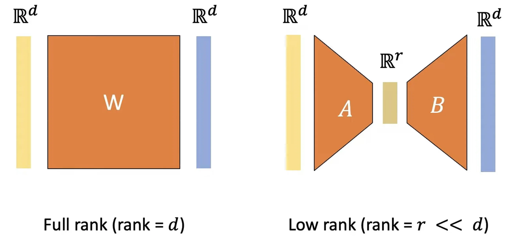
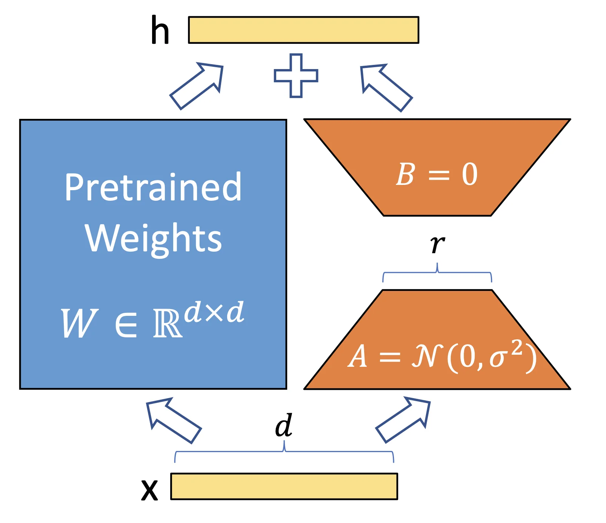
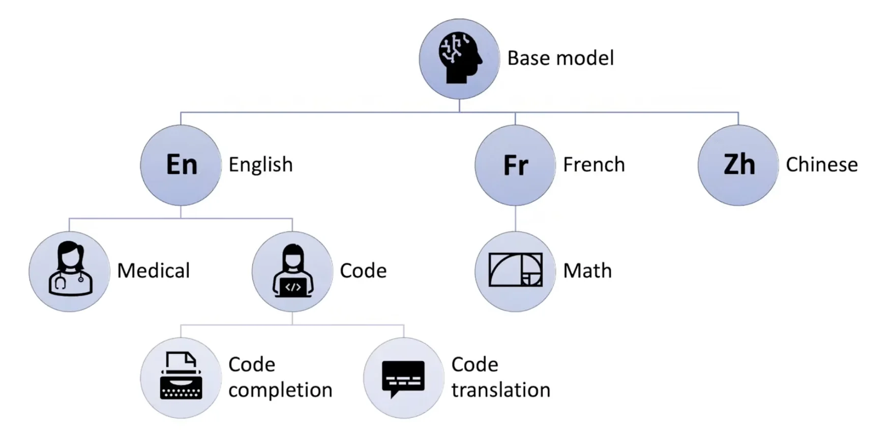

# 迁移学习

## fine-tuning

核心思想：

深度学习可以分成两个阶段：特征提取和分类

如果在一个大的复杂的数据集上进行训练，那么模型可以学习到一些通用的特征，这些特征可以用于其他任务。

那么我们就可以把在大的数据集上训练的模型，在小的数据集上进行微调，从而得到一个更好的模型。

### 数据集选择
源数据集和目标数据集的分布要尽可能的相似，否则微调的效果会不好。

> 现在公司都把在大的数据集上预训练的模型当作自己的财产，不会轻易的分享出来。

- 预训练模型的质量非常重要；微调通常速度更快、精度更高
- 源数据集远复杂于目标数据，通常微调效果更好
### 全量微调
- 使用更强的正则化
    - 使用更小的学习率
    - 使用更少的数据迭代

### 部分微调
- 底部层的特征更加通用，高层的特征与数据集与任务更相关，所以可以固定底部一些层的参数，不参与更新。

### 重用标号

## Adapter

Adapt Tuning。即在模型中添加 Adapter 层，在微调时冻结原参数，仅更新 Adapter 层。

具体而言，其在预训练模型每层中插入用于下游任务的参数，即 Adapter 模块，在微调时冻结模型主体，仅训练特定于任务的参数

## LoRA

[LORA: Low-rank Adaptation of Large Language Models](https://arxiv.org/pdf/2106.09685)

<iframe src="https://arxiv.org/pdf/2106.09685" width="100%" height=450px>
LORA: Low-rank Adaptation of Large Language Models
</iframe>

假设：
原始权重矩阵 $W_0$ 很大，比如是 $1000 \times 1000$ 的矩阵。我们不想直接更新它，而是假设：

它的变化 $\Delta W$（更新量）其实可以用一个更小、更低秩的矩阵来逼近。

<iframe src="//player.bilibili.com/player.html?isOutside=true&aid=924453166&bvid=BV1sT4y1t7Cu&cid=1423407924&p=1&autoplay=0" scrolling="no" border="0" frameborder="no" framespacing="0" allowfullscreen="true" width="100%" height=450px></iframe>

!!! note "why LoRA"
    * 大模型参数太多（比如 Transformer），微调（fine-tuning）它们时，需要更新所有的参数，成本非常高。
    * 检查点（checkpoint）太大、部署与存储困难
    * 如果只想让模型适应一个新任务（比如翻译、摘要），有没有办法**只更新很少的参数**，而不是几亿个？

    > 你有一个训练好的机器人大脑（$W_0$），你不想动它。你只是在它脑子里 **加了一个轻量级插件（$BA$）**，这个插件能稍微影响它的行为，但又不会破坏它本来的“知识”。

问题1: 我们需要找到并调整所有参数吗？

问题2:对于微调的权重矩阵，更新在矩阵秩方面应该具有多大的表现力？更新应该如何表达

所以，LoRA可以视作是全量微调的简化版。只要有矩阵乘法存在的地方，我们就可以考虑使用LoRA

### 怎么做？

原始权重矩阵 $W_0$ 很大，比如是 $1000 \times 1000$ 的矩阵。我们不想直接更新它，而是假设：

> **它的变化 $\Delta W$（更新量）其实可以用一个更小、更低秩的矩阵来逼近。**

我们用两个小矩阵 $B$ 和 $A$ 来构造这个更新：

$$
\Delta W = BA,\quad \text{其中 } B \in \mathbb{R}^{d \times r}, A \in \mathbb{R}^{r \times k}
$$

这样，我们不直接训练大矩阵 $W_0$，而是**只训练**这两个小矩阵 $B$ 和 $A$，其中 $r$（秩）远远小于 $d$ 和 $k$，比如 $r = 4$。

所以：

$$
\text{原来的计算：} h = W_0 x \\
\text{现在的计算：} h = W_0 x + BAx
$$

> LoRA 让模型 **保留原本的表达能力（$W_0 x$）**，同时**通过 $BAx$ 进行轻量级调整**。

{width=50%}

初始化策略

* $A$ 是随机初始化（高斯分布）
* $B$ 是全零初始化
  这样刚开始时：

$$
BA = 0 \Rightarrow \text{LoRA 不会影响初始输出}
$$

模型只在训练过程中逐渐学会适应新任务。

如果表现不好，可以尝试：
- 增加秩
- 增加数据

### 优点

- checkpoint 大大减小：GPT3从1TB减少到25MB；训练参数从1750亿到470万
- **A Generalization of Full Fine-tuning**

In other words, as we increase the number of trainable parameters 3, training LoRA roughly converges to training the original model, while adapter-based methods converges to an MLP and prefix-based methods to a model that cannot take long input sequences.

- No Additional Inference Latency

### transformer 应用
原则上，我们可以将 LoRA 应用于神经网络中的任何一部分权重矩阵，从而减少训练中需要更新的参数数量。

在 Transformer 结构中，LoRA 技术主要应用在注意力模块的四个权重矩阵：$W_{q}$、$W_{k}$、$W_{v}$、$W_{0}$，而冻结 MLP 的权重矩阵。
通过消融实验发现同时调整 $W_{q}$ 和 $W_{v}$ 会产生最佳结果。
在上述条件下，可训练参数个数为：
$$\Theta = 2 \times L_{LoRA} \times d_{model} \times r$$

其中，$L_{LoRA}$ 为应用 LoRA 的权重矩阵的个数，$d_{model}$ 为 Transformer 的输入输出维度，r 为设定的 LoRA 秩。

一般情况下，r 取到 4、8、16。

尽管每个注意力头只使用了权重矩阵的一部分（例如，输出会被切分成多个头），但我们还是把像 $W_q$（或 $W_k$、$W_v$）这样的矩阵看作是一个整体，即形状为 $d_{\text{model}} \times d_{\text{model}}$ 的矩阵。

### diffusion应用

### 工程细节

- 部署期间将许多LoRA模块缓存在RAM当中
- 并行训练多个LoRA模块，每个模块执行自己的任务，共享基础模型
- LoRA模型是可加性的，model switching变成了tree traversal。Base model is only instantiated once.

## SFT: Supervised Fine-tuning

## P-tuning

## RLHF

## 代码 - llama-factory

[Llamafactory](https://llamafactory.readthedocs.io/zh-cn/latest/index.html)

[llama-factory SFT系列教程 (二)，大模型在自定义数据集 lora 训练与部署_llama-factory自定义数据集-CSDN博客](https://blog.csdn.net/sjxgghg/article/details/137656248?spm=1001.2014.3001.5502)

## Acknowledgement

- LLLM-Lab [深入浅出 LoRA - 知乎](https://zhuanlan.zhihu.com/p/650197598)

