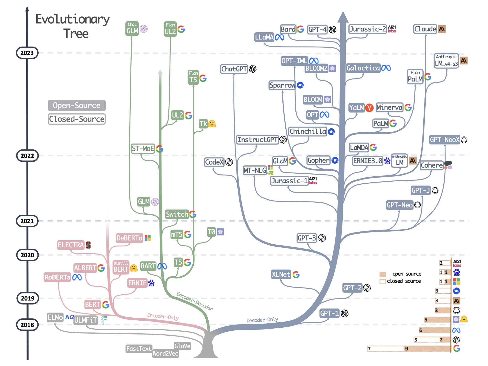

# 现状介绍

> 图源：[Harnessing the Power of LLMs in Practice: A Survey on ChatGPT and Beyond](https://arxiv.org/pdf/2304.13712)

Transformer-based models are shown in non-grey colors: 
- decoder-only models in the blue branch
- encoder-only models in the pink branch
- encoder-decoder models in the green branch. 

## Keyword

### 涌现能力是啥原因？

涌现能力（Emergent Ability）是指模型在训练过程中突然表现出的新的、之前未曾预料到的能力。这种现象通常发生在大型模型中，原因是大型模型具有更高的表示能力和更多的参数，可以更好地捕捉数据中的模式和关联。随着模型规模的增加，它们能够自动学习到更复杂、更抽象的概念和规律，从而展现出涌现能力。

### 模型幻觉是什么？业内解决方案是什么？

模型幻觉是指模型在生成文本时产生的不准确、无关或虚构的信息。这通常发生在模型在缺乏足够信息的情况下进行推理或生成时。业内的解决方案包括：
- 使用更多的数据和更高质量的训练数据来提高模型的泛化和准确性。
- 引入外部知识源，如知识库或事实检查工具，以提供额外的信息和支持。
- 强化模型的推理能力和逻辑推理，使其能够更好地处理复杂问题和避免幻觉。

## 基础

### word2vec

### tokenizer

## 应用领域

### 机器翻译

机器翻译就是把一种语言翻译成另外一种语言

- 第一个挑战，译文选择：同义词很多
- 第二个挑战，语序调整，主谓宾等
- 第三个挑战，数据稀疏。

**发展历程**

| 简称 | RBMT | SMT | NMT |
| --- | --- | --- | --- |
| 正式名称 | 基于规则的机器翻译引擎 | 统计机器翻译引擎 | 神经机器翻译引擎 |
| 概要 | 基于辞典、语法知识的机器翻译 | 基于海量对译数据统计信息的机器翻译 | 应用人工智能采用深度学习技术的机器翻译 |
| 优点 | 翻译速度快忠实于原文适合固定格式文章翻译 | 比RBMT翻译质量高能够翻译出比较自然的文章在BLEU值2评估中往往得分较高 | 比SMT翻译质量高能够翻译出自然流畅的文章 |
| 缺点 | 译文表达不够自然 | 译文表达不够自然 | 需要花费时间学习对译数据 |

**评估**

1. BLEU Score (Bilingual Evaluation Understudy)

- 最常用的机器翻译自动评估方法
- 通过比较机器翻译输出和多个参考翻译之间的n-gram重叠来工作
- 示例: 
  - 机器输出: "the cat is on the mat"
  - 参考输出: "the cat is sitting on the mat"
  - 1-gram精度: 5/6
  - 2-gram精度: 4/5

2. METEOR (Metric for Evaluation of Translation with Explicit ORdering)

- 考虑同义词匹配、词干匹配以及词序
- 示例:
  - 机器输出: "the pet is on the rug"
  - 参考输出: "the cat is on the mat"
  - METEOR会考虑"pet"和"cat"、"rug"和"mat"之间的相似性

3. ROUGE (Recall-Oriented Understudy for Gisting Evaluation)

- 通常用于评估自动文摘，也可用于机器翻译
- 考虑机器翻译输出和参考翻译之间n-gram的召回率
- 示例:
  - 对于"the cat is on the mat"和"the cat is sitting on the mat"
  - ROUGE-1召回率: 6/7

4. TER (Translation Edit Rate)

- 衡量将机器翻译输出转换为参考翻译所需的最少编辑次数
- 包括插入、删除、替换等操作
- 示例:
  - 机器输出: "the cat sat on the mat"
  - 参考输出: "the cat is sitting on the mat"
  - TER: 1/7 (需要添加一个"is")

#### 数据集
Multi30K是Flickr30K数据集 (Young等人，2014) 的扩展，具有英语描述的31,014德语翻译和155,070独立收集的德语描述。翻译是从专业签约的翻译人员那里收集的，而描述是从未经培训的众筹人员那里收集的。这些语料库之间的关键区别在于不同语言的句子之间的关系。在翻译的语料库中，我们知道两种语言的句子之间有很强的对应关系。在描述语料库中，我们只知道句子，无论语言如何，都应该描述相同的图像。 

‌​‌‌​​​​‌​​​‌‌‌‌‌​​‌‌​‌​‌​​‌​​​‌‌​‌‌‌​‌‌‌​​‌‌‌‌​‌​​​‌​‌‌‌​​‌‌‌‌​‌​‌‌​​‌‌‌​​‌‌‌‌​‌​​‌‌‌​‌

## 网站与资源

### 目前主流的开源模型体系有哪些？

- Transformer体系：由Google提出的Transformer模型及其变体，如BERT、GPT等。
- PyTorch Lightning：一个基于PyTorch的轻量级深度学习框架，用于快速原型设计和实验。
- TensorFlow Model Garden：TensorFlow官方提供的一系列预训练模型和模型架构。
- Hugging Face Transformers：一个流行的开源库，提供了大量预训练模型和工具，用于NLP任务。

## Acknowledgement

- [通向AGI之路：大型语言模型（LLM）技术精要 - 知乎](https://zhuanlan.zhihu.com/p/597586623)
- [Harnessing the Power of LLMs in Practice: A Survey on ChatGPT and Beyond](https://arxiv.org/pdf/2304.13712)