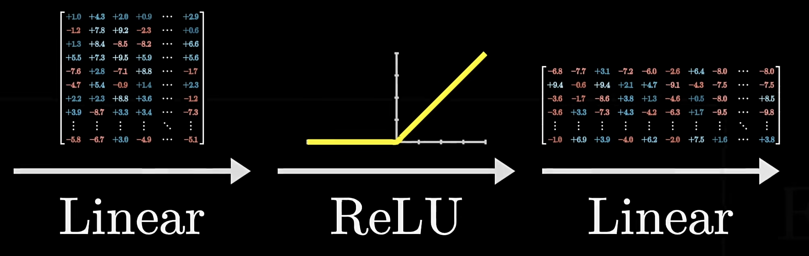
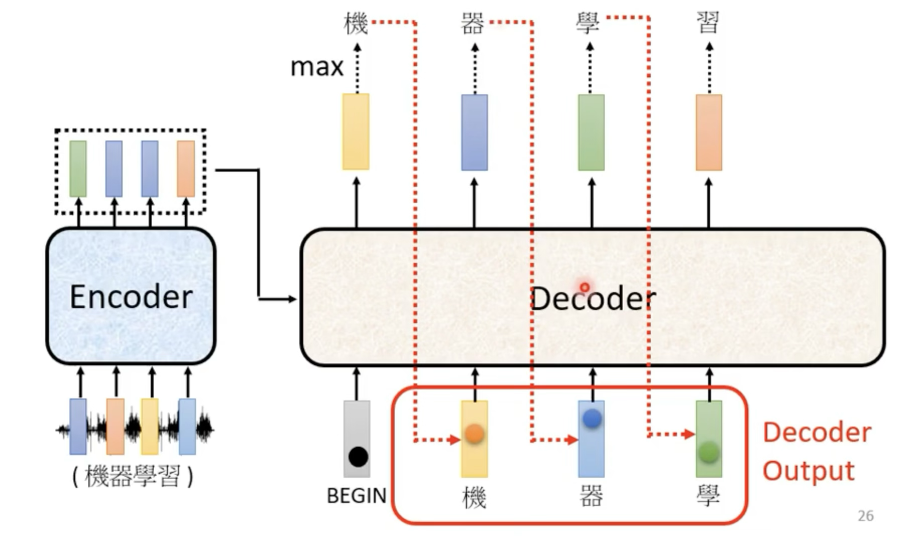
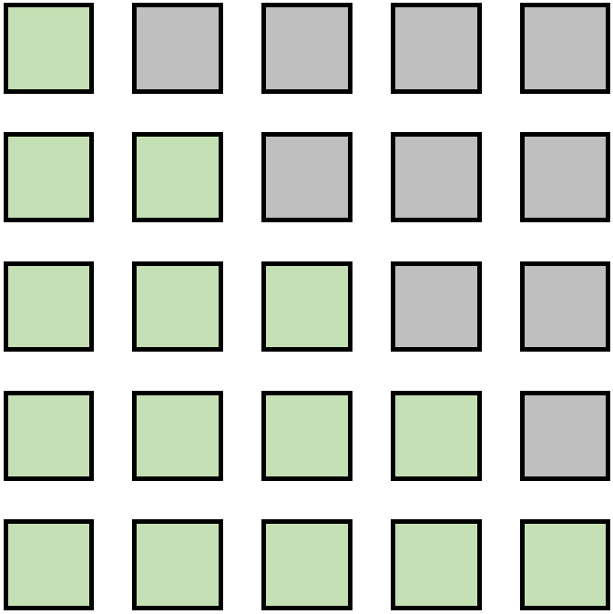

# Transformer
!!! info "Transformer"
    继MLP、CNN、RNN后的第四大类架构

<iframe src="https://arxiv.org/pdf/1706.03762" width="100%" height="600px" style="border: none;">
This browser does not support PDFs
</iframe>


在NLP，CV、media等领域都有着广泛的应用，让不同领域的任务都可以使用同一个模型，任何领域的研究者做出的突破，都可以更快速度地被其他领域所使用


人对世界的感知是多模态的，可以使用Transformer来处理多模态信息


## 假设与归纳偏置

对空间的假设很少，模型非常simple，可以train的参数很少。但抓取数据中信息的能力变差了，所以需要更多的数据，更大的模型。

优点：

- 可并行
- 独立于卷积和循环，完全依赖于attention处理全局依赖，解决长距离依赖问题
- 性能强


LSTM相比于单纯的前馈神经网络，首先具有理解文本的语序关系的能力（RNN）。除此之外，又解决了RNN在处理长序列时发生的梯度消失和梯度爆炸的问题。

Transformer进一步解决了RNN、LSTM等模型的长距离依赖问题，能够理解更长的上下文语义。可以并行化，所要的训练时间更短。


缺点：

- 长度固定
- 局部信息的获取不如RNN和CNN强：Transformer关注的全局关系，而RNN在计算过程中更关注局部，对距离更加敏感


> 图源 Attention is all you need


编码器将输入的符号序列 $(x_1, ..., x_n)$ 映射为连续表示序列 $z = (z_1, ..., z_n)$。给定 $z$，解码器会一次生成一个符号，最终生成输出序列 $(y_1, ..., y_m)$（注意 $m$ 和 $n$ 不一定相等）。

在每一步中，模型都是自回归的，即在生成下一个符号时，会将之前生成的符号作为额外的输入。


## Encoder - Self Attention

需求： 输入一个序列，输出一个序列

Encoder由六个相同层构成，每层都有两个子层：多头自注意力层和全连接的前馈神经网络层（Linear+relu+dropout+Linear）。使用残差连接和层归一化连接两个子层。

### residual connection

$$
Output = LayerNorm(x + Sublayer(x))
$$

其中，$x$是输入，$\text{Sublayer}(x)$是对$x$应用的子层操作，如自注意力或前馈网络。残差连接有助于解决深度模型中的梯度消失问题，使得更深层次的模型训练成为可能。


为了实现残差连接，需要让输入和输出具有相同的维度

作用：同resnet，解决梯度消失，防止过拟合;

通过直接将输入加到子层的输出上，使得深层网络中的信号能够直接传递到较浅层，有助于缓解梯度消失问题。


### Layer Norm

BatchNorm是对一个batch-size样本内的每个特征**分别**做归一化，LayerNorm是分别对每个样本的所有特征做归一化。


BN抹杀了不同特征之间的大小关系，但是保留了不同样本间的大小关系；LN抹杀了不同样本间的大小关系，但是保留了一个样本内不同特征之间的大小关系。

**layer normalization:** 对每个样本进行归一化，计算$m_x$和$\sigma_x$，然后归一化$x_i' = \frac{x_i - m_x}{\sigma_x}$


**batch normalization:** 对每个feture进行归一化


!!! note "为什么什么使用layer norm而不是batch norm"
    在时序模型当中，我们的样本长度可能会发生变化，使用batch norm计算均值和方差，在小批量的情况下，抖动会比较大

    另外在预测的时候，如果遇到了极端样本，需要计算全局的均值和方差，使用batch norm可能没有见过极端长的样本
    
    layer norm 不需要计算全局的均值和方差，LN是针对每个样本序列进行归一化，没有样本间依赖，对一个序列的不同特征维度进行归一化。
    
    CV使用BN是因为认为通道维度的信息对cv方面有重要意义，如果对通道维度也归一化会造成不同通道信息一定的损失。NLP认为句子长短不一，且各batch之间的信息没有什么关系，因此只考虑句子内信息的归一化


!!! note "BN和LN的使用场景"

    > 来自[一文搞懂Batch Normalization 和 Layer Normalization - 知乎](https://zhuanlan.zhihu.com/p/647813604)
    
    在BN和LN都能使用的场景中，BN的效果一般优于LN，原因是基于不同数据，同一特征得到的归一化特征更不容易损失信息。但是有些场景是不能使用BN的，例如batch size较小或者序列问题中可以使用LN。这也就解答了RNN 或Transformer为什么用Layer Normalization？
    
    首先RNN或Transformer解决的是序列问题，一个存在的问题是不同样本的序列长度不一致，而Batch Normalization需要对不同样本的同一位置特征进行标准化处理，所以无法应用；当然，输入的序列都要做padding补齐操作，但是补齐的位置填充的都是0，这些位置都是无意义的，此时的标准化也就没有意义了。
    
    其次上面说到，BN抹杀了不同特征之间的大小关系；LN是保留了一个样本内不同特征之间的大小关系，这对NLP任务是至关重要的。对于NLP或者序列任务来说，一条样本的不同特征，其实就是时序上的变化，这正是需要学习的东西自然不能做归一化抹杀，所以要用LN。

!!! note "为什么layer norm 在fn层之后？"

    [on layer normalization in the transformer architecture](https://dl.acm.org/doi/pdf/10.5555/3524938.3525913)


Layer Norm 的新研究
<iframe src="https://arxiv.org/pdf/1911.07013" width="100%" height="600px" style="border: none;">
This browser does not support PDFs
</iframe>


### position-wise feed-forward network

相当于一个MLP(线性层+ReLu+线性层)

$$
FFN(x) = max(0, xW_1 + b_1)W_2 + b_2
$$



- $x$: 512维

- $W_1$: 升维至2048

- $W_2$: 降维至512


attention层已经含有了想要的信息，进行MLP变换的目的是变换到想要的语义空间上去.它在每个位置上独立地作用于其输入，有助于增加模型的复杂度和表达能力。

其中，activation指激活函数，Transformer最开始用是ReLU，

之后的模型对这部分有改进，依次是：

$$
ReLU \rightarrow GELU \rightarrow Swish(SiLU) \rightarrow SwiGLU
$$

现在主流的LLM比如Llama、Qwen大多采用SwiGLU


!!! note "大模型的事实存储在MLP层当中"
    详见GPT一节

### 细节

self-attention层只需要学$W_Q,W_K,W_V$三个矩阵，参数数目是 $3*d_{model}$

对于相似的矩阵计算，使用concat化简表达

把V的参数量= Q+V 即把V做low rank transformation


## Decoder - Autoregressive

!!! note "什么叫做自回归"
    过去时候的输出，作为现在的输入

    有点类似于最近图书馆里面的拼贴诗接龙游戏



> 图源 李宏毅老师ppt

需要先给一个开始的信号 —— begin of sentence token，decoder会吐出一个vocabulary size的向量，然后通过softmax得到概率分布，然后选择概率最大的token作为输出

然后把之前输出的token作为输入，继续输出，直到遇到结束的信号 —— end of sentence token


> vocabulary size： 需要提前想好你的数据量大小，取决于任务（比如翻译任务，你的vocabulary可以是常见的3000个汉字）


### Mask

Mask：不要让后面的token影响前面的，在softmax之前把左下角矩阵改成负无穷

处理结果，在$t$时刻的值，只看$t-1$及之前的Q、K

{width=50%}

!!! note "why masked"

    让输入序列只看到过去的信息，而看不到未来的信息。
    
    - 对于encoder来说，所有token都是可见的，是并行处理的
    - 但是对于decoder来说，只能看到前面的token，所以需要mask。先有a1，然后有a2，然后有a3，然后有a4，需要把未来的token都mask掉


### 长度


使用 END 表示结束，begin和end 是同一个符号

如何输出 END呢？


## Encoder-Decoder

### Cross-attention

交互方式：
Cross Self-attention，Decoder提供$Q$，Encoder提供$K$，$V$。

{width=40% }


Query来自下一个attention的输入 

如果解码器的Query 与编码器输出的key相似度较高，那么给予更高的attention

相当于根据解码器的输入，去挑选编码器中感兴趣的东西


## 训练

Transformer看起来模型比较复杂，但几乎没有什么可以调节的参数，大部分都是可以根据比例算的。


> 图源 Attention is all you need

### 训练方法

**teacher forcing**

让decoder 输出的distribution和ground truth的distribution越接近越好

metrics是cross entropy，和分类比较相似

### Optimizer

学习率预热策略通过逐渐增加学习率，直到达到一个最大值，然后可能会逐渐降低

We used the Adam optimizer with $\beta_1=0.9,\beta_2=0.98$ and $\epsilon=10^{-9}.$ We varied the learning rate over the course of training, according to the formula:

$$
lr=d_{\mathrm{model}}^{-0.5}\cdot\min\{step\_num^{-0.5},step\_num\cdot warmup\_steps^{-1.5}\}
$$


This corresponds to increasing the learning rate linearly for the first `warmup_steps` training steps, and decreasing it there after proportionally to the inverse square root of the step number. We used `warmup_steps=4000`


### Regularization


1. residual dropout, $P_{drop} = 0.1$：在每个子层（self-attention和feed-forward network）的输出处添加dropout，丢弃率为0.1。这种dropout应用在残差连接之前，可以防止模型过拟合。具体来说：

   - 在self-attention层和feed-forward层的输出上应用dropout
   - 然后再与该层的输入进行残差连接

2. label smoothing：一种正则化技术，起源于Inception v3。传统的one-hot标签(如$y = [0,0,1,0]$)要求模型输出完全确定的0或1，这可能导致过拟合。Label smoothing通过将标签值"软化"（如$y' = [0.1,0.1,0.7,0.1]$），使模型学习到更平滑的分布。具体来说:

   - 原始one-hot标签: $y = [0,0,1,0]$ 
   - 平滑后的标签: $y' = (1-\alpha)y + \alpha/K$
   
   其中$\alpha$是平滑参数(通常0.1)，$K$是类别数。这样可以:防止模型过于自信，提高泛化能力，增强模型鲁棒性


### 训练技巧

**参数共享**

在Transformer模型中，特定层（如编码器中的多个相同层）之间或特定操作（如多头注意力中的头）之间共享参数，可以减少模型的总参数量，有助于减轻过拟合。


**梯度裁剪**

梯度裁剪通过设定一个阈值$\theta$，将梯度向量$g$裁剪为：$g^{\prime}=\min\left(1,\frac\theta{\|g\|}\right)g$这样做
是为了防止在训练过程中出现梯度爆炸问题，确保模型的稳定训练。


**copy mechanism**


```
User: hello, I'm John.
Machine: hello, John, nice to meet you.
```

- pointer network


**Guided attention**

> 训练TTS，读四遍“发财”是可以的，但是只读一遍“发财”是不行的

要求机器按照某种特定的方式attention，需要有一些

- monotonic attention
- location-aware attention

**Beam search**


greedy decoding不一定是最好的方法，因为可能错过最优解 

而beam search 是一种受限的宽度优先搜索，有一个超参数beam width，表示每次搜索的宽度

每一个时刻，保留得分最高的k个序列，下一个时刻，使用这些序列继续生成


> 有时候有用，有时候没用
> 如果答案非常确定，那么beam search 可能表现不错。
>
> 但是，如果答案不明确，那么beam search 可能表现不好。


### BLEU

> 机器翻译的评价指标

minimize cross entropy is not equivalent to maximize BLEU

and using BLEU score as a metric is not a good idea because it's impossible to calc the derivative of BLEU

so when you don't know how to optimize BLEU, use BLEU as the reward function of reinforcement learning


### exposure bias

推理的时候，decoder可能看到错误的东西


但是在训练的过程中， 一直看到的是正确的结果


即如何解决一步错，步步错的问题

**scheduled sampling**

合理的方法是给decode一些noise，让decoder看到一些错误的东西

- [Original Scheduled Sampling](https://arxiv.org/abs/1506.03099)

- [Scheduled Sampling for Transformer](https://arxiv.org/abs/1906.07651)

- [Parallel Scheduled Sampling](https://arxiv.org/abs/1906.04331) 

## 应用 - 机器翻译

### 数据集介绍
Multi30K

<iframe src="https://arxiv.org/pdf/1605.00459" width="100%" height="600px" style="border: none;">
This browser does not support PDFs
</iframe>

### Metrics介绍


## 代码实战

- [hyunwoongko/transformer: Transformer](https://github.com/hyunwoongko/transformer): PyTorch Implementation of "Attention Is All You Need"

- [jadore801120/attention-is-all-you-need-pytorch](https://github.com/jadore801120/attention-is-all-you-need-pytorch): A PyTorch implementation of the Transformer model in "Attention is All You Need"
### Transformers库

Transformers是由Hugging Face开发的一个自然语言处理库，提供了数千个预训练模型，支持多种深度学习框架如PyTorch、TensorFlow等。它的主要特点包括：

- 易用性：提供简单的API接口，几行代码就能完成复杂的NLP任务
- 灵活性：支持多种深度学习框架，可以根据需要选择
- 完整性：包含了从预处理到模型训练的完整工具链
- 开源社区：有活跃的开源社区支持，持续更新维护

主要功能：

- 文本分类、序列标注、问答系统等常见NLP任务
- 支持多语言预训练模型
- 提供模型训练和微调的工具
- 包含数据处理和评估的完整pipeline

- [🤗 Transformers简介](https://huggingface.co/docs/transformers/main/zh/index): 库
- [Hello! · Transformers快速入门](https://transformers.run/)
- [awesome-transformers](https://github.com/huggingface/transformers/blob/main/awesome-transformers.md): 示例

### MindNLP

- [Models — MindNLP 文档](https://mindnlpdocs.readthedocs.io/zh-cn/latest/api/models.html)

## 拓展
### Decoder - NAT


non-autoregressive model


长度如何决定：

- another predictor for output length
- 输出一个超级长的序列，忽略END之后的token


优点：

- 平行计算
- 输出长度可控

缺点：

- 效果不如autoregressive model
- multi-modality

### 超长文本

[基于BERT的超长文本分类模型_valleria的博客-CSDN博客_长文本分类](https://blog.csdn.net/valleria/article/details/105311340)

基本思想：对数据进行有重叠的分割，这样分割之后的每句句子直接仍保留了一定的关联信息。
模型由两部分构成，第一部分是fine-tune后的BERT，第二部分是由LSTM+FC层组成的混合模型。即，BERT只用来提取出句子的表示，而真正在做分类的是LSTM+FC部分。

具体流程：首先将长句子分割为多个小句子，如长200，重叠长度为50.将分割后的数据集传入BERT，分别取每个句子的[CLS]表示句子的embedding，将来自相同长句子的embedding拼接，作为长句子的向量表示。最后，将长句子的向量表示传入LSTM+FC部分进行分类。

除此之外，第二部分还可以用Transformer。


## Acknowledgement


<iframe src="//player.bilibili.com/player.html?isOutside=true&aid=577276749&bvid=BV1wB4y1o7is&cid=1303146845&p=3&autoplay=0" scrolling="no" border="0" frameborder="no" framespacing="0" allowfullscreen="true" width="100%" height=450px></iframe>

<iframe src="//player.bilibili.com/player.html?isOutside=true&aid=577276749&bvid=BV1wB4y1o7is&cid=1303146955&p=4&autoplay=0" scrolling="no" border="0" frameborder="no" framespacing="0" allowfullscreen="true" width="100%" height=450px></iframe>

<iframe src="//player.bilibili.com/player.html?isOutside=true&aid=506354287&bvid=BV1pu411o7BE&cid=432055065&p=1&autoplay=0" scrolling="no" border="0" frameborder="no" framespacing="0" allowfullscreen="true" width="100%" height=450px></iframe>


<iframe src="//player.bilibili.com/player.html?isOutside=true&aid=113215035936825&bvid=BV1aTxMehEjK&cid=26046694390&p=1&autoplay=0" scrolling="no" border="0" frameborder="no" framespacing="0" allowfullscreen="true" width="100%" height=450px></iframe>