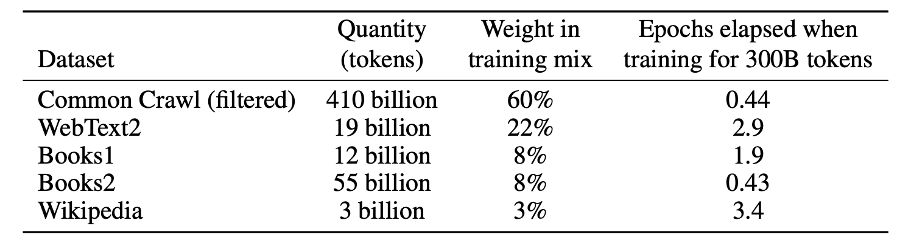
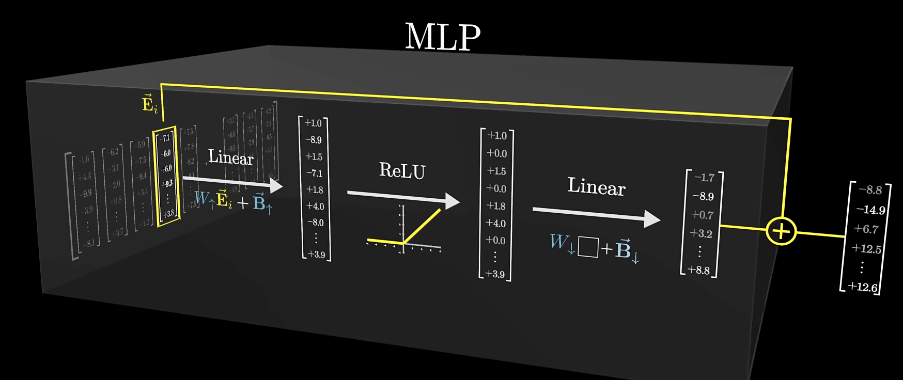

# GPT

!!! note "主要介绍一下decoder-only技术路线的模型，以GPT系列为主"

## 发展历程与chitchat

| 模型 | 发布时间 | 参数量 | 预训练数据量 |主要卖点 |
| --- | --- | --- | --- | --- |
| GPT | 2018 年 6 月 | 1.17 亿 | 约 5GB | Pre-training + Fine-tuning:预训练和一系列下游子任务的微调|
| GPT-2 | 2019 年 2 月 | 15 亿 | 40GB | Zero-Shot:不使用微调，直接将（任务描述，任务/问题，目标/答案）打包成一个句子，直接进行预训练，使得训练出来的模型适用于各种下游任务 |
| GPT-3 | 2020 年 5 月 | 1,750 亿 | 45TB | In-Context Learning |

GPT2，搜集了更大的数据集，训练了一个更大的模型。

GPT3比GPT2数据和模型都大了一百倍，暴力出奇迹。

GPT-3模型更复杂，要求更高，很难复现，因此引用较少，想往强人工智能走，解决更大问题

Bert想把计算机视觉成熟的先训练一个预训练的模型然后再做微调出子任务的结果，然后搬到NLP上做好，提升技术的效果。在同样模型大小，比如是一个亿级别模型大小时候，Bert的性能要好于GPT

## GPT(2018)

Improving Language Understanding by Generative Pre-Training

<iframe src="https://cdn.openai.com/research-covers/language-unsupervised/language_understanding_paper.pdf" width="100%" height="450px">
Improving Language Understanding by Generative Pre-Training
</iframe>

unlabeled data 如何进行训练

- 困难1：优化目标函数较难寻找
- 困难2：NLP子任务差别较大，所以没有一个统一的简单范式，把学到的文本表示传递到下游的子任务上面；

### 核心卖点：Pretrained + 微调

NLP领域没有像ImageNet那样那么多标好的数据，因此没有足够多的数据去训练一个比较大的模型，就不能使用CV当中先训练好预训练模型再做微调的范式

但使用的是没有标号的文本，因此走了一大步，然后在GPT系列后面的文章做Zero Shot

提出半监督方法（后面称之为自监督学习）（Self supervised Learning）

基于transformer模型架构，发表在transformer出来一年之后，和RNN模型相比transformer在迁移学习的时候学习到的特征更加稳健一些，可能是因为其里面有更加结构化的记忆使得能够处理更长的文本信息从而能够抽取出更好的句子层面和段落层面的语义信息

要做到这个任务，需要解决三个问题：

- GPT在没有标注的数据上如何进行训练
- 在训练好之后，如何在有标注的数据集上面进行微调
- 子任务如何表示输入

### 优化目标函数

**Unsupervised pre-training** 预训练阶段

优化函数$L_1$的含义是指在给定前面$k$个词汇以及模型$\Theta$，预测出下一个词的似然

$$
L_{1}(\mathcal{U})=\sum_{i}\log P(u_{i}|u_{i-k},\ldots,u_{i-1};\Theta)
$$

这里$k$指的是窗口的大小，是一个超参数。标准的 **自回归语言模型（autoregressive language model** 目标，预测下一个词（或 token）。

在GPT-1中，使用了12个transformer块的结构作为解码器，每个transformer块是一个多头的自注意力机制，然后通过全连接得到输出的概率分布。

$$
\begin{aligned}
h_0&=UW_e+W_p\\
h_{l}&=\text{transformer\_block}(h_{l-1})\quad \forall i\in[1,n] \quad \text{用最后一个词预测下一个词}\\
P(u)&=\mathrm{softmax}(h_nW_e^T)
\end{aligned}
$$

$n$是层数，$W_e$是token embedding matrix（词嵌入矩阵），$W_p$是position embedding matrix

选用transformer解码器（有掩码机制）只看当前词和词之前的信息，不看后面的词。

!!! note "与BERT的区别"

    主要的区别是优化目标函数的选取：GPT是要更难的，天花板更高
    
    > GPT类似于已知过去的股票价格，去预测未来一天的股票价格
    >
    > 而BERT是已知今天以前之前的股票价格，预测昨天的。
    
    BERT相当于完形填空，可以看到前后的句子，所以可以使用Transformer的编码器。而GPT看不到后面的词汇，所以用的是Transfomer的解码器
    
    这是作者为何一直不断的把模型做大，一直不断努力最后才能做出GPT3。选择了更难的技术路线，但很可能天花板就更高。

**Supervised fine-tuning** 微调阶段

对于有标记的数据集$\mathcal{C}$，使用有监督学习进行微调，用的是完整的输入序列+标签。

- input: $x^1, \ldots, x^m$ （$x^i$ 是第$i$个token）
- output: $y$ （$y$ 是标签）

$$
P(y|x^1, \ldots, x^m) = \text{softmax}(h_l^m W_y)
$$

- $h_l^m$ 是最后一层的最后一个token的输出
- $W_y$ 是线性层的权重矩阵

优化函数是

$$
L_2(\mathcal{C}) = \sum_{(x,y)} \log P(y|x^1, \ldots, x^m)
$$

给你一个序列预测这个序列的下一个词

$$
L_3(\mathcal{C})=L_2(\mathcal{C})+\lambda*L_1(\mathcal{C})
$$

目标函数=有监督的目标函数+λ*无监督的目标函数。

给你完整的序列预测序列对应的标号两个一起训练效果是最佳的

### 输入表示

加入了**开始符**、**分隔符**、**结束符**

改变输入形式【通过在序列前后添加 [Start] 和 [Extract] 特殊标识符来表示开始和结束，序列之间添加必要的 [Delim] 标识符来表示分隔】，接上对应下游任务的层，就可实现不同下游任务。【**注：利用最后一层的最后一个token的输出，接下游层即可完成各类任务**】

- 第一行是分类

- 第二行是蕴含，下一句的假设是否被上一句的事实所支持。比如上一句是A送B玫瑰，下一句是A喜欢B。

- 第三行是相似

- 第四行，多选题，选答案。算置信度，选最大的那个。

都可以构造成序列，预训练好Transformer的模型，不变。

### 参数 1.17亿

12层 768维度

用的12层解码器，每一层768个维度。

### 数据集

- 它的训练数据是两个数据集的组合：Common Crawl，一个包含数十亿单词的网页数据集，和 BookCorpus 数据集，一个包含超过 11000 本不同类型的书籍的数据集。未发表的书籍

### 代码实现

[GPT系列：GPT, GPT-2, GPT-3精简总结 (模型结构+训练范式+实验)_gpt3结构-CSDN博客](https://blog.csdn.net/weixin_43646592/article/details/129064311)

⭐ **第一步：序列输入**

将整个序列输入GPT，取最后一层的最后一个token的输出作为下一轮输入，同时保存所有12层的 $k, v$ 向量。

⭐ **第二步：单token处理**

- 单个token输入后，得到其 $q, k, v$ 向量
- $k,v$ 向量更新(与上一轮的 $k,v$ 向量在 $seq\_len$ 维度上拼接)
- 进行注意力计算
- 保存本轮所有12层的 $k, v$ 向量

这就是past_key_values机制。目前大多数用于文本生成的预训练模型(如Google的T5、Facebook的Bart等)都采用此机制。

在GPT生成过程中，每轮输入是单个token而非整个已生成序列。这是因为past_key_values机制可以将已生成文本序列的信息编码到past_key_values中(即 $k,v$ 向量)。

⭐ **第三步：迭代生成**

此时输入仅为单个token。从第二步开始，后续每次输入都是单token。由于 $k,v$ 向量每轮更新，每轮 $k,v$ 向量长度会加1。

## GPT-2(2019)

Language Models are Unsupervised Multitask Learners

<iframe src="https://cdn.openai.com/better-language-models/language_models_are_unsupervised_multitask_learners.pdf" width="100%" height="600px" style="border: none;">
Language Models are Unsupervised Multitask Learners
</iframe>

### 核心卖点：**Zero-Shot**——不在下游任务微调

现在的模型，泛化性不好，一个数据集在一个应用上面不错，但不好应用在另一个应用。

Multitask Learning，多任务学习，训练一个模型的时候，同时看多个数据集。但在NLP上用的不多。

现在流行的还是，预训练，然后再对每一个任务做有监督的学习的微调。**这样的问题就是对于每一个任务都需要重新微调，以及要导入有标号的数据。**

本文提出的想法就是，**zero-shot**

要做的就是在下游任务的时候，不需要下游任务的信息，也可以进行预测

**任何有监督任务都是语言模型的一个子集，当模型的容量非常大且数据量足够丰富时，仅仅靠训练语言模型的学习便可以完成其他有监督学习的任务。**

这就要求下游任务的时候，不能出现没有见过的符号，需要使用和预训练时候相同的符号，不然模型会非常困惑。

> prompt：提示词的由来
> 
> For example, a translation training example can be written as the sequence `(translate to french, english text, french text).`
> 
> Likewise, a reading comprehension training example can be written as `(answer the question, document, question, answer).`

!!! note "新意度"

    沐神关于做研究的启发： 做研究不要一条路走到黑，做过程你可以一条路走到黑，但是在做研究的时候，你要灵活一些，不要一条路走到黑。你需要尝试从一个新的角度来看问题。
    
    GPT2还是做语言模型，但是在做到下游任务的时候，会用一个叫做zero-shot的设定，zero-shot是说，在做到下游任务的时候，不需要下游任务的任何标注信息，那么也不需要去重新训练已经预训练好的模型。这样子的好处是我只要训练好一个模型，在任何地方都可以用。 
    
    如果作者就是在GPT1的基础上用一个更大的数据集训练一个更大的模型，说我的结果比Bert好一些，可能也就好那么一点点，不是好那么多的情况下，大家会觉得GPT2这篇文章就没什么意思了，工程味特别重。那么我换一个角度，选择一个更难的问题，我说做zero-shot。虽然结果可能没那么厉害了，没那么有优势，但是新意度一下就来了。

### model

Layer Norm被移到了每个子块的输入端，类似于预激活残差网络，并在最后一个自注意力块后添加了额外的Layer Norm。

使用了一种改进的初始化方法，考虑到了残差路径上随着模型深度的累积效应。我们在初始化时将残差层的权重按照因子$1/\sqrt{N}$进行缩放，其中$N$是残差层的数量。

词汇表扩展到了50,257。还将上下文大小从512增加到1024个token，并使用了更大的批量大小512。

### 数据集

Common Crawl，这是有一群人写的一个网络爬虫，不断的去网上抓取网页。TB级的数量级，但数据需要清洗，很麻烦。

后面用Reddit，大家可以自主的放网页上去，大家可以投票，Karma是用户对帖子的评价，选取有3个Karma的帖子，拿到4500万的链接，**一共有800万个文档，40GB的文字**

### 参数-15亿

GPT-2 15亿参数（1.5B）

模型越大，效果越好。
所以考虑用更多的数据，做更大的模型，于是GPT-3应运而生。

### 实验

- 在8个语言模型任务中，仅仅通过zero-shot学习，GPT-2就有7个超过了state-of-the-art的方法；
- 在“Children's Book Test”数据集上的命名实体识别任务中，GPT-2超过了state-of-the-art的方法约7%；
- “LAMBADA”是测试模型捕捉长期依赖的能力的数据集，GPT-2将困惑度从99.8降到了8.6；
- 在阅读理解数据中，GPT-2超过了4个baseline模型中的三个；
- 在法译英任务中，GPT-2在zero-shot学习的基础上，超过了大多数的无监督方法，但是比有监督的state-of-the-art模型要差；
- GPT-2在文本总结的表现不理想，但是它的效果也和有监督的模型非常接近。

GPT2在很多任务上得分并不高，更多地看起来还是在讲Zero-Shot的问题。

## GPT-3(2020)

language models are few-shot learners

<iframe src="https://arxiv.org/pdf/2005.14165" width="100%" height="600px" style="border: none;">
language models are few-shot learners
</iframe>

> 有非常多的作者，页数也很长，但是并没有把事情完全讲清楚，需要先看GPT、GPT2、BERT的论文

### 核心卖点：不训练、不梯度更新、上下文学习

微调问题：

1. 对于每一次都需要一些标号的数据；
2. 微调效果好，不一定模型的泛化性能好：不允许微调，那么拼的就是预训练模型的泛化性能
3. 人类不需要很大的数据集来学会绝大部分的语言任务

GPT3不去更新梯度，不做微调

- meta learning： 训练一个很大的模型，泛化性能不错

- “**In-Context learning**”：即使给了一些样本，GPT3因为模型太大了，更新不了，所以不会去更新所谓的权重。模型inference的时候，为了把模型的能力迅速迁移（用聚焦或提炼可能更合适）到某个特定task上，先给他一些参考样例，然后模型就迅速领会到了要干什么，然后就可以按照这个特定task去输入输出了。整个过程只在inference阶段，不涉及模型参数的任何更新

### model

- GPT-3采用了 12 层的多头transformer，头的个数为 96；
- 词向量的长度是 12288；
- 上下文划窗的窗口大小提升至 2048 个token；
- GPT-3模型和GPT-2一样，但GPT-3应用了**Sparse Transformer**中的attention结构。

!!! note "sparse attention 与传统 self-attention（称为 dense attention） 的区别"

    - dense attention：每个 token 之间两两计算 attention，复杂度 $O(n^2)$
    - sparse attention：每个 token 只与其他 token 的一个子集计算 attention，复杂度 $O(n\times\log n)$
    sparse attention 除了相对距离不超过 $k$ 以及相对距离为 $k, 2k, 3k, \ldots$ 的 token，其他所有 token 的注意力都设为 0，如下图所示：

    使用 sparse attention 的好处主要有以下两点：

    - 减少注意力层的计算复杂度，节约显存和耗时，从而能够处理更长的输入序列；

    - 具有“局部紧密相关和远程稀疏相关”的特性，对于距离较近的上下文关注更多，对于距离较远的上下文关注较少；

    > Generating Long Sequences with Sparse Transformers

    <iframe src="https://arxiv.org/abs/1904.10509" width="100%" height="600px" style="border: none;">
    Generating Long Sequences with Sparse Transformers
    </iframe>

### 参数：1750亿

自回归模型，1750亿个可学习的参数，

- GPT-3 Small 是GPT规模
- GPT-3 Medium是BERT规模
- GPT-3 XL和GPT-2差不太多，GPT3模型偏扁

W_E GPT3 50267个token，每个token具有12288维度，共6亿左右参数，随机初始化

### 数据集

多个数据集，不同采样率

- 过滤：爬取一部分低质量的Common Crawl作为负例，高质量的Reddit作为正例，用逻辑回归做二分类，判断质量好坏。接下来用分类器对所有Common Crawl进行预测，过滤掉负类的数据，留下正类的数据
- 去重：lsh算法（局部敏感哈希），去掉相似的文章

### 训练方法

DGX-1集群，带宽非常高

使用相对比较大的批量大小，计算性能更好，每台机器的并行度更高，通讯量变低，降低批量里的噪音分布式比较好

小的模型批量大小更容易过拟合一些

模型越来越大的时候过拟合没有那么的严重，搜索范围更广，可能存在一个比较简单的模型架构，SDG可以帮助找到那个模型，使泛化精度更好一些

模型批量大小增大学习率下降

{width=75%}

评估GPT3：

1. few-shot：每个子任务提供10-100个训练样本；
2. one-shot：1个样本
3. zero-shot：0个样本

{width=75%}

- 分类：true/false
- 补全：beam search

### 训练结果

**精度与计算量的关系**

数据量指数翻倍的时候，验证精度是线性下降的

使用validation loss是因为与子任务精度有关系

power law：不需要过度训练

{width=50%}

{width=50%}

{width=50%}

{width=50%}

{width=50%}

### 局限性与负面

- 长文本比较弱，写小说就不行。

- 结构和算法上的局限性，只能往前看。（原因：使用的是transformer的解码器的原因）

- 对于词的预测是平均的，不知道什么词才是重点。虚词。

- 视频、真实世界的物理交互是无法理解的

- 样本有效性不够

- 训练起来非常的贵

- **无法解释，不知道为何得出的输出**

负面：

1. 可能会被用来做坏事
2. 散布一些不实的消息
3. 论文造假
4. 公平性、偏见
5. 性别、种族

## GPT-4

## Interpretability

词汇存在高维向量当中，向量的方向可以编码不同的含义

transformer大部分的参数在MLP层当中（约占用2/3的参数，GPT3 - 12亿）

第一个线性层可以使用行视角，视作嵌入空间中的方向

ReLU 类似于与门，只有最终结果为正数时，才会输出

第二个线性层，可以使用列视角，如果某个列向量学习到了“篮球”的概念，同时对应的向量又被激活

在$N$维空间当中，如果使用正交基表示一个概念，那么最多只能表示$N$个概念

johnson-lindenstrauss lemma 告诉我们，如果使用非正交基，那么可以表示更多的概念，尤其是在高维空间当中。能表示的概念数量与维数$n$成指数分布

这也说明，某个概念并不是单纯由一个单元激活，而是由多个单元激活（superposition）

<iframe src="//player.bilibili.com/player.html?isOutside=true&aid=113215035936825&bvid=BV1aTxMehEjK&cid=26046694390&p=1&autoplay=0" scrolling="no" border="0" frameborder="no" framespacing="0" allowfullscreen="true" width="100%" height=450px></iframe>

### 拓展阅读
芝加哥大学victor veitch 的论文

Anthropic Transformer circuit

[Toy Models of Superposition](https://transformer-circuits.pub/2022/toy_model/index.html)

[Towards Monosemanticity: Decomposing Language Models With Dictionary Learning](https://transformer-circuits.pub/2023/monosemantic-features/index.html)

- RLHF
- scaling law

## Acknowledgement

<iframe src="//player.bilibili.com/player.html?isOutside=true&aid=296939123&bvid=BV1AF411b7xQ&cid=541096351&p=1&autoplay=0" scrolling="no" border="0" frameborder="no" framespacing="0" allowfullscreen="true" width=100% height=450px></iframe>

> 写笔记的时候也参考了该视频下“产品黄叔”、“小清舍”等用户的笔记

- #苦行僧 - [GPT系列：GPT, GPT-2, GPT-3精简总结 (模型结构+训练范式+实验)_gpt3结构-CSDN博客](https://blog.csdn.net/weixin_43646592/article/details/129064311)
- 大师兄 - [预训练语言模型之GPT-1，GPT-2和GPT-3 - 知乎](https://zhuanlan.zhihu.com/p/350017443)

