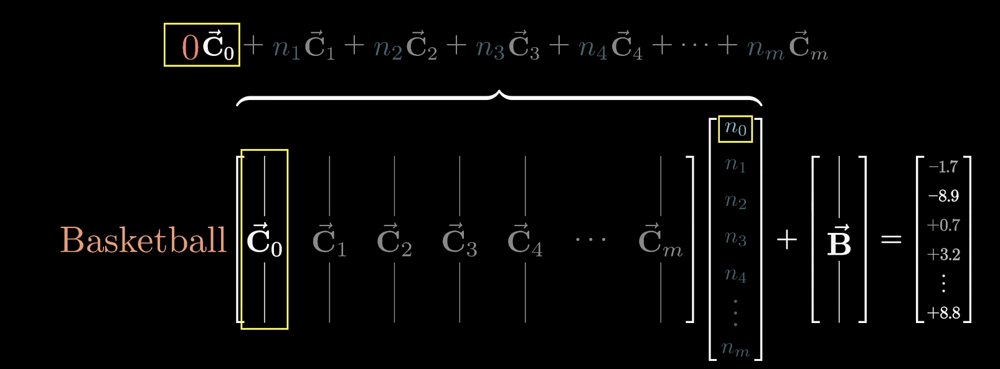

# 重点问题讨论

## 消融实验

- 消融实验：通过逐步移除模型中的某些组件或参数，观察模型性能的变化，从而确定模型中哪些组件或参数对模型性能的提升最为重要。

## 残差连接

## Layer Norm

- GPT3：采用了Post-Layer Normalization（后标准化）的结构，即先进行自注意力或前馈神经网络的计算，然后进行Layer Normalization。这种结构有助于稳定训练过程，提高模型性能。
- LLAMA：采用了Pre-Layer Normalization（前标准化）的结构，即先进行Layer Normalization，然后进行自注意力或前馈神经网络的计算。这种结构有助于提高模型的泛化能力和鲁棒性。
- ChatGLM：采用了Post-Layer Normalization的结构，类似于GPT3。这种结构可以提高模型的性能和稳定性。

## 激活函数

- ReLU（Rectified Linear Unit）：一种简单的激活函数，可以解决梯度消失问题，加快训练速度。
- GeLU（Gaussian Error Linear Unit）：一种改进的ReLU函数，可以提供更好的性能和泛化能力。
- Swish：一种自门控激活函数，可以提供非线性变换，并具有平滑和非单调的特性。

## FFN - 大模型的事实藏在哪里

词汇存在高维向量当中，向量的方向可以编码不同的含义

transformer大部分的参数在MLP层当中（约占用2/3的参数，GPT3 - 12亿）

第一个线性层可以使用行视角，视作嵌入空间中的方向

ReLU 类似于与门，只有最终结果为正数时，才会输出

第二个线性层，可以使用列视角，如果某个列向量学习到了“篮球”的概念，同时对应的向量又被激活

在$N$维空间当中，如果使用正交基表示一个概念，那么最多只能表示$N$个概念

johnson-lindenstrauss lemma 告诉我们，如果使用非正交基，那么可以表示更多的概念，尤其是在高维空间当中。能表示的概念数量与维数$n$成指数分布

这也说明，某个概念并不是单纯由一个单元激活，而是由多个单元激活（superposition）

<iframe src="//player.bilibili.com/player.html?isOutside=true&aid=113215035936825&bvid=BV1aTxMehEjK&cid=26046694390&p=1&autoplay=0" scrolling="no" border="0" frameborder="no" framespacing="0" allowfullscreen="true" width="100%" height=450px></iframe>

### 拓展阅读
芝加哥大学victor veitch 的论文

Anthropic Transformer circuit

[Toy Models of Superposition](https://transformer-circuits.pub/2022/toy_model/index.html)

[Towards Monosemanticity: Decomposing Language Models With Dictionary Learning](https://transformer-circuits.pub/2023/monosemantic-features/index.html)

- RLHF
- scaling law

