---
status: new
comments: True
--- 
# 06 | Infer Optimization


!!! note "正在施工中👷.. "


## Key-value cache
- Key-value cache

<iframe src="//player.bilibili.com/player.html?isOutside=true&aid=1006179366&bvid=BV1kx4y1x7bu&cid=1616577437&p=1&autoplay=0&high_quality=1&danmaku=0" scrolling="no" border="0" frameborder="no" framespacing="0" allowfullscreen="true" width="100%" height="500px"></iframe>

### 原理
在 Decoder阶段，使用Auto Regressive机制

$$
Attention(Q,K,V) = softmax(\frac{QK^T}{\sqrt{d_k}})V
$$

由于有Mask机制，每次有新的token加入的时候，只需要做$Q_{new}$和$K_{old}$的注意力计算，而不用重新计算整个序列。

所以，我们只需要保存 $K_{old}$ 和 $V_{old}$ (因为只用到了KV)，就可以实现高效的增量生成。

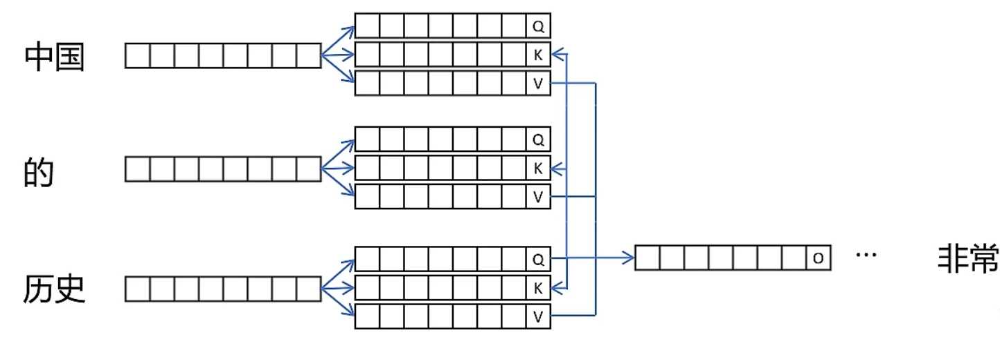


值得注意的是，KV 缓存的大小通常和模型本身大小是同一级别，也是一种空间换时间的策略

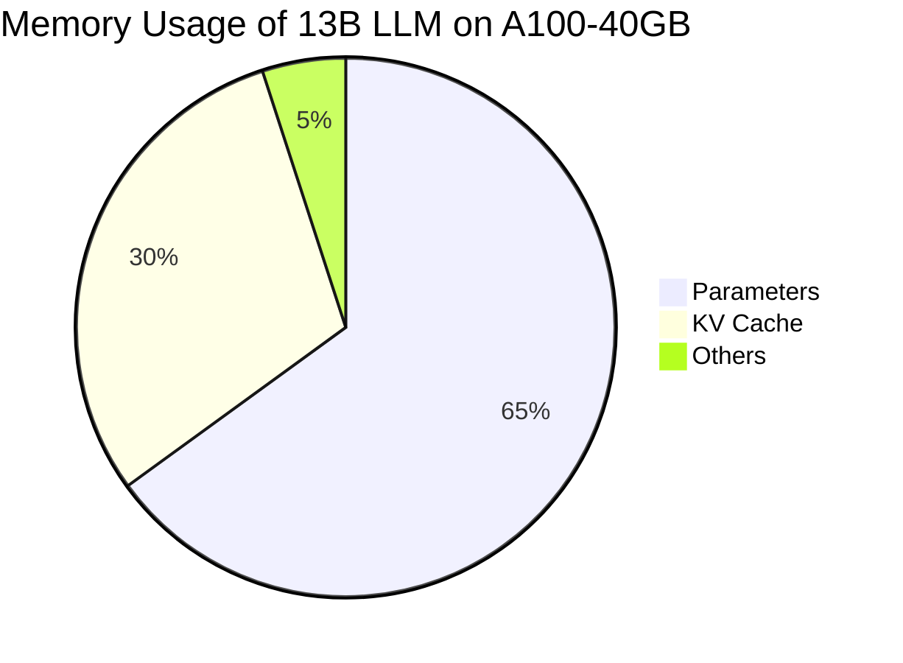


## Paged Attention
### 为什么需要

!!! note "操作系统"
    操作系统需要给进程预先分配内存吗

    每个页4K
    
    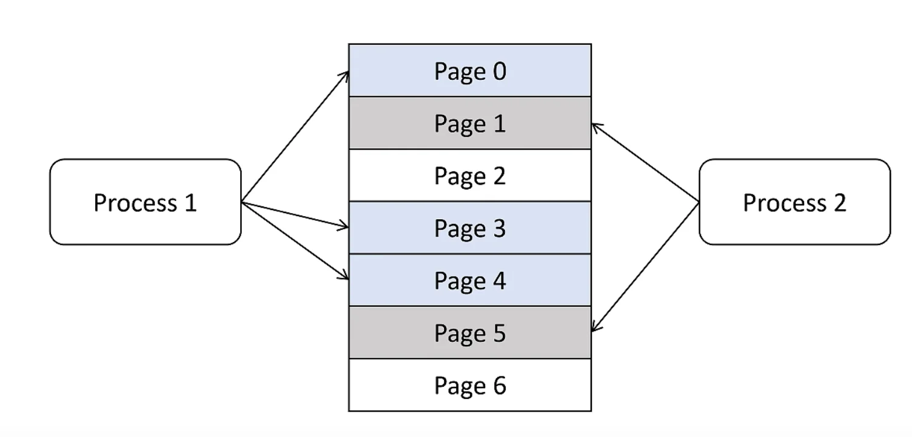


### 原理

- 不预分配，按需调用
  
- 按块Block分配内存，碎片更小
    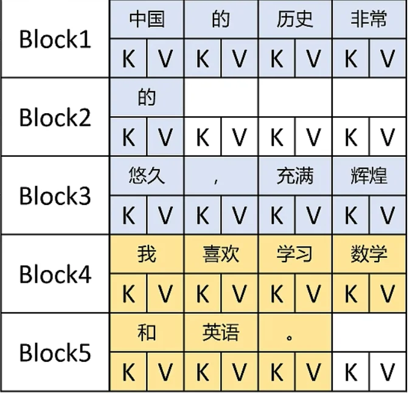

- 虚拟内存：逻辑内存是连续的，通过映射表链接到物理内存（实际分配不连续）；方便调用

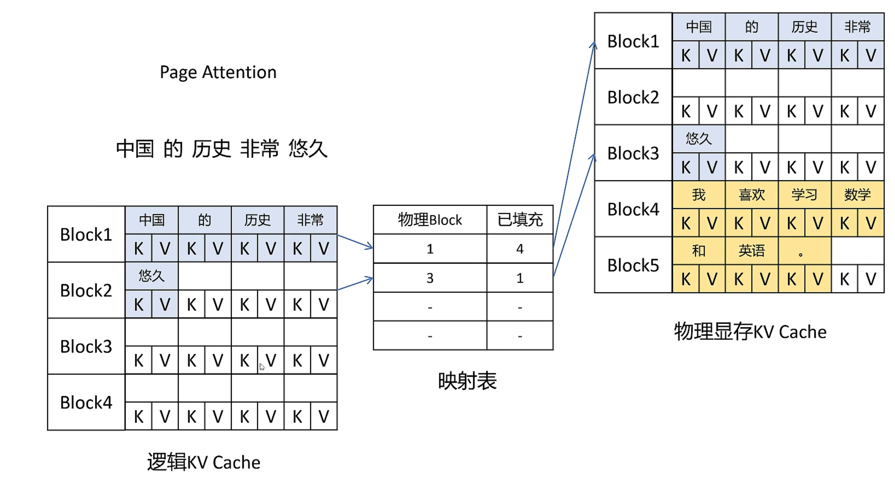


## Share KV Cache

**copy on write**机制：引用大于1的时候，不能直接写入，必须拷贝一份，再写入

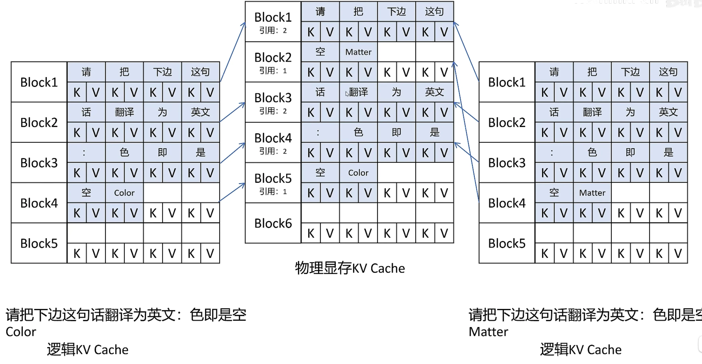

还可以优化 beam-search

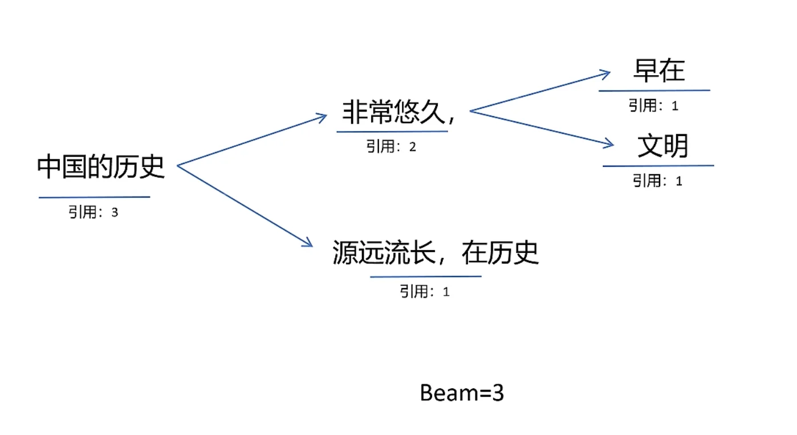


## Flash Attention
[[2205.14135] FlashAttention: Fast and Memory-Efficient Exact Attention with IO-Awareness](https://arxiv.org/pdf/2205.14135)

[](https://www.semanticscholar.org/paper/FlashAttention%3A-Fast-and-Memory-Efficient-Exact-Dao-Fu/87c5b281fa43e6f27191b20a8dd694eda1126336)[](https://github.com/Dao-AILab/FlashAttention) 

- Fast
- Memory-Efficient
- Exact 

<iframe src="//player.bilibili.com/player.html?isOutside=true&aid=1706279420&bvid=BV1UT421k7rA&cid=1625114922&p=1&autoplay=0&high_quality=1&danmaku=0" scrolling="no" border="0" frameborder="no" framespacing="0" allowfullscreen="true" width="100%" height="500px"></iframe>


### 为什么需要

> Transformers are slow and memory-hungry on long sequences, since the time and memory complexity of self-attention are quadratic in sequence length.


SRAM读取快，HBM读取慢

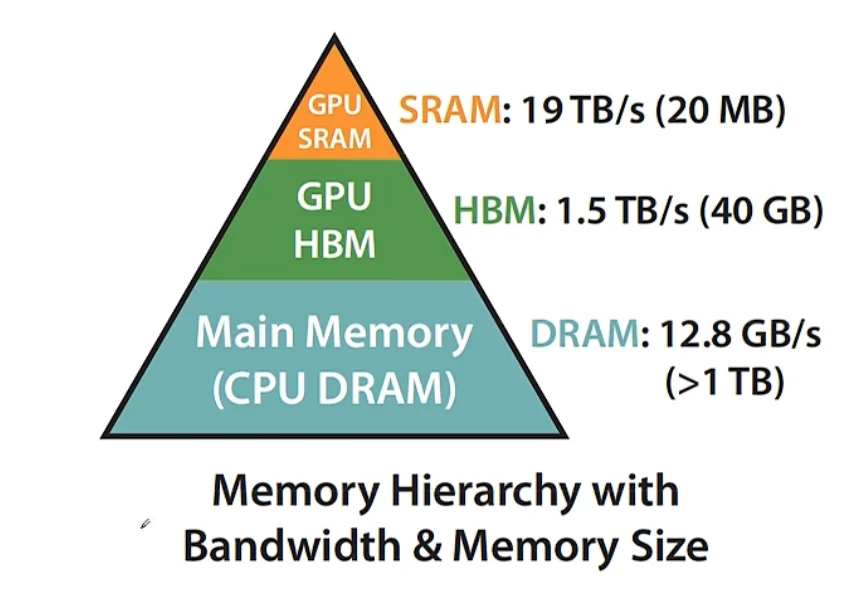


- Compute-bound: （数据等算力）
  - 大的矩阵乘法，多channel卷积
- IO-bound:（算力等数据）
  - 按位操作：Relu，Dropout
  - 规约操作：sum、softmax

一般使用fusion融合操作，算结果时候只读取一次HBM


### 原始 Attention的实现

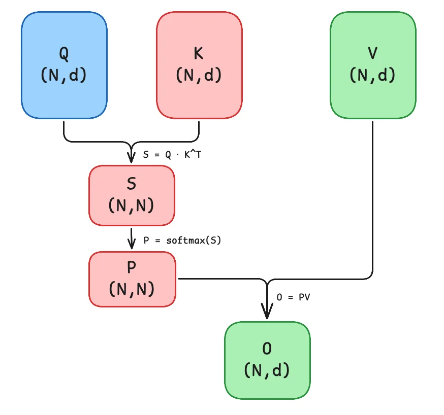

矩阵 $Q$, $K$, $V \in \mathbb{R}^{N\times d}$ 存储在 HBM。（$N$ 是序列长度，$d$ 是维度）

1. 从 `HBM` 加载 $Q$, $K$ 到 `SRAM`
2. 计算出 $S = QK^T$
3. 将 $S$ 写到 `HBM`
4. 将 $S$ 加载到 `SRAM`
5. 计算 $P = softmax(S)$
6. 将 $P$ 写出到 `HBM`
7. 从 `HBM` 加载 $P$ 和 $V$ 到 `SRAM`
8. 计算 $O = PV$
9. 把 $O$ 写出到 `HBM`
10. 返回 $O$


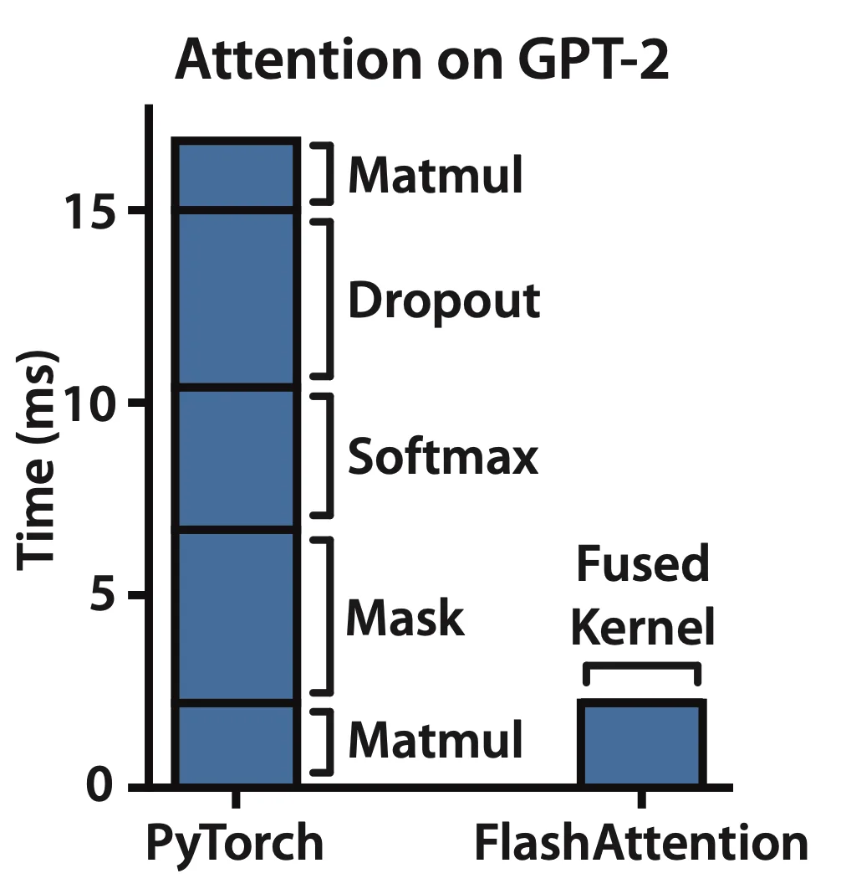

### tiling **softmax**


减少IO量

让Attention的所有计算都符合**加法结合律**

- 通过分块计算，融合多个操作，减少中间结果缓存
- 反向传播等时候，重新计算结果

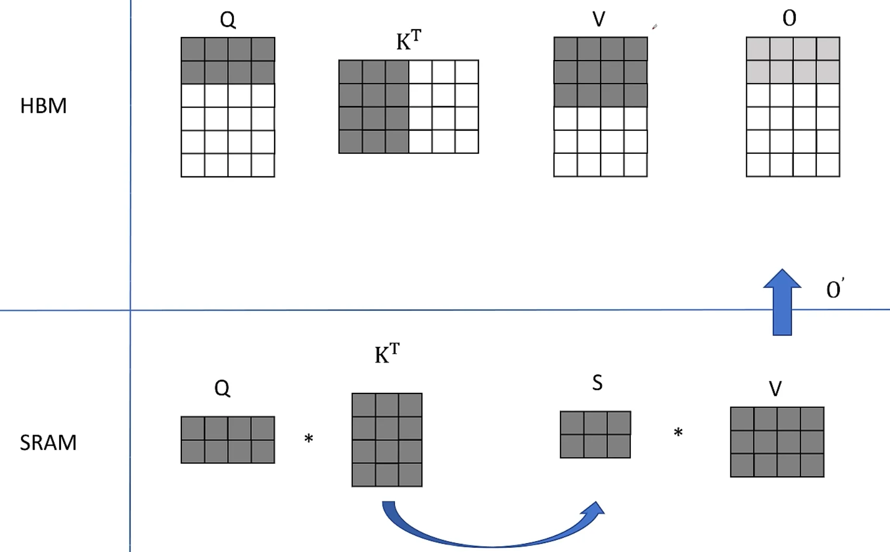

!!! note "**softmax**精度问题"
    $e$的指数项可能超过精度，比如65536

    使用指数项可能会爆精，所以使用safe_softmax


    $$
    \begin{aligned}
    m &= \max(x_1,...,x_N) \\
    \mathrm{softmax}(\{x_1,...,x_N\}) &= \{\frac{e^{x_i}/e^m}{\sum_{j=1}^Ne^{x_j}/e^m}\}_{i=1}^N = \{\frac{e^{x_i-m}}{\sum_{j=1}^Ne^{x_j-m}}\}_{i=1}^N
    \end{aligned}
    $$


即如果计算了左侧的softmax，右侧的softmax如何计算整体的

KV 在外循环 Q在内循环

$$
\begin{aligned}
& x = \lfloor x_1, \ldots, x_N, \ldots, x_{2N} \rfloor \\
& m(x) := \max(x) \quad \text{其中} \quad x = [x_1, \ldots, x_N] \\
& p(x) := [e^{x_1 - m(x)}, \ldots, e^{x_N - m(x)}] \\
& l(x) := \sum_i p(x)_i \\
& softmax(x) := \frac{p(x)}{l(x)}
\end{aligned}
$$

对于整体来讲

$$
\begin{aligned}
& x^1 = [x_1, \ldots, x_N] \quad x^2 = [x_{N+1}, \ldots, x_{2N}] \\
& m(x) := \max(m(x^1), m(x^2)) \\
& p(x) := [e^{m(x^1) - m(x)} p(x^1), e^{m(x^2) - m(x)} p(x^2)] \\
& l(x) := e^{m(x^1) - m(x)} l(x^1) + e^{m(x^2) - m(x)} l(x^2) \\
& softmax(x) := \frac{p(x)}{l(x)}
\end{aligned}
$$


```python title="去掉最后一个 embedding 维度（4）"
Q.shape[:-1] = (1, 1, 6)
```


`[..., None]` 会在最后**增加一个维度**，相当于：

```python
(1, 1, 6) → (1, 1, 6, 1)
```

所以：

* **`l.shape` = `(1, 1, Q_LEN, 1)`**
* **`m.shape` = `(1, 1, Q_LEN, 1)`**


??? note "为什么是 `(1, 1, Q_LEN, 1)` 而不是 `(1, 1, Q_LEN)`？"
    
    **作用：方便广播运算**
    
    在注意力计算时，`l` 和 `m` 是**针对每个 query 位置**存储的：
    
    * `m` → 这个位置的当前最大 logit（数值稳定 softmax 用）
    * `l` → 这个位置的 softmax 分母（`sum(exp(...))`）
    
    在后续更新中，会用到像：
    
    ```python
    torch.exp(m_block_ij - mi_new)
    ```
    
    这里的 `m_block_ij` 形状通常是 `(1, 1, block_size, 1)`，
    如果 `l` 和 `m` 也有最后一个 `1` 维度，就可以**无额外 reshape 直接广播**。


    **另外一个原因：与 V 对齐**
    
    注意力输出是：
    
    ```python
    output = sum(softmax(QK^T) * V)
    ```
    
    `V` 的形状是 `(1, 1, KV_LEN, dim)`，
    而 `l`、`m` 只存每个 query 的一个标量，所以最后一维是 `1`，
    这样在计算时既能和 `(1, 1, Q_LEN, dim)` 广播，也能和 `(1, 1, Q_LEN, 1)` 对齐。


需要额外存储

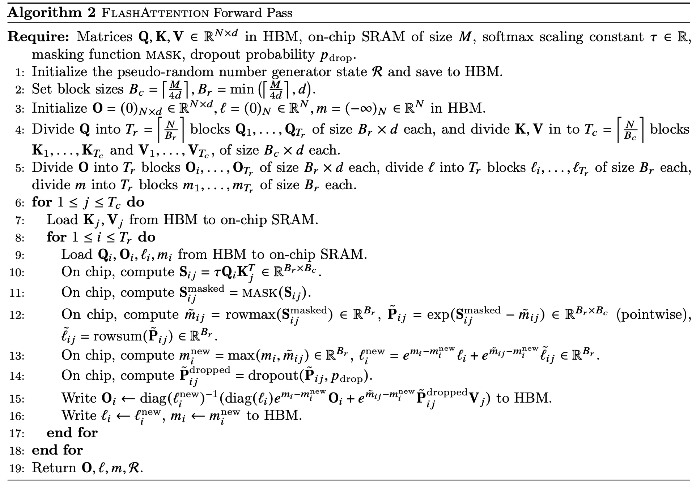

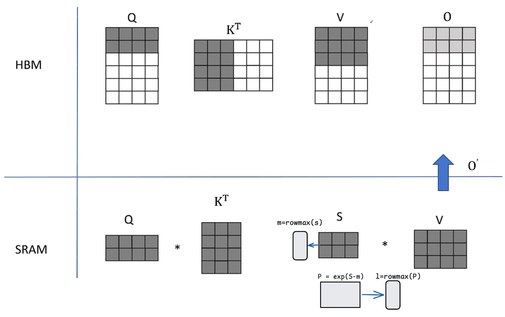

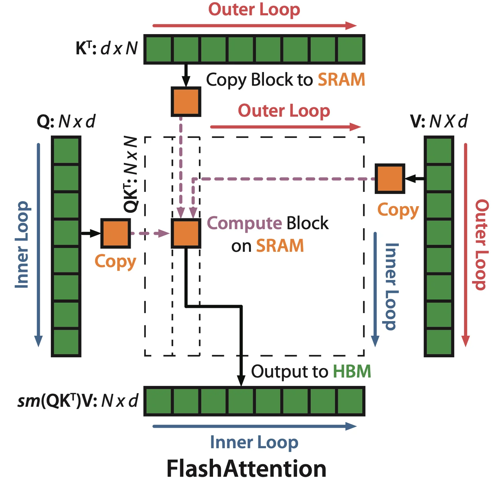


### 反向传播 recomputation

前向的时候，会保存softmax统计值，$m$和$l$

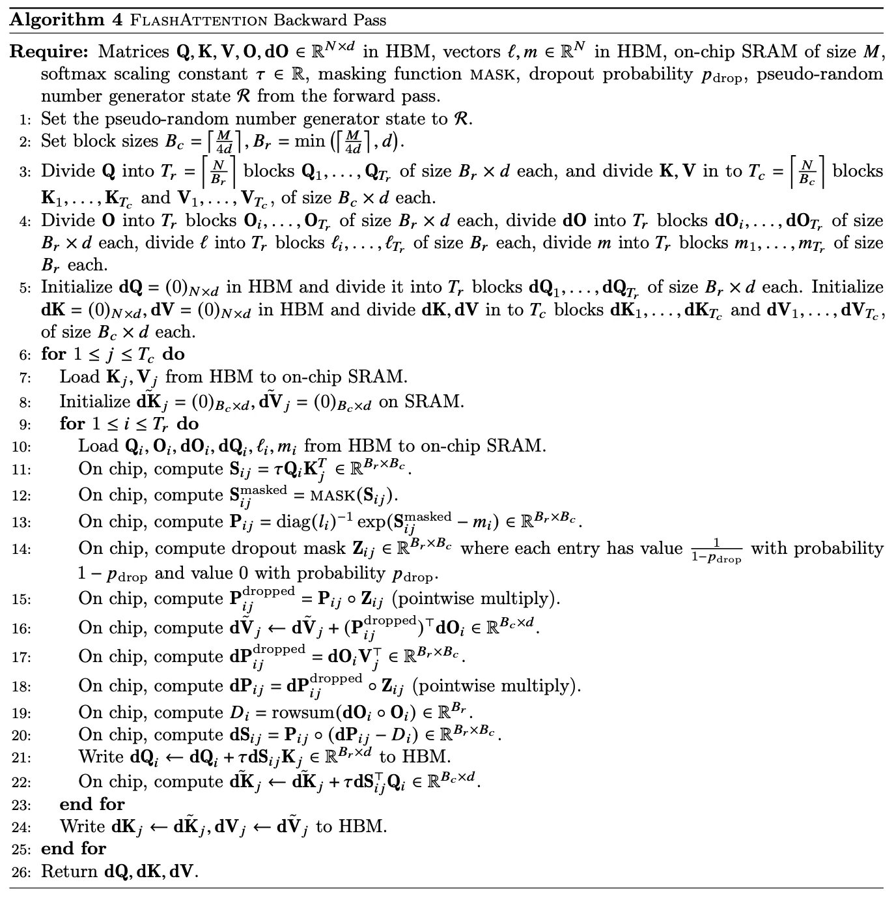


## StreamLLM


在nvidia-smi中可以看到所有GPU的利用率会直接冲到100%，直到这个超卡的请求全部生成完，才会恢复正常。这不就是典型的优先prefill暂停decode么，解决办法就是chunked prefill size啊，deepseek都告诉你了。
