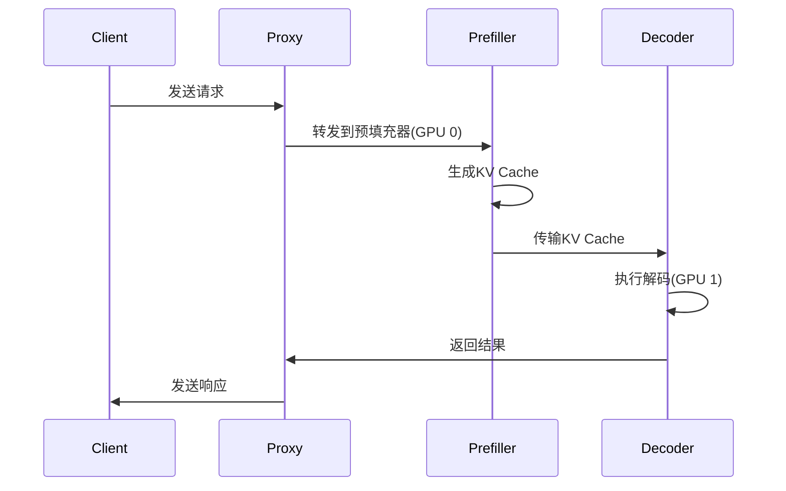

---
status: new
comments: True
--- 
# 06 | Infer Optimization

!!! note "正在施工中👷.. "

## 1. Flash Attention

在nvidia-smi中可以看到所有GPU的利用率会直接冲到100%，直到这个超卡的请求全部生成完，才会恢复正常。这不就是典型的优先prefill暂停decode么，解决办法就是chunked prefill size啊，deepseek都告诉你了。

## 2. Key-value cache
- Key-value cache

什么是 KV Cache？
在 Transformer 模型（如 LLaMA、GPT）中，模型会对之前输入的内容进行“记忆”，这种“记忆”被保存在一个叫 KV Cache（Key-Value Cache） 的地方。

为什么需要它？
假设你已经输入了一段话：

“Once upon a time, in a faraway land,”

接下来你想生成下一个词。如果每次都从头开始输入，效率会非常低。

所以模型会把之前算好的结果（注意力的 Key 和 Value）缓存起来，之后生成的时候 只处理新增的内容。

原理（简化）
每个 Token 输入时，模型会计算对应的 Key 和 Value。

这些 K/V 会被保存下来。

下一次输入新的 Token 时，只需要用新 Token 的 Query 去和之前的 Key 做注意力计算，而不用重新计算整个序列。

这样就实现了高效的增量生成。

## 3. Speculative decoding
- Speculative decoding

