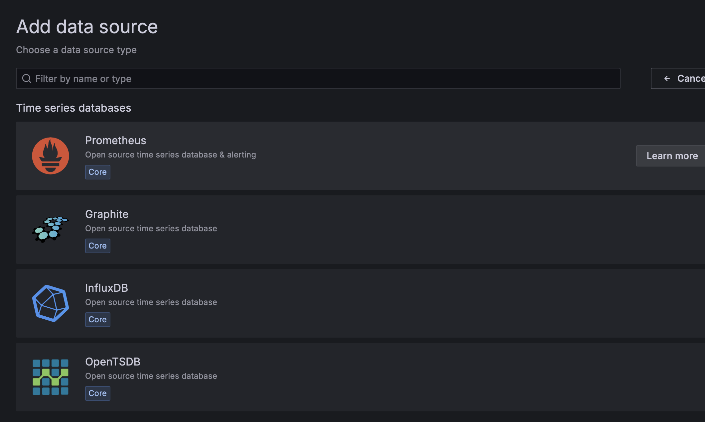
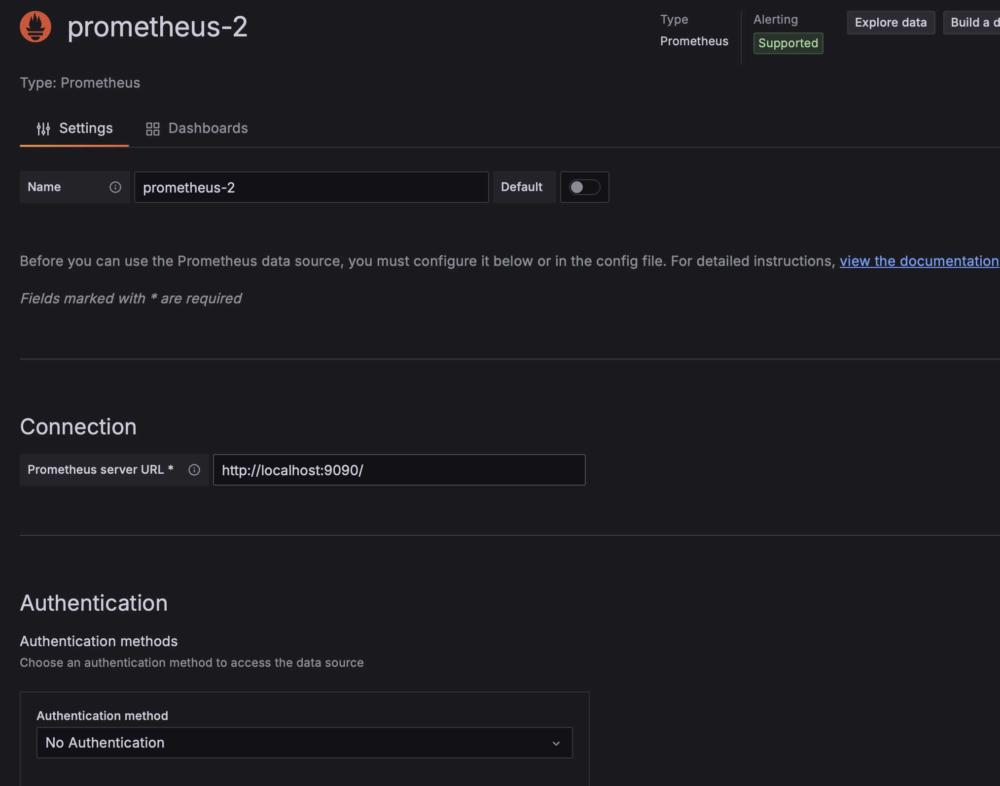
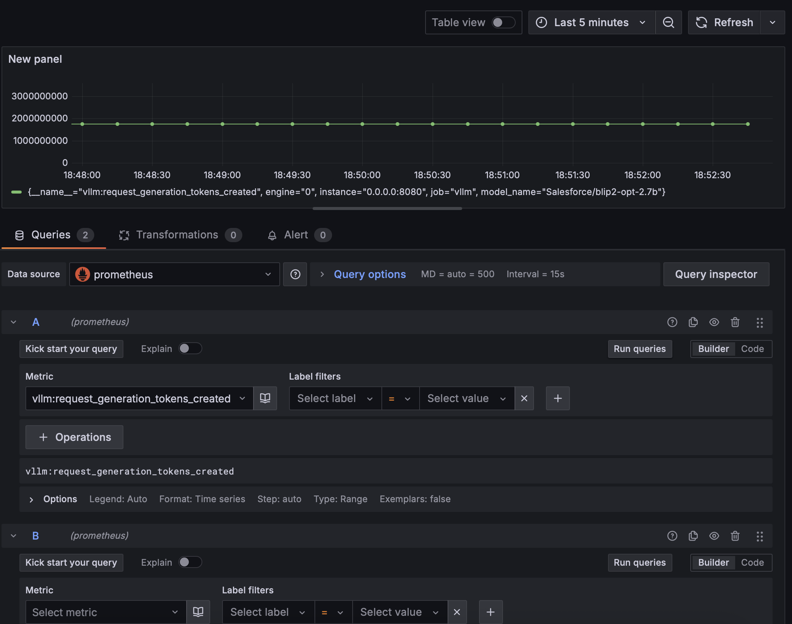

# 07 | LLM 评估与监控

!!! note "正在施工中👷.. "

```toml title="本项目用到的pyproject.toml"
[project]
name = "code"
version = "0.1.0"
description = "my repos of using vllm and relating tools"
readme = "README.md"
requires-python = ">=3.10"
dependencies = [
    "datasets>=4.0.0",
    "evalscope[app,perf,vlmeval]>=0.16.3",
    "lmcache>=0.3.3",
    "nixl>=0.4.1",
    "nvitop>=1.5.2",
    "nvitop-exporter>=1.5.2",
    "pandas>=2.3.1",
    "swanlab>=0.6.8",
    "vllm>=0.10.0",
]

[[tool.uv.index]]
url = "https://mirrors.aliyun.com/pypi/simple"
default = true
 
[tool.uv.pip]
index-url = "https://mirrors.tuna.tsinghua.edu.cn/pypi/web/simple"
```

## 工具链

vllm + Prometheus + Grafana


## Benchmark 基准测试

LLM（Large Language Model）基准测试（benchmarking）是评估大型语言模型性能的关键方法，benchmark_latency和benchmark_serving是用于评估机器学习模型性能的两个重要方面，尤其是在部署和实际应用中。它们的目标是确保模型在不同条件下具有良好的响应时间和服务能力。

### Benchmark Latency

Latency 是指从输入数据发送到模型，直到模型返回预测结果之间所花费的时间。在机器学习模型的评估中，benchmark_latency 主要关注以下方面：

- **Inference Time**: 单次推理所需的时间，包括模型加载、数据预处理、推理过程以及后处理
- **Throughput**: 每秒处理的请求数，通常与延迟成反比关系
- **Consistency**: 在不同负载条件下，延迟是否保持稳定，是否存在明显的抖动或延迟尖峰

### Benchmark Serving

Serving 是指在生产环境中部署和运行模型，以处理实际的用户请求。benchmark_serving 关注模型在生产环境中的整体性能和稳定性，包括：

- **Scalability**: 系统在增加负载时能否有效扩展，保持高性能
- **Reliability**: 系统的可靠性，包括在高负载或异常情况下的稳定性
- **Resource Utilization**: 评估CPU、GPU、内存等资源的使用情况，确保在高效利用资源的同时保持高性能
- **Latency under Load**: 在高并发请求下，系统的延迟表现


### 压力测试核心指标

| 指标类别 | 指标名称 | 含义 | 单位 | 典型阈值 |
|---------|---------|------|------|---------|
| **延迟类** | P50 latency | 50% 请求完成时间 | ms | < 100 ms |
| | P90 latency | 90% 请求完成时间 | ms | < 200 ms |
| | P99 latency | 99% 请求完成时间 | ms | < 500 ms |
| | TTFT (Time To First Token) | 首 token 延迟 | ms | < 50 ms |
| | TPOT (Time Per Output Token) | 每输出 token 延迟 | ms | < 20 ms |
| **吞吐类** | QPS (Queries Per Second) | 每秒查询数 | req/s | 取决于模型规模 |
| | TPS (Tokens Per Second) | 每秒生成 token 数 | tokens/s | 取决于 GPU 数量 |
| | Goodput | 成功请求占比 | % | > 99% |
| **资源类** | GPU 利用率 | GPU 计算单元使用率 | % | 80-95% |
| | GPU 显存占用 | 显存使用比例 | % | < 90% |
| | CPU 利用率 | CPU 计算单元使用率 | % | < 80% |
| | 网络带宽 | 网络传输速率 | Gbps | 视部署规模而定 |
| **稳定性类** | 错误率 | 失败请求占比 | % | < 1% |
| | 超时率 | 超时请求占比 | % | < 0.1% |
| | 重启次数 | 服务重启频率 | 次/小时 | 0 |
| **扩展性类** | 并发用户数 | 同时在线用户数 | 人 | 视业务需求 |
| | 队列长度 | 等待处理请求数 | 个 | < 100 |
| | 自动扩缩容时间 | 弹性伸缩耗时 | s | < 30 s |


## 压测工具

### vLLM 内置压测
LLM 公开了一些指标，可用于监控系统的健康状况。这些指标通过 vLLM OpenAI 兼容 API 服务器上的 `/metrics` 端点公开。


[生产指标 — vLLM 文档](https://docs.vllm.com.cn/en/latest/serving/metrics.html)

vLLM 提供了内置的基准测试工具，用于评估模型性能。

```shell
TORCH_CUDA_ARCH_LIST="8.9"
MODEL_NAME="Qwen/QwQ-32B-AWQ"
NUM_PROMPTS=1000
DATASET_NAME="sharegpt"
DATASET_PATH="/root/autodl-tmp/jacky/benchmark/ShareGPT_V3_unfiltered_cleaned_split.json"
MAX_MODEL_LEN=1024
python3 vllm/benchmarks/benchmark_throughput.py \
  --model "${MODEL_NAME}" \
  --dataset-name "${DATASET_NAME}" \
  --dataset-path "${DATASET_PATH}" \
  --num-prompts "${NUM_PROMPTS}" \
  --max-model-len ${MAX_MODEL_LEN}
```

### SGLang Benchmark

SGLang 框架提供的基准测试工具，用于评估 SGLang 应用的性能表现。


### evalscope

来自 ModelScope 的评估工具，提供全面的模型评估能力。

#### VLM


### GenAI-Perf

专门为生成式AI设计的性能评估工具。

### 其他压测工具

[FlyAIBox/llm_benchmark](https://github.com/FlyAIBox/llm_benchmark) 是一个专门用于大模型推理压测的开源工具。


## 监控工具

### nvitop-exporter

nvitop 是一个实时监控 GPU 各项核心指标的工具，支持终端交互式查看。

nvitop-exporter

将 GPU 指标转换为 Prometheus 兼容格式的工具，通过 HTTP 接口暴露数据。

```shell
uv pip install --upgrade nvitop nvitop-exporter
```

```shell
nvitop-exporter --bind 0.0.0.0 --port 5050
```

会在`5050/metrics`下面把gpu的信息列出来，可以使用prometheus记性数据采集

### Prometheus

Prometheus 是一个开源的监控和告警系统，用于数据采集与存储。

**主要功能：**
- 时序数据存储
- 数据查询语言
- 告警规则配置
- 服务发现
- 高可用性支持

[Download | Prometheus](https://prometheus.io/download/)

!!! note "AutoDL因为本身就是docker环境搭建的，所以不支持运行docker"

```shell
tar -xvf prometheus-3.5.0.linux-amd64.tar 
```


```yml title="prometheus.yml" hl_lines="18 24"
# 全局配置项，适用于所有 job
global:
  # 设置 Prometheus 抓取目标指标的时间间隔
  scrape_interval: 15s      # 每 15 秒抓取一次数据（默认是 1 分钟）

  # 设置评估告警规则的时间间隔
  evaluation_interval: 15s  # 每 15 秒检查一次告警规则（默认是 1 分钟）

  # 设置每次抓取目标的最大超时时间
  scrape_timeout: 10s       # 默认也是 10 秒

# 抓取目标配置
scrape_configs:
  # 第一个 job：监控 vllm 推理服务
  - job_name: 'vllm'        # job 名称，Prometheus 中标签为 job="vllm"
    static_configs:
      - targets:
          - '0.0.0.0:8080'  # vllm 服务的地址和端口，更改为你的服务端口

  # 第二个 job：GPU 监控（使用 nvitop-exporter）
  - job_name: 'gpu-monitoring'  # job 名称，用于标识 GPU 指标来源
    static_configs:
      - targets:
          - '0.0.0.0:5050'  # nvitop-exporter 默认监听在 5050 端口
```


```shell title="运行，默认使用路径下的prometheus.yml配置"
./prometheus
```

## 可视化工具

### Grafana

Grafana 是一个开源的数据可视化和监控平台。

**主要功能：**
- 丰富的图表类型
- 多数据源支持
- 仪表盘定制
- 告警通知
- 用户权限管理


缺点：

- 数据抓取时间间隔15s 较长，不适用于时间精度要求较高的任务

=== "ubuntu"

    这种方法autodl用不了
    
    ```shell title="安装"
    sudo apt-get install -y adduser libfontconfig1 musl
    wget https://dl.grafana.com/enterprise/release/grafana-enterprise_12.0.0_amd64.deb
    sudo dpkg -i grafana-enterprise_12.0.0_amd64.deb
    ```

=== "直接下载"

    ```shell
    wget https://dl.grafana.com/enterprise/release/grafana-enterprise-12.0.0.linux-amd64.tar.gz
    tar -zxvf grafana-enterprise-12.0.0.linux-amd64.tar.gz
    ```

```shell
cd grafana-v12.0.0/bin/
./grafana server
```

会在3000端口开一个服务

登陆进去之后使用 账户密码都是admin admin登陆
    

添加`prometheus`数据源



在URL处填入网址，其他可以不变。

```text
http://localhost:9090/
```




打开Dashboard

1. 在“指标”选项卡下，选择您的 Prometheus 数据源（右下角）。
2. 在“查询”字段中输入任何 Prometheus 表达式，同时使用“指标”字段通过自动补全查找指标。
3. 要格式化时间序列的图例名称，请使用“图例格式”输入。例如，要仅显示返回查询结果的 method 和 status 标签（用破折号分隔），您可以使用图例格式字符串 {{method}} - {{status}}。
4. 调整其他图表设置，直到您有一个可用的图表。



抓取的time interval是15s，而且不能更改，所以grafana测量得到的数据粒度不高


### Streamlit

Streamlit 是一个用于快速构建数据应用的 Python 库。

**主要功能：**
- 快速原型开发
- 交互式数据展示
- 机器学习模型展示
- 实时数据更新

### 夜莺

夜莺是一个开源的监控告警系统，提供完整的监控解决方案。

**主要功能：**
- 数据采集
- 数据存储
- 告警管理
- 可视化展示

### SwanLab

SwanLab 是一个轻量级的实验跟踪工具。优点：国产团队，国内访问比较方便

**主要功能：**
- 实验记录
- 指标可视化
- 模型比较
- 简单易用

```shell
pip install swanlab
```

```shell
swanlab login
```


### TensorBoard

TensorBoard 是 TensorFlow 的可视化工具，也可用于其他深度学习框架。

**主要功能：**
- 训练过程可视化
- 模型结构展示
- 性能指标跟踪
- 参数分布分析

### WandB (Weights & Biases)

WandB 是一个用于机器学习实验跟踪的平台。

**主要功能：**
- 实验管理
- 模型版本控制
- 性能指标跟踪
- 团队协作


## 相关资源


- [基于 nvitop+Prometheus+Grafana 的物理资源与 VLLM 引擎服务监控方案](https://blog.csdn.net/xiangyuanhong08/article/details/148011686)
- [使用 Prometheus、Grafana、Loki 和 Alloy 在 Google GKE 上监控 Streamlit 应用程序](https://medium.com/@omarnour_5895/monitoring-a-streamlit-app-on-gke-with-grafana-loki-alloy-4d1bad572c01)