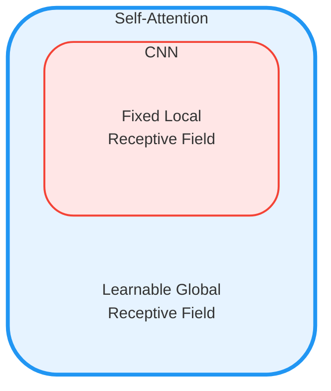
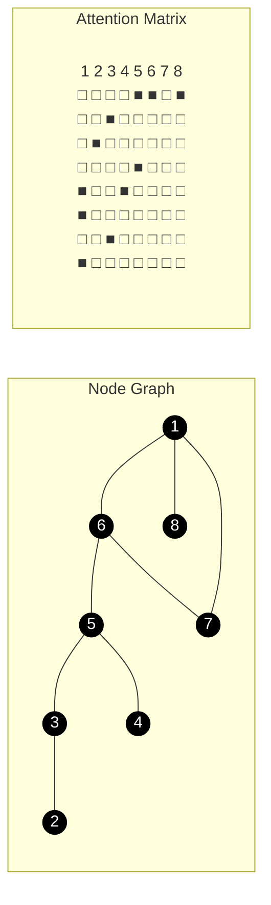

# 注意力机制

个人学习流程：

3b1b 视频 ➡️ 李宏毅视频 ➡️ 李沐视频 ➡️ 论文阅读 ➡️ 代码实战 ➡️ 公司面试八股

<iframe src="https://arxiv.org/pdf/1706.03762" width="100%" height="600px" style="border: none;">
This browser does not support PDFs
</iframe>

- [ ] 各个层的参数数量整理
- [ ] 时间复杂度计算

## 对比
!!! note "对应paper中abstract、background"

### vs CNN

CNN只考虑卷积核的感受野，而attention考虑整个序列

所以卷积难以考虑较长的序列，如果距离较远的话，需要很多层卷积才可以达到效果；

> 图源网络，侵删

而attention可以考虑整个序列，所以可以考虑较长的序列

---

可以说CNN是attention的特例

attention也可以说是特殊的CNN，相当于CNN的receptive filed是learn出来的

<iframe src="https://arxiv.org/pdf/1911.03584" width="100%" height="600px" style="border: none;">
This browser does not support PDFs
</iframe>

- data 较少的时候，CNN训练效果好
- 数据量较大的时候，attention效果好，有scaling效应

### vs RNN

- RNN 计算$h_t$的时候，需要考虑hidden state $h_{t-1}$ and the input for position $t$
- 很早期的信息在后续计算的时候可能会丢失，做大的ht对内存开销较大

- RNN虽然可以双向，但是不可以并行计算，对memory要求高

<iframe src="https://arxiv.org/abs/2006.16236" width="100%" height="600px" style="border: none;">
This browser does not support PDFs
</iframe>

### vs GNN
- 应用在gragh结构上的时候，可以使用edge已经给出的连接关系，直接计算attention score，其他节点可以直接设置成0

## Self-Attention

思考下面的问题：

- 同一个词汇，放在句子不同位置，它的语义可能不同（我们需要上下文信息）：可以开window解决
- 但如果输入是一个变长的序列：开window就解决不了了

所以需要一个机制，让每个词汇都考虑整个序列的信息（这个序列是变长的），这就是self-attention

### word embedding

word2vec：获得词汇的最初始含义

Word embedding.

- 嵌入是一个“抽象”的过程，把高维向量嵌入到一个低维度当中

> in the embedding layers, we multiply weights by $\sqrt{d_{model}} = \sqrt{512}$ 
> 防止，维度一高，导致初始时候与position encoding的值相差太大

### position encoding

我们不仅仅需要考虑词汇的语义信息，还需要考虑词汇的位置信息，所以需要一个position encoding

位置编码通过向每个位置的词嵌入添加一个特定的向量来实现，其中第 $i$ 个位置的第 $2k$ 或 $2k+1$ 维的位置编码分别为：

$$
\begin{aligned}
PE(pos,2i) &= \sin(\frac{pos}{10000^{2i/d_{model}}})\\
PE(pos,2i+1) &= \cos(\frac{pos}{10000^{2i/d_{model}}})
\end{aligned}
$$

- $pos$ 是序列中的位置（从0开始）
- $i$ 是维度索引（从0开始）
- $d_{model}$ 是词嵌入的维度

这种正弦和余弦函数的使用使得模型能够区分不同位置的词，并使得模型能够学习到位置的相对关系，解决了Transformer模型自身不具备处理序列中元素顺序信息的问题。

> 当然表示位置的算法可以自己创造
> 可学习的位置编码、相对位置编码、旋转位置编码（RoPE）

### Attention 计算 -- scaled dot-product attention

word embedding 解决了词汇本身的含义，position encoding 附加了词汇的位置信息，那么词汇的不同位置（或者说上下文信息）是如何影响到这个词汇的最终含义呢？

这里涉及到计算attention score，如何计算attention score呢？

我们使用三个矩阵，来计算attention score

- $Q$: query
- $K$: key
- $V$: value,如何让前面的词汇影响后面的词汇，word embedding乘上这个矩阵得到一个转移到向量 

attention分数：$K$与$Q$的点积，可以看作$K$与$Q$的相似度，为value矩阵提供权重。对于如果$Q$ 和 $K$ 相似度很高，那么就给予$V$ 更多的权重

$$
Attention(Q,K,V) = softmax(\frac{QK^T}{\sqrt{d_k}})V
$$

$d_k$ 是Q和K的维度，因为Q和K的维度是相同的，在论文中是$d_k = 512$

> 如果$d_k$ 很大，那么$QK^T$ 的值会很大，导致softmax的值趋近于1，导致梯度消失
> 所以需要除以$\sqrt{d_k}$ 来归一化

> 图片来源：李宏毅老师ppt

> 图片来源：3b1b

点积能够有效衡量两个向量的相似性。在注意力机制中，通过计算查询向量（Query）和键向量（Key）的点积，可以评估它们之间的相关性，从而决定注意力权重

!!! note "attention的注意力矩阵的计算为什么用乘法而不是加法？"

    **为了计算更快**。
    
    注意力机制有两种
    
    $$
    \begin{aligned}
    &score(h,s)=<v,tanh(W_1h+W_2s)> \quad \text{additive attention} \\
    &score(h,s)=< W_1h,W_2s> \quad \text{dot-product attention}
    \end{aligned}
    $$
    
    

    加法形式是先加、后tanh、再和V矩阵相乘，相当于一个完整的隐层。

    !!! note "计算复杂度"
    
    - 在计算复杂度上，乘法和加法理论上的复杂度相似，但是在实践中，乘法可以利用高度优化的矩阵乘法代码(有成熟的加速实现)使得点乘速度更快，空间利用率更高。(论文P4有解释)
    - 加性注意力需要额外的全连接层和非线性变换，计算复杂度高，且不好并行
    - 点积可通过除以根号下dk进行缩放缓解梯度问题，加性注意力的不如其稳定；在$d_k$较小的时候，加法和乘法形式效果相近。但是随着$d_k$增大，加法开始显著优于乘法。作者认为，$d_k$增大导致乘法性能不佳的原因，**是极大的点乘值将整个softmax推向梯度平缓区，使得收敛困难**。于是选择scale，除$\sqrt{d_k}$。

!!! note "为什么$Q、K、V$ 相同"

    自注意力机制中，$Q、K、V$都是从同一个输入序列$x$中生成的，是因为：
    
    自注意力 的目标是捕捉输入序列中元素之间的依赖关系，**因此需要让每个元素同时作为Query、Key和Value**
    
    通过这种方式，模型可以计算每个元素与其他元素之间的关系，并生成上下文相关的表示

!!! note "Transformer中为什么需要线性变换？"

    **输入**：$x$维度为$[batch\_size, seq\_length, embed\_dim]$
    
    **线性投影**：将输入$x$，分别乘以$w_q, w_k, w_v$，生成$Q、K、V$ 
    - $w$的维度都是 $[batch\_size, embed\_dim, embed\_dim]$ 
    - $Q, K, V$的维度都是 $[batch\_size, seq\_length, embed\_dim]$
    
    $$
    Q = xW_q, K = xW_k, V = xW_v
    $$
    
    [算法岗常见面试题（八）：Transformer_牛客网](https://www.nowcoder.com/discuss/473903838680875008)
    
    $K$、$Q$、$V$分别是输入向量经过不同的线性变换矩阵$W_k$、$Q_k$、$V_k$计算得到。可以从正反两面分析线性变换的必要性：
    
    **线性变换的好处**：在$QK^T$部分，线性变换矩阵将KQ投影到了不同的空间，增加了表达能力(这一原理可以同理SVM中的核函数-
    将向量映射到高维空间以解决非线性问题),这样计算得到的注意力矩阵的泛化能力更高。
    
    **不用线性变换的坏处**：在$QK^T$部分，如果不做线性变换，即X=Q=K,则会导致注意力矩阵是对称的，即$d(x_1,x_2)=d(x_2,x_1)$,
    这样的效果明显是差的，比如“我是一个女孩”这句话，女孩对修饰我的重要性应该要高于我修饰女孩的重要性。

预测时候，把最后一个词乘上一个矩阵，得到映射到词库上面的得分，经过softmax层后，就有了概率分布

softmax：指数放缩后再归一化

$$
softmax(x) = \frac{e^x}{\sum_{i=1}^n e^{x_i}}
$$

我们需要归一化的系数，来作为计算语意移动操作的权重

同时让高值更多权重，采样的时候，让高值更容易被采样到

{width=50%}

在数量级较大时，softmax将几乎全部的概率分布都分配给了最大值对应的标签。

---

这里要引入一个超参数T，来控制softmax的放缩。可以类比化学反应中的温度。T越大，活性越小，softmax的放缩越大，即让高值更多权重。

$$
softmax(x,T) = \frac{e^{x/T}}{\sum_{i=1}^n e^{x_i/T}}
$$

T较大的时候，让放缩较小，即让低值更多权重

!!! note "Transformer attention计算为什么要在softmax这一步之前除以$\sqrt{d_k}$"

    Nil-9 - [transformer中的attention为什么scaled? - 知乎](https://www.zhihu.com/question/339723385)
    
    1. 取决于Softmax的性质，如果softmax内计算的数过大或者过小，可能导致Softmax后的结果为0，导致梯度消失
    2. 为什么是$d_k$。假设$Q$、$K$中元素的值分布在$[0,1]$, softmax的计算中，分母涉及了一次对所有位置的求和，整体的分布就会扩大到$[0,d_k]$。
    
    > $d_k$是$Q$和$K$的维度，因为$Q$和$K$的维度是相同的，在论文中是$d_k = 512$
    
    ---
    
    **softmax 的梯度推导**
    
    给定输入 $\mathbf{x} = [x_1, x_2, \dots, x_n]$，softmax 输出为：
    
    $$
    y_i' = g(\cdot)= \frac{e^{x_i}}{\sum_{j=1}^{n} e^{x_j}}
    \quad\text{for } i=1,\dots,n
    $$

    分两种情况讨论：
    
    $$
    \begin{aligned}
    i = j \; \text{时}\qquad&
    \frac{\partial \hat{y}_i}{\partial x_i}
    = \frac{d}{d x_i} \left( \frac{e^{x_i}}{\sum_k e^{x_k}} \right)=\frac{e^{x_i}\sum_k e^{x_k}-e^{x_i}e^{x_i}}{(\sum_k e^{x_k})^2}
    = \hat{y}_i \left(1 - \hat{y}_i\right)\\
    i \ne j \; \text{时}\qquad&
    \frac{\partial \hat{y}_i}{\partial x_j}
    = \frac{d}{d x_j} \left( \frac{e^{x_i}}{\sum_k e^{x_k}} \right)=-\frac{e^{x_i}e^{x_j}}{(\sum_k e^{x_k})^2}
    = - \hat{y}_i \hat{y}_j\\
    \end{aligned}
    $$
    
    综上
    
    $$
    \boxed{
    \frac{\partial \hat{y}_i}{\partial x_j} = \hat{y}_i (\delta_{ij} - \hat{y}_j)
    }
    $$
    
    其中 $\delta_{ij}$ 是 Kronecker delta：$\delta_{ij} =
    \begin{cases}
    1 & \text{if } i = j \\
    0 & \text{if } i \ne j
    \end{cases}$
    
    **写成矩阵形式（Jacobian）：**
    
    记 softmax 输出为 $\mathbf{\hat{y}} = [\hat{y}_1, \dots, \hat{y}_n]^\top$，则：
    
    $$
    \boxed{
    \mathbf{J}_{\text{softmax}} = \text{diag}(\mathbf{\hat{y}}) - \mathbf{\hat{y}} \mathbf{\hat{y}}^\top
    }
    $$
    
    * $\text{diag}(\mathbf{\hat{y}})$ 是对角矩阵，对角线为 $\hat{y}_i$
    * $\mathbf{\hat{y}} \mathbf{\hat{y}}^\top$ 是外积，得到一个 rank-1 矩阵
    --- 
    
    **梯度消失的推导**
    
    然后我们来看softmax的梯度。不妨简记softmax函数为 $g(\cdot)$，softmax得到的分布向量 $\hat{\mathbf{y}} = g(\mathbf{x})$ 对输入 $\mathbf{x}$ 的梯度为：
    
    $$
    \frac{\partial g(\mathbf{x})}{\partial \mathbf{x}} = \text{diag}(\hat{\mathbf{y}}) - \hat{\mathbf{y}} \hat{\mathbf{y}}^\top \quad \in \mathbb{R}^{d \times d}
    $$
    
    把这个矩阵展开：
    
    $$
    \frac{\partial g(\mathbf{x})}{\partial \mathbf{x}} = \begin{bmatrix}
    \hat{y}_1 & 0 & \cdots & 0 \\
    0 & \hat{y}_2 & \cdots & 0 \\
    \vdots & \vdots & \ddots & \vdots \\
    0 & 0 & \cdots & \hat{y}_d
    \end{bmatrix} - \begin{bmatrix}
    \hat{y}_1^2 & \hat{y}_1 \hat{y}_2 & \cdots & \hat{y}_1 \hat{y}_d \\
    \hat{y}_2 \hat{y}_1 & \hat{y}_2^2 & \cdots & \hat{y}_2 \hat{y}_d \\
    \vdots & \vdots & \ddots & \vdots \\
    \hat{y}_d \hat{y}_1 & \hat{y}_d \hat{y}_2 & \cdots & \hat{y}_d^2
    \end{bmatrix}
    $$
    
    根据前面的讨论，当输入 $\mathbf{x}$ 的元素均较大时，softmax会把大部分概率分布分配给最大的元素，假设我们的输入数量级很大，最大的元素是 $x_1$，那么就将产生一个接近one-hot的向量 $\hat{\mathbf{y}} \approx [1, 0, \cdots, 0]^{\top}$，此时上面的矩阵变为如下形式：
    
    $$
    \frac{\partial g(\mathbf{x})}{\partial \mathbf{x}} \approx \begin{bmatrix}
    1 & 0 & \cdots & 0 \\
    0 & 0 & \cdots & 0 \\
    \vdots & \vdots & \ddots & \vdots \\
    0 & 0 & \cdots & 0
    \end{bmatrix} - \begin{bmatrix}
    1 & 0 & \cdots & 0 \\
    0 & 0 & \cdots & 0 \\
    \vdots & \vdots & \ddots & \vdots \\
    0 & 0 & \cdots & 0
    \end{bmatrix} = \mathbf{0}
    $$
    
    也就是说，在输入的数量级很大时，梯度消失为0，造成参数更新困难。
    
    ---
    
    **维度与点积大小的关系**
    
    假设向量 $q$ 和 $k$ 的各个分量是互相独立的随机变量，均值是0，方差是1，那么点积 $q \cdot k$ 的均值是0，方差是 $d_k$
    
    对 $\forall i = 1, \cdots, d_k$，$q_i$ 和 $k_i$ 都是随机变量，
    
    记 $X = q_i$，$Y = k_i$ 
    
    有：$D(X) = D(Y) = 1$，$E(X) = E(Y) = 0$
    
    则：
    
    $$
    \begin{aligned}
    E(XY) &= E(X)E(Y) = 0 \times 0 = 0\\
    D(XY) &= E(X^2 \cdot Y^2) - [E(XY)]^2 \\
    &= E(X^2)E(Y^2) - [E(X)E(Y)]^2 \\
    &= [D(X)+E^2(X)][D(Y)+E^2(Y)] - [E(X)E(Y)]^2 \\
    &= D(X)D(Y) - [E(X)E(Y)]^2 \\
    &= 1 \times 1 - (0 \times 0)^2 \\
    &= 1
    \end{aligned}
    $$
    
    这样 $\forall i = 1, \cdots, d_k$，$q_i \cdot k_i$ 的均值是0，方差是1，又由期望和方差的性质，对相互独立的分量 $Z_i$，有
    
    $$
    E\left(\sum_i Z_i\right) = \sum_i E(Z_i)\\
    D\left(\sum_i Z_i\right) = \sum_i D(Z_i)
    $$
    
    所以有 $q \cdot k$ 的均值 $E(q \cdot k) = 0$，方差 $D(q \cdot k) = d_k$ 。
    
    方差越大也就说明，点积的数量级越大（以越大的概率取大值）。那么一个自然的做法就是把方差稳定到1，做法是将点积除以 $\sqrt{d_k}$，这样有：
    
    $$
    D\left(\frac{q \cdot k}{\sqrt{d_k}}\right) = \frac{d_k}{(\sqrt{d_k})^2} = 1
    $$
    
    将方差控制为1，也就有效地控制了前面提到的梯度消失的问题。

!!! note "为什么在分类层(最后一层),使用非 scaled 的 softmax?"

    同上面一部分，分类层的 softmax 也没有两个随机变量相乘的情况。此外，这一层的 softmax 通常和交叉熵联合求导，在某个目标类别 $i$ 上的整体梯度变为 $y_i^{\prime}-y_i$ ,即预测值和真值的差。
    
    当出现某个极大的元素值，softmax 的输出概率会集中在该类别上。如果是预测正确，整体梯度接近于 0,抑制参数更新；如果是错误类别，则整体梯度接近于1，给出最大程度的负反馈。
    
    也就是说，这个时候的梯度形式改变，不会出现极大值导致梯度消失的情况了。

    --- 
    
    **交叉熵 + softmax 的梯度推导**

    * softmax 函数记为：
    
    $$
    g(\mathbf{x}) = \left[\frac{e^{x_1}}{\sum_k e^{x_k}}, \dots, \frac{e^{x_n}}{\sum_k e^{x_k}} \right]^\top = \hat{\mathbf{y}}
    $$
    
    $$
    \frac{\partial \hat{y}_i}{\partial x_j} = \hat{y}_i (\delta_{ij} - \hat{y}_j)\qquad \delta_{ij} =
    \begin{cases}
    1 & \text{if } i = j \\
    0 & \text{if } i \ne j
    \end{cases}
    $$
    
    * 交叉熵损失函数定义为：
    
    $$
    \mathcal{L}(\hat{\mathbf{y}}, \mathbf{y}) = -\sum_{i=1}^n y_i \log \hat{y}_i
    $$
    
    $$
    \frac{\partial \mathcal{L}}{\partial \hat{\mathbf{y}}} = \left( -\frac{y_i}{\hat{y}_i} \right)
    $$
    
    * 整体函数组合为：
    
    $$
    \boxed{y = \mathcal{L}(g(\mathbf{x}))}
    $$

    根据链式法则：
    
    $$
    \begin{aligned}
    \frac{\partial y}{\partial x_j}  &=  \sum_i \frac{\partial \mathcal{L}}{\partial \hat{y}_i} \cdot \frac{\partial \hat{y}_i}{\partial x_j}\\
    &= \sum_i \left( -\frac{y_i}{\hat{y}_i} \right) \cdot \left( \hat{y}_i (\delta_{ij} - \hat{y}_j) \right)\\
    &= \sum_i \left( -y_i (\delta_{ij} - \hat{y}_j) \right)\\
    &= -y_j + \hat{y}_j
    \end{aligned}
    $$
    
    即
    
    $$
    \frac{\partial \mathcal{L}(g(\mathbf{x}))}{\partial x_j} = \hat{y}_j - y_j
    $$
    
    写成矩阵形式
    
    $$
    \boxed{
    \nabla_{\mathbf{x}} \mathcal{L}(g(\mathbf{x})) = \hat{\mathbf{y}} - \mathbf{y}
    }
    $$

最后一个词向量，成为预测下一个词的logit

## Multi-Head Attention

- 捕捉更多样的特征
  - 单头 只能从一个子空间计算注意力权重，可能无法充分捕捉输入序列中复杂的依赖关系
  - 多头 通过将输入映射到多个子空间，每个头可以关注不同的特征或模式
- 增强模型的表达能力
- 提高泛化能力
- 并行计算 多头注意力机制可以并行计算多个注意力头，充分利用GPU的并行计算能力

多头注意力，模型能学习到根据上下文改变语意的多种方式。使用多个线性层投影到低维空间，再进行attention计算，那么线性层的$\omega$的参数是可以学习的。

使用不同的$Q$，学习不同种类的相关性

多头注意力机制首先将 Q、K、V 通过不同的线性变换映射到不同的表示空间，然后在每个表示空间上独立地应用自注意力机制，最后将所有头的输出拼接并再次线性变换得到最终输出。

在多头注意力机制中，原始维度$d_{model}$被拆分成$h$个较小的维度$d_k$，每个头对应的维度为$d_k$，使得每个头可以并行处理。

数学上，设有$h$个头，对于第$i$个头

$$
\mathrm{Head}_i=Attention( QW_i^Q, KW_i^K, VW_i^V)
$$

最终输出为：

$$
MultiHead(Q,K,V)=Concat(\mathrm{Head}_1,\ldots,\mathrm{Head}_h)W^O
$$

这种方式能够使模型在不同的子空间捕捉到序列的不同特征，从而提高性能。

## 改进

attention 对于模型的假设更少，所以需要更大的模型，更多的数据量，更多的计算时间，才能达到好的效果

[Transformer变体层出不穷，它们都长什么样？](https://mp.weixin.qq.com/s/iuuRS_M3cYm0DXFkZGjjBg)

!!! note "Transformer计算量最大的部分是哪里"

    多头注意力部分计算量最大。
    
    假设完成一次推理，$b=1$(batch-size), $s=256$(seq-length, 序列最大长度), $h=768$(hidden-size), $head=12$(attention-head) 
    
    经过一个 Transformer的多头注意力block, 所需要的矩阵乘法的数量:
    1. $Q[s, \frac{h}{12}] \times K[\frac{h}{12}, s] = Q[256, 64] \times K[64, 256]$
       - 计算量: $s^2 \times \frac{h}{12} = 256 \times 64 \times 256$
       - 结果: $Score[256, 256] = Score[s, s]$
    
    2. $Score[s, s] \times V[s, \frac{h}{12}] = Score[256, 256] \times V[256, 64]$
       - 计算量: $s^2 \times \frac{h}{12} = 256 \times 256 \times 64$
    
    总计算量: $12 \times (256 \times 64 \times 256 + 256 \times 256 \times 64) = 1$亿次乘法
    
    除矩阵乘法外的其他运算:
    
    1. 除以$\sqrt{d_k}$
       - 计算量: $s^2 = 256 \times 256$
    
    2. Softmax函数
       - 计算量: $s \times (s+s-1) \approx s^2$
    
    补充说明:
    
    1. 两个矩阵相乘的计算量
       - 矩阵$A$尺寸为$(m,n)$
       - 矩阵$B$尺寸为$(n,k)$
       - 计算量为$m \times n \times k$
    
    2. 权重矩阵$K,Q,V$的尺寸
       - 不考虑多头注意力: 均为$(s,h)$
       - 多头注意力(12头): 单头尺寸为$(s,\frac{h}{12})$

### 速度 & 准确

<iframe src="https://arxiv.org/pdf/2011.04006" width="100%" height="600px" style="border: none;">
This browser does not support PDFs
</iframe>

### 训练速度

### attention is not all you need

<iframe src="https://arxiv.org/pdf/2103.03404" width="100%" height="600px" style="border: none;">
This browser does not support PDFs
</iframe>

## Acknowledgement

- 王几行XING - [大模型-Transformer 面试八股文，简单背一背 - 知乎](https://zhuanlan.zhihu.com/p/689965833)

- SweetBean - [算法岗常见面试题（八）：Transformer_牛客网](https://www.nowcoder.com/discuss/473903838680875008)

- ch3nboyu - [Transformer-interview: Transformer面试常见八股](https://github.com/ch3nboyu/Transformer-interview)

<iframe src="//player.bilibili.com/player.html?isOutside=true&aid=1353986541&bvid=BV13z421U7cs&cid=1525102356&p=1&autoplay=0" scrolling="no" border="0" frameborder="no" framespacing="0" allowfullscreen="true" width="100%" height="500px"></iframe>

<iframe src="//player.bilibili.com/player.html?isOutside=true&aid=1154246338&bvid=BV1TZ421j7Ke&cid=1530196453&p=1&autoplay=0" scrolling="no" border="0" frameborder="no" framespacing="0" allowfullscreen="true" width="100%" height="500px"></iframe>

<iframe src="//player.bilibili.com/player.html?isOutside=true&aid=577276749&bvid=BV1wB4y1o7is&cid=1303146692&p=1&autoplay=0" scrolling="no" border="0" frameborder="no" framespacing="0" allowfullscreen="true" width="100%" height="500px"></iframe>

<iframe src="//player.bilibili.com/player.html?isOutside=true&aid=577276749&bvid=BV1wB4y1o7is&cid=1303146918&p=2&autoplay=0" scrolling="no" border="0" frameborder="no" framespacing="0" allowfullscreen="true" width="100%" height="500px"></iframe>