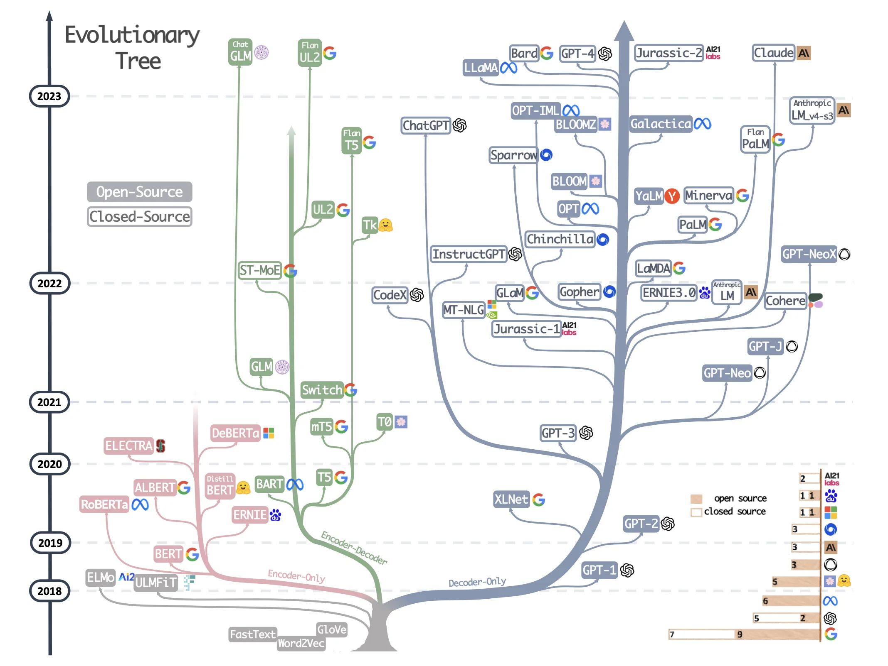

# 现状介绍




> 图源：[Harnessing the Power of LLMs in Practice: A Survey on ChatGPT and Beyond](https://arxiv.org/pdf/2304.13712)

Transformer-based models are shown in non-grey colors: 
- decoder-only models in the blue branch
- encoder-only models in the pink branch
- encoder-decoder models in the green branch. 


## Keyword


### 涌现能力是啥原因？

涌现能力（Emergent Ability）是指模型在训练过程中突然表现出的新的、之前未曾预料到的能力。这种现象通常发生在大型模型中，原因是大型模型具有更高的表示能力和更多的参数，可以更好地捕捉数据中的模式和关联。随着模型规模的增加，它们能够自动学习到更复杂、更抽象的概念和规律，从而展现出涌现能力。

### 模型幻觉是什么？业内解决方案是什么？

模型幻觉是指模型在生成文本时产生的不准确、无关或虚构的信息。这通常发生在模型在缺乏足够信息的情况下进行推理或生成时。业内的解决方案包括：
- 使用更多的数据和更高质量的训练数据来提高模型的泛化和准确性。
- 引入外部知识源，如知识库或事实检查工具，以提供额外的信息和支持。
- 强化模型的推理能力和逻辑推理，使其能够更好地处理复杂问题和避免幻觉。

## 基础

### word2vec


### tokenizer

### NER任务

进行NER任务，选取经典的BIO标注数据，总共有三类实体，人物，地点，组织。那么对于Bert模型来说需要进行的分类一共有
```
O
B-PER
I-PER
B-ORG
I-ORG
B-LOC
I-LOC
X
[CLS]
[SEP]
```
这是由于在做英文tokenize分词处理的时候有可能会出现[“do”, “ing”]这种情况，这时候为了避免冗余，tag只会加到第一个词上，所以后面的都使用X这个label来表示。

## 应用领域


## 网站与资源

### 目前主流的开源模型体系有哪些？

- Transformer体系：由Google提出的Transformer模型及其变体，如BERT、GPT等。
- PyTorch Lightning：一个基于PyTorch的轻量级深度学习框架，用于快速原型设计和实验。
- TensorFlow Model Garden：TensorFlow官方提供的一系列预训练模型和模型架构。
- Hugging Face Transformers：一个流行的开源库，提供了大量预训练模型和工具，用于NLP任务。


## Acknowledgement

- [通向AGI之路：大型语言模型（LLM）技术精要 - 知乎](https://zhuanlan.zhihu.com/p/597586623)
- [Harnessing the Power of LLMs in Practice: A Survey on ChatGPT and Beyond](https://arxiv.org/pdf/2304.13712)