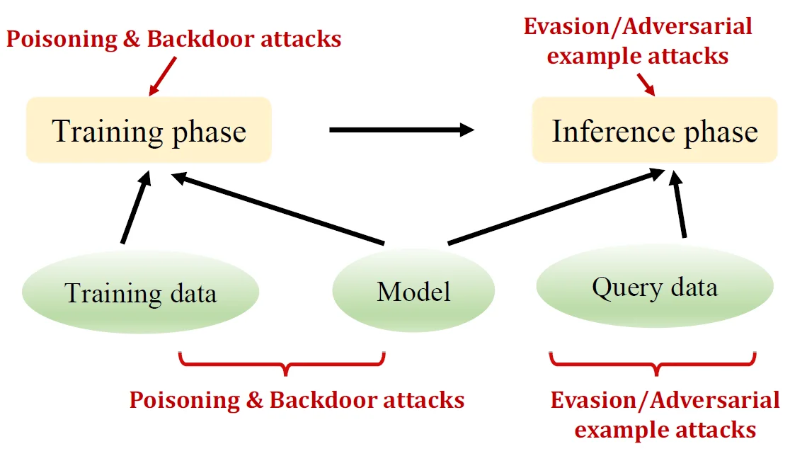
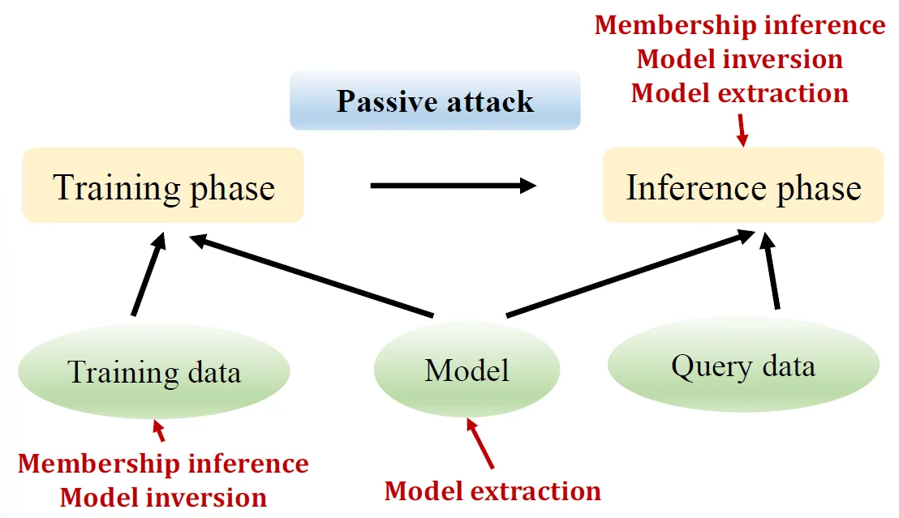

# 01 | 攻防综述
## 基本信息
[Attack ML Models-8-3\_哔哩哔哩\_bilibili](https://www.bilibili.com/video/BV1pb41177Qg?p=3)

[CSIG讲习班20-02 part2 朱军 深度学习的对抗攻击与防守\_哔哩哔哩\_bilibili](https://www.bilibili.com/video/BV1aa4y147dg/)

[AI安全-对抗攻击与防御\_哔哩哔哩\_bilibili](https://www.bilibili.com/video/BV1Z14y177cF/)
深度学习：深度学习是一种深层模型，利用多层非线性变换进行特征提取；由低层特性抽取出高层更抽象的表示。主要类型：循环神经网络、深度置信网络、卷积神经网络等。

对抗攻击：通过设计一种有针对性的数值型向量从而让机器学习模型做出误判，这便被称为对抗性攻击。

对抗样本：人为构造的样本。通过对正常样本x添加难以察觉的扰动ŋ，使得分类模型f对新生成的样本x’产生错误的分类判断。新生成的对抗样本为：x’=x+ŋ。同时：

可迁移性：类型:在同一数据集训练的不同模型之间的可迁移性、在不同机器学习技术之间的可迁移性、执行不同任务的模型之间的可迁移性。影响因素：模型类型、对抗样本的攻击力、非目标攻击比目标攻击更容易迁移、数据统计规律。

鲁棒性：（健壮性）控制系统在一定(结构，大小)的参数摄动下，维持其它某些性能的特性。

## 分类

根据所获模型信息：

- 白盒攻击：攻击者了解攻击模型的详细信息,如数据预处理方法、模型结构、模型参数，某些
情况下攻击者还能够掌握部分或全部的训练数据信息。
- 黑盒攻击：攻击者不了解攻击模型的关键细节，攻击者仅能够接触输入和输出环节，不能实质性地接触到任何内部操作和数据。

根据攻击目标：

- 目标攻击：攻击者指定攻击范围和攻击效果,使被攻击模型不但把样本分类错误，并且把样本错误分类成指定的类别。
- 无目标/无差别攻击：攻击者的攻击目标更为宽泛,攻击目的只需要让被攻击模型对样本进行分类错误，但并不指定分类成特定类别。
- 普遍攻击：攻击者设计一个单一的转换（例如图像扰动），会对所有或者大多数输入值造成模型混乱的攻击。

## Adversarial ML
[Adversarial Machine Learning (AML, 对抗机器学习）技术调研 - 知乎](https://zhuanlan.zhihu.com/p/135374750)
make the model more robust

l1 norm: absolute value of the difference between the two vectors

l2 norm: square root of the sum of the squares of the differences between the two vectors

linear classifier: a function that maps an input to a class label

important factors:
- the choice of the loss function
- the quality of the features

decision boundary: the line that separates the classes

CV tasks:
- classification
- classification+localization
- object detection
- instance segmentation

active security threats

passive security threats

Evasion/adversarial example attacks: adversary crafts
adversarial examples that evade detection (spam email marked as ham)

Poisoning/backdoor attacks: adversary inserts emails that contain spam but removes them from the spam folder back to inbox

Membership inference: adversary inspects model to test whether an email was used to train it (privacy violation)

Model extraction: adversary observes predictions and
reconstructs model locally

## solutions

### Adversarial Training
Learning the model parameters using adversarial samples is referred to as adversarial training
### Random Resizing and Padding
Model training with randomly resizing the image and applying random padding on all four sides have shown to improve the robustness to adversarial attacks

隐藏梯度(gradient masking)：由于大多数攻击算法都是基于分类器的梯度信息，因此掩蔽或混淆梯度会混淆攻击机制。
鲁棒性优化(robust optimization): 这类研究展示了如何训练一个鲁棒的分类器，可以正确地分类对抗样本。
对抗检测(adversary detection): 这类方法试图在将样本输入深度学习模型之前，检查一个样本是良性的还是对抗的。
