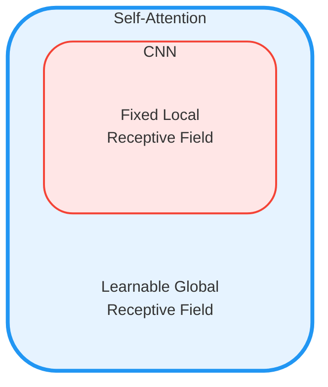
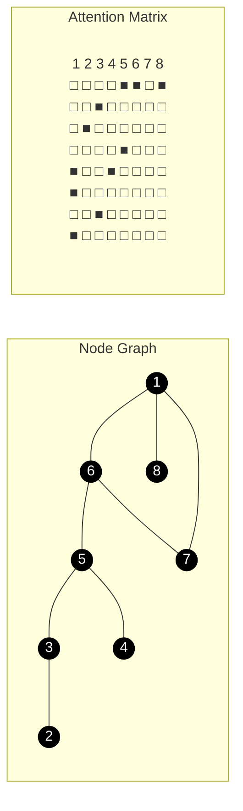

# 注意力机制

<iframe src="https://arxiv.org/pdf/1706.03762" width="100%" height="600px" style="border: none;">
This browser does not support PDFs
</iframe>

## 对比
!!! note "对应paper中abstract、background"

### vs CNN

CNN只考虑卷积核的感受野，而attention考虑整个序列

所以卷积难以考虑较长的序列，如果距离较远的话，需要很多层卷积才可以达到效果；

> 图源网络，侵删

而attention可以考虑整个序列，所以可以考虑较长的序列

---

可以说CNN是attention的特例

attention也可以说是特殊的CNN，相当于CNN的receptive filed是learn出来的

<iframe src="https://arxiv.org/pdf/1911.03584" width="100%" height="600px" style="border: none;">
This browser does not support PDFs
</iframe>

- data 较少的时候，CNN训练效果好
- 数据量较大的时候，attention效果好，有scaling效应

### vs RNN

- RNN 计算$h_t$的时候，需要考虑hidden state $h_{t-1}$ and the input for position $t$
- 很早期的信息在后续计算的时候可能会丢失，做大的ht对内存开销较大

- RNN虽然可以双向，但是不可以并行计算，对memory要求高

<iframe src="https://arxiv.org/abs/2006.16236" width="100%" height="600px" style="border: none;">
This browser does not support PDFs
</iframe>

### vs GNN
- 应用在gragh结构上的时候，可以使用edge已经给出的连接关系，直接计算attention score，其他节点可以直接设置成0

## Self-Attention

思考下面的问题：

- 同一个词汇，放在句子不同位置，它的语义可能不同（我们需要上下文信息）：可以开window解决
- 但如果输入是一个变长的序列：开window就解决不了了

所以需要一个机制，让每个词汇都考虑整个序列的信息（这个序列是变长的），这就是self-attention

---

注意力机制有两种

- additive attention
- dot-product attention（矩阵乘法）

### word embedding

word2vec：获得词汇的最初始含义

Word embedding.

- W_E GPT3 50267个token，每个token具有12288维度，共6亿左右参数，随机初始化
- 嵌入是一个“抽象”的过程，把高维向量嵌入到一个低维度当中
 

> in the embedding layers, we multiply weights by $\sqrt{d_{model}} = \sqrt{512}$ 
> 防止，维度一高，导致初始时候与position encoding的值相差太大

### position encoding

我们不仅仅需要考虑词汇的语义信息，还需要考虑词汇的位置信息，所以需要一个position encoding

在原始论文当中，使用一个sin和cos的组合来表示position encoding

$$
PE(pos,2i) = \sin(\frac{pos}{10000^{2i/d_{model}}})\\
PE(pos,2i+1) = \cos(\frac{pos}{10000^{2i/d_{model}}})
$$

> 当然表示位置的算法可以自己创造

### Attention 计算 -- scaled dot-product attention

word embedding 解决了词汇本身的含义，position encoding 附加了词汇的位置信息，那么词汇的不同位置（或者说上下文信息）是如何影响到这个词汇的最终含义呢？

这里涉及到计算attention score，如何计算attention score呢？

我们使用三个矩阵，来计算attention score

- $Q$: query
- $K$: key
- $V$: value,如何让前面的词汇影响后面的词汇，word embedding乘上这个矩阵得到一个转移到向量 

attention分数：$K$与$Q$的点积，可以看作$K$与$Q$的相似度，为value矩阵提供权重。对于如果$Q$ 和 $K$ 相似度很高，那么就给予$V$ 更多的权重

$$
Attention(Q,K,V) = softmax(\frac{QK^T}{\sqrt{d_k}})V
$$

$d_k$ 是Q和K的维度，因为Q和K的维度是相同的，在论文中是$d_k = 512$

> 如果$d_k$ 很大，那么$QK^T$ 的值会很大，导致softmax的值趋近于1，导致梯度消失
> 所以需要除以$\sqrt{d_k}$ 来归一化

> 图片来源：李宏毅老师ppt

> 图片来源：3b1b

预测时候，把最后一个词乘上一个矩阵，得到映射到词库上面的得分，经过softmax层后，就有了概率分布
 

!!! note "使用softmax函数的目的"

    softmax：指数scale再归一化
    
    $$
    softmax(x) = \frac{e^x}{\sum_{i=1}^n e^{x_i}}
    $$

    我们需要归一化的系数，来作为计算语意移动操作的权重
    
    同时让高值更多权重，采样的时候，让高值更容易被采样到

    ---

    这里要引入一个超参数T，来控制softmax的scale。可以类比化学反应中的温度。T越大，活性越小，softmax的scale越大，即让高值更多权重。

    $$
    softmax(x,T) = \frac{e^{x/T}}{\sum_{i=1}^n e^{x_i/T}}
    $$

    T较大的时候，让scale较小，即让低值更多权重

最后一个词向量，成为预测下一个词的logit

## Multi-Head Attention

单头注意力机制，是没有参数可以学习的。

多头注意力，模型能学习到根据上下文改变语意的多种方式。使用多个线性层投影到低维空间，再进行attention计算，那么线性层的$\omega$的参数是可以学习的。

使用不同的$Q$，学习不同种类的相关性

## 改进

attention 对于模型的假设更少，所以需要更大的模型，更多的数据量，更多的计算时间，才能达到好的效果

### 速度 & 准确

<iframe src="https://arxiv.org/pdf/2011.04006" width="100%" height="600px" style="border: none;">
This browser does not support PDFs
</iframe>

### 训练速度

## Acknowledgement

<iframe src="//player.bilibili.com/player.html?isOutside=true&aid=1353986541&bvid=BV13z421U7cs&cid=1525102356&p=1&autoplay=0" scrolling="no" border="0" frameborder="no" framespacing="0" allowfullscreen="true" width="100%" height="500px"></iframe>

<iframe src="//player.bilibili.com/player.html?isOutside=true&aid=1154246338&bvid=BV1TZ421j7Ke&cid=1530196453&p=1&autoplay=0" scrolling="no" border="0" frameborder="no" framespacing="0" allowfullscreen="true" width="100%" height="500px"></iframe>