# 03 | 小作文
# 图表类小作文

## Acknowledgement

<iframe src="//player.bilibili.com/player.html?isOutside=true&aid=818993987&bvid=BV1FG4y1J7br&cid=30984111846&p=2&autoplay=0" scrolling="no" border="0" frameborder="no" framespacing="0" allowfullscreen="true" width =100% height = 650px></iframe>

- 折线图 Line Graph 
- 柱状图 Bar Chart
- 饼图 Pie Chart 
- 表格 Table

## 准备要求1 —— 题目要求

### 图形介绍

!!! note "某个图 shows 某种数据"

结构：一个核心词+多个修饰语

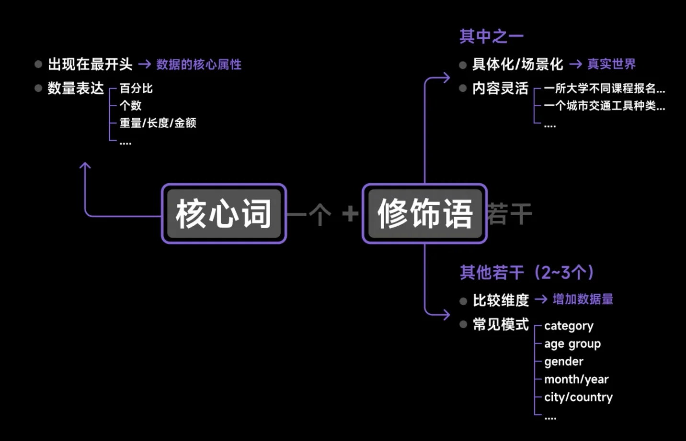

为什么要分修饰语：其实就是限定比较的组别和对象。需要从题目给定的数据当中找到比较维度

### 指令要求

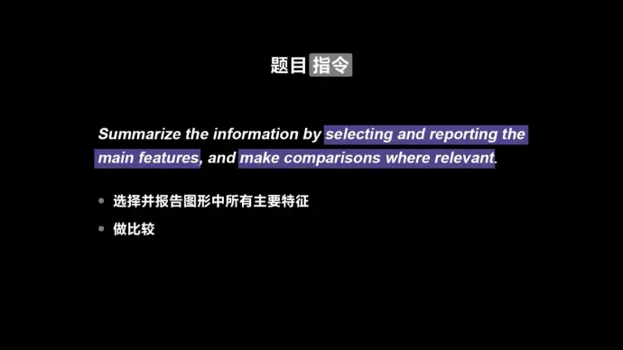

图表所有直观看到的内容features

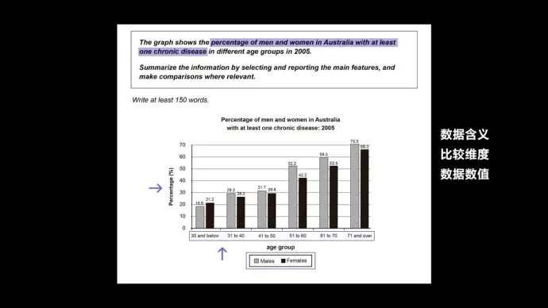

要做的三个动作：

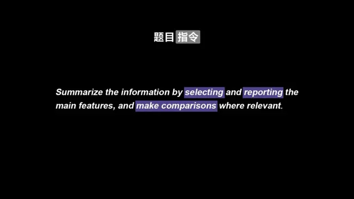

## 准备工作2 —— 动静分类

动态图：时间维度

- 不仅可以读取数值，还可以读取趋势
- 趋势分为：上升、下降、波动

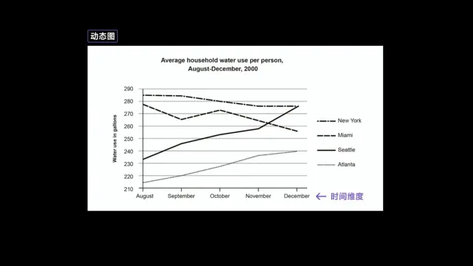

静态图：

- 只能读取数值

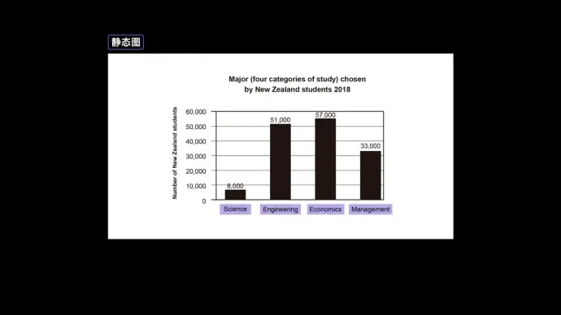

## 如何分段

## 

第一段为**改写段**进行同义复述句子数量看题目改

第二段为**Overview概述段** 进行宏观概述,2~3句话，看我们能概括出几点

第三段&第四段为**Detail细节段**,细节段分两段清晰一些

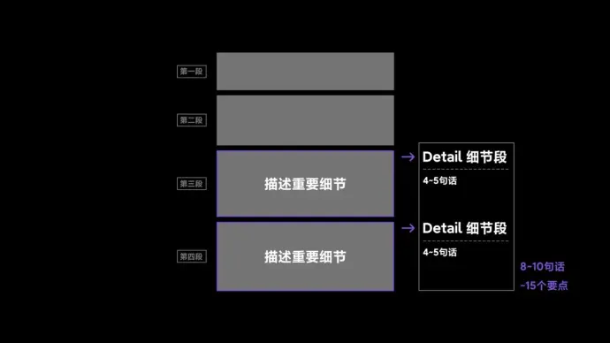

## Para1: 改写段

- 具体化 The graph
- 统一话术 give information about
- 照抄小标题
- 补充没写完的信息
- 如果有两个图，就重复一遍

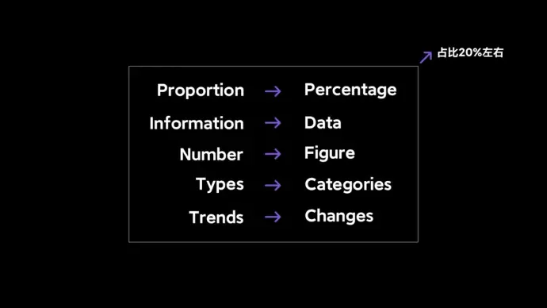

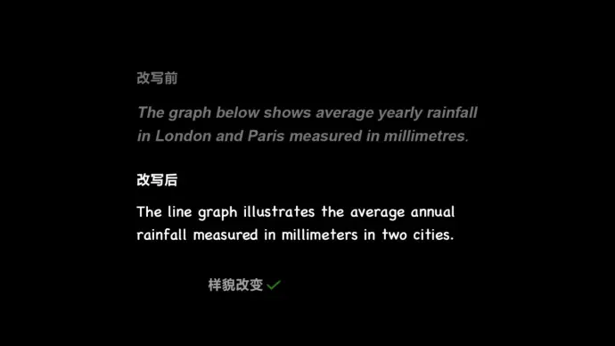

改写方法：

- 换词：描述性词汇同意替换
- 换位置：
- 概括

## Para2: Overview段

三选二

### 另类的

- 最大的部分
- 不一样的趋势
- 差距很大

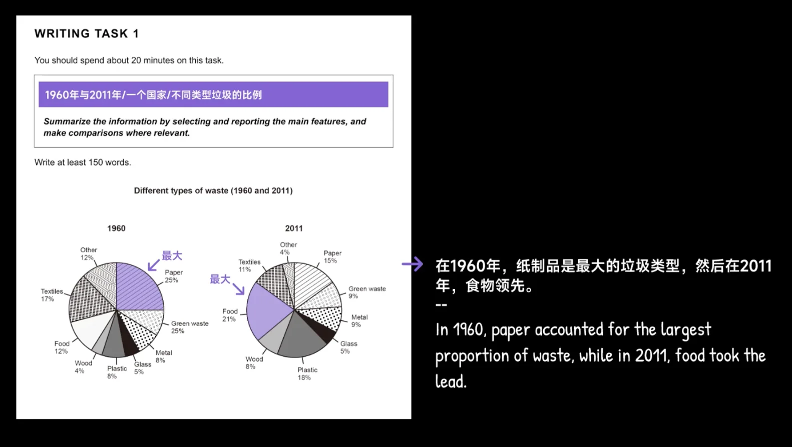

### 统一的

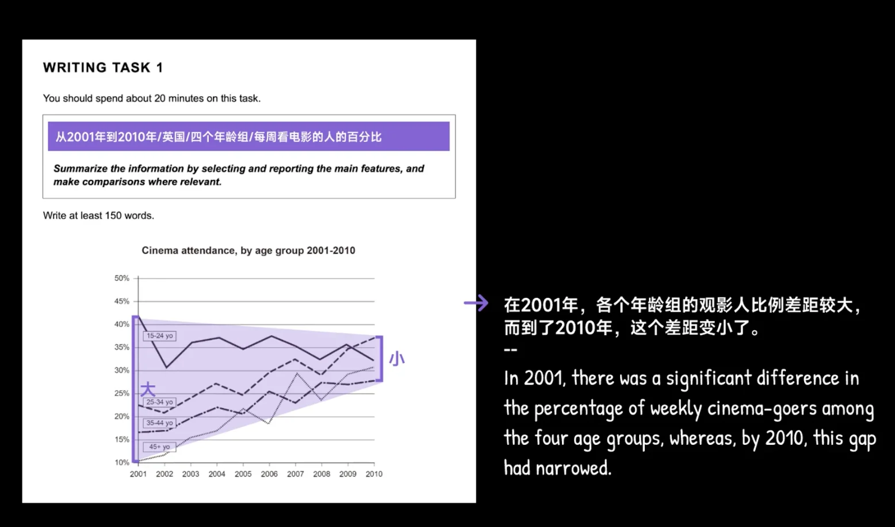

### 乱乱的

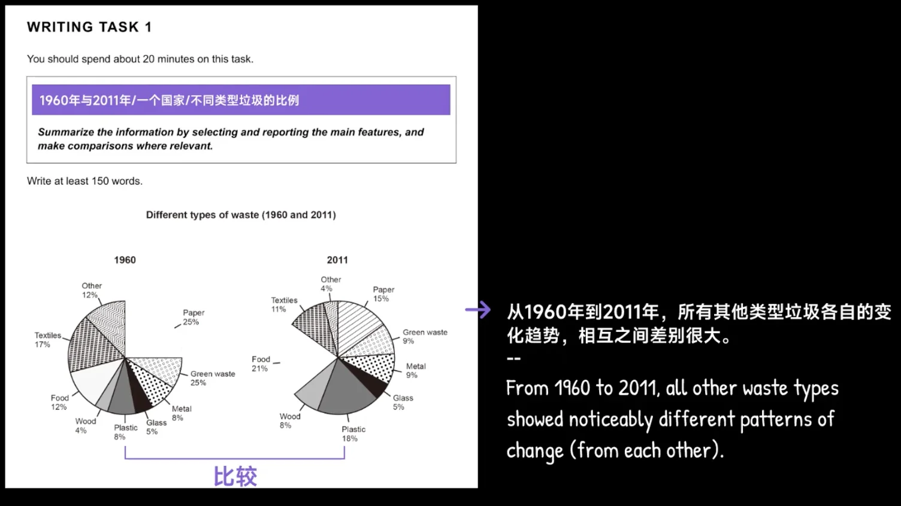

### 注意

- 不要写具体数值
- 引导词： 
  - Overall
  - In sum
  - in general
- 两点之间连接词
  - Moreover

## Para3&4: Detail段挑选/分组

### 如何抓细节

回顾题目要求

summerize the information by selecting and reporting the **main features**  and **make comparisons** where relevant

什么叫做features？

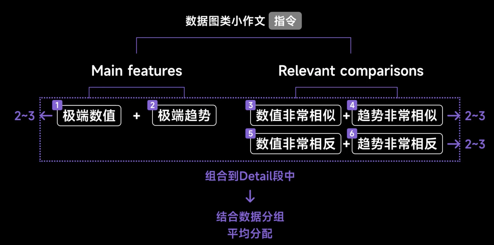

!!! note "在做比较的时候要注意控制变量，一次只能比较一个变量"

- 作比较的作用（第一维度）：最大值、最小值、等值、差值、倍数、大于、小于

- 维度（趋势方面）（只有动态图可以）：上升、下降、波动、稳定

### 细节性内容分组

但是需要注意不是每一个比较维度切分出来都是可以的。不能切割只有两个项目

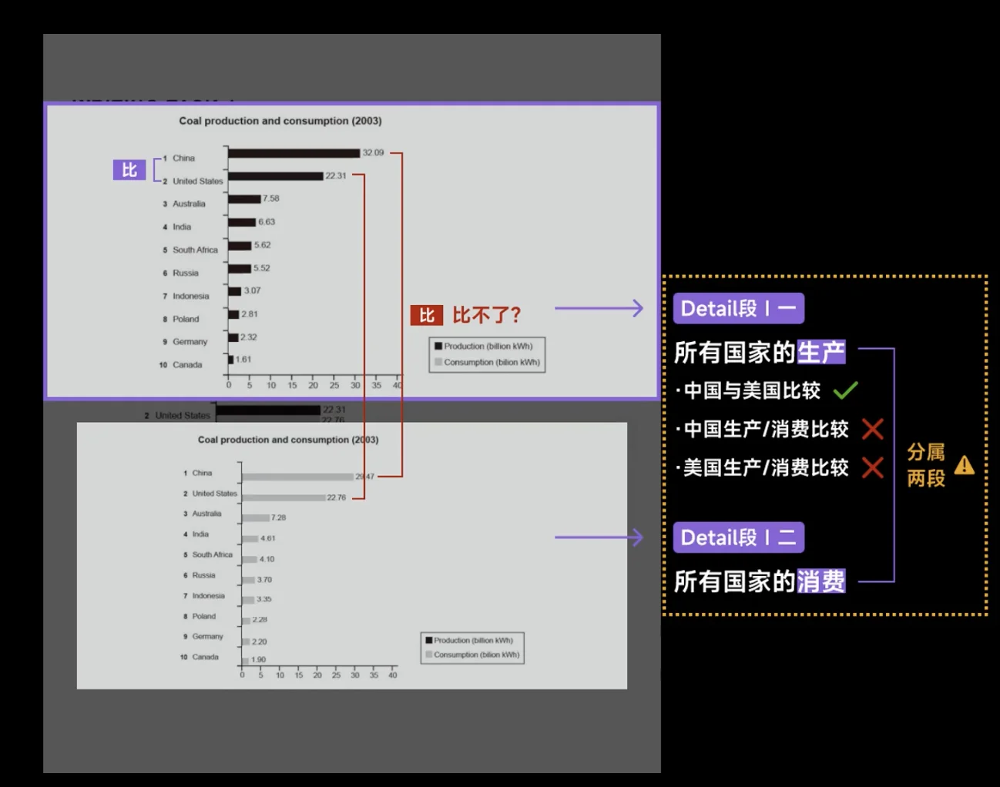

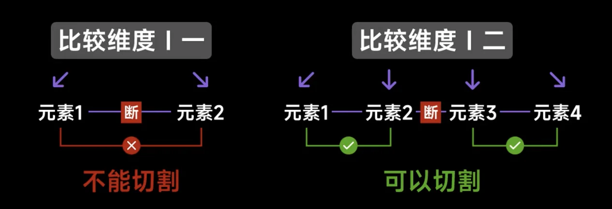

引导词：

- 可以不写引导词
- 不相关的两个图形 

## 范文

> 改写段

The line graph gives information about the weekly cinema attendance by age groups in the UK from 2001 to 2010.

> Overview

Overall, in 2001, there was a significant difference in the percentage of weekly cinema-goers among the four age groups, whereas, by 2010, this gap had narrowed.

Additionally, three of the age groups showed an upward trend in this data over time.

> Detail1

Concerning weekly cinema-goers under 35 years old, the 15-24 age group percentage peaked at around 42% in 2001, which was 10% higher than the figure in 2010.

In 2002, both the 15-24 and 25-34 age groups recorded their lowest points, although the latter was slightly lower at 21%.

Additionally, these two groups experienced a rise and then followed by a fall between 2001 and 2004.

However, from 2009 to 2010, these two age groups showed opposite trends: the former decreased, but the latter increased.

> Detail2

Regarding age groups over 35 years old, between 2006 and 2007, the percentage of weekly cinema-goers aged 45 and above increased significantly, rising from less than 20% to nearly 30%.

In 2005, similar values were seen in the 35-44 and the 45+ age group, both around 22%.

The percentage of 35-44 year-old cinema-goers consistently increased from 2001 to 2004, after which it fluctuated noticeably.

Furthermore, after 2008, the figure for the 45+ group rapidly grew to over 30%; in contrast, the figure for the 35-44 age group remained relatively stable (at 23%).

