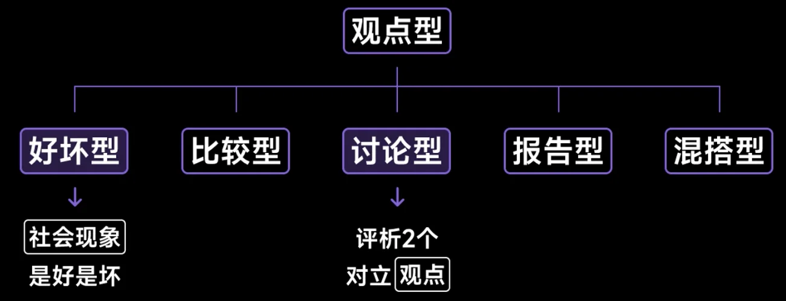
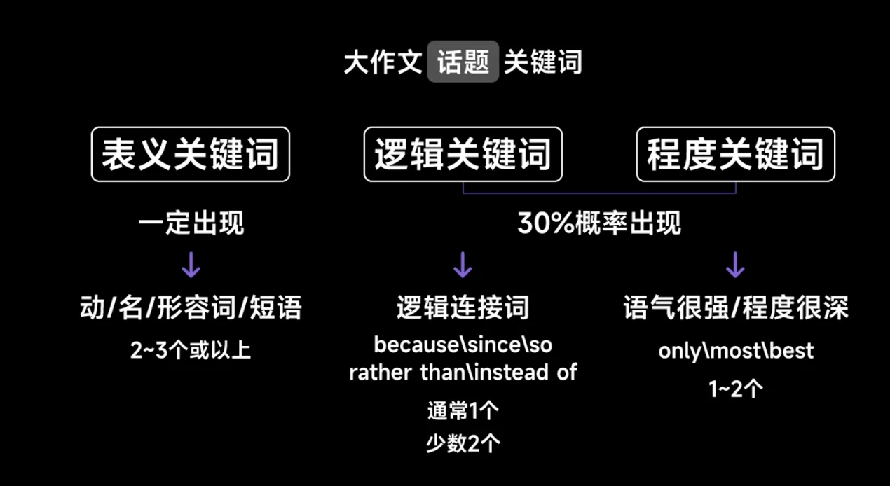
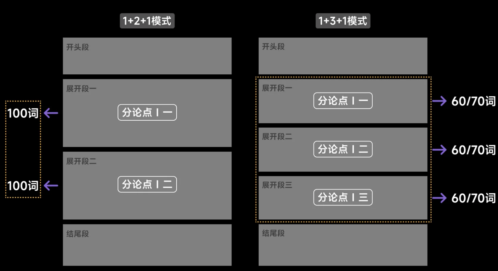
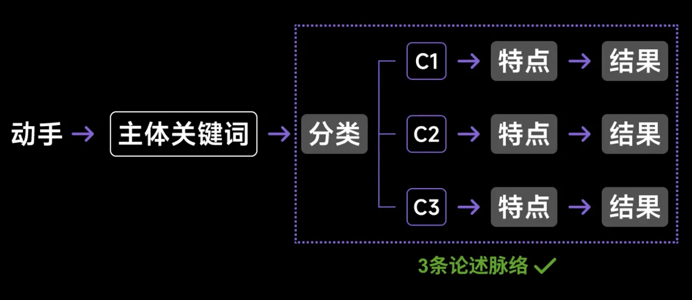
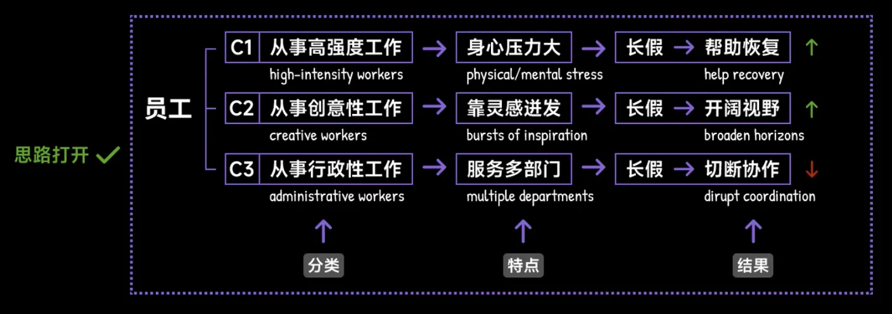
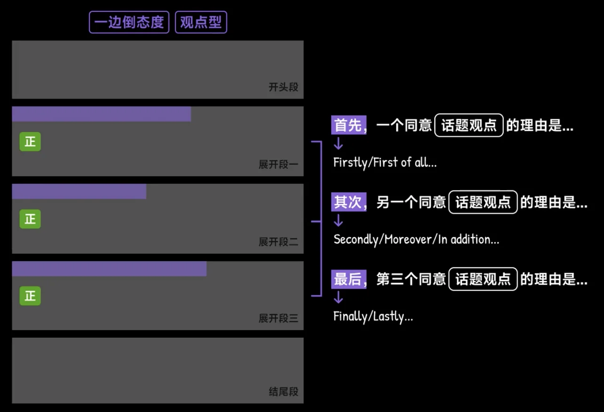
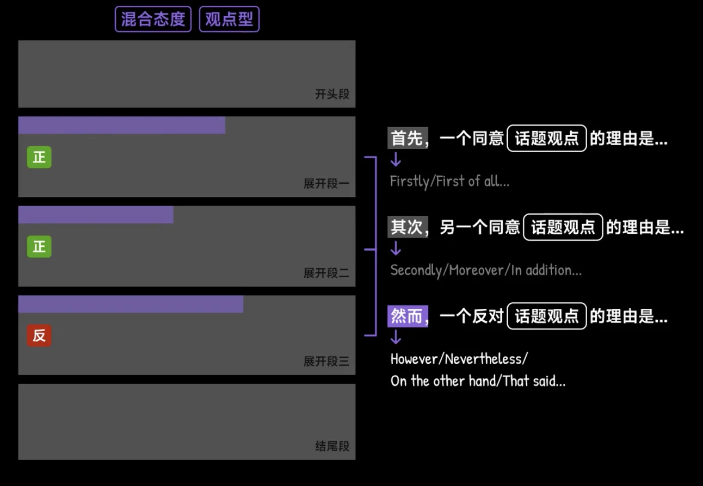
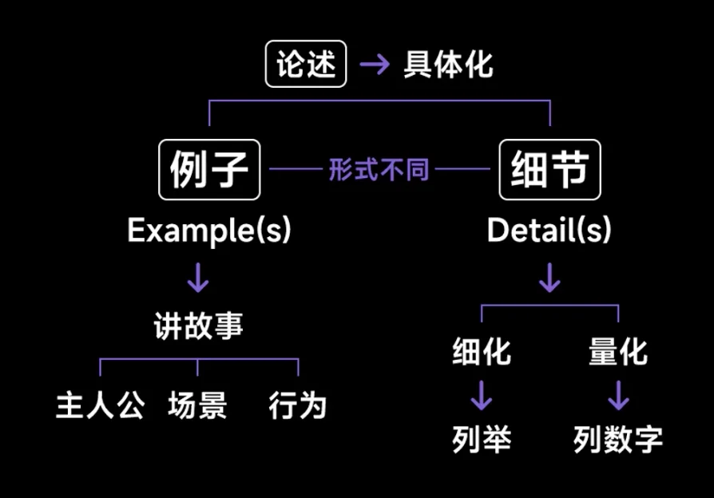
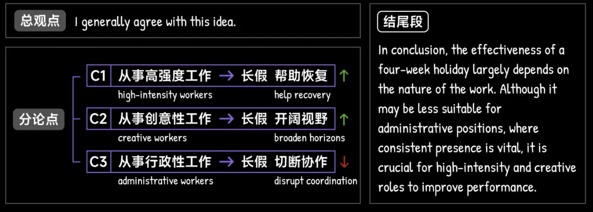

# 03 | 大作文

## Acknowledgement

[九分学长](https://docs.qq.com/doc/DR0liWVFuSG5oaFpT)

<iframe src="https://docs.qq.com/doc/DR0liWVFuSG5oaFpT" scrolling="no" border="0" frameborder="no" framespacing="0" allowfullscreen="true" width =100% height = 650px></iframe>

<iframe src="//player.bilibili.com/player.html?isOutside=true&aid=818993987&bvid=BV1FG4y1J7br&cid=31072845890&p=11&autoplay=0" scrolling="no" border="0" frameborder="no" framespacing="0" allowfullscreen="true" height=450px width=100%></iframe>

## 准备工作

话题+指令

### 结构 

## 解读与预处理

- 找到所有表意关键词
- 确定主题关键词
- 捋顺主客体之间的关系

3C原则：

- Classification
- Characterization
- Consequence

## 分论点与总论点

Employees should be given at least four weeks of holiday time each year to help thm do their jobs better

- 什么的X
- X的什么

总论点其实就是在分论点的基础上进行

### 连接词

- Admittedly
- There is no denying that

### 观点词

- supporting
- in favour of 
- against
- 

## 

## 展开段落

### 分论点句子

### 论述

- 因果
- 条件

### 例子&细节

3/4环逻辑链路

例子不需要真实数据，雅思就是一个把论述生活化、表达化的过程

## 开头

复述话题+总观点句子 

## 结尾

