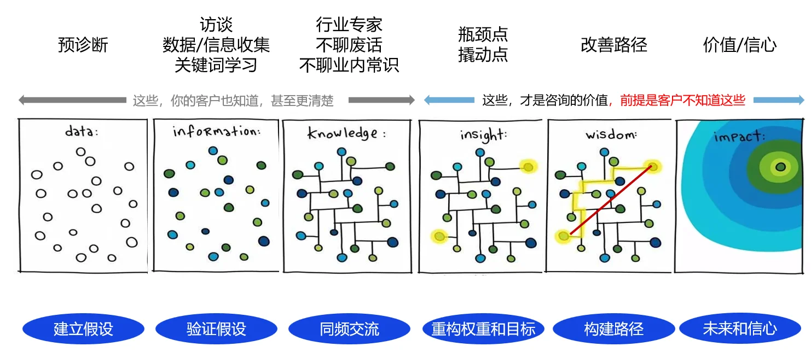
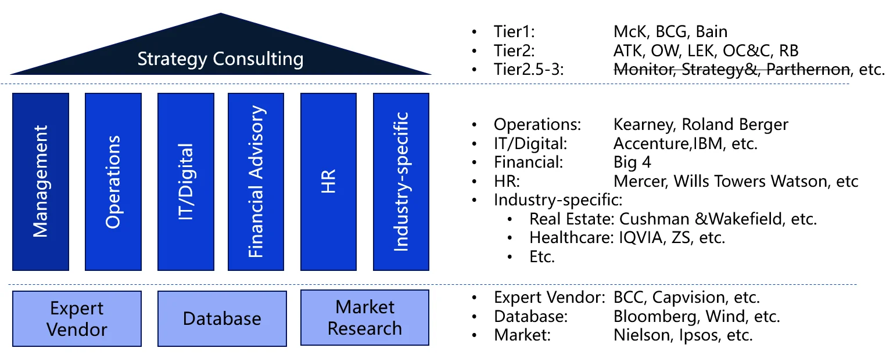
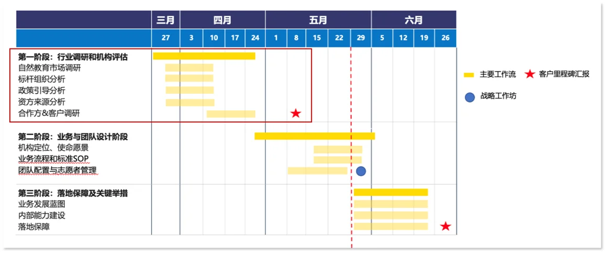
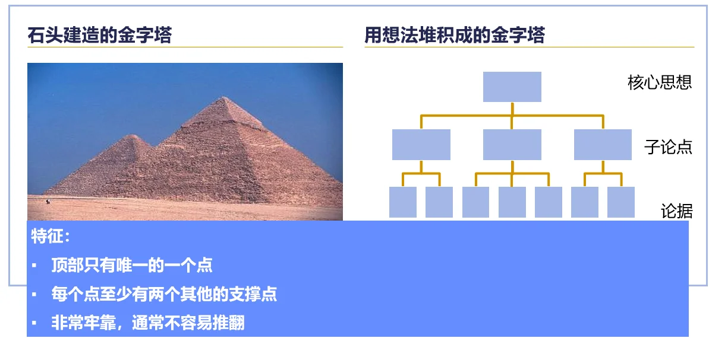

# Consulting

## 什么是咨询

脑替+嘴替

在咨询行业中，BD是"Business Development"的缩写，意为"商务拓展"。BD 在咨询行业中的角色主要是负责开发新的商业机会和合作伙伴，以帮助公司扩大业务范围和市场份额。他们通过与潜在客户、合作伙伴以及其他利益相关者建立和维护关系，来识别和探索新的商业机会。BD 人员需要具备良好的沟通和谈判技巧，以及对市场趋势和行业动态的敏锐洞察力，以便为公司制定有效的业务发展战略

咨询的真正价值在哪里

前半部分：你永远不可能比客户更懂他们的业务

## 咨询行业概况

### **咨询行业的生态链**

**Tier 1** 的名单就是无可争议的MBB：

麦肯锡（McKinsey） ，波士顿咨询 （BCG），贝恩（Bain）。

**Tier 2** 的名单虽然一直都在变动之中，但普遍包括以下几家：

科尔尼（A.T.Kearney），艾意凯（L.E.K），罗兰贝格（Roland Berger），奥纬（OliverWyman），思略特（Strategy&，前Booz，被PwC收购），摩立特（Monitor，被Deloitte收购），里特（Arthur D. Little）等。

- **战略运营类：**麦肯锡、贝恩、波士顿、摩立特

- **市场调查类：**艾瑞、凯度、尼尔森、益普索、盖洛普、易观智库、欧睿

- **医疗医药行业：**致盛咨询、艾意凯

- **汽车/教育行业：**帕特农、罗兰贝格

- **人力资源咨询：**美世、怡安翰威特、光辉合益、韦莱韬悦

## 方法论

麦肯锡七步法是一种问题解决方法论，由麦肯锡公司提出，常用于商业和工作环境中。以下是麦肯锡七步法的步骤：

1. **定义问题**：明确需要解决的问题是什么，确保问题清晰、具体和可行动。
2. **分解问题**：将问题拆分为更小的、更易于管理的子问题或要素。
3. **关键要素排序**：根据重要性和紧急性对问题的关键要素进行排序，优先处理最关键的要素。
4. **制定工作计划**：根据问题分解和排序结果，制定详细的工作计划，包括任务、时间表和责任人。
5. **进行关键分析**：对问题的关键要素进行深入分析，收集和分析相关数据，以支持决策。
6. **汇总研究成果**：综合分析结果，形成对问题的全面理解，并提出解决方案。
7. **交流沟通**：将研究成果和解决方案有效地传达给相关利益相关者，以获得支持和实施。

真实的工作计划通常长这样

- 要时刻关注客户的需求，沟通是无时无刻进行的
### 结构化思考
- 金字塔原理

## 访谈

需要录音吗：询问客户的建议，能录尽录

小白觉得自己的问题很肤浅：先找有经验的人过滤一遍自己的问题

访谈是为了获取信息回答疑问：访谈时通过与客户或相关人士交流，获取信息和洞察，**解答问题**，支撑你得出结论的过程

用结构化思维提问题

用结构化思维设计访谈、实施访谈并进行复盘总结

