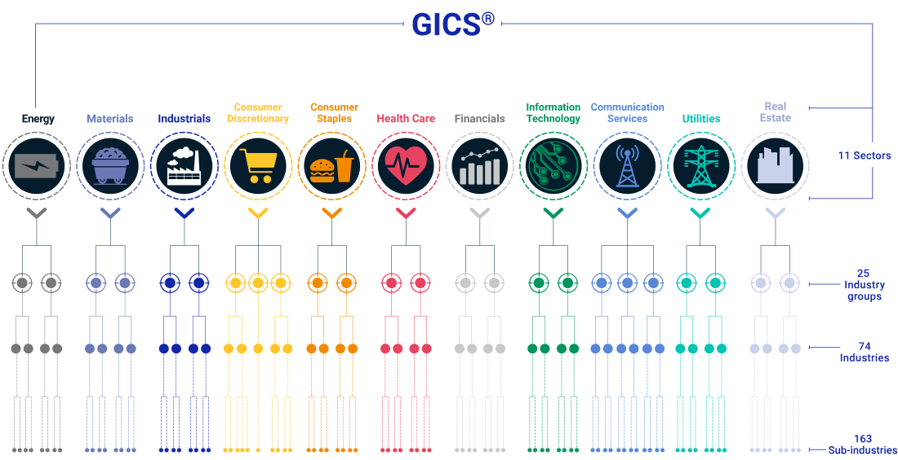

# 行业观察

## 分析框架
!!! note "麦肯锡分析法"

### 宏观分析
- 政治 (Political): 新能源行业敏感
- 经济 (Economic)
- 社会 (Social) 政策敏感：如教培
- 技术 (Technological)

### 行业概况

- 产品&服务
- 行业规模
- 行业生命周期：幼稚期、成长期、成熟期、衰退期
- 发展速度
- 行业市场结构：key players
- 平均利润
### 产业链分析

- 供求分析
- 上下游都有哪些玩家
- 在产业链中处于什么位置
- 在产业链中产生什么价值
- 是否不可或缺
- 是否具备定价权

### 资本市场表现
- 行业内上市公司业绩表现
- PE/VC 投资动向

## 行业分类

**国内：**

[国民经济行业分类](https://www.stats.gov.cn/sj/tjbz/gmjjhyfl/202302/P020230213400314380798.pdf)

[中国上市公司协会--中国上市公司协会上市公司行业统计分类指引](https://www.capco.org.cn/xhdt/tzgg/202305/20230521/j_2023052117544500016846630061707656.html)

**国外：**

[GICS® - Global Industry Classification Standard - MSCI](https://www.msci.com/our-solutions/indexes/gics)

## 数据&信息搜集
- 各大咨询公司公众号
- 119it
- 艾瑞
- 艾媒

