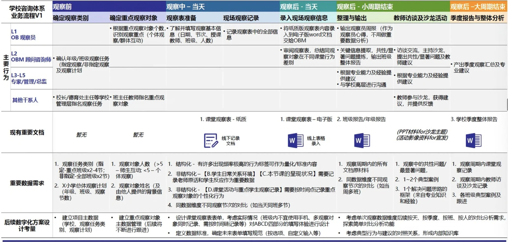

# 公益通识

## 简介
- 公益组织的起点是社会问题

!!! note "常见误区"
    免费不是公益组织的特点

NGO（Non-Governmental Organization）非政府组织，是指由个人或团体自愿组织起来，独立于政府，不以营利为目的，通过非强制性的方式，为社会提供服务的组织。（相对于政府来讲）

NPO（Non-Profit Organization）非营利组织，是指不以营利为目的，通过非强制性的方式，为社会提供服务的组织。（相对于企业来讲）

第三部分/公益组织：

- 政府组办的以救灾为主的组织
- ：置卖土地的

## 公益和慈善的区别

公益是舶来品，慈善不是

## 发展历史

## 在做什么

组织架构

资金哪里来

## 案例

项目交付回顾

