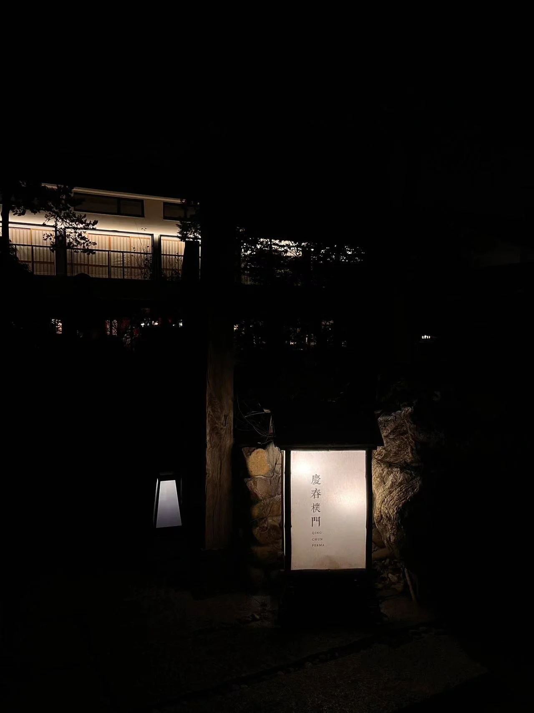
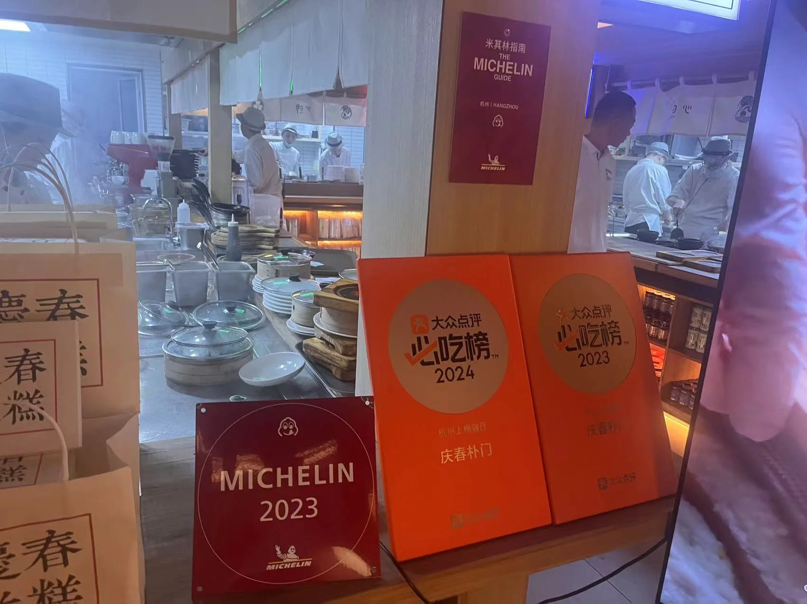

# 杭州

!!! tip "人们都说会对上大学的城市产生莫名的情愫，那就专门给杭州开一个也页面吧"

东经118°21′-120°30′，北纬29°11′-30°33′
## 汉堡

### Three Fingers

位置：[Three Fingers](https://surl.amap.com/qNEeF8EU7RX)

离玉泉特别近，一家小店，汉堡挺好吃的，薯条是我喜欢的比较粗比较脆的类型，装修风格比较简约

### Rawday

坐落在玉泉北门的一家汉堡店

装修风格简约

9.9入会可以1年无限续杯饮料

餐巾纸需要自己取

汉堡用料中上，结构比较容易散架，酱汁比较容易流出来

### 哞堡
在zjg浙港国际附近，味道还行，就是倒闭了

### 
在zjg北门处

感觉火鸡面汉堡和经典的汉堡都还可以

## 烧烤

### 东明烧烤
22年冬天慢慢火起来的一个路边摊，东明大哥一直在浙大附近做烧烤，个人感觉他家的烤肉并不好吃，至少水平波动挺大的，但是烤鱼还是挺绝的。

## 日料

### UMAI 舞麦
优点：离紫金港比较近，适合一人食
价格不是特别便宜 

### 小林刺身
牛舌还不错

部队锅一般般

### 加奈日本料理

是玉泉北门非常近的一家店面

### 南门三叔（青芝坞）

玉泉青芝坞

一家和UMAI差不多风格的店铺，价格我觉得在同档次小店中竞争力一般

## 炒菜
### 王记小厨

在玉泉小桥门对面，人均30-40左右

离yq挺近的，而且出品不错，算是yq附近的口碑小饭店了

消费达50r可以送小罐饮料

### 庆春朴门
高德位置：[庆春朴门](https://surl.amap.com/r5ksw31ab3Y)

价格：人均120r

评价：环境挺好的，味道不错，可以再去

### 隐食·喜乐餐厅
3人250r左右，点了一个美团的套餐，又点了个饮料啥的

位置在天街南边，稍远一点

高德链接[隐食·喜乐餐厅](https://surl.amap.com/16YdY7qoH9D8)

### 

### 农家小炒

在玉泉北门夏星旁边，优点是比较实惠，人均35-40r左右

## 东北菜

### 乡在东北
位置：[乡在东北](https://surl.amap.com/17o2A8Y8qcWB)
拱墅公园里边的一家店，味道一般吧我不是特别吃得来东北菜，量大便宜，比较适合人多聚餐

### 山河屯铁锅炖

一个还不错的炖菜，四个男生人均60-70r

### 东北一锅香

## 面馆

### 兰州拉面（青芝坞）
牛肉面还不错

葱油饼不太好吃

## 川湘菜

### 川味泡菜馆

## 杂

### 篝火旁

位置在乡在东北旁边

场子很大，以酒水和一些小食为主，比较适合聚会

味道一般般

晚上会有驻场歌手，80/首

### 幸彘揭灶（台湾小吃）

在玉泉南门青芝坞处，均价50r左右

原料和装修都不错

