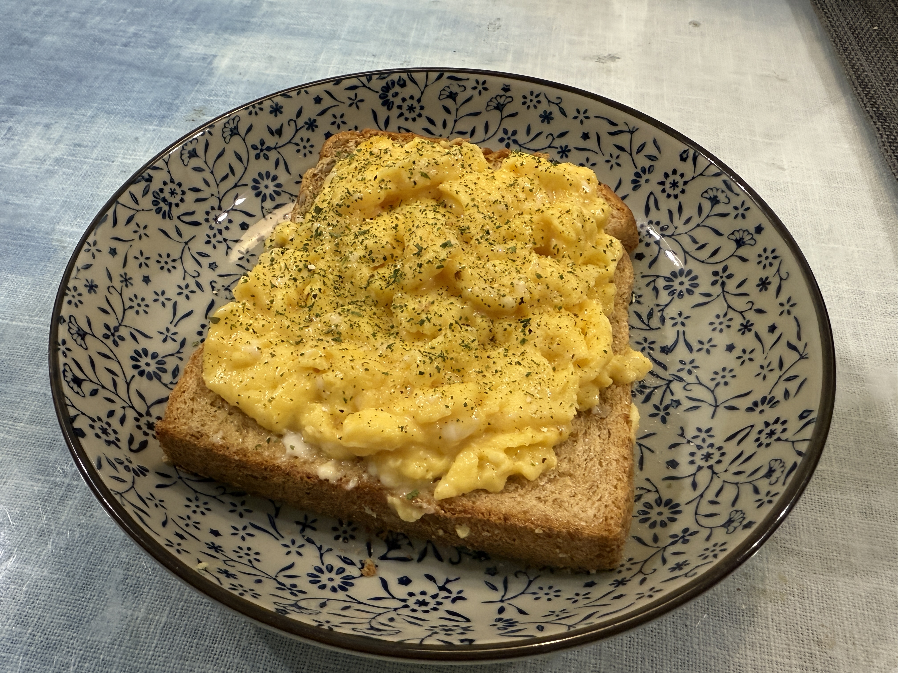

# 西餐食谱

## 主菜

### 红酒炖牛尾

!!! note "菜单来自米老师"

1. 牛尾切掉一部分肥肉，泡血水，用料酒、黑胡椒和盐腌一会儿。
2. 洋葱切丁，蒜切沫，胡萝卜削皮切块，番茄用开水把皮烫掉后切块。
3. 黄油和橄榄油混合入锅，爆香蒜沫、一把洋葱和油葱酥；牛尾擦干水分，裹一层薄面粉，下锅煎至表面金黄、没有血水流出。
4. 煎好牛尾后捞出，放到吸油纸上备用；继续用锅里的油翻炒胡萝卜，炒一会儿后下洋葱，再炒一会儿后下番茄，番茄出汁后加一罐番茄罐头（罐头里已经添加有足量盐和糖），搅匀再翻炒一会儿。
5. 把菜从炒锅里移到砂锅里，倒入半瓶酸度不要太高的红酒，煮开两分钟让酒精挥发掉。
6. 往砂锅里加入煎好的牛尾，加入三片香叶、一根肉桂、整瓣的蒜、适量的水和面粉增稠，最后液体要完全没过牛尾，避免糊锅。
7. 大火煮开后，转小火炖俩小时，中间搅一搅/撇浮沫/给牛尾翻个面，哪面欠火候就让哪面朝下，适当加水使液体一直处在没过牛尾的状态，直到牛尾软烂，最后再转大火收汁，不需要收尽，收到液体能没过牛尾三分之一高度即可。
8. 看着黑暗但好吃：如果红酒偏酸、番茄罐头的味道盖不住酸味，又不想额外放糖，炖煮的中途可以放点桂圆或者荔枝hhh
9. 出锅时撒点欧芹碎点缀，完美。

## 鸡蛋

## 汉堡

和牛鹅肝汉堡
<iframe src="//player.bilibili.com/player.html?isOutside=true&aid=114266380177545&bvid=BV19LfwY2E3G&cid=29193275206&p=1&autoplay=0" scrolling="no" border="0" frameborder="no" framespacing="0" allowfullscreen="true" width=600px height=450px></iframe>

## 牛排
<iframe src="//player.bilibili.com/player.html?isOutside=true&aid=113128096536012&bvid=BV1V444esEsX&cid=25649223381&p=1&autoplay=0" scrolling="no" border="0" frameborder="no" framespacing="0" allowfullscreen="true" width=600px height=450px></iframe>

## 肉酱

<iframe src="//player.bilibili.com/player.html?isOutside=true&aid=113783347353929&bvid=BV1hBr2YZEtG&cid=27738113995&p=1&autoplay=0" scrolling="no" border="0" frameborder="no" framespacing="0" allowfullscreen="true" width=600px height=450px></iframe>

## 面食

龙虾意面

<iframe src="//player.bilibili.com/player.html?isOutside=true&aid=114026818312373&bvid=BV1LCAeepEgh&cid=28463204333&p=1&autoplay=0" scrolling="no" border="0" frameborder="no" framespacing="0" allowfullscreen="true" width=600px height=450px></iframe>
