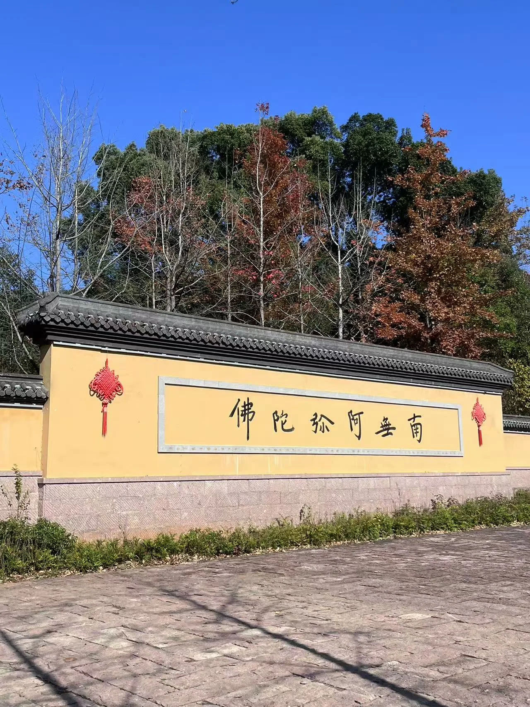
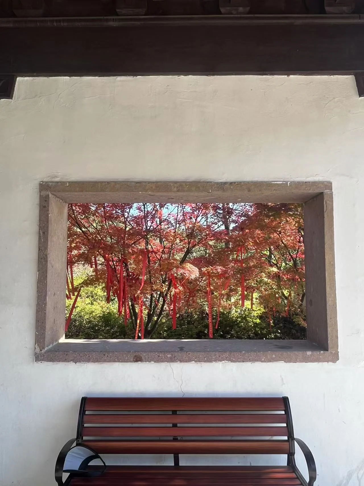
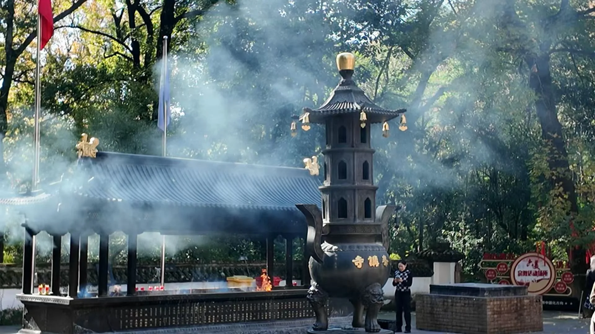
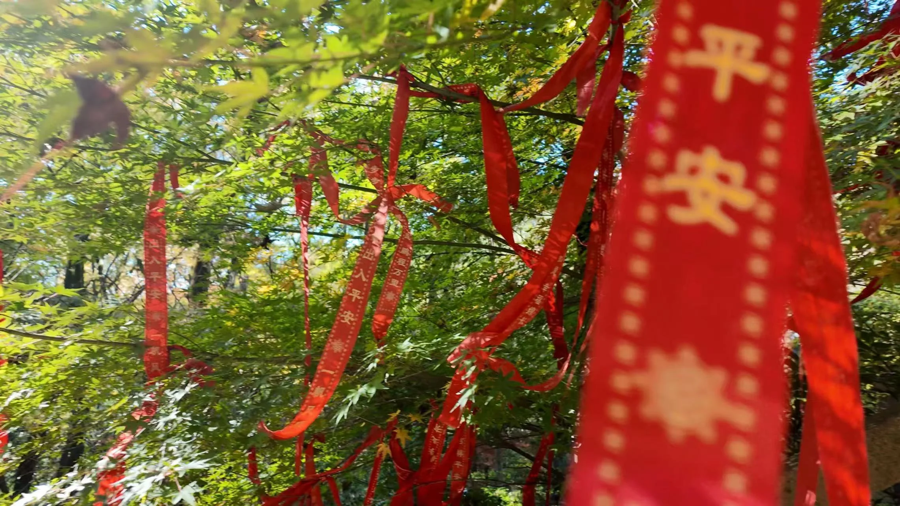
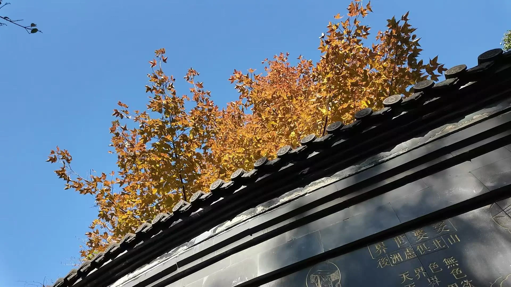
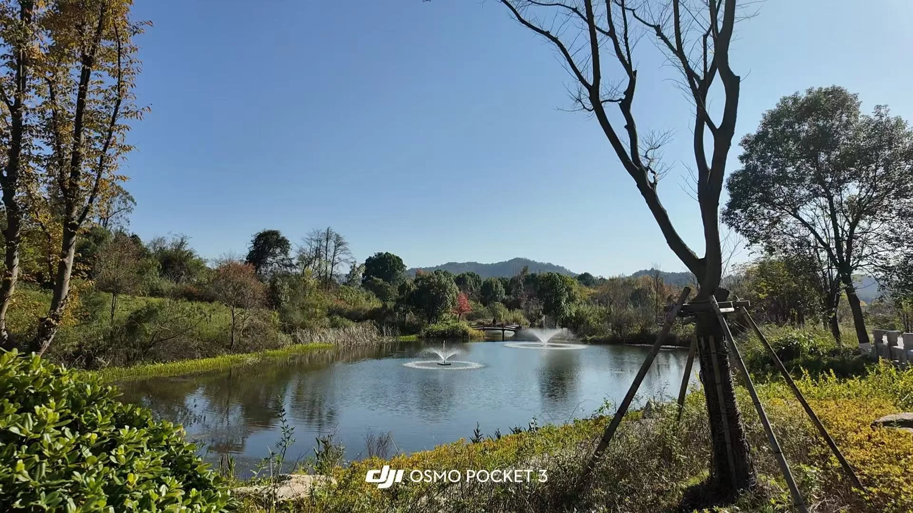
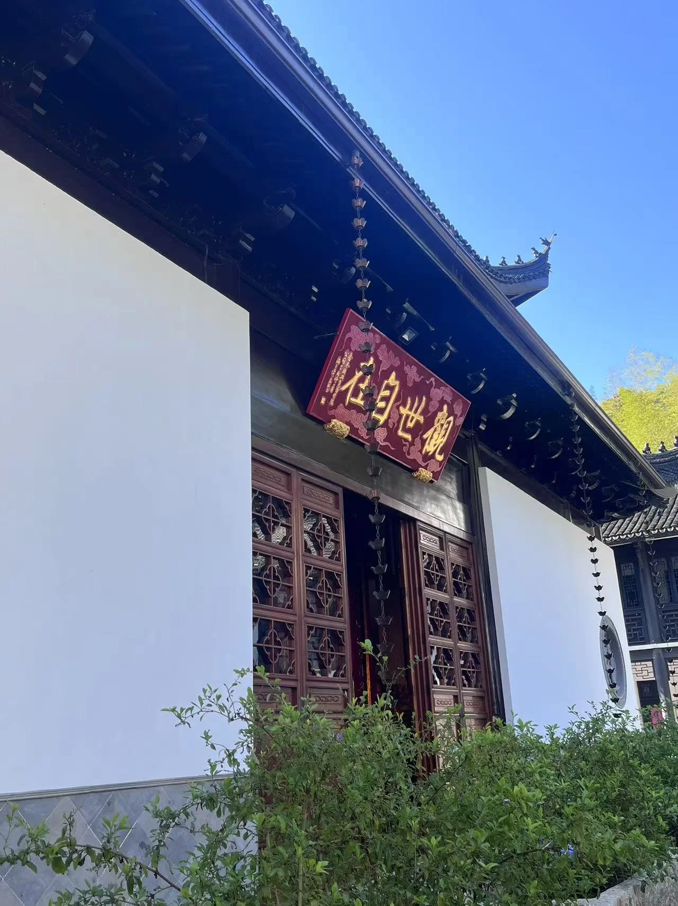
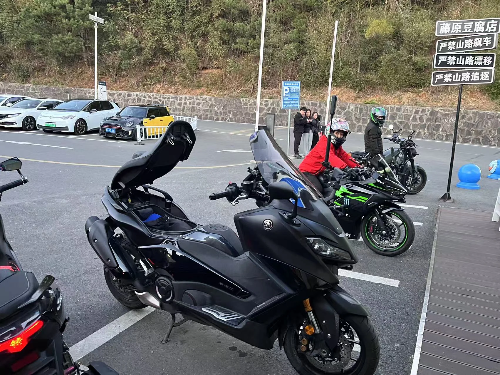
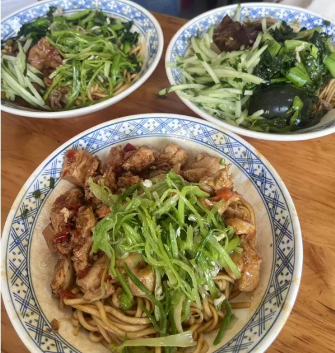
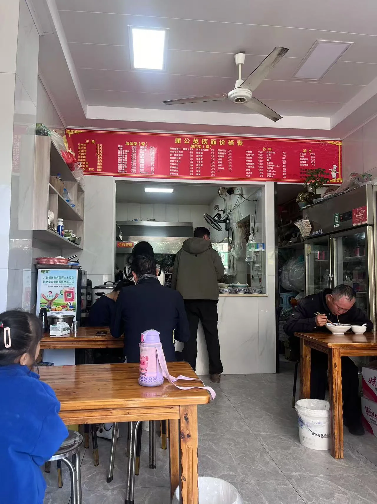

# 浙江
## 安吉

整体建设属于发展较好的县级城市，景点以风景类为主，可能需要规划好路线，不然会面临无处可去的尴尬境地

另外感觉安吉景区属于杭州郊区辐射的景点，很多人都是家庭自驾游，物价我认为还是挺高的。谨慎购买

|名录|价格|
|---|---|
|灵峰寺|免费|
|江南天池||
|Hello Kitty主题乐园||
|云山草原||
|天荒坪|免费|
|余村|免费|

### 灵峰寺

一座门头很小但里面不小的寺庙，整体构造和灵隐寺差不多。

去的时候人很少，也非常安静。

### 余村

一个非常小的村庄，有几片田

一进村有建设一块较大的草坪，但是上面的设施很多都坏掉了。

### 天荒坪

上山的过程是盘山公路和隧道，可能有一些驾驶乐趣（？）

在山上看了一场日落，半山腰有一家咖啡馆叫“”

路上有很多飙车和骑摩托车、骑自行车的人，感觉很危险

### Hello Kitty主题乐园

### 云山草原

### 江南天池

### 饮食
吃了蒲公英捞面

## 千岛湖

### 食物

看了大众点评，最后想去老方淳鱼馆

- 骑龙巷（吃的不是很多，不好吃）
- 阿根酒楼--鱼头豆腐汤and 红烧鱼，千岛野娇娇还挺好吃的
- 老方淳鱼馆--葱油千岛河蚌and 有机鱼排，都好吃
- 老铁私房菜--川菜--杂鱼锅+红烧仔排+酸辣土豆丝
- 路边摊--烧烤--牛肉串+五花肉+翅中翅尖+娃娃菜+鸭爪煲
- 方英猪蹄--猪蹄很好吃
- 千味鱼馆--本地20年老店，价格实惠

### 景点

#### 啤酒小镇
纯骗人，风车感觉没必要去

#### 天屿山
下午可以去

水滑道感觉没必要

#### 东南湖区

#### 中心湖区

梅峰山观景台可以看到经典图

#### 鹿岛/植物园

感觉还可以

### 自驾

### 项目
一般会有游船、骑行、皮划艇这几种项目
