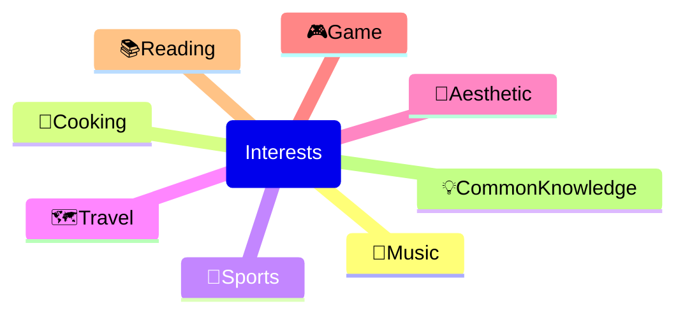

# 生命因你而火热

{{ BEGIN_TOC }}
- 🎹 Music
  - 音乐理论: Music/00-Music_Theory.md
  - 钢琴课程: Music/01-Piano_Class.md
  - 钢琴自选: Music/02-Piano_SelfSelect.md
  - 钢琴古典: Music/03-Pinao_Classic.md
- 🍳 Eat
  - 中餐食谱: Eat/eat.md
  - 西餐食谱: Eat/eat-west.md
  - 杭州美食: Eat/eat-hangzhou.md
  - 咖啡文化: Eat/coffee.md
- 🏃 Exercise
  - 健身指南: Exercise/exercise-fit.md
  - 跑步运动: Exercise/exercise-running.md
  - 游泳运动: Exercise/exercise-swimming.md
  - 网球运动: Exercise/exercise-tennis.md
  - 舞蹈艺术: Exercise/dance.md
- 🗺️ Travel
  - 马来西亚: Travel/C-J-MY.md
  - 日本旅行: Travel/C-J-Japan.md
  - 浙江旅行: Travel/C-J-浙江.md
  - 四川旅行: Travel/C-J-四川.md
  - 自驾游: Travel/C-Driving.md
- 🎨 Aesthetic
  - 摄影艺术: Aesthetic/Photography.md
  - 设计美学: Aesthetic/design.md
  - 花卉艺术: Aesthetic/flower.md
  - PPT设计: Aesthetic/powerpoint.md
- 🎮 Game
  - 我的世界: Game/MC.md
  - FIFA游戏: Game/fifa.md
- 💡 CommonKnowledge
  - 社会保障: CommonKnowledge/social_security.md
  - 商业保险: CommonKnowledge/insurance_commercial_insurance.md
  - 社会保险: CommonKnowledge/insurance_social_insurance.md
  - 劳动法规: CommonKnowledge/labour.md
  - 房屋知识: CommonKnowledge/house.md
- 🫘 Bean Knowledge
  - 豆知识: bean_knowledge.md
{{ END_TOC }}

**玉泉手绘地图**

> 图源 浙大官微

[本科生选研究生课，看这一篇就够了！(tag:选课/ 个性化 / 个性修读 / 个性学分/ 选修研究生课 /学分不够 ) - CC98论坛](http://www-cc98-org-s.webvpn.zju.edu.cn:8001/topic/6111277/1