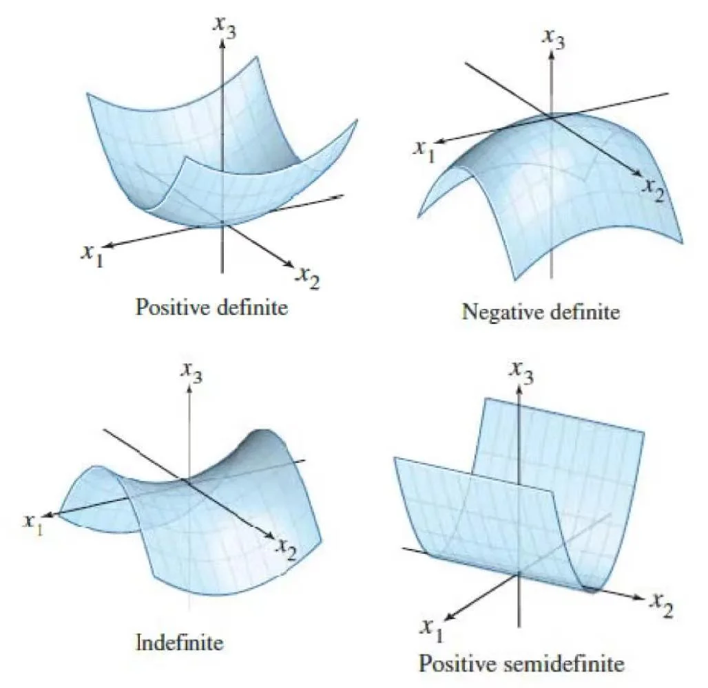

# 02 | 微分与积分

## 变元与函数

$\boldsymbol{x}=[x_1,\cdots,x_m]^{\mathrm{T}}\in\mathbb{R}^m$ 为实向量变元；

$\boldsymbol{X}=[\boldsymbol{x}_1,\cdots,\boldsymbol{x}_n]\in\mathbb{R}^{m\times n}$ 为实矩阵变元；

根据输入输出的类型不同，我们可以把函数分为以下几种：

| 输入\输出 | 输入为向量 $\boldsymbol{x}\in\mathbb{R}^m$ | 输入为矩阵 $\boldsymbol{X}\in\mathbb{R}^{m\times n}$ |
|---|---|---|
| 标量输出 | $f(\boldsymbol{x})\in\mathbb{R}$，记作 $f:\mathbb{R}^m\to\mathbb{R}$   例：向量的范数 | $f(\boldsymbol{X})\in\mathbb{R}$，记作 $f:\mathbb{R}^{m\times n}\to\mathbb{R}$   例：矩阵的迹 |
| 向量输出 | $f(\boldsymbol{x})\in\mathbb{R}^p$，记作 $f:\mathbb{R}^m\to\mathbb{R}^p$   例：卷积、傅立叶变换 | $f(\boldsymbol{X})\in\mathbb{R}^p$，记作 $f:\mathbb{R}^{m\times n}\to\mathbb{R}^p$ |
| 矩阵输出 | $\boldsymbol{F}(\boldsymbol{x})\in\mathbb{R}^{p\times q}$，记作 $\boldsymbol{F}:\mathbb{R}^m\to\mathbb{R}^{p\times q}$   例：vandermonde矩阵、confusion matrix | $\boldsymbol{F}(\boldsymbol{X})\in\mathbb{R}^{p\times q}$，记作 $\boldsymbol{F}:\mathbb{R}^{m\times n}\to\mathbb{R}^{p\times q}$   例：输入是猫狗图，输出是猫狗分类结果 |

微分与积分：element-wise

$$
\frac{\mathrm{d} \mathbf{A}}{\mathrm{d} t} = \mathbf{\dot{A}} = \begin{bmatrix} \frac{\mathrm{d} a_{11}}{\mathrm{d} t} & \frac{\mathrm{d} a_{12}}{\mathrm{d} t} & \cdots & \frac{\mathrm{d} a_{1n}}{\mathrm{d} t} \\ \frac{\mathrm{d} a_{21}}{\mathrm{d} t} & \frac{\mathrm{d} a_{22}}{\mathrm{d} t} & \cdots & \frac{\mathrm{d} a_{2n}}{\mathrm{d} t} \\ \vdots & \vdots & \ddots & \vdots \\ \frac{\mathrm{d} a_{m1}}{\mathrm{d} t} & \frac{\mathrm{d} a_{m2}}{\mathrm{d} t} & \cdots & \frac{\mathrm{d} a_{mn}}{\mathrm{d} t} \end{bmatrix}
$$

$$
\int \mathbf{A} \mathrm{d} t = \begin{bmatrix} \int a_{11} \mathrm{d} t & \int a_{12} \mathrm{d} t & \cdots & \int a_{1n} \mathrm{d} t \\ \int a_{21} \mathrm{d} t & \int a_{22} \mathrm{d} t & \cdots & \int a_{2n} \mathrm{d} t \\ \vdots & \vdots & \ddots & \vdots \\ \int a_{m1} \mathrm{d} t & \int a_{m2} \mathrm{d} t & \cdots & \int a_{mn} \mathrm{d} t \end{bmatrix}
$$

矩阵求导的链式法则

$$
\frac{\mathrm{d}}{\mathrm{d} t} (\mathbf{A} \mathbf{B}) = \frac{\mathrm{d} \mathbf{A}}{\mathrm{d} t} \mathbf{B} + \mathbf{A} \frac{\mathrm{d} \mathbf{B}}{\mathrm{d} t}
$$

## 偏导
### 行偏导 - Jacobian Matrix

=== "标量函数&向量变元 - 行偏导"

    行偏导算子
    
    $$
    \begin{align*}
    \mathrm{D}_{x}&\overset{\mathrm{def}}{\operatorname*{=}}\frac{\partial}{\partial {x^{\mathrm{T}}}_{1\times m}}=\left[\frac{\partial}{\partial x_{1}},\cdots,\frac{\partial}{\partial x_{m}}\right]_{1\times m}\\
    \mathrm{D}_{\boldsymbol{x}}f(\boldsymbol{x})&=\frac{\partial f(\boldsymbol{x})}{\partial\boldsymbol{x}^{\mathrm{T}}}=\left[\frac{\partial f(\boldsymbol{x})}{\partial x_{1}},\cdots,\frac{\partial f(\boldsymbol{x})}{\partial x_{m}}\right]
    \end{align*}
    $$

    !!! example "行偏导"
    
        $$
        \begin{aligned}
        f(x)&=x^{T}x\\
        D_{x}f(x)&=\frac{\partial f(x)}{\partial x^{T}}=[\frac{\partial f(x)}{\partial x_{1}}\cdots\frac{\partial f(x)}{\partial x_{m}}]\\
        &=[\frac{\partial x^{T}x}{\partial x_{1}}\cdots\frac{\partial x^{T}x}{\partial x_{m}}]\\
        &=[2x_{1}\cdots2x_{m}]=2x^{T}\end{aligned}
        $$

=== "标量函数&矩阵变元"

    如果变元是矩阵，也可以写出行偏导
    
    $$
    \begin{aligned}
    &\mathrm{D}_{\mathrm{vec}\boldsymbol{X}}f(\boldsymbol{X})=\frac{\partial f(\boldsymbol{X})}{\partial\mathrm{vec}^{\mathrm{T}}(\boldsymbol{X})}=\left[\frac{\partial f(\boldsymbol{X})}{\partial x_{11}},\cdots,\frac{\partial f(\boldsymbol{X})}{\partial x_{m1}},\cdots,\frac{\partial f(\boldsymbol{X})}{\partial x_{1n}},\cdots,\frac{\partial f(\boldsymbol{X})}{\partial x_{mn}}\right]_{1\times mn}\\
    &\mathrm{D}_{\mathrm{vec}\boldsymbol{X}}f(\boldsymbol{X})=\mathrm{rvec}(\mathrm{D}_{\boldsymbol{X}}f(\boldsymbol{X}))=\left(\mathrm{vec}(\mathrm{D}_{\boldsymbol{X}}^{\mathbf{T}}f(\boldsymbol{X}))\right)^{\mathbf{T}}
    \end{aligned}
    $$
    
    所以求行偏导的结果相当于把雅可比矩阵给行向量化了

=== "标量函数&矩阵变元 - Jacobian Matrix"

    $f(X)$ 关于矩阵变元 $X$ 的 Jacobian 矩阵
    
    $X \in \mathbb{R}^{m \times n}$
    
    $$
    D_X f(X) = \frac{\partial f(X)}{\partial X^T} = \begin{bmatrix} \frac{\partial f(X)}{\partial x_{11}} & \ldots & \frac{\partial f(X)}{\partial x_{m1}} \\ \vdots & \ddots & \vdots \\ \frac{\partial f(X)}{\partial x_{1n}} & \ldots & \frac{\partial f(X)}{\partial x_{mn}} \end{bmatrix} \in \mathbb{R}^{n \times m}
    $$

=== "矩阵函数&矩阵变元 - Jacobian Matrix"

    $$
    \mathrm{D}_{\boldsymbol{X}}\boldsymbol{F}(\boldsymbol{X})\overset{\mathrm{def}}{\operatorname*{=}}\frac{\partial\mathrm{vec}(\boldsymbol{F}(\boldsymbol{X}))}{\partial(\mathrm{vec}\boldsymbol{X})^{\mathrm{T}}}\in\mathbb{R}^{pq\times mn}
    $$
    
    思路：
    
    - 把矩阵函数列向量化$vec(\mathbf{F}(\mathbf{X})) =vec\begin{bmatrix}\mathbf{F}_{1} & \mathbf{F}_{2} & \cdots & \mathbf{F}_{q} \end{bmatrix}$
    - 列向量化之后，相当于把矩阵函数的每一个元素展开成了一个列向量，然后相当于标量对于矩阵求行偏导

    $$
    \begin{aligned}
    &\mathrm{D}_{\boldsymbol{X}}\boldsymbol{F}(\boldsymbol{X})=\begin{bmatrix}\frac{\partial f_{11}}{\partial(vecX)^{\mathrm{T}}}\\\vdots\\\frac{\partial f_{p1}}{\partial(vecX)^{\mathrm{T}}}\\\vdots\\\frac{\partial f_{1q}}{\partial(vecX)^{\mathrm{T}}}\\\vdots\\\frac{\partial f_{pq}}{\partial(vecX)^{\mathrm{T}}}\end{bmatrix}
    =\begin{bmatrix}\frac{\partial f_{11}}{\partial x_{11}}&\cdots&\frac{\partial f_{11}}{\partial x_{m1}}&\cdots&\frac{\partial f_{11}}{\partial x_{1n}}&\cdots&\frac{\partial f_{11}}{\partial x_{mn}}\\\vdots&\vdots&\vdots&\vdots&\vdots&\vdots\\\vdots&\vdots&\vdots&\vdots&\vdots&\vdots\\\frac{\partial f_{p1}}{\partial x_{11}}&\cdots&\frac{\partial f_{p1}}{\partial x_{m1}}&\cdots&\frac{\partial f_{p1}}{\partial x_{1n}}&\cdots&\frac{\partial f_{p1}}{\partial x_{mn}}\\\vdots&\vdots&\vdots&\vdots&\vdots&\vdots\\\vdots&\vdots&\vdots&\vdots&\vdots&\vdots\\\frac{\partial f_{1q}}{\partial x_{11}}&\cdots&\frac{\partial f_{1q}}{\partial x_{m1}}&\cdots&\frac{\partial f_{1q}}{\partial x_{1n}}&\cdots&\frac{\partial f_{1q}}{\partial x_{mn}}\\\vdots&\vdots&\vdots&\vdots&\vdots&\vdots\\\vdots&\vdots&\vdots&\vdots&\vdots&\vdots\\\frac{\partial f_{pq}}{\partial x_{11}}&\cdots&\frac{\partial f_{pq}}{\partial x_{m1}}&\cdots&\frac{\partial f_{pq}}{\partial x_{1n}}&\cdots&\frac{\partial f_{pq}}{\partial x_{mn}}\end{bmatrix}
    \end{aligned}
    $$

### 列偏导 - Derivative 梯度

$m\times1$列向量偏导算子即梯度算子记作$\nabla_{\boldsymbol{x}}$,定义为

> taking derivative **with respect to** a column vector

具有连续偏导→可微→**有切平面**→切线都在切平面上→有一个斜率最大的

=== "标量函数&向量变元"

    $$
    \nabla_{x}\stackrel{\mathrm{def}}{=}\frac{\partial}{\partial x_{m\times1}}=\left[\frac{\partial}{\partial x_{1}},\cdots,\frac{\partial}{\partial x_{m}}\right]^{\mathrm{T}}
    $$

    $$
    \nabla_{\boldsymbol{x}}f(\boldsymbol{x})\stackrel{\mathrm{def}}{=}\left[\frac{\partial f(\boldsymbol{x})}{\partial x_{1}},\cdots,\frac{\partial f(\boldsymbol{x})}{\partial x_{m}}\right]^{\mathrm{T}}=\frac{\partial f(\boldsymbol{x})}{\partial\boldsymbol{x}}
    $$

=== "标量函数&矩阵变元"

    $$
    \nabla_{\boldsymbol{X}}f(\boldsymbol{X})=\begin{bmatrix}\frac{\partial f(\boldsymbol{X})}{\partial x_{11}}&\cdots&\frac{\partial f(\boldsymbol{X})}{\partial x_{1n}}\\\vdots&\ddots&\vdots\\\frac{\partial f(\boldsymbol{X})}{\partial x_{m1}}&\cdots&\frac{\partial f(\boldsymbol{X})}{\partial x_{mn}}\end{bmatrix}=\frac{\partial f(\boldsymbol{X})}{\partial\boldsymbol{X}}
    $$
    
    **梯度矩阵是雅可比矩阵的转置**

!!! note "方向导数是一个数，梯度是一个向量"

#### **方向导数**

方向导数是函数在某一特定方向上的变化率。它表示函数在定义域内某一点沿着给定方向的变化趋势。具体来说，对于一个具有定义域的函数 $f(x, y)$，在点 $(x_0, y_0)$ 处沿着方向向量 

$$
D_{\vec{u}}f(x_0, y_0) = \lim_{h \to 0} \frac{f(x_0 + hu_1, y_0 + hu_2) - f(x_0, y_0)}{h}
$$

其中，$h$ 是一个很小的正数，$u_1$ 和 $u_2$ 是方向向量 $\vec{u}$ 的分量。

!!! example "求导"
    $$
    f(x) = x^{T}x = \sum_{i=1}^{n}x_{i}^{2}
    $$

    $$
    \nabla_{x}f(x) = \begin{bmatrix} \frac{\partial \sum_{i=1}^{n}x_{i}^{2}}{\partial x_{1}} \\ \vdots \\ \frac{\partial \sum_{i=1}^{n}x_{i}^{2}}{\partial x_{n}} \end{bmatrix} = \begin{bmatrix} 2x_{1} \\ \vdots \\ 2x_{n} \end{bmatrix} = 2x
    $$
    
    很多时候低维推到高维的时候，结构是类似的，所以高维求不出来的时候，可以先从低维开始推，然后推广到高维

- 梯度的方向：函数上升最快的方向
- **梯度流**：函数下降最快的方向，梯度方向的负方向 $-\nabla_{\boldsymbol{x}}f(\boldsymbol{x})$ 称为函数 $f$ 在点 $\boldsymbol{x}$ 的梯度流 (gradient flow)，记作

$$
\dot{\boldsymbol{x}}=-\nabla_{\boldsymbol{x}}f(\boldsymbol{x}) \quad \text { 或 } \quad \dot{\boldsymbol{X}}=-\nabla_{\operatorname{vec} \boldsymbol{X}}f(\boldsymbol{X})
$$

!!! note "梯度流是函数下降最快的方向"
    根据泰勒公式

    $$
    f(x+d) \approx f(x) + \nabla x^T f(x) d
    $$
    
    如果想让函数值下降$f(x+d)<f(x)$
    
    则需要$d$ 和 $\nabla x^T f(x)$ 夹角大于90度，即$\cos \langle \nabla x^T f(x), d \rangle < 0$，而其中
    
    $$
    -1 \leq \cos \langle \nabla x^T f(x), d \rangle = \frac{\nabla x^T f(x) d}{||\nabla x^T f(x)|| ||d||} \leq 1
    $$
    
    当只有$d$ 和 $\nabla x^T f(x)$ 方向完全相反时，$\cos \langle \nabla x^T f(x), d \rangle = -1$，这个时候下降的速度最快

### 计算法则 - 核心链式法则

!!! note "特例"

    特例：$y \in R^{m\times 1}$, $\mathbf{A} \in R^{m\times m}$
    
    - $\frac{\partial{\mathbf{A}\mathbf{X}}}{\partial{\mathbf{X}}} = \mathbf{A}^T$
    - $\frac{\partial{\mathbf{X}^T\mathbf{A}\mathbf{X}}}{\partial{\mathbf{X}}} = \mathbf{A}^T\mathbf{X} + \mathbf{AX}$

- **若 $f(X)=c$ 为常数**，其中 $X$ 为 $m\times n$ 矩阵，则梯度 $\frac{\partial c}{\partial X}= O_{m\times n}$

- **线性法则**：若 $f(\boldsymbol{X})$ 和 $g(\boldsymbol{X})$ 分别是矩阵 $X$ 的实值函数，$c_1$ 和 $c_2$ 为实常数，则

$$
\frac{\partial[c_1f(\boldsymbol{X})+c_2g(\boldsymbol{X})]}{\partial\boldsymbol{X}}=c_1\frac{\partial f(\boldsymbol{X})}{\partial\boldsymbol{X}}+c_2\frac{\partial g(\boldsymbol{X})}{\partial\boldsymbol{X}}
$$

- **乘积法则**：若 $f(X)$、$g(X)$ 和 $h(X)$ 都是矩阵 $X$ 的实值函数，则

$$
\frac{\partial[f(X)g(X)]}{\partial X}=g(X)\frac{\partial f(X)}{\partial X}+f(X)\frac{\partial g(X)}{\partial X}
$$

$$
\frac{\partial[f(X)g(X)h(X)]}{\partial X}=g(X)h(X)\frac{\partial f(X)}{\partial X}+f(X)h(X)\frac{\partial g(X)}{\partial X}+f(X)g(X)\frac{\partial h(X)}{\partial X}
$$

- **链式法则**：

$$
\frac{\partial g(f(\boldsymbol X))}{\partial\boldsymbol X}=\frac{\mathrm{d}g(y)}{\mathrm{d}y}\frac{\partial f(\boldsymbol X)}{\partial\boldsymbol X}
$$

#### 独立性基本假设
假定实值函数的向量变元 $\boldsymbol{x}=[x_{i}]_{i=1}^{m}\in\mathbb{R}^{m}$ 或者矩阵变元 $\boldsymbol{X}=[x_{ij}]_{i=1,j=1}^{m,n}\in\mathbb{R}^{m\times n}$ 本身无任何特殊结构, 即向量或矩阵变元的元素之间是各自独立的。

$$
\frac{\partial x_{i}}{\partial x_{j}}=\delta_{ij}=\begin{cases}1, & i=j \\ 0, & \text { 其他 }\end{cases}
$$

以及

$$
\frac{\partial x_{kl}}{\partial x_{ij}}=\delta_{ki}\delta_{lj}=\begin{cases}1, & k=i \text { 且 } l=j \\ 0, & \text { 其他 }\end{cases}
$$

其中 $\delta_{ij}$ 是 Kronecker符号

!!! example "求实值函数 $f(x)=x^{T}Ax$ 的 Jacobian 矩阵"
    由于 $x^{T}Ax=\sum_{k=1}^{n}\sum_{l=1}^{n}a_{kl}x_{k}x_{l}$
    
    求出行偏导向量 $\frac{\partial x^{T}Ax}{\partial x^{T}}$ 的第 $i$ 个分量为
    
    $$
    [\frac{\partial x^{T}Ax}{\partial x^{T}}]_{i}=\frac{\partial}{\partial x_{i}}\sum_{k=1}^{n}\sum_{l=1}^{n}a_{kl}x_{k}x_{l}=\sum_{k=1}^{n}x_{k}a_{ki}+\sum_{l=1}^{n}x_{l}a_{il}
    $$
    
    先固定一个值，利用上面的独立性假设，可以求得

!!! example "令 $F(X) = X \in \mathbb{R}^{m \times n}$，则直接计算偏导得"

    $$
    \frac{\partial f_{kl}}{\partial x_{ij}} = \frac{\partial x_{kl}}{\partial x_{ij}} = \delta_{lj} \delta_{ki}
    $$
    
    于是得 Jacobian 矩阵
    
    $$
    \mathrm{D}_{X} F(X) \stackrel{\text { def }}{=} \frac{\partial \text{vec}(F(X))}{\partial(\text{vec} X)^{T}} \\ \mathrm{D}_{X} X = I_{n} \otimes I_{m} = I_{mn} \in \mathbb{R}^{mn \times mn}
    $$

## 微分

### 一些规则

- 标量函数 

$$
\mathrm{d}[\mathrm{tr}(\mathbf{U})] = \mathrm{d}\left(\sum_{i=1}^{n} u_{ii}\right) = \sum_{i=1}^{n} \mathrm{d}u_{ii} = \mathrm{tr}\left(\mathrm{d}\mathbf{U}\right)
$$

- 矩阵乘积UV的微分矩阵

$$
\mathrm{d}(\mathbf{U}\mathbf{V}) = (\mathrm{d}\mathbf{U})\mathbf{V} + \mathbf{U}(\mathrm{d}\mathbf{V})
$$

- 矩阵的迹的矩阵微分等于矩阵微分的迹

$$
\mathrm{d}\left(\mathrm{tr}(\mathbf{X})\right) = \mathrm{tr}(\mathrm{d}\mathbf{X})
$$

- 矩阵转置的微分等于矩阵微分的转置

$$
\mathrm{d}(\boldsymbol{X}^T) = (\mathrm{d}\boldsymbol{X})^T
$$

- 矩阵线性组合的微分等于矩阵微分的线性组合

$$
\mathrm{d}(\alpha\boldsymbol{X}+\beta\boldsymbol{Y}) = \alpha\mathrm{d}\boldsymbol{X}+\beta\mathrm{d}\boldsymbol{Y}
$$

### Jocabian 矩阵辨识

矩阵微分用符号 dX 表示

更方便得到雅可比矩阵

微分法则：

对于标量函数 $f(\mathbf{x})$，其中 $\mathbf{x}=[x_1,x_2,\ldots,x_m]^T \in \mathbb{R}^m$：

$$
\begin{aligned}
df(\mathbf{x}) = & \left[\frac{\partial f(\mathbf{x})}{\partial x_1},\ldots,\frac{\partial f(\mathbf{x})}{\partial x_m}\right]
\begin{bmatrix}
dx_1 \\ \vdots \\ dx_m
\end{bmatrix} \\
= & \frac{\partial f(\mathbf{x})}{\partial\mathbf{x}^T}d\mathbf{x} \\
= & \text{tr}(\boldsymbol{A}d\mathbf{x})
\end{aligned}
$$

对于标量函数 $f(\boldsymbol{X})$，其中 $\boldsymbol{X} \in \mathbb{R}^{m\times n}$：

$$
df(\boldsymbol{X}) = \text{tr}(\boldsymbol{A}d\boldsymbol{X})
$$

对于向量变元的标量函数：

$$
df(\mathbf{x})=\text{tr}(\mathbf{A}d\mathbf{x}) \text{ 等价于 } D_\mathbf{x}f(\mathbf{x})=\frac{\partial f(\mathbf{x})}{\partial\mathbf{x}^T}=\mathbf{A}
$$

对于矩阵变元的标量函数：

$$
df(\boldsymbol{X})=\text{tr}(\boldsymbol{A}d\boldsymbol{X}) \text{ 等价于 } D_\mathbf{x}f(\boldsymbol{X})=\frac{\partial f(\boldsymbol{X})}{\partial\boldsymbol{X}^T}=\boldsymbol{A}
$$

行偏导与梯度的关系：

$$
D_{\mathbf{x}}f(\boldsymbol{X})=\frac{\partial f(\boldsymbol{X})}{\partial\boldsymbol{X}^T}=\boldsymbol{A} \text{ 等价于 } \nabla_{\mathbf{x}}f(\boldsymbol{X})=\boldsymbol{A}^T
$$

!!! example "$f(x) = x^T A x$"

    $$
    f(x) = x^T A x
    $$
    
    求解
    
    $$
    \begin{aligned}
    df(x) &= (dx^T) A x + x^T d(A x)\\
    &= x^T A^T dx + x^T A dx\\
    &= Tr(x^T (A^T + A) dx)
    \end{aligned}
    $$
    
    $$
    \begin{aligned}
    D_x f(x) &= x^T (A^T + A) \\
    \nabla_x f(x) &= D_x^T f(x) = (A^T + A) x \\
    \text{if } A^T &= A \text{ then } \nabla_x f(x) = 2 A x
    \end{aligned}
    $$

!!! example "$f(X) = tr(A X^{-1})$"

    $$
    f(X) = tr(A X^{-1})
    $$
    
    $$
    \begin{aligned}
    d f(x)&=d\ \text{tr}(A^{-1}X)\\
    &= \text{tr}\left[d(A^{-1}X)\right]\\
    &= \text{tr}\left[A^{-1}dX\right]\\
    &= \text{tr}\left[A^{-1}(-X^{-1}dX X^{-1})\right]\\
    &= \text{tr}\left[-X^{-1}A^{-1}dX X^{-1}\right]\\
    \end{aligned}
    $$
    
    最后一步运用了迹的性质
    
    $$
    tr(ABC) = tr(BCA) = tr(CAB)
    $$

    $$
    D_Xf(X)=-X^{-1}A^{-1}X^{-1}
    $$

### 复向量
复变量的偏导数定义：

$$
\begin{cases}
\frac{\partial}{\partial z}=\frac{1}{2}\left(\frac{\partial}{\partial x}-j\frac{\partial}{\partial y}\right)\\
\frac{\partial}{\partial z^*}=\frac{1}{2}\left(\frac{\partial}{\partial x}+j\frac{\partial}{\partial y}\right)
\end{cases}
$$

其中 x 和 y 是相互独立的:

$$
\begin{cases}
\frac{\partial y}{\partial x}=0\\
\frac{\partial x}{\partial y}=0
\end{cases}
$$

可以证明 z 和 z* 也是相互独立的:

$$
\begin{aligned}
\frac{\partial z}{\partial z^*}&=\frac{\partial x}{\partial z^*}+j\frac{\partial y}{\partial z^*}\\
&=\frac{1}{2}\left(\frac{\partial x}{\partial x}+j\frac{\partial x}{\partial y}\right)+j\frac{1}{2}\left(\frac{\partial y}{\partial x}+j\frac{\partial y}{\partial y}\right)\\
&=\frac{1}{2}(1+0)+j\frac{1}{2}(0+j)=0
\end{aligned}
$$

$$
\begin{aligned}
\frac{\partial z^*}{\partial z}&=\frac{\partial x}{\partial z}-j\frac{\partial y}{\partial z}\\
&=\frac{1}{2}\left(\frac{\partial x}{\partial x}-j\frac{\partial x}{\partial y}\right)-j\frac{1}{2}\left(\frac{\partial y}{\partial x}-j\frac{\partial y}{\partial y}\right)\\
&=\frac{1}{2}(1-0)-j\frac{1}{2}(0-j)=0
\end{aligned}
$$

对于单变量复函数，其梯度定义为：

$$
\nabla_zf(z,z^*)=\frac{\partial f(z,z^*)}{\partial z}|_{z^*=\text{常数}}
$$

共轭梯度

$$
\nabla_{z^*}f(z,z^*)=\left.\frac{\partial f(z,z^*)}{\partial z^*}\right|_{z=\text{常数}}
$$

其微分形式为：

$$
df(z,z^*)=\frac{\partial f(z,z^*)}{\partial z}dz+\frac{\partial f(z,z^*)}{\partial z^*}dz^*
$$

对于复变元向量：

$$
\mathbf{z}=\begin{bmatrix}z_1,z_2,\ldots,z_m\end{bmatrix}^T
$$

其微分形式可以写作：

$$
\begin{aligned}
df(\mathbf{z},\mathbf{z}^*)&=\left[\frac{\partial f(\mathbf{z},\mathbf{z}^*)}{\partial z_1},\cdots,\frac{\partial f(\mathbf{z},\mathbf{z}^*)}{\partial z_m}\right]\begin{bmatrix}dz_1\\\vdots\\dz_m\end{bmatrix}+\left[\frac{\partial f(\mathbf{z},\mathbf{z}^*)}{\partial z_1^*},\cdots,\frac{\partial f(\mathbf{z},\mathbf{z}^*)}{\partial z_m^*}\right]\begin{bmatrix}dz_1^*\\\vdots\\dz_m^*\end{bmatrix}\\
&=\frac{\partial f(\mathbf{z},\mathbf{z}^*)}{\partial\mathbf{z}^T}d\mathbf{z}+\frac{\partial f(\mathbf{z},\mathbf{z}^*)}{\partial\mathbf{z}^H}d\mathbf{z}^*
\end{aligned}
$$

对于复变量来说，通常要求两个梯度，一个是$\frac{\partial}{\partial z}$，一个是$\frac{\partial}{\partial z^{*}}$

### Hession矩阵 

先求行偏导，再求梯度

实值函数 $f(\mathbf{x})$ 相对于 $m \times 1$ 实向量 $\mathbf{x}$ 的二阶偏导称为 Hessian 矩阵，记作 $\mathbf{H}[f(\mathbf{x})]$，定义为

$$
\mathbf{H}[f(\mathbf{x})] = \frac{\partial^2 f(\mathbf{x})}{\partial \mathbf{x} \partial \mathbf{x}^T} = \frac{\partial}{\partial \mathbf{x}} \left[ \frac{\partial f(\mathbf{x})}{\partial \mathbf{x}^T} \right] \in \mathbb{R}^{m \times m}
$$

或记作

$$
\mathbf{H}[f(\mathbf{x})] = \nabla_x^2 f(\mathbf{x}) = \nabla_x (D_x f(\mathbf{x}))
$$

或写作

$$
\mathbf{H(f)} = \nabla^{2} f(x)=\left[\begin{array}{cccc}
\frac{\partial^{2} f(x)}{\partial x_{1}^{2}} & \frac{\partial^{2} f(x)}{\partial x_{1} \partial x_{2}} & \ldots & \frac{\partial^{2} f(x)}{\partial x_{1} \partial x_{m}} \\
\frac{\partial^{2} f(x)}{\partial x_{2} \partial x_{1}} & \frac{\partial^{2} f(x)}{\partial x_{2}^{2}} & \ldots & \frac{\partial^{2} f(x)}{\partial x_{2} \partial x_{m}} \\
\vdots & \vdots & \ddots & \vdots \\
\frac{\partial^{2} f(x)}{\partial x_{m} \partial x_{1}} & \frac{\partial^{2} f(x)}{\partial x_{m} \partial x_{2}} & \ldots & \frac{\partial^{2} f(x)}{\partial x_{m}^{2}}
\end{array}\right]\in \mathbb{R}^{m \times m}
$$

二次型理论

- $\mathbf{H(f)}$负定，有极大值： 奇数阶主子式为负数，偶数阶为正数
- $\mathbf{H(f)}$正定，有极小值：顺序主子式都为正数
- $\mathbf{H(f)}$不定，鞍点：特征值有正有负
- $\mathbf{H(f)}$不可逆，无法判断：特征值有0

## 积分

$$
\int\mathbf{A}\mathrm{d}t=\begin{bmatrix}\int a_{11}\mathrm{d}t&\int a_{12}\mathrm{d}t&\cdots&\int a_{1n}\mathrm{d}t\\\int a_{21}\mathrm{d}t&\int a_{22}\mathrm{d}t&\cdots&\int a_{2n}\mathrm{d}t\\\vdots&\vdots&\ddots&\vdots\\\int a_{m1}\mathrm{d}t&\int a_{m2}\mathrm{d}t&\cdots&\int a_{mn}\mathrm{d}t\end{bmatrix}
$$

