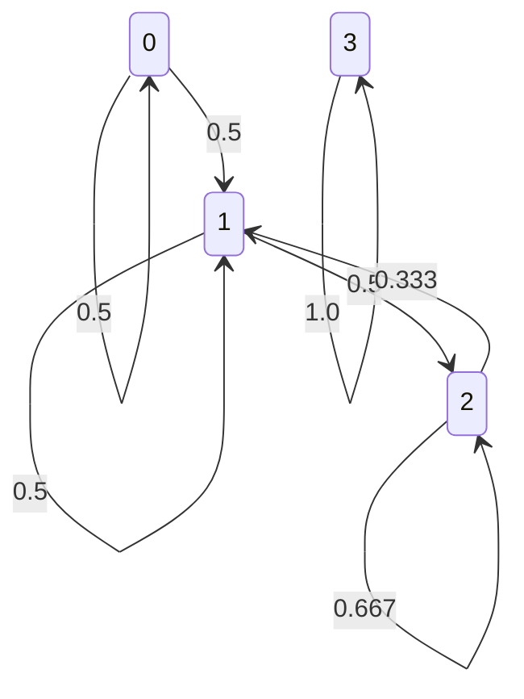

# 02 ｜ 马尔可夫链


| 字母 | 含义 |
|------|------|
| $X_n$ | $n$ 时刻的状态 |
| $p_{ij}(m,m+n)$ | $m$ 时刻经过$n$步从状态 $i$ 到状态 $j$ 的概率 |
| $\mathbf P$ | 一步转移矩阵 |
| $\mathbf P^{(n)}$ | $k$ 步转移矩阵|
| $C_i$ | 互达等价类 |
| $T$ | 余下状态 |
| $d(i)$ | 状态 $i$ 的周期 |
| $f_{ij}$ | 从状态 $i$ 出发在有限步首次到达状态 $j$ 的概率 |
| $f_{ij}^{(n)}$ | 从状态 $i$ 出发在 $n$ 步首次到达状态 $j$ 的概率 |
| $\mathbf\pi$ | 平稳分布向量 |
| $\mu_i$ | 状态 $i$ 的平均回转时间 |
| $n$ | 时间步数 |


## Markov 性

- 无记忆性：$P(X_{n+1}=j\mid X_0=i_0,\cdots,X_{n-1}=i_{n-1},X_n=i)=P(X_{n+1}=j\mid X_n=i)$

- 在知道**当前状态**的情况下，**过去与将来相互独立**。

$$
\begin{align*}
P(AC\mid B)&=\frac{P(ABC)}{P(B)}=\frac{P(C\mid AB)P(AB)}{P(B)}\\
&=P(C\mid AB)P(A\mid B) = P(C\mid B)P(A\mid B)
\end{align*}
$$

- 当前时刻状态决定了下一时刻的随机过程的分布也决定了下一时刻不可能是哪些分布

### 时齐 Markov 链

**K步转移概率只与时间间隔K有关，与当前所处状态无关**

若 $\forall\;i,j\quad P(X_{n+1}=j\mid X_n=i)$ 不依赖于 $n$ ，则称 {$X_n$} 是**时齐的 $Markov$ 链**


时齐的Markov链的有限维分布完全由初始分布和一步转移矩阵决定

## 转移矩阵

$m$ 时处于状态 $i$ 的条件下，到 $n$ 时转移到状态 $j$ 的概率 $P(X_n=j\mid X_m=i)\overset{记为}\Longrightarrow p_{ij}(m,n)$ 。

**①** 各元素非负	

**②** 各行元素之和为 1


### 一步转移

- 一步转移概率:$P(X_{n+1}=j\mid X_n=i)\overset{记为}\Longrightarrow p_{ij}$
- 一步转移矩阵:$\mathbf P=[\;p_{ij}\;]_{I\times I}$


### $k$ 步转移矩阵

- $k$ 步转移概率:$P(X_{n+k}=j\mid X_n=i)\overset{记为}\Longrightarrow p_{ij}^{(k)}$

- $k$ 步转移矩阵:$\mathbf P^k=[\;p^{(k)}_{ij}\;]_{I\times I}$ 

### C-K方程


$\forall\;m,n,l\geq0\quad i,j\in I\qquad p_{ij}(m,m+n+l)=\sum_kp_{ik}(m,m+n)·p_{kj}(m+n,m+n+l)$

> 类似于化学当中算焓变

**①** 由转移图推得任一概率 $\forall\;n\geq1\quad P(X_n=j)=\sum_iP(X_0=i)·p_{ij}^{(n)}$

**②** $\forall\;n_1<n_2<\dots<n_k\quad P(X_{n_1}=i_1,\dots,X_{n_k}=i_k,)=P(X_{n_1}=i_1)·p_{i_1i_2}^{(n_2-n_1)}\dots p_{i_{k-1}i_k}^{(n_k-n_{k-1})}$

时齐 $Markov$ 链的有限维分布完全由**初始分布**与**一步转移矩阵**决定。

## 常返和暂留


$\tau_i=min(n\geq1;X_n=i)$ 为首次击中状态 $i$ 的时间（首中时）。

- 第 $n$ 步击中概率 $f_{ij}^{(n)}$ 为从状态 $i$ 出发在 $n$ 步**首次击中**状态 $j$ 的概率。
- $i$ 出发在有限步能够击中状态 $j$ 的概率 $f_{ij}\quad f_{ij}=P(\tau_j<\infty\mid X_0=i)$
- $f_{ij}=\sum f_{ij}^{(n)}$ 。

> 首次击中很关键

### 常返

$$
P(\tau_i<\infty\mid X_o=i)=1
$$

- 首中时间 $\tau_i$:从状态 $i$ 出发能在有限时间内返回状态 $i$


性质：

- $i$常返<br>$\Leftrightarrow$ $\sum_{n=0}^{\infty} p_{ii}^{(n)} = \infty$<br>$\Leftrightarrow$ $f_{ii} = 1$<br>$\Leftrightarrow$ 从$i$出发以概率1返回状态$i$无穷多次

### 暂留

不满足**常返**的。

- 有概率回不到初始状态
- $f_{ii}<1$
- $\Leftrightarrow P(N_i<\infty\mid X_0=i)=1$
- $\Leftrightarrow \sum_{n=0}^{\infty} p_{ii}^{(n)} < \infty$


### 平均回转时

$\mu_i=\sum nf_{ii}^{(n)}=\begin{cases}<\infty\qquad正常返\\[2ex]=\infty\qquad零常返\end{cases}$

走回原地的步数的期望，每一步的概率是 $f_{ii}^{(n)}$ 

$$
\lim_{n\to\infty}\frac{1}{n}\sum_{k=1}^np_{ii}^{(k)}=\frac{1}{\mu_i}
$$

- 返回$i$的时间间隔有长有短，但根据大数定律保证，访问i的频率和时间间隔$\mu_i$是一样的

## 状态空间的划分

### 可达

$i$ 能到达 $j$ 。$i\curvearrowright j$ 。

### 互达

$i$ 能到达 $j$ 且 $j$ 能到达 $i$ 。$i\leftrightarrow j$ 。有 $d(i)=d(j)$ 且各状态有**相同的周期性与常返性**。

> 满足自反性、对称性、传递性，是等价关系

$\forall\;i\;j$ 互达 $\Leftrightarrow$ $Markov$ 链**不可约**

### 互达等价类

所有处于同一互达状态的集合。状态空间可分为不交的**互达等价类**的并集。

### 闭集

一旦进入此互达等价类中的状态便不再进入非该互达等价类的其他状态。

### 周期

$d(i)$ 为集合$\{n;n\geq1;p_{ii}^{(n)}>0\}$可能取值的最大公约数。


- $i$ 非周期 $\Leftrightarrow$ $d(i)=1$ 。
- { $X_n$ } 遍历 $\Leftrightarrow$ { $X_n$ } 不可约非周期正常返。

## 平稳分布

$\mathbf{\pi}=(\pi_1,\pi_2,\pi_3,\dots,\pi_n)$ 代表稳态时各个状态的含量。满足 

**①** $\mathbf{\pi}=\mathbf{\pi}\mathbf{P}$ （$\mathbf{P}$ 为一步转移矩阵）

**②** $\sum\pi_i=1$


!!! note "根据这两个式子列方程求解平稳分布"

### 不可约**Markov**链的性质

**①** 若 { $X_n$ } 正常返，则 $\pi$ 存在且唯一，$\pi_i=\frac 1{\mu_i}$ 。

**②** 若 { $X_n$ } 遍历，则 $\forall\;i,j\quad \underset{{n\rightarrow\infty}}\lim P_{ij}^{(n)}=\pi_j\rightarrow \underset{{n\rightarrow\infty}}\lim P(X_n=j)=\pi_j$ 。

> 无论你从哪个状态开始，经过足够长时间后，系统会达到一个与**初始状态无关的稳定的状态分布**

**③** 若状态空间有限，则 { $X_n$ } 正常返。

### 可约 $Markov$ 链的性质

**①** $i$ 的互达等价类不闭 $\rightarrow$ $i$ 暂留， $i$ 常返 $\rightarrow$ $i$ 的互达等价类关闭。

**②** $i$ 的互达等价类是有限闭集 $\rightarrow$ $i$ 正常返。

**③** 若 $j$ 暂留或零常返，则 $\forall\;i\quad\underset{{n\rightarrow\infty}}\lim p_{ij}^{(n)}=0$

### 有限**Markov**链的状态分解

可将状态空间分解为所有不交的互达等价类 $C_i$ 与余下状态 $T$ 的并集，则 $C_i$ 中各状态正常返，$T$ 中各状态暂留。则将 { $X_n$ } 限制在 $C_i$ 上得到一个不可约正常返的 $Markov$ 链，其满足 $\pi_i=\frac 1{\mu_i}$ 。

## 吸收概率与平均吸收时间

**先走一步法**

设状态 $a$ 为吸收态，$P_i$ 为状态 $i$ 进入状态 $a$ 的概率/时间，则 $P_b=\sum p_{bc_i}·P_{c_i}$ （求平均步数需 +1）

其中 $p_{bc_i}$ 为一步转移概率。


## 解题方式

**①** 画出状态转移图，写出一步转移矩阵。**观察**状态转移图：

**②** 只要某几个状态两两互达，则为一互达等价类。若任一状态**常返**，则闭；反之不闭。

**③** 对周期的判断则看返回步数的所有可能取值，若出现质数，则**非周期**；反之，周期为其最大公约数。

**④** 若某一状态一旦出去就回不来了，则**暂留**；若还能回来，则**正常返**。
 
**⑤** 求**平均回转时**可先进行状态分解，在**互达等价类**内部求平稳分布 $\pi$ ，**平均回转时**即倒数。

**⑥** 求 $n$ 步转移概率/稳态概率，方法同 ⑤ 。若某一状态**暂留**，则 $n$ 步后到该状态的概率/稳态概率为 0 ；反之为对应的 $\pi$ 值。

## 模型整理


=== "两个吸收壁的游动"
    状态空间 $E = \{1,2,3,4,5\}$, 质点运动到 1, 5 时会永远停留, 一步转移概率矩阵为

    $$
    P = \begin{pmatrix}
    1 & 0 & 0 & 0 & 0 \\
    q & 0 & p & 0 & 0 \\
    0 & q & 0 & p & 0 \\
    0 & 0 & q & 0 & p \\
    0 & 0 & 0 & 0 & 1
    \end{pmatrix}
    $$

=== "两个反射壁的随机游动"
    状态空间 $E=\{1,2,3,4,5\}$, 质点运动到 1, 5 时会永远不能停留, 一步转移概率矩阵为

    $$
    P = \begin{pmatrix}
    0 & 1 & 0 & 0 & 0 \\
    q & 0 & p & 0 & 0 \\
    0 & q & 0 & p & 0 \\
    0 & 0 & q & 0 & p \\
    0 & 0 & 0 & 1 & 0
    \end{pmatrix}
    $$

=== "两个弹性壁的随机游动"

    状态空间$E=\{1,2,3,4,5\}$，质点运动到1, 5时会以一定概率停留，一定概率反弹

    $$
    P = \begin{pmatrix}
    q & p & 0 & 0 & 0 \\
    q & 0 & p & 0 & 0 \\
    0 & q & 0 & p & 0 \\
    0 & 0 & q & 0 & p \\
    0 & 0 & 0 & q & p
    \end{pmatrix}
    $$

### 爬梯子模型

### 输光模型


### d维对称随机游动

已有：当 $d=1$ 时，$p_{oo}^{(2n)} \sim \frac{1}{\sqrt{\pi n}}$；当 $d=2$ 时，$p_{oo}^{(2n)} \sim \frac{1}{\pi n}$. 事实上当 $d \geqslant 3$ 时，$p_{oo}^{(2n)} = O(n^{-d/2})$（证略）。由此可得 $\sum_{n} p_{oo}^{(n)} < \infty$，因此状态 $o$ 暂留。

这个例子说明**一维和二维对称随机游动都是零常返**的，**三维和三维以上对称随机游动都是暂留**的。醉汉一定能回家，但喝醉的小鸟却不一定。这是因为醉汉在二维世界游走，而醉鸟飞翔于三维空间。给的空间越大，越容易逃离。

尽管没有给出当 $d \geqslant 3$ 时的证明，但我们可以试着直观理解如下：

对于 $d$ 维对称随机游动，它有 $d$ 个坐标可以移动，根据大数定律，当 $n$ 足够大时，前 $n$ 步中约有 $\frac{n}{d}$ 步往第 $i$ 个坐标移动。而在这些步数中，它其实是第 $i$ 个坐标上的一维对称随机游动。当给定各个坐标上的移动步数后，这 $d$ 个一维对称随机游动是相互独立的。又由于经过 $n$ 步后返回当且仅当每个坐标上的一维对称随机游动都返回。因此应该有

$$
p_{oo}^{(2n)} = O\left(\left(\frac{1}{\sqrt{\pi n/d}}\right)^d\right) = O(n^{-d/2})
$$

### 网页排名


网页排名是基于“**从许多优质网页链接过来的网页，必定还是优质网页**”的思想来判断网页的重要性。提高网页排名的主要因素有3个：

1. 反向链接数，即链接到这个网页的数目。反向链接数越多，这个网页越重要。
2. 反向链接是否来源于推荐度高的页面，重要网页链接的网页也重要。
3. 反向链接页面的链接数。一个网页的链接数越多，它对它所链接的网页的重要性影响就越小。如果一个网页有k个链接，则它的影响就被等分成k份而平均地影响到它所链接的每一个页面。


因此我们先把所有的网页看成一个有向图V，每个网页是一个顶点。如果网页i超链接到网页j，就认为从i到j有一条边相连，j就称为i的邻居。现在记$\pi_i$为网页i的重要性，规定所有网页重要性之和为1，即$\sum\pi_i=1$，则由上面3条得到，对任何网页k，

$$
\pi_k = \sum_{i:i\text{超链接到}k} \pi_i \frac{1}{d_i}
$$

这里$d_i$表示i的邻居数，即网页$i$的超链接数目。

让我们想象一下这样的网页访问方式：如果现在访问网页$i$，则下一步等可能地访问$i$的邻居。这样就定义了有向图$V$上的随机游动，它是一个时齐马尔可夫链，状态空间为顶点集$V$，一步转移概率

$$
p_{ij}=\begin{cases}\dfrac{1}{d_i},&j\text{ 是 }i\text{ 的邻}\\\\0,&\text{其他}.\end{cases}
$$

$\pi_k=\sum_i\pi_ip_{ik}.$这样就得到了一个有趣的事实：$(\pi_i,i\in I)$恰好就是刚才定义的有向图$V$上随机游动的平稳分布. 特别地，当这个随机游动遍历时$\operatorname* { lim} _{n\to \infty }P( X_{n}$ = $i)$ = $\pi _{i}$,即访问网页$i$的极限概率为$\pi_i$,因此$\pi_{i}$越大，访问网页$i$越频繁，从而网页 $i$ 越重要


## 例题


①绝对分布: 初始分布和n步转移概率的乘积

②对于状态空间有限的齐次马氏链, 如果其某一步转移概率矩阵的每一个元素都大于零, 则该链是遍历的

③定理: 遍历的齐次马氏链的极限分布是平稳分布

④定理: 如果齐次马氏链的初始分布为平稳分布, 则初始分布也为绝对分布

### 求初始分布、绝对分布、极限分布、平稳分布


!!! example "设 { $X_n\;;\;n\geq0$ } 是时齐的 $Markov$ 链，状态空间 $I$ = {1,2,3,4,5,6}，一步转移概率为：$p_{11}=p_{54}=p_{62}=0.4$ ，$p_{12}=p_{56}=p_{65}=0.6$ ，$p_{21}=p_{34}=p_{43}=1$ 。"
    ```mermaid
    graph TD;
        1 -->|0.4| 1;
        1 -->|0.6| 2;
        2 -->|1.0| 1;
        3 -->|1.0| 4;
        4 -->|1.0| 3;
        5 -->|0.4| 4;
        5 -->|0.6| 6;
        6 -->|0.4| 2;
        6 -->|0.6| 5;
    ```

    （1）所有互达等价类为  $C_1$={1,2}	$C_2$={3,4}	$C_3$={5,6}	其中 $C_1\; C_2$ 是闭的。

    （2）$d(1)=d(2)=1\quad d(3)=d(4)=d(5)=d(6)=2$	即状态 1、2非周期。

    （3）状态 1、2、3、4 正常返，状态 5、6 暂留。

    （4）$\because\pi=(\frac58,\frac38,\frac12,\frac12)$	$\therefore(\mu_1,\mu_2,\mu_3,\mu_4)=(\frac85,\frac83,2,2)$

    （5）$\underset{{n\rightarrow\infty}}\lim p_{12}^{(n)}=\pi_2=\frac38$，$\underset{{n\rightarrow\infty}}\lim p_{55}^{(n)}=0$

    （6）$\underset{{n\rightarrow\infty}}\lim P(X_n=3)=\pi_3=\frac12$，	$\underset{{n\rightarrow\infty}}\lim P(X_n=6)=0$

### 通过题目背景求解平稳分布or转移概率

!!! example "若顾客的购买情况不受到过去购买历史的影响。现在市场上供应了 A, B, C 厂家生产的三种不同的味精，以 $X(n)=1, X(n)=2, X(n)=3$ 分别表示顾客第 $n$ 次购买 A, B, C 厂的味精。"

    若已知顾客第一次购买三个厂味精的概率分布为：$(0.2, 0.4, 0.4)$，又知道一步转移矩阵为：

    $$
    P = \begin{pmatrix}
    0.8 & 0.1 & 0.1 \\
    0.5 & 0.1 & 0.4 \\
    0.5 & 0.3 & 0.2
    \end{pmatrix}
    $$

    求：

    (1) 顾客第二次购买各厂味精的概率

    (2) 预测经过多次购买之后，顾客的购买倾向


    $$
    (0.2, 0.4, 0.4) \begin{pmatrix}
    0.8 & 0.1 & 0.1 \\
    0.5 & 0.1 & 0.4 \\
    0.5 & 0.3 & 0.2
    \end{pmatrix} = (0.56, 0.18, 0.26)
    $$

    $$
    \begin{cases}
    (\pi_1, \pi_2, \pi_3) = (\pi_1, \pi_2, \pi_3) P\\
    \pi_1 + \pi_2 + \pi_3 = 1
    \end{cases}
    $$

    解得：


    $$
    \begin{gathered}\begin{cases}\pi_{1}=0.8\pi_{1}+0.5\pi_{2}+0.5\pi_{3}\\\pi_{2}=0.1\pi_{1}+0.1\pi_{2}+0.3\pi_{3}\\\pi_{3}=0.1\pi_{1}+0.4\pi_{2}+0.2\pi_{3}\\\pi_{1}+\pi_{2}+\pi_{3}=1&\end{cases}\\(\pi_{1},\pi_{2},\pi_{3})=\left(\frac{60}{84},\frac{11}{84},\frac{13}{84}\right)\end{gathered}
    $$


!!! example "明天是否有雨仅与今天的天气有关，而与过去的天气无关。又假设今天下雨而明天也下雨的概率为 $\alpha$，今天无雨明天有雨的概率为 $\beta$；规定有雨天气为状态0，无雨天气为状态1。设 $\alpha = 0.7$，$\beta = 0.4$。求今天有雨且第四天仍然有雨的概率"

    解：

    一步转移概率为:

    $$
    P = \begin{pmatrix} 0.7 & 0.3 \\ 0.4 & 0.6 \end{pmatrix}
    $$

    今天有雨且第四天仍然有雨的概率: 0.5749

    $$
    P^4 = \begin{pmatrix} 0.5749 & 0.4251 \\ 0.5668 & 0.4332 \end{pmatrix}
    $$


!!! example "设任意连续的两天中，雨天转晴天的概率为$\frac{1}{3}$，晴天转雨天的概率为$\frac{1}{2}$，任意一天中晴天和雨天为互斥事件，以0表示晴天状态，以1表示雨天状态，$X_n$表示第n天的状态"

    解：

    1） 写出该马氏链的一步转移概率

    2） 在第一天为晴天的条件下,第三天为晴天,第五天为雨天的概率各为多少

    $$
    \begin{aligned}
    &P = \begin{pmatrix} \frac{1}{2} & \frac{1}{2} \\ \frac{1}{3} & \frac{2}{3} \end{pmatrix},\quad
    P^2 = \begin{pmatrix} \frac{5}{12} & \frac{7}{12} \\ \frac{7}{18} & \frac{11}{18} \end{pmatrix},\quad
    P^4 = \begin{pmatrix} \frac{173}{432} & \frac{259}{432} \\ \frac{259}{648} & \frac{389}{648} \end{pmatrix}\\
    &P(X_{3}=0|X_{1}=0) = \frac{5}{12}\\
    &P(X_{5}=1|X_{1}=0) = \frac{259}{432}
    \end{aligned}
    $$


## 习题

### 3.10
设 $\{X_{n}\}$ 是一时齐马尔可夫链, 状态空间为 $\{0, 1, 2, 3\}$, 一步转移矩阵为

$$
P = \begin{pmatrix}
\frac{1}{2} & \frac{1}{2} & 0 & 0 \\ 
0 & \frac{1}{2} & \frac{1}{2} & 0 \\ 
0 & \frac{1}{3} & \frac{2}{3} & 0 \\ 
0 & 0 & 0 & 1 
\end{pmatrix}
$$

设 $P(X_{0}=0)=P(X_{0}=1)=P(X_{0}=3)=\frac{1}{3}$.

**(1) 计算 $P(X_{1}=1, X_{3}=2)$, $P(X_{2}=1)$ 和 $P(X_{10}=0)$;**

**(2) 求出各状态的常返性, 并计算正常返态的平均回转时.**


$$
P^2 = \begin{pmatrix}
\frac{1}{2} & \frac{1}{2} & 0 & 0 \\ 
0 & \frac{1}{2} & \frac{1}{2} & 0 \\ 
0 & \frac{1}{3} & \frac{2}{3} & 0 \\ 
0 & 0 & 0 & 1 
\end{pmatrix}\begin{pmatrix}
\frac{1}{2} & \frac{1}{2} & 0 & 0 \\ 
0 & \frac{1}{2} & \frac{1}{2} & 0 \\ 
0 & \frac{1}{3} & \frac{2}{3} & 0 \\ 
0 & 0 & 0 & 1 
\end{pmatrix}=
\begin{pmatrix}
\frac{1}{4} & \frac{1}{2} & \frac{1}{4} & 0 \\ 
0 & \frac{1}{3} & \frac{2}{3} & 0 \\ 
0 & \frac{1}{2} & \frac{1}{2} & 0 \\ 
0 & 0 & 0 & 1 
\end{pmatrix}
$$

$$
P^3 = P^2 \cdot P = \begin{pmatrix}
\frac{1}{4} & \frac{1}{2} & \frac{1}{4} & 0 \\ 
0 & \frac{1}{3} & \frac{2}{3} & 0 \\ 
0 & \frac{1}{2} & \frac{1}{2} & 0 \\ 
0 & 0 & 0 & 1 
\end{pmatrix}\begin{pmatrix}
\frac{1}{2} & \frac{1}{2} & 0 & 0 \\ 
0 & \frac{1}{2} & \frac{1}{2} & 0 \\ 
0 & \frac{1}{3} & \frac{2}{3} & 0 \\ 
0 & 0 & 0 & 1 
\end{pmatrix}=\begin{pmatrix}
\frac{1}{8} & \frac{5}{12} & \frac{1}{3} & 0 \\ 
0 & \frac{1}{2} & \frac{1}{2} & 0 \\ 
0 & \frac{1}{3} & \frac{2}{3} & 0 \\ 
0 & 0 & 0 & 1 
\end{pmatrix}
$$





### 3.16

### 3.17

### 3.20 


### 3.21 

### 3.23


