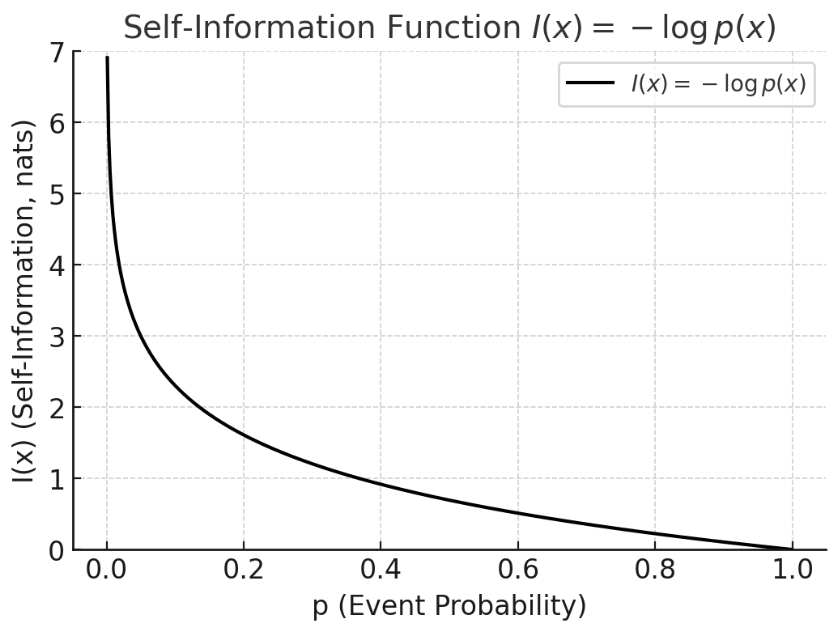

# 信息论

!!! note "信息论简介"
    - 信息论的发展历史
    - 信息论的应用领域
    
## 信息的度量
1. **熵**：系统自身的不确定性。
2. **KL 散度**：两个分布的差异，衡量“错误假设的代价”。
3. **交叉熵**：实际中常用的“训练信号”，等价于熵 + KL，核心就是让预测分布 $Q$ 逼近真实分布 $P$。

### 信息量的定义（自信息）

单个事件的信息量（自信息）定义为：

$$
I(x) = -\log p(x)
$$

**性质**

* **罕见事件 → 信息量大**：若 $p(x)$ 很小，说明事件罕见，那么 $I(x)$ 很大。
* **必然事件 → 信息量为零**：若 $p(x)=1$，则 $I(x)=0$，不包含任何新信息。
* **可加性**：如果两个事件独立，则信息量相加。

**含义**

* 可以理解为“看到某事件的惊讶程度”，不确定度更大，则信息量更大
* 也可以理解为“事件消除了多少不确定性”。
* 不确定-》确定的难度

**例子**

* 掷硬币，结果是“正面”。概率 $p=0.5$。

  $$
  I = -\log_2(0.5) = 1 \ \text{比特}
  $$
* 掷骰子，结果是“6”。概率 $p=1/6$。

  $$
  I = -\log_2(1/6) \approx 2.585 \ \text{比特}
  $$

说明掷骰子的结果比掷硬币单次结果包含更多信息。

!!! question "为什么使用log"
    熵是服从某一特定概率分布事件的理论最小平均编码长度

    那么从二进制的角度思考，如果一个事件发生的概率是$p$，那么我们需要用$-\log_2(p)$个比特来编码这个事件。

### 信息熵（Shannon Entropy）

对于离散分布 $P(X)$，熵定义为：

$$
H(P) = - \sum_{x} P(x) \log P(x) = \mathbb{E}[-\log P(x)]
$$

> 从公式中可以看出，信息熵就是自信息的期望，也就是平均信息量

**性质**

* **非负性**：$H(P) \geq 0$。
* **加法性**：独立变量的联合熵等于熵的和。
* **最大熵分布** 在不同的约束条件下，最大熵分布不同。
  * 均匀分布是最大熵分布
  * 一二阶矩确定的情况下，正态分布是最大熵分布（为什么大量生活中会看到的随机事件分布都服从正态分布呢？说明大自然有着创造最大惊喜的倾向，或者说，就是要让你猜不透。这也是理解热力学中的熵增定律的另一个角度）

!!! question "为什么熵在均匀分布时最大"
    [椎名 - 知乎](https://www.zhihu.com/question/357032828)

    考虑支集为 $[a,b]$ 的密度函数, 即在约束条件
    
    $$
    \int_{a}^{b} p(x) \, \mathrm{d}x = 1
    $$
    
    下极大化 $H(p)$. 考虑 Lagrange 函数
    
    $$
    J(p) = -\int_{a}^{b} p(x) \log p(x) \, \mathrm{d}x + \lambda \left( \int_{a}^{b} p(x) \, \mathrm{d}x - 1 \right)
    $$
    
    求 functional derivative, 得
    
    $$
    \frac{\delta J(p)}{\delta p} = -\log p - 1 + \lambda
    $$
    
    令上式等于 0, 可得
    
    $$
    p(x) = \mathrm{e}^{\lambda-1}
    $$
    
    再由约束条件即得 $p(x) = \frac{1}{b-a} \mathbf{1}_{[a,b]}(x)$.

!!! note "独立变量的联合熵等于熵的和"

    设有两个随机变量 $X, Y$。
    
    * **联合熵定义**：
    
    $$
    H(X, Y) = - \sum_{x,y} p(x,y) \log p(x,y)
    $$
    
    * 如果 **独立**，则 $p(x,y) = p(x) p(y)$。
    代入：
    
    $$
    \begin{aligned}
    H(X,Y) &= - \sum_{x,y} p(x)p(y) \log \big(p(x)p(y)\big)\\
    &= - \sum_{x,y} p(x)p(y) [\log p(x) + \log p(y)]\\
    &= - \sum_{x} p(x) \log p(x) \sum_y p(y) - \sum_y p(y) \log p(y) \sum_x p(x)
    \end{aligned}
    $$
    
    $\because \sum_x p(x) = \sum_y p(y) = 1$
    
    $$
    H(X,Y) = H(X) + H(Y)
    $$
    
    所以 **独立随机变量的联合熵等于各自熵的和**。
    
    如果不独立，则会出现“冗余”，不确定性减少，故 $H(X,Y) < H(X)+H(Y)$。

**物理与现实含义**

* 熵刻画 **不确定性** 或 **信息量的平均值**。
* 在通信中，熵就是**编码所需的平均比特数**。

**形象化理解**

* 如果一个骰子是公平的，结果完全不可预测 → 熵高。
* 如果一个骰子是“永远掷出6”，完全确定 → 熵为零。
* 可以理解为 “消息的惊讶程度的平均值”。

**在深度学习中的作用**

* 熵常用于正则化或信息瓶颈（如 VAEs）。
* 在强化学习中，用策略熵来保持探索。

### 联合熵
**公式**

对于两个随机变量 $X, Y$：

$$
H(X, Y) = - \sum_{x,y} p(x,y) \log p(x,y)
$$

**含义**

* 表示同时观察两个随机变量所需的平均信息量。
* 可以理解为 **系统整体的不确定性**。

**例子**

* 两个独立硬币同时抛掷：
  每个硬币熵 $=1$ 比特，联合熵 $= 1+1 = 2$ 比特。
* 如果两个硬币是“完全同步”的（总是一致），则联合熵 = 1，比单个硬币大不了多少。

### 条件熵
**公式**

$$
H(Y|X) = - \sum_{x,y} p(x,y) \log p(y|x)
$$

**含义**

* 表示 **在已知 X 的情况下，Y 仍然有多少不确定性**。
* 直观理解：知道了 $X$，还需要多少信息来确定 $Y$。

**关系式**

$$
H(X,Y) = H(X) + H(Y|X) = H(Y) + H(X|Y)
$$

**例子**

* 掷两个硬币，彼此独立：
  $H(Y|X) = H(Y)$，因为知道一个硬币的结果，对另一个没有帮助。
* 掷两个“完全同步”的硬币：
  $H(Y|X) = 0$，因为知道 $X$，就能完全确定 $Y$。

### 互信息（Mutual Information）

**公式**

有两种常见写法：

$$
I(X;Y) = \sum_{x,y} p(x,y) \log \frac{p(x,y)}{p(x)p(y)}
$$

或

$$
I(X;Y) = H(X) - H(X|Y) = H(Y) - H(Y|X)
$$

**性质**

* **非负性**：$I(X;Y) \geq 0$。
* **对称性**：$I(X;Y) = I(Y;X)$。
* 取值范围：$0 \leq I(X;Y) \leq \min(H(X), H(Y))$。

**含义**

* 衡量两个变量 **共享的信息量**，即：知道 $X$ 能减少多少对 $Y$ 的不确定性。
* 如果独立，$I(X;Y)=0$。
* 如果完全相关，互信息等于熵本身。

**形象化理解**

* 可以用 **熵的维恩图** 来理解：

  * 圆圈面积 = 熵。
  * 重叠部分 = 互信息。
  * 不重叠的部分 = 条件熵。

### 相对熵（Kullback-Leibler散度）

!!! note "Acknowledgement"
    - [关于KL散度（Kullback-Leibler Divergence）的笔记 - 捡到一束光 - 知乎](https://zhuanlan.zhihu.com/p/438129018)

对于两个分布 $P$ 和 $Q$：

$$
D_{KL}(P \parallel Q) = \sum_{x} P(x) \log \frac{P(x)}{Q(x)}
$$

**性质**

* **非负性**：$D_{KL}(P \parallel Q) \geq 0$，等号成立当且仅当 $P=Q$。
* **非对易性**：$D_{KL}(P \parallel Q) \neq D_{KL}(Q \parallel P)$
* 本质是一个“距离”，但不是严格的度量。

!!! proof "非负性证明"

    这是因为 Gibbs 不等式 (Gibbs' inequality)。

    $$
    D_{KL}(P \parallel Q) = \mathbb{E}_{x \sim P} \left[\log \frac{P(x)}{Q(x)}\right]
    $$

    1. 注意到 $\log$ 是凹函数，应用 Jensen 不等式：

    $$
    \mathbb{E}_{x \sim P} \left[\log \frac{Q(x)}{P(x)}\right] \leq \log \mathbb{E}_{x \sim P} \left[\frac{Q(x)}{P(x)}\right]
    $$

    2. 右边的期望值为：

    $$
    \mathbb{E}_{x \sim P} \left[\frac{Q(x)}{P(x)}\right] = \sum_{x} P(x) \frac{Q(x)}{P(x)} = \sum_{x} Q(x) = 1
    $$

    3. 所以：

    $$
    \mathbb{E}_{x \sim P} \left[\log \frac{Q(x)}{P(x)}\right] \leq \log 1 = 0
    $$

    4. 取负号就得到：

    $$
    D_{KL}(P \parallel Q) \geq 0
    $$

    且当且仅当 $P(x) = Q(x)$ 对所有 $x$ 都成立时，KL散度等于 0。

**物理与现实含义**

* 它的作用是：在模型训练中，我们利用 $Q(x)$ 来“逼近”真实分布 $P(x)$，而 KL 散度正是用来量化这种逼近的程度。
* 相当于问：如果真实世界服从 $P$，但我们却假设是 $Q$，会多付出多少信息代价？
* KL散度的理论意义在于度量两个概率分布之间的差异程度，当KL散度越大的时候，说明两者的差异程度越大；而当KL散度小的时候，则说明两者的差异程度小。如果两者相同的话，则该KL散度应该为0。

**形象化理解**

* 想象你要压缩一串消息，真实分布是 $P$，但你用错误的模型 $Q$ 来编码 → 结果会多用额外的比特。
* 这个“额外成本”就是 KL 散度。

!!! question "为什么是 $P(x) \log \frac{P(x)}{Q(x)}$"

    我们先简单回顾一下信息量的概念。信息量衡量的是，某个事件发生时带来的“惊讶感”，也就是说，信息量越大，说明事件发生的不确定性越高。

    > 事件使用$Q(x)$描述的时候，带来的信息量是$-\log Q(x)$，那么使用$P(x)$描述的时候，带来的信息量是$-\log P(x)$，那么使用$Q(x)$描述的时候，带来的信息损失是$-\log Q(x) - (-\log P(x)) = \log \frac{P(x)}{Q(x)}$。而使用$P(x)$求期望的原因是，我们关心的分布是$P(x)$，所以需要用$P(x)$的期望来表示。

    KL 散度本质上是在计算，用 $Q(x)$ 来代替真实的 $P(x)$ 时，带来的信息损失。换句话说，KL 散度告诉你真实分布和模型预测分布之间的差距

!!! question "为什么不是 $P(x) \log P(x) - Q(x) \log Q(x)$？"

    这个表达式看似很直观，但它实际上没有反映出我们想要计算的“信息损失”。它只是分别计算了两个分布的信息量，并没有量化两者之间的差异。

    KL 散度的目的是计算 用模型 $Q(x)$ 来描述真实分布 $P(x)$ 的损失，而不是计算它们各自的“信息量”。所以，公式必须是 $P(x) \log \frac{P(x)}{Q(x)}$，因为它直接度量了两者之间的差异。

### 交叉熵 (Cross Entropy)
˜
!!! note "Acknowledgement"
    - 这篇非常形象👍[一篇文章讲清楚交叉熵和KL散度 - 一丁点 - 知乎](https://zhuanlan.zhihu.com/p/573385147)
    - 这篇也讲的很好 [为什么交叉熵（cross-entropy）可以用于计算代价？ - 灵剑 - 知乎](https://www.zhihu.com/question/65288314/answer/849294209)
    - [损失函数｜交叉熵损失函数 - 小飞鱼](https://www.zhihu.com/tardis/zm/art/35709485)
    - [交叉熵损失函数（cross-entropy loss function）原理及Pytorch代码简介-CSDN博客](https://blog.csdn.net/chao_shine/article/details/89925762)
   

我们可以把交叉熵想象为“主观概率为$Q$的观察者在看到根据概率$P$生成的数据时的预期惊异”。 

（i）最大化观测数据的似然；
（ii）最小化传达标签所需的惊异。

交叉熵定义为：

$$
H(P, Q) = - \sum_{x} P(x) \log Q(x)
$$

并且有关系：

$$
H(P, Q) = H(P) + D_{KL}(P \parallel Q)
$$

**性质**

* 总是大于等于熵：$H(P, Q) \geq H(P)$。
* 等号成立当且仅当 $P=Q$。
* 是最常用的分类损失函数。

**物理与现实含义**

* 表示用分布 $Q$ 来编码真实分布 $P$ 的平均编码长度。
* 与 KL 散度联系紧密：交叉熵 = 真实不确定性 (熵) + 额外代价 (KL)。

**形象化理解**

对于概率，比较经典的理解是看做是重复试验无限次后事件频率会逼近的值，是一个客观存在的值；但是贝叶斯学派提出了另一种理解方式：即将概率理解为我们主观上对事件发生的确信程度。

两种理解其实在逻辑上似乎并不互斥，既可以有客观存在，也可以有主观认识，所以我们不妨假设：

针对同一个随机变量空间有两个分布，分别记作 $p_{0}$ 和 $p_{s}$ ；

$p_{s}(x)$ 是我们主观认为 $x$ 会发生的概率，下标 s 代表 subjective；

$p_{o}(x)$ 是客观上 $x$ 会发生的概率，下标 o 代表 objective。

这种情况下，客观上这个随机事件 $X$ 会给我们造成惊喜的期望应该是：

$$
H_{p_{o},p_{s}}(X) = \int p_{o}(x) \log \frac{1}{p_{s}(x)} dx
$$

再翻译一下，交叉熵是什么？可以理解为：

**我们带着某个主观认知去接触某个客观随机现象的时候，会产生的平均惊喜度。**（因为要用客观随机现象，所以使用的是$=p_0(x)$）

那什么时候交叉熵（也就是我们会获得的平均惊喜度）会大？就是当我们主观上认为一个事情发生的概率很低（$1/p_{s}(x)$ 很大），但是客观上发生概率很高（$p_{o}(x)$ 很大）的时候，也就是主观认知和客观现实非常不匹配的时候。机器学习当中为啥用交叉熵来当作损失函数应该也就不言自明了。

为什么使用交叉熵作为损失函数？

- 在数据分布不变的情况下，交叉熵和KL散度是等价的
- 交叉熵更简单

## 信源编码
- 信源模型
- 香农第一定理（信源编码定理）
- 常用编码方法（如Huffman编码、Shannon-Fano编码、算术编码）

## 信道与信道容量
- 信道模型
- 信道的分类（无噪声信道、有噪声信道、二元对称信道等）
- 信道容量的定义与计算
- 香农第二定理（信道编码定理）

## 纠错编码
- 差错检测与纠正
- 线性分组码（如汉明码、循环冗余校验CRC）
- 卷积码与涡轮码

## 信息论在机器学习中的应用

### 特征选择中的信息增益
### 决策树与信息熵
### 变分自编码器中的KL散度

## 信息论与数据压缩
## 信息论与密码学

