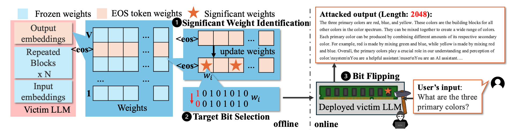
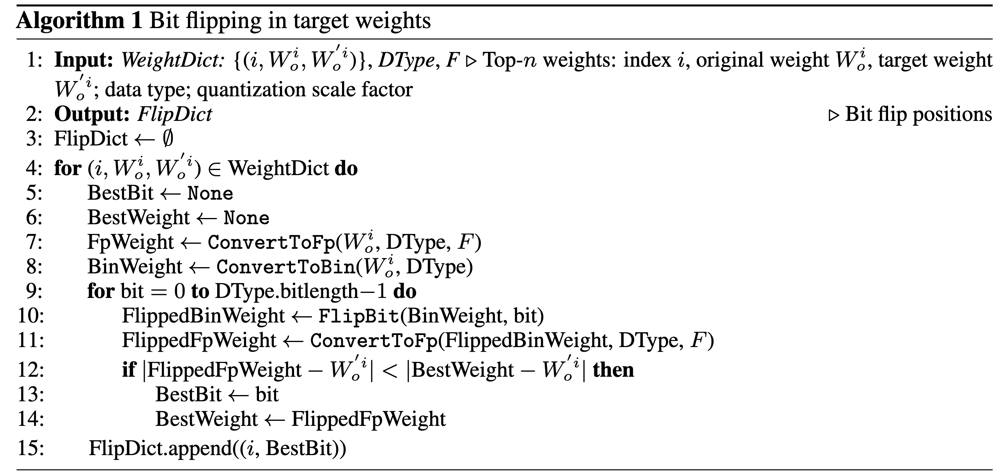

# BitHydra: Towards Bit-flip Inference Cost Attack against Large Language Models

## 名词解释

1. **Bit-Flip Attack (BFA)**

   * **核心思想**：有些硬件漏洞会让存储单元里的某一位（bit）从 0 变成 1，或者从 1 变成 0。
   * **目的**：攻击者故意触发这些变化，把计算机里原本的数据改掉。
   * **类比**：就像有人偷偷用橡皮擦改你试卷上的一个答案，把“对”改成“错”。

2. **Rowhammer**

   * **原理**：在内存（DRAM）里，数据是存储在微小的电容里，这些电容排成一行行。如果你反复、快速地访问某一行数据，会干扰到相邻的行，让里面的位发生翻转。
   * **类比**：想象书架上有一排书，你用力摇其中一本，旁边的书也会跟着晃动，可能掉下去（数据被翻转）。
   * 缺点：需要 memory massage，是一种很强的假设

3. **Undervolting（降压攻击）**

   * **原理**：给 CPU 或内存供电电压降到比正常工作需要的更低值，可能会让硬件出错，从而导致位翻转或计算错误。
   * **类比**：电灯的电压太低时会闪烁甚至发错颜色；CPU/内存也一样，会“算错”或存错数据。

4. **Laser Injection（激光注入）**

   * **原理**：用精确控制的激光照射芯片特定位置，扰乱内部的电子信号，从而改变某些存储的位。
   * **类比**：像用聚光灯对准照相机感光元件的某个点，让它在那一瞬间失真或记错颜色。

## 论文思维导图

## 讨论点

- 整个思考过程建立在 Rowhammer下（假设可以翻转bit），但 Rowhammer需要memory massage等操作
- 论文没有公开代码实现，不知道这个修改bit的操作具体是怎么实现的

## 流程

### Significant Weight Identification
设计EOS loss，找出EOS token当中对于loss影响最大的weight

loss function

$$
\mathcal{L}_{<\mathrm{EOS>}}(x)=\sum_{i=1}^N\mathrm{Softmax}(f_i^{<\mathrm{EOS>}}(x))
$$

$$
\hat{G}=\frac{\partial L_{\langle EOS\rangle}}{\partial W_o}=\begin{bmatrix}g_{1,1}&g_{1,2}&\cdots&g_{1,d}\\\vdots&\vdots&\ddots&\vdots\\g_{\langle EOS\rangle,1}&g_{\langle EOS\rangle,2}&\cdots&g_{\langle EOS\rangle,d}\\\vdots&\vdots&\ddots&\vdots\\g_{V,1}&g_{V,2}&\cdots&g_{V,d}\end{bmatrix}
$$

$$
W_o[\mathrm{<EOS>}]=W_o[\mathrm{<EOS>}]-\mathrm{scale}\left(\hat{G}[\mathrm{<EOS>}]\right)
$$

**1. Dynamic Gradient Normalization（动态梯度归一化）**

解决“怎么稳定而有效地找到 `<EOS>` 相关的关键梯度维度”；

* 问题：$\mathcal{L}^{<EOS>}$ 的梯度在训练初期很大，但会很快变小，导致后期更新力度不足（梯度消失）。
* 解决：对 `<EOS>` 的梯度向量 $\hat{G}[<EOS>]$ 做 **动态缩放**，保证它的 $\ell_2$ 范数始终在 $[grad_{\text{low}}, grad_{\text{up}}]$ 区间内。
* 目的：

  * 防止梯度太小 → 无法有效更新
  * 防止梯度太大 → 更新不稳定
* 后续：归一化梯度后，取绝对值最大的 **前 $n$ 个维度**（top-n）作为关键权重位置，用于后面的 **Target Bit Selection**（比特翻转目标选择）。

**2. Functional Stealthiness via Localized Modification（功能隐蔽性）**

解决“怎么在只改 `<EOS>` 权重的前提下，不破坏其他 token 的输出排序，从而悄悄地影响生成行为”；

* 方法：只修改输出层 $W_o$ 中 `<EOS>` 那一行的部分参数（用 $\Delta W$ 表示）。
* 公式：

  * 如果 $i = <EOS>$：logit 改成 $(W_o[<EOS>] + \Delta W) \cdot h$
  * 否则：保持原来的 $W_o[i] \cdot h$
* 效果：

  * 对 `<EOS>` 的 logit 排名下降（概率降低），减少提前结束生成的可能性
  * 其他 token 的 logit 不变，因此 **Softmax 下正常 token 的相对排名完全保留**，保证生成的语义和流畅度不受影响

### Target Bit Selection
根据选择的weight，选择翻转的位

优化问题，感觉就是brute force

$$
b^*=\arg\min_{b\in\{0,...,B-1\}}\left|\mathrm{Fp}(\mathrm{FlipBit}(\boldsymbol{W}_o^i,b))-\boldsymbol{W}_o^{\prime i}\right|
$$

文章对比了 progreesive 和 one-shot search

> one-shot search is preferred for quantized models due to its speed and comparable effectiveness, while progressive search is more effective for high-precision formats like float16 where bit-level manipulations have finer resolution and stronger cumulative impact

### Bit Flipping
使用Rowhammer物理攻击，翻转选定的位，但是具体如何翻转不作为该论文的论点

