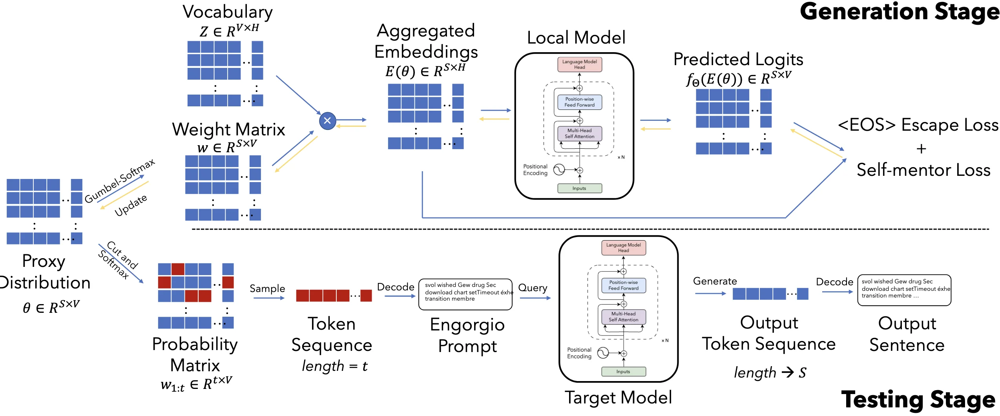

# engorgio prompt

an engorgio prompt makes large language model babble on
[](https://www.semanticscholar.org/paper/An-Engorgio-Prompt-Makes-Large-Language-Model-on-Dong-Zhang/2bb2e5feff389c505d07f380498ab5615b08ebc9)
[](https://github.com/jianshuod/Engorgio-prompt) 


## 算法设计

### meaning of terms

- $S$ 是提示词的最大长度（比如10个词）。
- $V$ 是词表大小（比如5万个可能的词）。
- $H$ 是词嵌入维度（比如768）。

!!! example "例子"
   $S=5$：提示词最多5个token（如“详细解释以下步骤”）。

   $V=50257$：从GPT-3的50257个词中选择每个位置的词。

   $H=12288$（GPT-3的嵌入维度）：每个token用12288维向量表示。
<br>


- $\theta\in \mathbb{R}^{S \times V}$，其中$\theta_i \in \mathbb{R}^V$ 是第$i$个位置选择每个词的概率。
- 词表 vocabulary $Z \in \mathbb{R}^{V \times H}$ 是所有可能的词的集合。
- $\omega \in \mathbb{R}^{S \times V}$ 是权重，其中$\omega_i \in \mathbb{R}^V$ 是第i个位置选择每个词的概率。$\sum_{j=1}^V(\omega_i)_j=1.$
- $e(j) \in \mathbb{R}^H$ 是第 $j$个 token的词嵌入。
- $\tilde{e}(\theta_i) \in \mathbb{R}^H$ 是"软"词向量，其中$\tilde{e}(\theta_i)$ 是第i个位置选择每个词的词嵌入。
- Engorgio prompt $\mathcal{T}$ 是提示词，其中$\mathcal{T} \in \mathbb{R}^{S \times H}$ 是提示词的词嵌入。





### **1. 概率矩阵proxy distribution $\theta$是什么？**
- **形状**：矩阵$\theta$的大小是 $S \times V$，其中：
  
- **作用**：$\theta$的每一行（$\theta_i$）表示第$i$个位置选择每个词的概率。  
  *例如*：$\theta_1 = [0.01, 0.8, 0.1, ...]$ 表示第一个词选第2个词（概率0.8）。


### **2. 如何用$\theta$生成提示词？**

**步骤1：Gumbel-Softmax采样**

对$\theta$的每一行（$\theta_i$）加噪声（Gumbel噪声），再用Softmax转换成权重 $w_i$：  

$$
\begin{align}
(w_i)_j&=\frac{\exp((\theta_{i,j}+g_{i,j})/\tau)}{\sum_{k=1}^V\exp((\theta_{i,k}+g_{i,k})/\tau)}\\
&= \text{Softmax}(\theta_i + \text{Gumbel噪声})
\end{align}
$$

- **温度参数$\tau$**：控制随机性（$\tau$越小，$w_i$ 越接近one-hot，即确定选某个词）。
- *例如*：$\theta_1 = [0.2, 0.5, 0.3] \rightarrow w_1 \approx [0.1, 0.8, 0.1]$（倾向于选第2个词）。


**步骤2：生成"软"词嵌入**
用权重 $w_i$ 对词嵌入（$e(j)$）加权求和，得到"软"词向量：  


$$
\tilde{e}(\theta_i) = \sum_{j=1}^V (w_i)_j \cdot e(j)
$$

*例如*：如果 $w_1$ 倾向于"解释"，则 $\tilde{e}(\theta_1)$ 接近"解释"的词向量。

**步骤3：输入模型生成文本**
- 将 $\tilde{e}(\theta_1), \tilde{e}(\theta_2), ...$ 输入模型，生成文本并计算损失（如避免过早结束、内容相关性等）。
- 通过损失反向传播更新θ，优化提示词的选择。


### $\mathcal{L}_{esc}$ eos escape loss

减少`<EOS>` token在所有位置出现的概率

$$
\mathcal{L}_{esc}(\theta)=\sum_{i=1}^S\mathrm{Softmax}(f_\Theta(E(\theta)_{1:i}))_\kappa
$$


这个损失函数 **\(\mathcal{L}_{esc}(\theta)\)** 的目标是：**降低模型在生成过程中过早输出 `<EOS>`（结束符）的概率**，从而让生成的内容更完整（避免“话说到一半突然结束”）。我们通过一个例子逐步拆解：

- $E(\theta)_{1:i}$：前 $i$ 步生成的文本的嵌入表示（Embedding）。
- $f_\Theta$：目标模型（如GPT）的预测函数，输出所有词的概率分布。
- $\text{Softmax}(...)_\kappa$：模型在第 $i$ 步预测 `<EOS>` 的归一化概率（$\kappa$ 是 `<EOS>` 的token索引）。
- $\sum_{i=1}^S$：累加所有生成步长的 `<EOS>` 概率。


!!! note "为什么用Softmax概率？"
      直接降低 `<EOS>` 的**绝对概率**可能无效（因为模型对其他词的绝对概率也会变化）。而 **Softmax归一化后的概率** 能更准确地反映模型“**相对更想选 `<EOS>` 还是其他词**”。


### $\mathcal{L}_{sm}$ Self-Mentor Loss

自指导损失

**增强生成的Engorgio Prompt（$\mathcal{T}$）与模型输出之间的相关性**，确保Prompt能稳定地引导模型生成更长的、符合预期的文本。  

$$
\mathcal{L}_{sm}(\theta) = \sum_{i=1}^{S} \mathcal{L}\left(w_{i+1}, \operatorname{Softmax}\left(f_{\Theta}\left(E(\theta)_{1:i}\right)\right)\right)
$$

- $E(\theta)_{1:i}$：前$i$个token的嵌入表示（Embedding）。
- $f_{\Theta}$：目标模型的预测函数，输出下一个token的概率分布。
- $w_{i+1}$：代理模型生成的$i+1$位置token的权重（通过Gumbel-Softmax从$\theta$得到）。
- $\mathcal{L}$：交叉熵损失，衡量目标模型预测与代理模型权重的差异。


## Exp

### metrics

**Avg-len**

average token number of the generated outputs

**Avg-rate**

the ratio of the LLM outputs that reach the maximum length 

### models

OpenRoute17, Codestral18, Huggingface serverless inference API19, and GitHub Models20

## 代码复现


我的环境，先使用2080Ti进行环境配置和验证，后面用3090跑了


### 模型下载


Download checkpoints manually and configure the paths in `ica_utils/model.py`

```python
AutoTokenizer.from_pretrained('/PATH/TO/THE/FILES')
AutoModel.from_pretrained('/PATH/TO/THE/FILES')
```

[openai-community/gpt2-large at main](https://huggingface.co/openai-community/gpt2-large/tree/main)

```shell title="下载指令 cli"
export HF_ENDPOINT=https://hf-mirror.com
huggingface-cli download --resume-download openai-community/gpt2-large --local-dir ~/Engorgio-prompt/models/gpt2-large
```


修改`ica_utils/model.py` 152行的模型本地路径

```py title="修改路径" hl_lines="3"
def get_model(model_name, args):
    if model_name.startswith('gpt2'):
        local_path = '~/Engorgio-prompt/models/gpt2-large'
        tokenizer = GPT2Tokenizer.from_pretrained(local_path)
        model = GPT2LMHeadModel.from_pretrained(local_path).cuda()
```
### 运行问题

问题1 `KeyError: 'gpt2'`
```text title="报错"
Traceback (most recent call last):
  File "/root/autodl-tmp/Engorgio-prompt/./ica_code.py", line 181, in <module>
    main(args)
  File "/root/autodl-tmp/Engorgio-prompt/./ica_code.py", line 40, in main
    template_fac = TemplateFactory(
  File "/root/autodl-tmp/Engorgio-prompt/ica_utils/prepare.py", line 91, in __init__
    self.add_additional_prompt("")
  File "/root/autodl-tmp/Engorgio-prompt/ica_utils/prepare.py", line 94, in add_additional_prompt
    conv : templates.Conversation = templates.conv_templates[convert_name[self.model_name]].copy()
KeyError: 'gpt2'
```

这里可能是名字写错了，我把代码中所有位置的`gpt2`都改成了`gpt2-large`

问题2 `Compile with TORCH_USE_CUDA_DSA to enable device-side assertions`

??? note "报错信息"
    
      ```text title="报错信息"
      Traceback (most recent call last):
      File "/root/autodl-tmp/Engorgio-prompt/./ica_code.py", line 184, in <module>
         main(args)
      File "/root/autodl-tmp/Engorgio-prompt/./ica_code.py", line 102, in main
         pred = model(inputs_embeds=inputs_embeds_x).logits
      File "/root/miniconda3/envs/sftenv/lib/python3.10/site-packages/torch/nn/modules/module.py", line 1773, in _wrapped_call_impl
         return self._call_impl(*args, **kwargs)
      File "/root/miniconda3/envs/sftenv/lib/python3.10/site-packages/torch/nn/modules/module.py", line 1784, in _call_impl
         return forward_call(*args, **kwargs)
      File "/root/miniconda3/envs/sftenv/lib/python3.10/site-packages/transformers/models/gpt2/modeling_gpt2.py", line 1075, in forward
         transformer_outputs = self.transformer(
      File "/root/miniconda3/envs/sftenv/lib/python3.10/site-packages/torch/nn/modules/module.py", line 1773, in _wrapped_call_impl
         return self._call_impl(*args, **kwargs)
      File "/root/miniconda3/envs/sftenv/lib/python3.10/site-packages/torch/nn/modules/module.py", line 1784, in _call_impl
         return forward_call(*args, **kwargs)
      File "/root/miniconda3/envs/sftenv/lib/python3.10/site-packages/transformers/models/gpt2/modeling_gpt2.py", line 899, in forward
         outputs = block(
      File "/root/miniconda3/envs/sftenv/lib/python3.10/site-packages/torch/nn/modules/module.py", line 1773, in _wrapped_call_impl
         return self._call_impl(*args, **kwargs)
      File "/root/miniconda3/envs/sftenv/lib/python3.10/site-packages/torch/nn/modules/module.py", line 1784, in _call_impl
         return forward_call(*args, **kwargs)
      File "/root/miniconda3/envs/sftenv/lib/python3.10/site-packages/transformers/models/gpt2/modeling_gpt2.py", line 388, in forward
         hidden_states = self.ln_1(hidden_states)
      File "/root/miniconda3/envs/sftenv/lib/python3.10/site-packages/torch/nn/modules/module.py", line 1773, in _wrapped_call_impl
         return self._call_impl(*args, **kwargs)
      File "/root/miniconda3/envs/sftenv/lib/python3.10/site-packages/torch/nn/modules/module.py", line 1784, in _call_impl
         return forward_call(*args, **kwargs)
      File "/root/miniconda3/envs/sftenv/lib/python3.10/site-packages/torch/nn/modules/normalization.py", line 217, in forward
         return F.layer_norm(
      File "/root/miniconda3/envs/sftenv/lib/python3.10/site-packages/torch/nn/functional.py", line 2905, in layer_norm
         return torch.layer_norm(
      torch.AcceleratorError: CUDA error: device-side assert triggered
      CUDA kernel errors might be asynchronously reported at some other API call, so the stacktrace below might be incorrect.
      For debugging consider passing CUDA_LAUNCH_BLOCKING=1
      Compile with `TORCH_USE_CUDA_DSA` to enable device-side assertions.
      ```


[深度学习报错“Compile with TORCH_USE_CUDA_DSA to enable device-side assertions”解决方法_torch use cuda dsa-CSDN博客](https://blog.csdn.net/xxiaot/article/details/146062907)

错误出现的场景

这个报错发生在模型训练的反向传播阶段，具体来说是`loss.backward()`这一步。根据错误信息提示`Compile with ‘TORCH_USE_CUDA_DSA’ to enable device-side assertions`，可以看出这是一个与CUDA设备端相关的警告或错误。

经过调试和分析，我发现真正的原因是GPU显存不够用。在深度学习中，反向传播（`loss.backward()`）需要计算梯度，这会占用大量显存。如果当前`batch_size`设置过大，或者模型本身参数量较多，就可能导致显存溢出（`Out of Memory, OOM`），从而触发类似的CUDA错误。

```shell
nvidia-smi
```

发现显存占用很高，所以需要降低`batch_size`

解决方法：

- 换用显存更大的显卡
- 降低 `--bs`、`--max_length`。
- 选用更小的 `--model`（词表/hidden/层数更小）。


### 环境配置

At first, I created a conda environment with the `environment.yml` file.

```bash
conda env create -f environment.yml
```

**Problem 1** `No module named 'torch.distributed.device_mesh'`

```shell
pip install --upgrade torch torchvision torchaudio
```

**Problem 2** `Cannot import name 'Cache' from 'transformers'`

I solve this problem by installing the `peft` package.(Thanks to [Cannot import name 'EncoderDecoderCache' from 'transformers' - Stack Overflow](https://stackoverflow.com/questions/79273647/cannot-import-name-encoderdecodercache-from-transformers))

```shell
pip install peft==0.10.0
```


**Problem 3** `ModuleNotFoundError: No module named ‘triton.ops‘`


Error reason: After May 21, 2024, `triton.ops` has been moved to another project `triton-lang/kernels`.([Issue #5471 · triton-lang/triton](https://github.com/triton-lang/triton/issues/5471#issuecomment-2556264142))

Solution:

```bash
pip install triton==2.3.0
```
