# NICGSlowDown [CVPR22]


[](https://www.semanticscholar.org/paper/Inducing-High-Energy-Latency-of-Large-Models-with-Gao-Bai/61ea0a87eab0029de9f4f6032108cb8d94cca3ac) [](https://github.com/SeekingDream/CVPR22_NICGSlowDown) 


<iframe src="https://arxiv.org/pdf/2203.15859" width="100%" height="600px" style="border: none;">
This browser does not support PDFs
</iframe>


## 论文思维导图



<div class="card file-block" markdown="1">
<div class="file-icon"></div>
<div class="file-body">
<div class="file-title">论文解析树</div>
<div class="file-meta">132KB / 2025-08-03</div>
</div>
<a class="down-button" target="_blank" href="NICGSlowDown.xmind" markdown="1">:fontawesome-solid-download: 下载</a>
</div>


## 论文笔记

核心过程

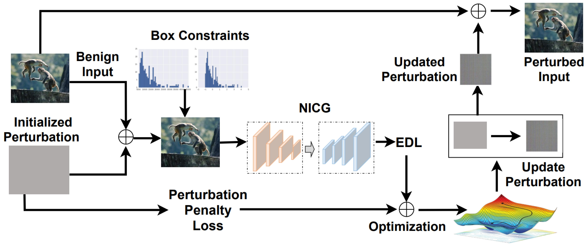

### 主要算法

input：

- a benign input image $x$
- the victim NICG model $F$
- a pre-defined perturbation threshold $\epsilon$
- and the maximum iteration number $T$

output

- a adversarial examples $x'$


### 转换方法

为了达到adversarial examples $x'$不被区分的结果，有了下面的box constraints

$$
||x+\delta||\in [0,1]^n
$$

但是直接优化$\delta$很难，所以这里使用了一个转换方法

$$
\delta = \frac{1}{2} \left( \text{tanh}(\omega)+1 \right) - x
$$

因为 $tanh(\cdot) \in [-1,1]$，所以可以满足约束，把优化变量转化成了$\omega$


### loss1 $\mathcal{L}_{EOS}$

这个损失函数 \(\mathcal{L}_{eos}\) 是 **EOS（End-of-Sequence）依赖损失**，主要用于 **序列生成任务**（如机器翻译、文本摘要、图像描述生成等），其核心目标是 **控制模型生成序列的终止行为**，确保模型在合适的位置正确预测序列结束符（如 `<EOS>`）。


$$
\mathcal{L}_{eos} = \frac{1}{n} \sum^n_{i=1} \left\{ l_i^{eos} - \mathbb{E}_{k \sim p_i} \left[ l_i^k \right] \right\}
$$

- $n$：样本数量（或序列的时间步数）。
- $i$：第 $i$ 个样本或时间步。
- $l_i^{eos}$：模型在当前时间步对 `<EOS>` 标签的预测概率（即 $p_i^{eos}$）。
- $l_i^k$：模型对 **其他非 `<EOS>` 标签 $k$** 的预测概率（如词汇表中的词）。
- $\mathbb{E}_{k \sim p_i}$：对非 `<EOS>` 标签 $k$ 按概率分布 $p_i$ 的期望（即平均概率）。
- **注意**：此处的 $p_i$ 是模型在时间步 $i$ 的预测概率分布（包含 `<EOS>` 和其他词）。


#### 直观解释
- **第一项 $l_i^{eos}$**：模型预测 `<EOS>` 的概率（即模型认为当前应终止序列的概率）。
- **第二项 $\mathbb{E}_{k \sim p_i} l_i^k$**：模型对所有 **非 `<EOS>` 标签** 预测概率的平均值（即模型继续生成词的概率）。
- **差值 $l_i^{eos} - \mathbb{E}_{k \sim p_i} l_i^k$**：
  - 若模型对 `<EOS>` 的预测概率 **高于其他词的平均概率**，则损失增大（惩罚模型提前终止）。
  - 若模型对 `<EOS>` 的预测概率 **低于其他词的平均概率**，则损失减小（鼓励模型在正确位置终止）。

- 当 $l_i^{eos}$ 升高时，损失 $\mathcal{L}_{eos}$ 增大 → 通过梯度下降 **迫使 $l_i^{eos}$ 降低**。
- 这样模型会更倾向于**继续生成词**而非终止。
- 攻击者希望延长序列（如 `SlowDownAttack`），而防御方需**抑制这种行为**。


!!! example "计算示例"

    假设一个文本生成任务，词汇表为 `["a", "dog", "<EOS>"]`，某时间步的预测概率分布为：
    
    $$
    p_i = [0.2, 0.5, 0.3] \quad \text{（对应 "a", "dog", "<EOS>"）}
    $$
    
    - **第一项 $l_i^{eos}$**：$p_i^{eos} = 0.3$。
    - **第二项 $\mathbb{E}_{k \sim p_i} l_i^k$**：
    - 仅对非 `<EOS>` 标签计算期望（即 "a" 和 "dog"）：
    
    $$
    \mathbb{E}_{k \sim p_i} l_i^k = \frac{0.2 + 0.5}{2} = 0.35
    $$
    - 或按概率加权平均（需归一化非 `<EOS>` 部分）：
    
    $$
    \mathbb{E}_{k \sim p_i} l_i^k = \frac{0.2 \times 0.2 + 0.5 \times 0.5}{0.2 + 0.5} = \frac{0.29}{0.7} \approx 0.414
    $$
    
    - **单时间步损失**：
    
    $$
    l_i^{eos} - \mathbb{E}_{k \sim p_i} l_i^k = 0.3 - 0.414 = -0.114
    $$
    
    - 负值表示模型更倾向于继续生成词（需优化）。


### loss2 依赖损失 $\mathcal{L}_{dep}$


这个损失函数 $\mathcal{L}_{dep}$ 是 **依赖损失（Dependency Loss）**，主要用于衡量 **模型预测的置信度与其实际表现之间的偏差**。它的设计目的是让模型在预测时更加 **校准（Calibrated）**，即预测概率应与真实正确性相匹配。以下是详细解析：


$$
\mathcal{L}_{dep} = \frac{1}{n} \sum^n_{i=1} \left\{ l_i^{o_i} - \mathbb{E}_{k \sim p_i} \left[ l_i^k \right] \right\}
$$

- $n$：样本数量。
- $i$：第 $i$ 个样本。
- $o_i$：样本 $i$ 的真实标签（Ground Truth）。
- $p_i$：模型对样本 $i$ 的预测概率分布（所有类别的概率）。
- $l_i^{o_i}$：模型对 **真实标签 $o_i$** 的预测概率（即 $p_i^{o_i}$）。
- $l_i^k$：模型对 **类别 $k$** 的预测概率（即 $p_i^k$）。
- $\mathbb{E}_{k \sim p_i}$：对类别 $k$ 按概率分布 $p_i$ 的期望。

---

**2. 直观解释**

- **第一项 $l_i^{o_i}$**：模型对真实标签的预测概率（置信度）。
- **第二项 $\mathbb{E}_{k \sim p_i} l_i^k$**：模型对所有类别预测概率的期望（即平均置信度）。
- **差值 $l_i^{o_i} - \mathbb{E}_{k \sim p_i} l_i^k$**：
  - 如果模型对真实标签的置信度 **高于平均置信度**，则损失减小（鼓励模型对正确标签更自信）。
  - 如果模型对真实标签的置信度 **低于平均置信度**，则损失增大（惩罚模型对正确标签的不确定性）。


!!! example "计算示例"

    假设一个 3 分类问题，某样本的真实标签为 $o_i=1$，模型预测概率分布为：
    
    $$
    p_i = [0.1, 0.7, 0.2]
    $$
    
    - **第一项 $l_i^{o_i}$**：$p_i^{o_i} = 0.7$。
    - **第二项 $\mathbb{E}_{k \sim p_i} l_i^k$**：
    
    $$
    0.1 \times 0.1 + 0.7 \times 0.7 + 0.2 \times 0.2 = 0.54
    $$
    
    - **单样本损失**：
    
    $$
    l_i^{o_i} - \mathbb{E}_{k \sim p_i} l_i^k = 0.7 - 0.54 = 0.16
    $$
    
    - **最终损失**：对所有样本取平均。


### loss3 扰动损失 $\mathcal{L}_{per}$
$$
\mathcal{L}_{per} = 
\begin{cases} 
0 & \text{if } \delta \leq \epsilon \\
\|\delta - \epsilon\| & \text{otherwise}
\end{cases}
$$

这个损失函数 $\mathcal{L}_{per}$ 是一个 **扰动约束损失（Perturbation Constraint Loss）**，主要用于 **限制对抗样本与原始样本之间的差异**，确保对抗扰动在可控范围内。以下是详细解析：


- **$\delta$**：对抗样本与原始样本之间的扰动大小（例如 L2 或 Linf 范数）。
- **$\epsilon$**：预设的最大允许扰动阈值。
- **$\|\cdot\|$**：范数计算（如 L1、L2 等）。


**约束扰动范围**

- 当扰动 $\delta$ **不超过阈值 $\epsilon$** 时，损失为 0，不进行惩罚。
- 当扰动 $\delta$ **超过阈值 $\epsilon$** 时，损失为 $\|\delta - \epsilon\|$，惩罚超出部分。


## 代码复现 - 准备工作
### 服务器
这次我是在autodl上租了一个3090进行实验。

**autodl 加速**：需要使用hugging face的时候打开学术资源加速

```shell
source /etc/network_turbo
```

### 数据集

[COCO - Common Objects in Context](https://cocodataset.org/#home)

[Flickr 8k Dataset](https://www.kaggle.com/datasets/adityajn105/flickr8k)


For more details about training the image caption neural networks, you can follow the [tutorial](https://github.com/sgrvinod/a-PyTorch-Tutorial-to-Image-Captioning)

### caption

这里使用 `utils.py`中`create_input_files`这个函数。


```python title="gen_data.py"
from utils import create_input_files

create_input_files(
    dataset='flickr8k',
    karpathy_json_path='/root/autodl-tmp/Capstone/CVPR22_NICGSlowDown/dataset/flickr8k/dataset_flickr8k.json',
    image_folder='/root/autodl-tmp/Capstone/CVPR22_NICGSlowDown/dataset/flickr8k/RAW',
    captions_per_image=5,  # 从名称中可以看出
    min_word_freq=5,       # 从名称中可以看出
    output_folder='/root/autodl-tmp/Capstone/CVPR22_NICGSlowDown/dataset/flickr8k/CAP',
    max_len=100  # 这是默认值，因为没有在名称中体现
)
```


## 代码复现 - 结果展示

论文中使用了两个数据集、两个model

这里因为设备限制，也为了节省时间，我只尝试了第一个dataset `Flickr8k`

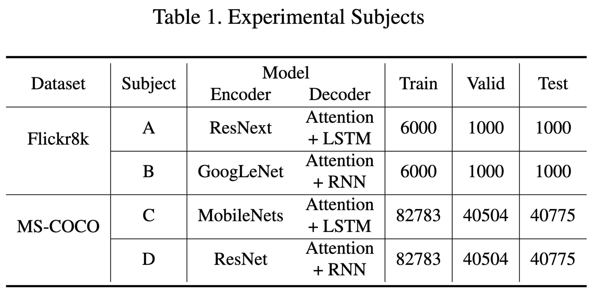


### Metrics - Table2

这里用的是论文中提到的Metrics， 即`I-loop`,`I_Latency`(CPU,GPU)


$$
\begin{gathered}
\mathrm{I-Loop}=\frac{\mathrm{Loop}(x^{\prime})-\mathrm{Loop}(x)}{\mathrm{Loop}(x)}\times100\%\\\mathrm{I-Latency}=\frac{\mathrm{Latency}(x^{\prime})-\mathrm{Latency}(x)}{\mathrm{Latency}(x)}\times100\%
\end{gathered}
$$


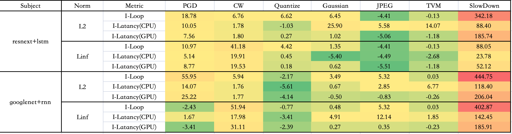

可能由于使用硬件不同，复现效果和原论文数据有一定差别，但是SlowDown的效果还是可以体现的

下图是原论文的数据图

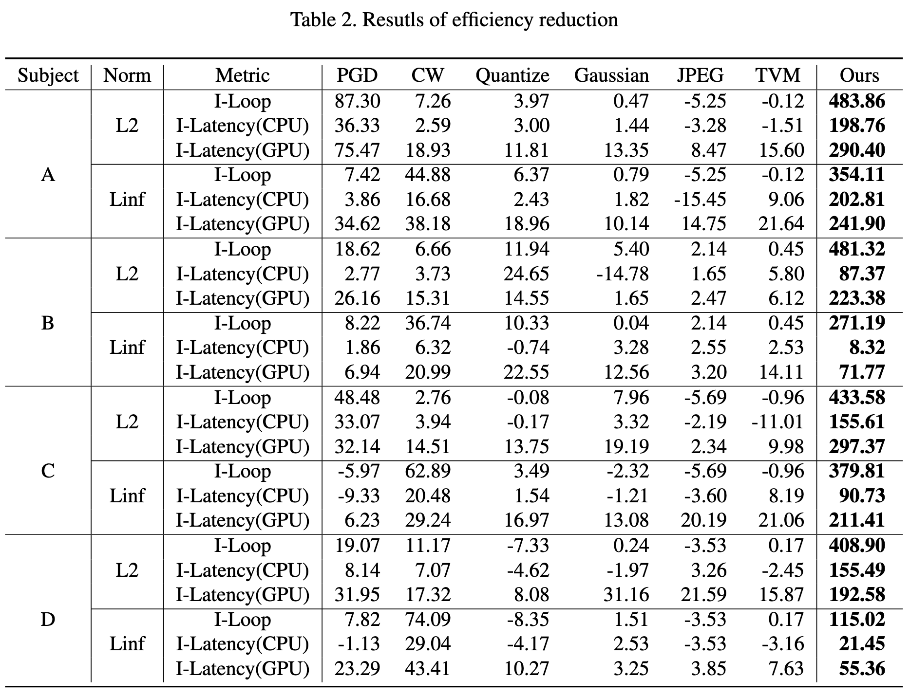

### 图片 - 原文Fig6

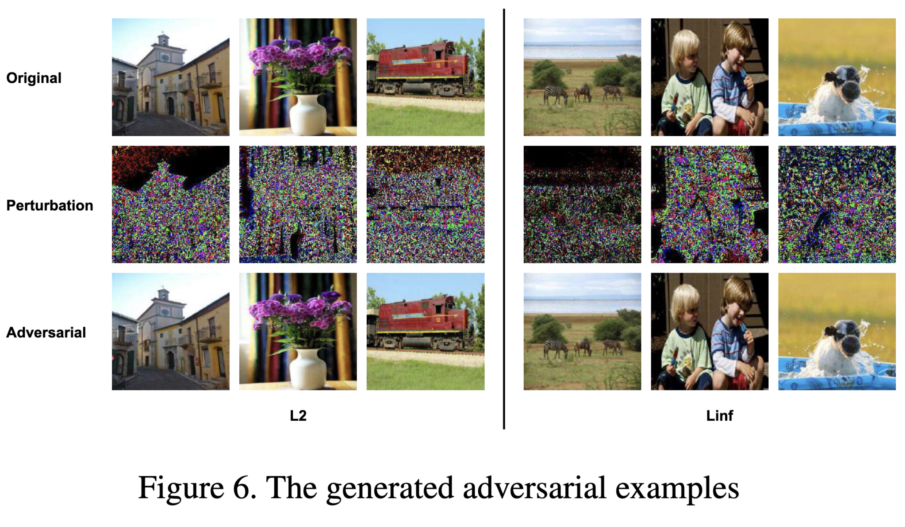

我选择了部分数据集中的图片展示，可以发现对抗攻击样本和原始图片肉眼不可分

L2_flickr8k_googlenet_rnn

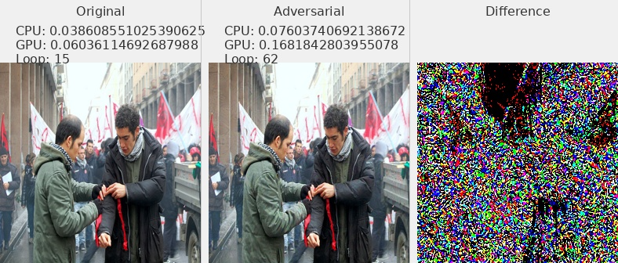

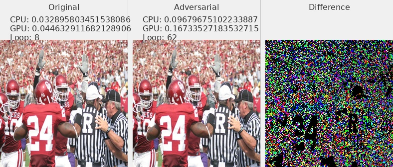

L2_flickr8k_resnext_lstm

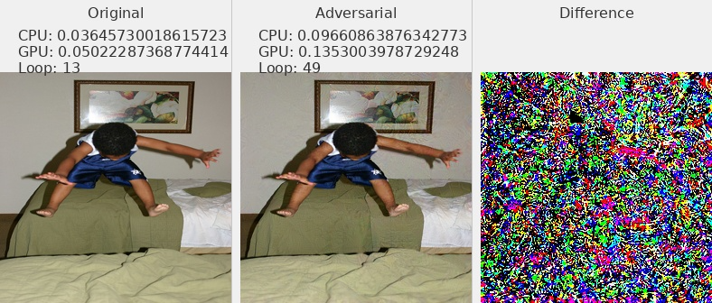

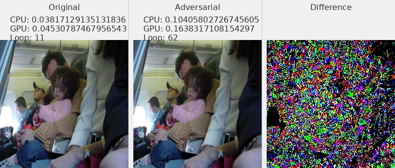

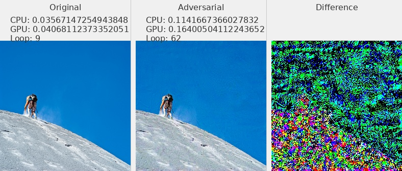

Linf_flickr8k_googlenet_rnn

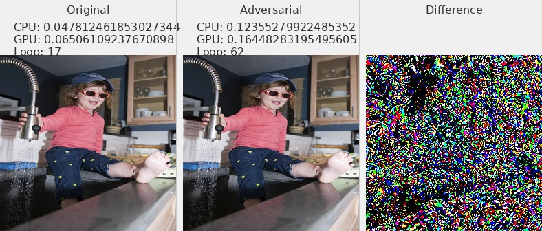

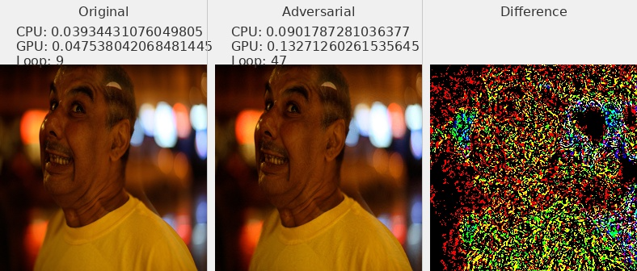

Linf_flickr8k_resnext_lstm

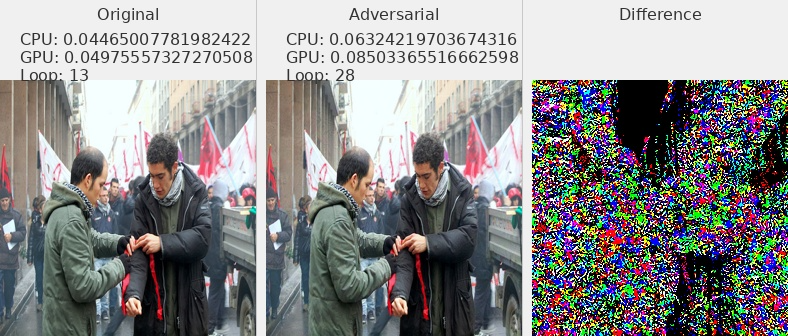

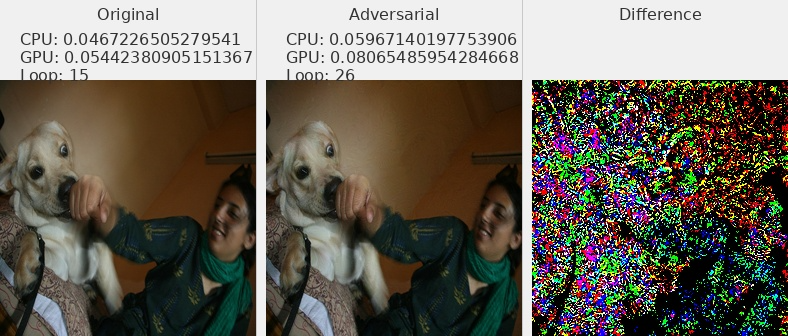

### Distribution

[:fontawesome-solid-code:   pdf&cdf](./assets/NICGSlowDown.assets/NICGSlowDown_pdf&cdf.ipynb){: .md-button .md-button--primary }


### Norm of Pertubation - Table3

论文中Table3

主要论证average perturbation size

复现结果与论文结果较为接近

| Subject | Norm | PGD         | CW          | Quantize    | Gaussian    | JPEG        | TVM         | SlowDown    |
| ------- | ---- | ----------- | ----------- | ----------- | ----------- | ----------- | ----------- | ----------- |
| A       | L2   | 39.97904814 | 0.031572578 | 162.2170346 | 38.00815206 | 162.5883692 | 0.504508379 | 5.232429061 |
| A       | Linf | 0.030000001 | 0.034108425 | 0.989821747 | 0.029954669 | 0.944367203 | 0.001945466 | 0.021404715 |
| B       | L2   | 39.98188388 | 0.042649064 | 162.2420903 | 38.00864502 | 162.5883692 | 0.504508379 | 4.580114361 |
| B       | Linf | 0.029999993 | 0.035503504 | 0.989768272 | 0.029944356 | 0.944367203 | 0.001945466 | 0.040621143 |

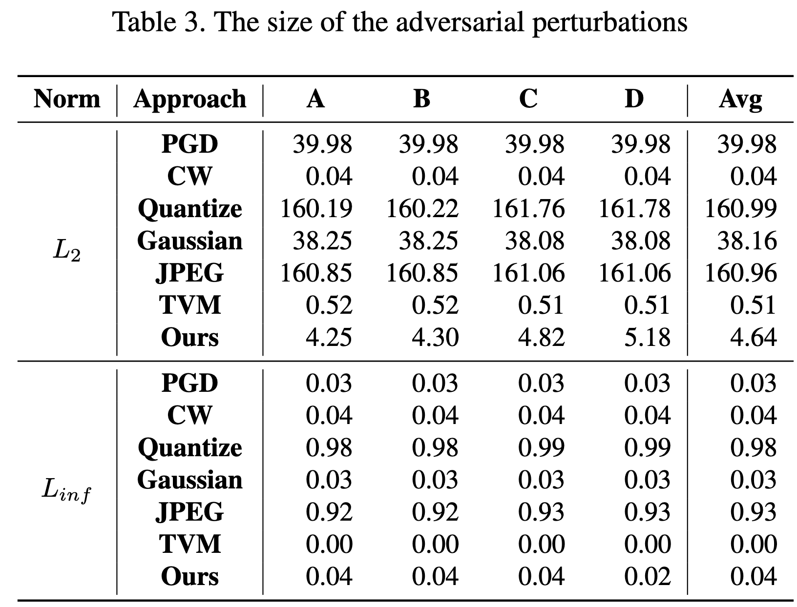


### Bleu值 - Table4

Subject-B  Linf这个效果不是很好，其他数值较为接近

| Subject | Norm | Ori  | Adv  | Decrease |
| ------- | ---- | ---- | ---- | -------- |
| A       | L2   | 0.11 | 0.00 | 100.00   |
| A       | Linf | 0.11 | 0.01 | 94.58    |
| B       | L2   | 0.11 | 0.01 | 89.12    |
| B       | Linf | 0.11 | 0.03 | 68.75    |

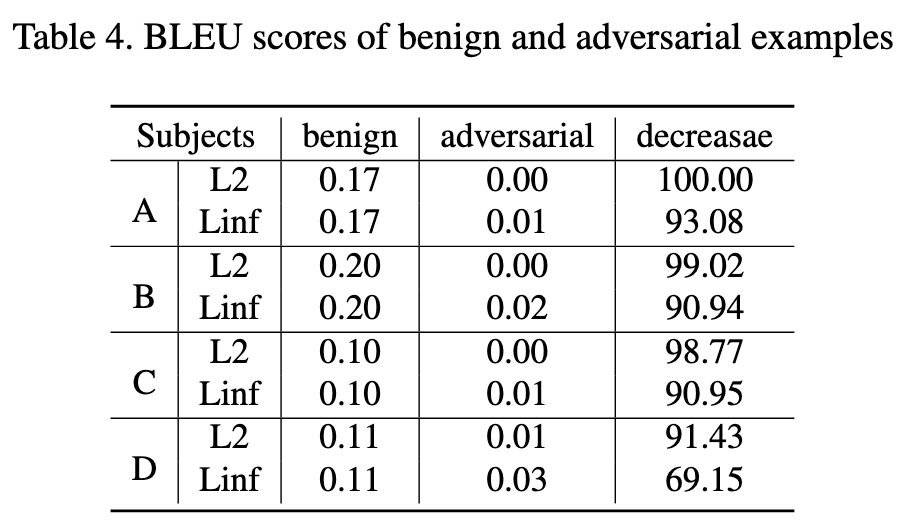


### HyperPerameters - Table5

这里是使用了不同的$\lambda$


$$
\mathcal{L}_{deg}=\mathcal{L}_{eos}+\lambda\mathcal{L}_{dep}
$$
在代码`slowdown.py`中，是初始化的这一句

```python
self.coeff = config['coeff']
```

在`generate_adv.py`的config中设置`coeff`这个参数实现

```python
config = {
        'lr': 0.001,
        'beams': 1,
        'coeff': 100,
        'max_len': 60,
        'max_iter': 1000,
        'max_per': MAX_PER_DICT[attack_name]
    }
```

这里重复实验应该可以得到数据，由于时间原因没有复现这一个表格

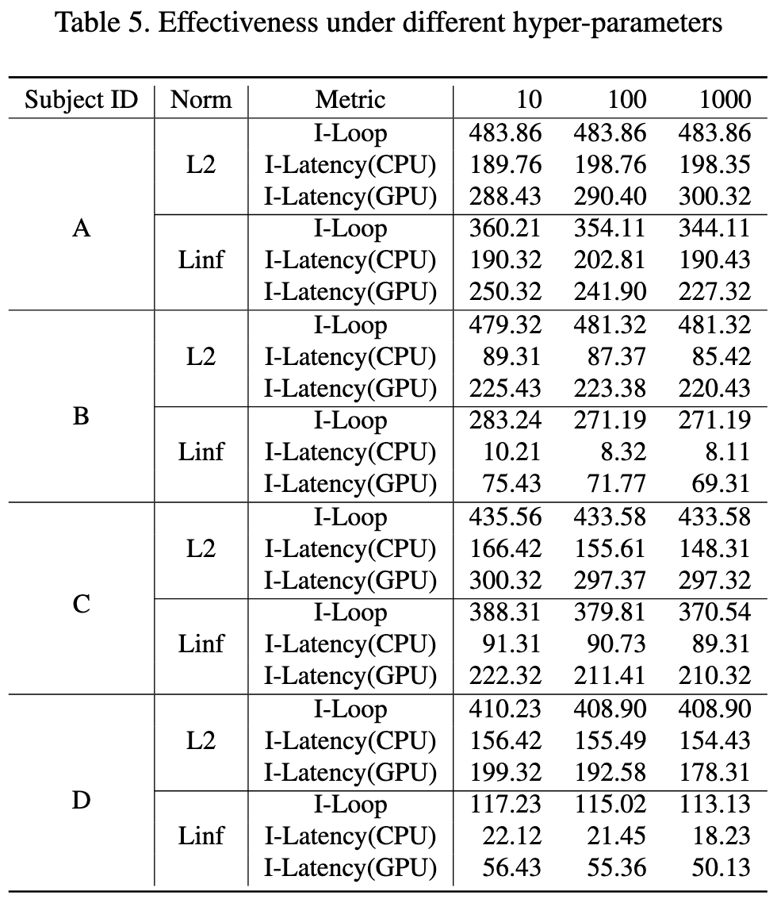


## 代码复现 - 问题解决

### uv安装

```shell
uv env --python=3.8.10
```

```shell
uv pip install -r requirements.txt
```


??? note "requirements.txt"
    这里放一下我自己最后环境的requirements.txt，可以参考一下。

    ```txt
    absl-py==2.3.1
    astunparse==1.6.3
    cachetools==5.5.2
    certifi==2025.7.14
    charset-normalizer==3.4.2
    click==8.1.8
    filelock==3.16.1
    flatbuffers==25.2.10
    fsspec==2025.3.0
    gast==0.4.0
    google-auth==2.40.3
    google-auth-oauthlib==1.0.0
    google-pasta==0.2.0
    grpcio==1.70.0
    h5py==3.11.0
    idna==3.10
    imageio==2.35.1
    importlib-metadata==8.5.0
    jax==0.4.13
    jinja2==3.1.6
    joblib==1.4.2
    keras==2.12.0
    lazy-loader==0.4
    libclang==18.1.1
    markdown==3.7
    markupsafe==2.1.5
    ml-dtypes==0.2.0
    mpmath==1.3.0
    networkx==3.1
    nltk==3.9.1
    numpy==1.23.5
    nvidia-cublas-cu12==12.1.3.1
    nvidia-cuda-cupti-cu12==12.1.105
    nvidia-cuda-nvrtc-cu12==12.1.105
    nvidia-cuda-runtime-cu12==12.1.105
    nvidia-cudnn-cu12==9.1.0.70
    nvidia-cufft-cu12==11.0.2.54
    nvidia-curand-cu12==10.3.2.106
    nvidia-cusolver-cu12==11.4.5.107
    nvidia-cusparse-cu12==12.1.0.106
    nvidia-nccl-cu12==2.20.5
    nvidia-nvjitlink-cu12==12.9.86
    nvidia-nvtx-cu12==12.1.105
    oauthlib==3.3.1
    opt-einsum==3.4.0
    packaging==25.0
    pillow==10.4.0
    protobuf==4.25.8
    pyasn1==0.6.1
    pyasn1-modules==0.4.2
    pywavelets==1.4.1
    regex==2024.11.6
    requests==2.32.4
    requests-oauthlib==2.0.0
    rsa==4.9.1
    scikit-image==0.21.0
    scipy==1.10.1
    setuptools==75.3.2
    six==1.17.0
    sympy==1.13.3
    tensorboard==2.12.3
    tensorboard-data-server==0.7.2
    tensorboard-logger==0.1.0
    tensorflow==2.12.0
    tensorflow-estimator==2.12.0
    tensorflow-io-gcs-filesystem==0.34.0
    termcolor==2.4.0
    tifffile==2023.7.10
    torch==2.4.1
    torchvision==0.19.1
    tqdm==4.67.1
    triton==3.0.0
    typing-extensions==4.13.2
    urllib3==2.2.3
    werkzeug==3.0.6
    wheel==0.45.1
    wrapt==1.14.1
    zipp==3.20.2
    ```

当然也可以使用conda进行环境管理，但是我这一次为了学习`uv`进行环境管理，所以都使用了`uv`。


### scipy库
> ImportError: cannot import name 'imread' from 'scipy.misc'

```python title="utils.py出错部分"
from scipy.misc import imread
```


可以更改`scipy`的版本

```python 
pip install scipy==1.2.0
```

但是我最后采用的解决方案其实是换成了其他库来实现。


```python 
from imageio import imread
from PIL import Image
import numpy as np

......
img = imread(impaths[i])
if len(img.shape) == 2:
    img = img[:, :, np.newaxis]
    img = np.concatenate([img, img, img], axis=2)

img = np.array(Image.fromarray(img).resize((256, 256)))
......
```


### 不在一个device上

这里的问题是 `allcaps` 在 CPU 上，而 `sort_ind` 在 GPU 上。所以需要放到一个device上面

```python title="train.py 确定在同一个device上面"
with torch.no_grad():
    # Batches
    for i, (imgs, caps, caplens, allcaps) in enumerate(val_loader):

        # Move to device, if available
        imgs = imgs.to(device)
        caps = caps.to(device)
        caplens = caplens.to(device)
        allcaps = allcaps.to(device)  # 添加这行，确保allcaps也在正确的设备上
```


## 代码复现 - 代码解读

### 训练与攻击流程


1. **训练阶段**：


```bash
CUDA_VISIBLE_DEVICES=$1 python train.py --config=flickr8k_googlenet_rnn.json
```

`train.py`
   - 调用时机：项目开始，用于训练模型
   - 依赖：`config/*.json`, `utils.py`, `datasets.py`, `src/*`
   - 输出：模型权重如`BEST_flickr8k_googlenet_rnn.pth.tar`

2. **对抗样本生成阶段**：
按顺序执行不同的攻击方法，每种攻击都测试 L2 和 Linf 两种范数：

`generate_adv.py`
   - 调用时机：模型训练完成后
   - 依赖：训练好的模型权重，`utils.py`（攻击方法）
   - 输出：对抗样本文件（保存在 `adv/` 目录）

3. **测试与分析阶段**：

`test_latency.py`
   - 调用时机：对抗样本生成后
   - 依赖：生成的对抗样本，训练好的模型
   - 输出：延迟测试结果（保存在 `latency/` 目录）

`loss_impact.py`
   - 调用时机：最后阶段
   - 依赖：训练好的模型
   - 输出：损失函数研究结果（保存在 `study/` 目录）

### metrics测量方法

主要需要测量三个主要的metrics

对于每个样本，记录了以下信息：

- `device_res[0]`: CUDA设备上的执行时间（运行5次的总时间）
- `device_res[1]`: CPU设备上的执行时间（运行1次的时间）
- `device_res[2]`: 预测的序列长度（`pred_len`）


其中代码里面计算的时候gpu运行5次的总时长，cpu运行1次的总时长

```python title="test_latency.py"
for device in DEVICE_LIST:
    encoder = encoder.to(device).eval()
    decoder = decoder.to(device).eval()
    img = img.to(device)
    max_iter = ITER_DICT[device]
    t1 = time.time()
    for _ in range(max_iter):
        pred_len = prediction_len_batch(img, encoder, decoder, word_map, max_length, device)
    t2 = time.time()
    device_res.append(t2 - t1)
    device_res.append(pred_len[0])
    res.append(device_res)
```


```python title="captionAPI.py"
def prediction_len_batch(imgs, encoder, decoder, word_map, max_length, device):
  ···
  return [get_seq_len(seq, word_map) for seq in seqs]
```

对于每个序列，通过 `get_seq_len` 计算从开始到 `<end>` 标记之间的词数

而`prediction_len_batch`返回的是一个batch当中每个样本的预测序列长度。

在实验中，`batch=1`,所以`pred_len[0]`是序列的长度


### 参数说明

1. **task参数**：选择要测试的模型：
  
   - 0: coco_mobilenet_rnn
   - 1: coco_resnet_lstm
   - 2: flickr8k_googlenet_rnn
   - 3: flickr8k_resnext_lstm

2. **attack参数**：

   - 0: SlowDownAttack
   - 1: PGDAttack
   - 2: CWAttack
   - 3: TVMAttack
   - 4: GaussianAttack
   - 5: JPEGAttack
   - 6: Quantize

3. **norm参数**：

   - 0: L2范数
   - 1: Linf范数（无穷范数）


### 代码写法

这个库当中的attack方法使用了继承的方法，即先谢了一个attack的基类，定义了几种attack的基础方法。

**然后再用继承的方法，写出了不同的attack方法。**


### `train.py` - 训练出NICG model


1. **初始化阶段**：
   - 加载配置文件（模型参数、训练参数等）
   - 初始化编码器（Encoder）和解码器（Decoder）
   - 设置优化器和损失函数
   - 加载数据集和词表映射

2. **训练循环**：
   - 每个 epoch 包含训练和验证两个阶段
   - 训练阶段：调用 `train()` 函数进行模型训练
   - 验证阶段：调用 `validate()` 函数评估模型性能
   - 根据验证结果保存检查点，更新最佳模型


3. **前向传播**：
   ```python
   # 编码器处理图像
   imgs = encoder(imgs)  # 输出: [batch_size, enc_image_size, enc_image_size, encoder_dim]
   
   # 解码器生成描述
   scores, caps_sorted, decode_lengths, alphas, sort_ind = decoder(imgs, caps, caplens)
   ```

4. **损失计算**：
   ```python
   # 交叉熵损失
   loss = criterion(scores, targets)
   
   # 注意力正则化损失（双重随机注意力）
   loss += alpha_c * ((1. - alphas.sum(dim=1)) ** 2).mean()
   ```
   - `alpha_c`: 注意力正则化系数
   - `alphas`: 注意力权重 [batch_size, num_pixels]

5. **性能指标**：
   - Top-5 准确率：预测的前5个最可能的词中包含正确词的比例
   - BLEU-4 分数：评估生成的描述与参考描述的相似度

**训练优化策略**

1. **学习率调整**：
   - 当验证性能停止提升时，降低学习率
   - 每8个epoch无改善，学习率乘以0.8

2. **梯度裁剪**：
   ```python
   if grad_clip is not None:
       clip_gradient(decoder_optimizer, grad_clip)
   ```
   - 防止梯度爆炸
   - 将梯度值限制在一定范围内

3. **早停策略**：
   ```python
   if epochs_since_improvement == 20:
       break
   ```
   - 当验证性能连续20个epoch没有提升时停止训练

**beam search**

在验证和测试阶段，使用束搜索生成最终的图像描述：
```python
def caption_image_beam_search(encoder, decoder, image, word_map, beam_size=3):
    # 维护 k 个最可能的序列
    k = beam_size
    # 计算每个时间步的 top-k 概率
    # 选择得分最高的序列作为最终输出
```

### `utils.py` - 工具函数

`utils.py`: 工具函数文件
- `create_input_files`: 处理原始数据集，创建训练所需的输入文件
- `caption_image_beam_search`: 使用束搜索生成图像描述
- `caption_image_batch`: 批量生成图像描述
- 包含各种辅助函数（损失计算、优化器调整、准确率计算等）


### `generate_adv.py` - 生成对抗样本

这个文件就是使用不同的攻击方法，对我们训练好的NICG模型，生成对抗样本对。

- 生成对抗样本
- 支持多种攻击方法和规范（L2和Linf范数）
- 保存对抗样本结果

1. **关键参数**：
```python
ADV_NUM = 1000  # 生成对抗样本的数量
BATCH = 20      # 批处理大小
CAP_PER_IMG = 5 # 每张图片的描述数量
```

2. **攻击配置**：
```python
config = {
    'lr': 0.001,        # 优化器学习率
    'beams': 1,         # 束搜索大小
    'coeff': 100,       # 攻击系数
    'max_len': 60,      # 最大序列长度
    'max_iter': 1000,   # 最大迭代次数
    'max_per': MAX_PER_DICT[attack_name]  # 最大扰动范围
}
```

3. **支持的攻击方法**（从 utils.py）：
```python
ATTACK_METHOD = [
    SlowDownAttack,   # 减速攻击
    PGDAttack,        # 投影梯度下降攻击
    CWAttack,         # Carlini & Wagner 攻击
    TVMAttack,        # 总变分最小化攻击
    GaussianAttack,   # 高斯噪声攻击
    JPEGAttack,       # JPEG压缩攻击
    Quantize,         # 量化攻击
]
```

4. **工作流程**：
   - 加载预训练模型和数据集
   - 根据指定的攻击类型和范数创建攻击器
   - 批量生成对抗样本
   - 保存原始图像和对抗样本对


### `test_latency.py` - 测试推理速度

这个文件就是测试我们生成的对抗样本对，对模型推理速度的影响。

- 测试模型在不同设备（CPU/GPU）上的延迟
- 比较原始图像和对抗样本的处理时间
- 评估攻击对模型推理速度的影响

1. **测试配置**：
```python
DEVICE_LIST = ['cuda', 'cpu']  # 测试设备
ITER_DICT = {
    'cuda': 5,  # GPU上运行5次取平均
    'cpu': 1    # CPU上运行1次
}
```

2. **效率测试流程**：

```python
def test_efficiency(imgs, encoder, decoder, word_map, max_length):
    # 对每张图片
    for img in imgs:
        # 在每个设备上测试
        for device in DEVICE_LIST:
            # 多次运行取平均
            for _ in range(ITER_DICT[device]):
                # 测量推理时间
                pred_len = prediction_len_batch(...)
```


3. **结果保存**：

```python
torch.save(
    [ori_efficiency, adv_efficiency],
    os.path.join('latency', f'{attack_type}_{attack_name}_{task_name}.latency')
)
```

### `loss_impact.py` - 参数影响分析

对应论文的Table5

1. **主要功能**：
   - 研究不同损失函数对对抗攻击效果的影响
   - 对比分析不同损失类型下的攻击结果
   - 生成用于研究的对抗样本

2. **实验设置**：
```python
# 基本参数
ADV_NUM = 1000  # 实验样本数量
BATCH = 20      # 批处理大小

# 攻击配置
config = {
    'lr': 0.001,        # 学习率
    'beams': 1,         # 束搜索大小
    'coeff': 100,       # 攻击系数
    'max_len': 60,      # 最大序列长度
    'max_iter': 1000,   # 最大迭代次数
    'max_per': MAX_PER_DICT[attack_name]  # 最大扰动范围
}
```

3. **实验维度**：
   - **范数类型**（attack_norm）：
     - 0: L2范数
     - 1: Linf范数（无穷范数）
   
   - **损失类型**（loss_type）：
     - 0: 原始损失函数
     - 1: 改进的损失函数
   - 
### `slowdown.py` - 攻击函数
```python
while len(complete_seqs) < batch_size:
    # 1. Embed previous word
    embeddings = decoder.embedding(k_prev_words.to(device)).squeeze(1)  # (batch_size, embed_dim)

    # 2. Attention计算
    awe, alpha = decoder.attention(encoder_out, h)  # (batch_size, encoder_dim), (batch_size, num_pixels)

    # 3. Gating mechanism
    gate = decoder.sigmoid(decoder.f_beta(h))  # (batch_size, encoder_dim)
    awe = gate * awe  # 加权注意力特征

    # 4. LSTM/GRU 解码
    if type(decoder.decode_step) == torch.nn.LSTMCell:
        h, c = decoder.decode_step(torch.cat([embeddings, awe], dim=1), (h, c))
    elif type(decoder.decode_step) == torch.nn.GRUCell:
        h = decoder.decode_step(torch.cat([embeddings, awe], dim=1), h)

    # 5. 计算下一个词的概率分布
    scores = decoder.fc(h)  # (batch_size, vocab_size)
    scores = F.softmax(scores, dim=-1)
    next_word_probs, next_word_inds = scores.max(1)  # 取概率最高的词

    # 6. 强制计算 <end> token 的概率（用于对抗攻击）
    next_word_probs = \
        scores[:, word_map['<end>']] + \
        (next_word_inds != word_map['<end>']) * next_word_probs

    # 7. 更新序列和分数
    next_word_inds = next_word_inds.cpu()
    seqs = torch.cat([seqs, next_word_inds.unsqueeze(1)], dim=1)  # (batch_size, step+1)
    seq_scores = torch.cat([seq_scores, next_word_probs.unsqueeze(1)], dim=1)

    # 8. 检查是否生成 <end> token
    incomplete_inds = [ind for ind, next_word in enumerate(next_word_inds) if next_word != word_map['<end>']]
    complete_inds = set(range(batch_size)) - set(incomplete_inds)
    complete_seqs.update(complete_inds)

    # 9. 更新输入词
    k_prev_words = next_word_inds.unsqueeze(1)

    # 10. 检查是否超过最大长度
    if step > max_length:
        break
    step += 1
```


1. **Embedding 层**：将上一个词 `k_prev_words` 转换为词向量 `embeddings`。
2. **注意力机制**：
  - `decoder.attention(encoder_out, h)` 计算当前隐藏状态 `h` 对图像特征的注意力权重 `alpha`。
  - `awe` 是加权后的上下文向量（Attended Visual Features）。
3. **Gating 机制**：
  - 使用 `decoder.f_beta(h)` 和 `sigmoid` 计算门控值 `gate`，调整 `awe` 的权重。
4. **LSTM/GRU 解码**：
  - 输入：`[embeddings, awe]`（词向量 + 注意力特征）。
  - 输出：更新隐藏状态 `h`（和 `c`，如果是 LSTM）。
5. **Softmax 计算**：
  - `decoder.fc(h)` 输出词表概率分布 `scores`。
  - `next_word_probs` 是最高概率词的分数。
6. **强制计算 `<end>` 概率**：
  - 如果当前词不是 `<end>`，则 `next_word_probs` 保持不变；否则，使用 `<end>` 的概率。
  - 这是对抗攻击的关键，因为攻击目标是让模型在 `<end>` 处停留更久（增加推理时间）。
7. **更新序列和分数**：
  - `seqs` 存储生成的序列。
  - `seq_scores` 存储每个词的概率分数（用于计算对抗损失）。
8. **终止条件**：
  - 如果生成 `<end>` 或超过 `max_length`，则停止解码。


### `distribution.py`

- **输入**：从`latency/`目录加载不同攻击方法（`L2`和`Linf`）的延迟测试结果（`.latency`文件）。
- **处理**：将原始（`ori_res`）和对抗（`adv_res`）的延迟数据合并，并重新组织为结构化格式。
- **输出**：保存为CSV文件到`dist/`目录，文件命名格式为`____dist____{task_name}_{attack_name}.csv`。

=== "数据加载"
    ```python
    latency_res = torch.load(latency_file)  # 加载.latency文件
    ori_res, adv_res = latency_res         # 解包原始和对抗结果
    ```

    - 假设`ori_res`和`adv_res`是列表，每个元素代表一个样本的延迟测量值（例如不同层的推理时间）。


=== "数据合并"


    ```python
    for ori, adv in zip(ori_res, adv_res):
       tmp = np.array(ori + adv).reshape([1, -1])  # 将ori和adv拼接为一行
       res.append(tmp)
    res = np.concatenate(res, axis=0)              # 堆叠所有样本
    ```
    
    - 每个样本的原始和对抗数据被拼接为一行（例如`ori`有3个值，`adv`有4个值，则合并后为7列）。


=== "输出示例"

    - 如果`ori_res[0] = [t1, t2, t3]`，`adv_res[0] = [t4, t5, t6, t7]`，则合并后的一行为`[t1, t2, t3, t4, t5, t6, t7]`。


### `collect_latency.py`

根据原始数据计算metrics

```
0.15, 0.12, 0.18, 0.20, 0.10, 0.05, 0.30  # 循环延迟平均增加（攻击类型1-6，最后一列是类型0）
0.10, 0.08, 0.12, 0.15, 0.05, 0.02, 0.25  # CPU延迟平均增加
0.20, 0.15, 0.25, 0.30, 0.12, 0.08, 0.40  # GPU延迟平均增加
0.50, 0.40, 0.60, 0.70, 0.30, 0.20, 0.80  # 循环延迟最大增加
0.30, 0.25, 0.35, 0.40, 0.20, 0.15, 0.50  # CPU延迟最大增加
0.60, 0.50, 0.70, 0.80, 0.40, 0.30, 0.90  # GPU延迟最大增加
```

- **每行含义**：
  1-3行：平均延迟增加（循环、CPU、GPU）。
  4-6行：最大延迟增加（循环、CPU、GPU）。
- **每列含义**：
  前6列：攻击类型1-6的结果，最后一列：攻击类型0的结果。


### `acc.py`

计算bleu值


### `pertubation.py`

计算Table-3，也就是算average perturbation size

输出到`PerRes`目录

1. 每个模型的单独结果文件 (`task_name + '_' + attack_name + '.csv'`)：
```python
final_res = np.concatenate([delta_list[:, 1:], delta_list[:, 0:1]], axis=1)
```
这个文件的格式是：
- 每行代表一个样本
- 有7列，对应7种攻击方法的扰动值
- 特别注意：列的顺序是 [1,2,3,4,5,6,0]，把第0种攻击方法的结果放到最后一列

2. 最终的平均结果文件 (`average.csv`)：
```python
all_res = np.concatenate(all_res, axis=1)
```
这个文件包含了：
- 每个元素是 `(final_res < MAX_PER_DICT[attack_name]).mean(0)`
- 表示扰动小于阈值的样本比例
- 对每个模型和每种攻击类型都有一个这样的统计值
- 

### 几个loss的实现


#### Pertubation penalty

$$
\mathcal{L}_{per}=\begin{cases}\quad0;&\mathrm{~if~}\delta\leq\epsilon\\||\delta-\epsilon||;&\mathrm{~otherwise}&&\end{cases}
$$

这个损失函数在 `SlowDownAttack` 类中实现：


```python
def compute_per(self, adv_imgs, ori_imgs):
    """计算扰动大小"""
    if self.attack_norm == L2:
        current_L = self.mse_Loss(
            self.flatten(adv_imgs),
            self.flatten(ori_imgs)).sum(dim=1)
    elif self.attack_norm == Linf:
        current_L = (self.flatten(adv_imgs) - self.flatten(ori_imgs)).max(1)[0]
    else:
        raise NotImplementedError
    return current_L
```

然后在 `run_attack` 和 `run_diff_loss` 方法中使用：

```python
current_per = self.compute_per(adv_images, ori_img)
per_loss = self.relu(current_per - self.max_per)  # 这里实现了分段函数
per_loss = per_loss.sum()
```

这里的实现对应公式：
- `current_per` 计算 \delta (扰动大小)
- `self.max_per` 对应 \epsilon (扰动阈值)
- `self.relu(current_per - self.max_per)` 实现了分段函数：
  - 当 \delta \leq \epsilon 时，输出0
  - 当 \delta > \epsilon 时，输出 ||\delta-\epsilon||

#### 依赖损失

$$
\mathcal{L}_{dep} =\frac 1n \sum^n_{i=1} \{l_i ^{o_i} - \mathbb{E}_{k \sim p_i} l_i ^k\}
$$


这个在 `prediction_batch` 函数中实现：

```python
def prediction_batch(imgs, encoder, decoder, word_map, max_length, device):
    # ...
    scores = decoder.fc(h)  # (s, vocab_size)
    scores = F.softmax(scores, dim=-1)  # 计算概率分布
    next_word_probs, next_word_inds = scores.max(1)  # 获取最大概率的词
    
    # 计算每个位置的得分
    seq_scores = torch.cat([seq_scores, next_word_probs.unsqueeze(1)], dim=1)
```

这个损失函数的实现体现在：
- `scores = F.softmax(scores, dim=-1)` 计算每个位置的概率分布 p_i
- `next_word_probs, next_word_inds = scores.max(1)` 获取最可能的词 o_i 及其概率 l_i^{o_i}
- 通过 softmax 计算得到的 scores 包含了 \mathbb{E}_{k \sim p_i} l_i^k

在 `SlowDownAttack` 类中，这两个损失被组合使用：

```python
def run_attack(self, x):
    # ...
    adv_loss = self.compute_adv_loss(adv_images)  # 包含依赖损失
    current_per = self.compute_per(adv_images, ori_img)  # 扰动损失
    per_loss = self.relu(current_per - self.max_per)
    per_loss = per_loss.sum()
    
    loss = adv_loss + self.coeff * per_loss  # 组合损失
```

整个攻击过程中：
1. \mathcal{L}_{per} 确保生成的对抗样本扰动不会太大，保持在可接受范围内
2. \mathcal{L}_{dep} 通过影响模型在每个位置的预测概率分布，来实现对序列生成过程的干扰
3. 两个损失通过系数 `self.coeff` 进行平衡，共同指导对抗样本的生成

这种实现方式使得攻击既能保持对抗样本的视觉质量（通过扰动损失约束），又能有效地影响模型的预测行为（通过依赖损失）。这正是论文中描述的降速攻击的核心思想。


### EOS依赖损失
在 `slowdown.py` 和`captionAPI.py`当中有所体现

```python title="compute_adv_loss"
def compute_adv_loss(self, adv_imgs):
    seqs, seq_scores = prediction_batch_target_end(
        adv_imgs, self.encoder, self.decoder,
        self.word_map, self.max_len, self.device
    )
    loss = self.bce_loss(seq_scores, torch.zeros_like(seq_scores))
    return loss.mean(1).sum()
```

- **作用**：计算对抗样本的损失，目标是让模型生成更长的序列（延迟 `<EOS>` 的出现）。
- **关键步骤**：
  1. **`prediction_batch_target_end`**：生成对抗样本的序列和分数 `seq_scores`。
  2. **`bce_loss`**：二元交叉熵损失，将 `seq_scores` 与全零张量比较，强制降低 `<EOS>` 的概率。


```python title="prediction_batch_target_end"
next_word_probs = \
    scores[:, word_map['<end>']] + \
    (next_word_inds != word_map['<end>']) * next_word_probs
```
- **设计意图**：
  - 如果当前预测词不是 `<EOS>`，则 `next_word_probs` 保留最高概率词的分数。
  - 如果当前预测词是 `<EOS>`，则 `next_word_probs` 直接使用 `<EOS>` 的概率。
  - 这样设计的目的是让损失函数能够 **显式区分模型是否预测了 `<EOS>`**。


- **二元交叉熵 (BCE Loss)**：

$$
\mathcal{L}_{\text{adv}} = -\frac{1}{n} \sum_{i=1}^n \left[ 0 \cdot \log(p_i^{eos}) + 1 \cdot \log(1 - p_i^{eos}) \right]
$$

- 其中 `p_i^{eos}` 是 `<EOS>` 的概率（来自 `seq_scores`）。
- 最小化该损失等价于 **强制 `p_i^{eos}` 趋近于 0**（即延迟终止）。


原始问题中的 $\mathcal{L}_{eos}$ 公式：

$$
\mathcal{L}_{eos} = \frac{1}{n} \sum^n_{i=1} \{l_i^{eos} - \mathbb{E}_{k \sim p_i} l_i^k\}
$$

在代码中 **并未直接实现此公式**，但通过以下方式间接实现类似效果：
1. **`prediction_batch_target_end`** 中的 `next_word_probs` 计算已经隐含了 `<EOS>` 与其他词概率的对比。
2. **`bce_loss`** 通过强制 `<EOS>` 概率降低，实现了类似 $\mathcal{L}_{eos}$ 的目标（抑制 `<EOS>` 的出现）。


#### 代码中的具体实现链路
1. **输入对抗样本**：`adv_imgs`（通过扰动生成的图像）。
2. **生成序列和分数**：
   - 调用 `prediction_batch_target_end`，返回 `seq_scores`（包含每个时间步的 `<EOS>` 调整概率）。
3. **计算损失**：
   - 使用 `bce_loss` 将 `seq_scores` 与零张量比较，惩罚高 `<EOS>` 概率。
4. **优化对抗样本**：
   - 在 `run_attack` 中，联合扰动约束损失 (`per_loss`) 和对抗损失 (`adv_loss`) 更新对抗样本。


- **当前代码**：通过 `bce_loss` 隐式实现 $\mathcal{L}_{eos}$ 的目标（抑制 `<EOS>`）。
- **关键函数**：`prediction_batch_target_end` 中的 `next_word_probs` 计算是核心。
- **设计意图**：攻击者希望模型生成更长序列，因此需降低 `<EOS>` 概率，增加计算时间。