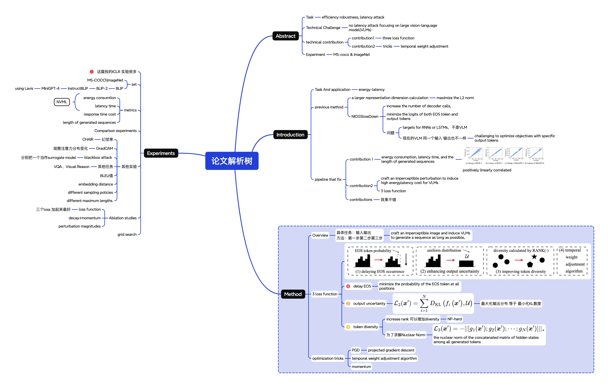
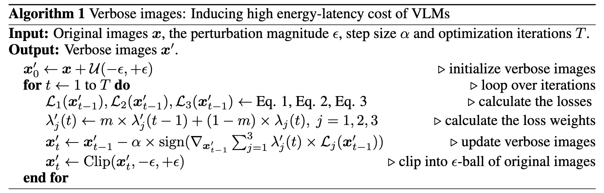
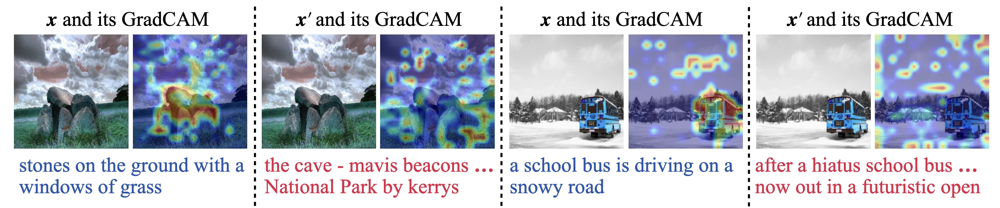
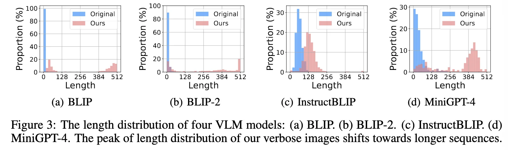
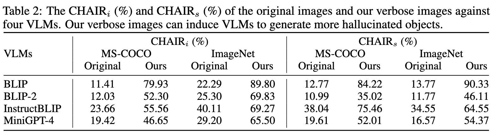
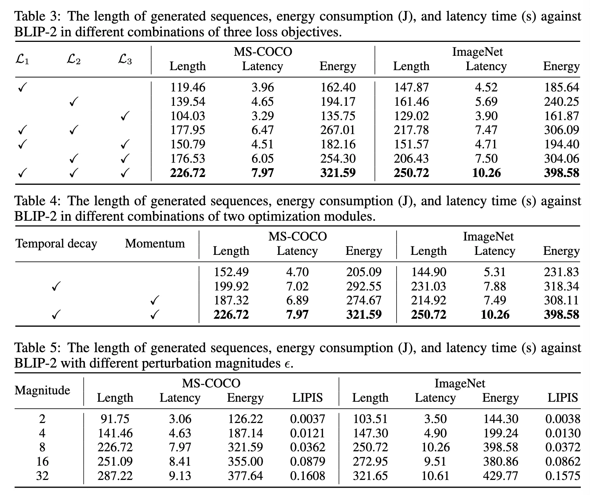
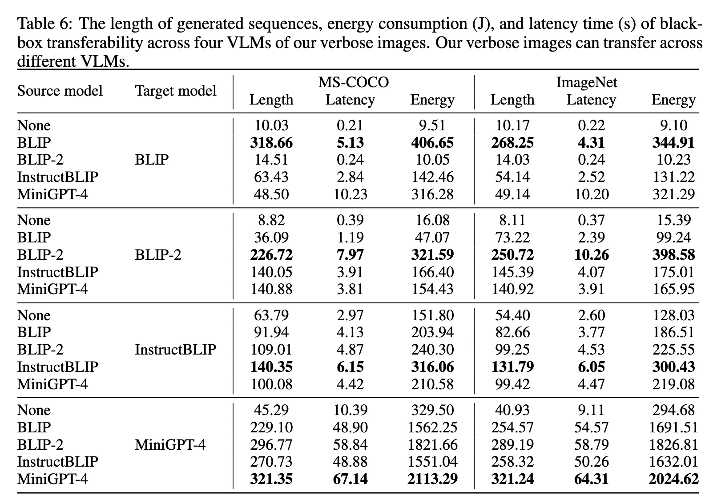
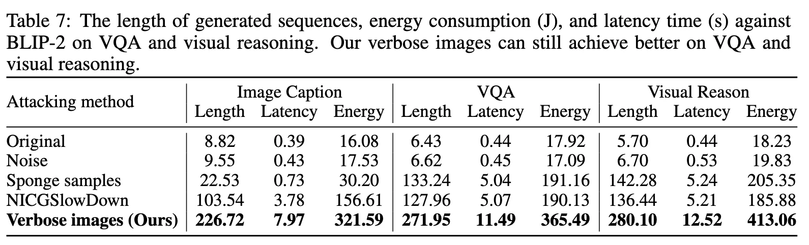

# VerboseImages [ICLR24]

!!! note "正在施工中👷.. "


[](https://www.semanticscholar.org/paper/Inducing-High-Energy-Latency-of-Large-Models-with-Gao-Bai/61ea0a87eab0029de9f4f6032108cb8d94cca3ac) [](https://github.com/KuofengGao/Verbose_Images) 


<iframe src="https://arxiv.org/pdf/2401.11170" width="100%" height="600px" style="border: none;">
This browser does not support PDFs
</iframe>


## 论文思维导图

<div class="card file-block" markdown="1">
<div class="file-icon"></div>
<div class="file-body">
<div class="file-title">论文解析树</div>
<div class="file-meta">132KB / 2025-08-03</div>
</div>
<a class="down-button" target="_blank" href="VerboseImages.xmind" markdown="1">:fontawesome-solid-download: 下载</a>
</div>

ICLR 好多实验啊、、



## 论文笔记

### previous

NICGSlowDown不行的原因

- failure case: image-language model
- train for lstm&cnn&rnn not VLM
- VLM对于同一个输入，输出也可能不同（sampling policies）；但是NICGSlowDown 优化特定输出token的对率




总的loss function为

$$
\min_{\boldsymbol{x}^{\prime}}\lambda_1\times\mathcal{L}_1(\boldsymbol{x}^{\prime})+\lambda_2\times\mathcal{L}_2(\boldsymbol{x}^{\prime})+\lambda_3\times\mathcal{L}_3(\boldsymbol{x}^{\prime}),\quad s.t.\left||\boldsymbol{x}^{\prime}-\boldsymbol{x}|\right|_p\leq\epsilon
$$


### $\mathcal{L}_1$ - delayed EOS loss 

$$
\mathcal{L}_1(\boldsymbol{x}^{\prime})=\frac{1}{N}\sum_{i=1}^Nf_i^\mathrm{EOS}\left(\boldsymbol{x}^{\prime}\right)
$$

因为不知道什么时候结束，所以优化所有位置上EOS的概率

### $\mathcal{L}_2$ - Enhancing output uncertainty 

$$
\mathcal{L}_2(\boldsymbol{x}^{\prime})=\sum_{i=1}^ND_{\mathrm{KL}}\left(f_i\left(\boldsymbol{x}^{\prime}\right),\mathcal{U}\right)
$$

### $\mathcal{L}_3$ - Improving token diversity 

- $[g_1(x'),g_2(x'), \cdots g_n(x')]$ 表示所有生成的token的隐藏状态的拼接矩阵，**增加隐藏状态矩阵的秩**会得到 **更多样化的token隐藏状态** 。
- 由于秩优化困难，使用 **核范数(nuclear norm)作为近似** ，并定义了相应的 **token多样性损失函数** 
  
$$
\mathcal{L}_3(\boldsymbol{x}^\prime)=-||[g_1(\boldsymbol{x}^\prime);g_2(\boldsymbol{x}^\prime);\cdots;g_N(\boldsymbol{x}^\prime)]||_*
$$


通过这种方式，可以在优化过程中间接促进token的多样性，从而实现增加能量和延迟成本的目标。


### trick1 - PGD

an iterative optimization technique that updates the solution by taking steps in the direction of the negative gradient while projecting the result back onto the feasible set

### trick2 $\lambda,m$ - temporal weight adjustment algorithm

**时间权重调整算法**


$$
\begin{aligned}&\lambda_1(t)=||\mathcal{L}_2(\boldsymbol{x}_{t-1}^{\prime})||_1\:/\:||\mathcal{L}_1(\boldsymbol{x}_{t-1}^{\prime})||_1\:/\:\mathcal{T}_1(t),\\&\lambda_2(t)=||\mathcal{L}_2(\boldsymbol{x}_{t-1}^{\prime})||_1\:/\:||\mathcal{L}_2(\boldsymbol{x}_{t-1}^{\prime})||_1\:/\:\mathcal{T}_2(t),\\&\lambda_3(t)=||\mathcal{L}_2(\boldsymbol{x}_{t-1}^{\prime})||_1\:/\:||\mathcal{L}_3(\boldsymbol{x}_{t-1}^{\prime})||_1\:/\:\mathcal{T}_3(t)
\end{aligned}
$$

temporal decay functions are set as:

$$
\mathcal{T}_1(t)=a_1\times\ln(t)+b_1\\
\mathcal{T}_2(t)=a_2\times\ln(t)+b_2\\
\mathcal{T}_3(t)=a_3\times\ln(t)+b_3
$$

此外，引入动量值 m 到权重的更新过程中


### 评价1 -  GradCAM

a gradient-based visualization technique that generates attention maps highlighting the relevant regions in the input images



### 评价2 - CHAIR

**CHAIR（Caption Hallucination Assessment with Image Relevance）** 是一种用于评估**图像描述生成模型**中**幻觉现象**的指标。


- **图像描述生成任务**要求模型根据输入图像生成自然语言描述。然而，模型有时会生成**与图像内容不符**的描述，即**幻觉现象**。


$CHAIR_i$ - Instance-level CHAIR，反映了模型在**实例级别**上的幻觉程度

$$
CHAIR_i = \frac{\text{幻觉对象实例的数量}}{\text{总对象实例的数量}}
$$

$CHAIR_s$ - Sentence-level CHAIR

$$
CHAIR_s = \frac{\text{包含幻觉对象的句子数量}}{\text{总句子数量}}
$$


## 代码复现 - 部分结果


### first trial

```
2025-08-02 01:45:22,698 - OPT - INFO - PARAMETER ...
2025-08-02 01:45:22,699 - OPT - INFO - Namespace(epsilon=0.032, step_size=0.0039, iter=100, gpu=0, seed=256, root_path='/root/autodl-tmp/Capstone/Verbose_Images', dataset='/root/autodl-tmp/Capstone/Verbose_Images/dataset')
2025-08-02 01:48:57,167 - OPT - INFO - Original sequences: layers of tall buildings
2025-08-02 01:48:57,168 - OPT - INFO - Verbose sequences: the last essex community bus service has left the network
2025-08-02 01:48:57,168 - OPT - INFO - ------------------------
2025-08-02 01:48:57,168 - OPT - INFO - Original sequences: a city bus moving down a road with another bus behind it
2025-08-02 01:48:57,168 - OPT - INFO - Verbose sequences: ’2149qb bfti grnt 45 hp twin barrier tri dup plasma plus interurbia 82 leadless all colour with rainbow rainbow stock clips from the blue and rainbow sofa where can i buy a sofa in india, search blue sofa in india, person, indian sofa, couch, city bus, transportation, in the city, the city bus, orlando bus, electric bus, metro bus, metro system, regional bus, ftl buses, metros, btm, btdl
2025-08-02 01:48:57,168 - OPT - INFO - ------------------------
2025-08-02 01:48:57,168 - OPT - INFO - Original sequences: a purple bus sitting next to some buildings
2025-08-02 01:48:57,168 - OPT - INFO - Verbose sequences: the purple bus is driving on the street
2025-08-02 01:48:57,168 - OPT - INFO - ------------------------
2025-08-02 01:48:57,168 - OPT - INFO - Original images, Length: 8.00, Energy: 14.31, Latency: 0.34
2025-08-02 01:48:57,168 - OPT - INFO - Verbose images, Length: 28.67, Energy: 90.84, Latency: 0.91
```


### Distribution



### Chair




### ablation Exp




### 黑盒攻击



### 其他任务




## 代码复现 - 准备工作

### 服务器

AudoDL 的 RTX 3090


```bash title="学术资源加速"
source /etc/network_turbo
```

!!! note "论文中用的是A100 40GB"


### 模型

| Name         |                               |      |      |
| ------------ | ----------------------------- | ---- | ---- |
| BLIP         | encoder-decoder model in 224M |      |      |
| BLIP-2       | OPT-2.7B LM                   |      |      |
| InstructBLIP | Vicuna-7B LM                  |      |      |
| MiniGPT-4    | Vicuna-7B LM                  |      |      |

### Metrics

using NVIDIA Management Library (NVML)

- energy consumption
- latency time
- the length of generated sequences
- response time cost


### 数据集下载


下载coco数据集[COCO - Common Objects in Context](https://cocodataset.org/#download)


### 数据集准备


```python title="取出随机图片"
import os
import random
import shutilh

def random_select_images(source_folder, target_folder, num_images=1000):
    """
    从源文件夹随机选择指定数量的图片到目标文件夹
    
    参数:
        source_folder: 源图片文件夹路径
        target_folder: 目标文件夹路径
        num_images: 要选择的图片数量(默认1000)
    """
    # 确保目标文件夹存在
    os.makedirs(target_folder, exist_ok=True)
    
    # 获取所有图片文件
    all_images = [f for f in os.listdir(source_folder) 
                 if f.lower().endswith(('.png', '.jpg', '.jpeg', '.bmp', '.gif'))]
    
    # 检查是否有足够图片
    if len(all_images) < num_images:
        raise ValueError(f"文件夹中只有 {len(all_images)} 张图片，不足 {num_images} 张")
    
    # 随机选择
    selected_images = random.sample(all_images, num_images)
    
    # 复制到目标文件夹
    for img in selected_images:
        src_path = os.path.join(source_folder, img)
        dst_path = os.path.join(target_folder, img)
        shutil.copy2(src_path, dst_path)
    
    print(f"成功复制 {len(selected_images)} 张图片到 {target_folder}")

# 使用示例
source = "/root/autodl-tmp/train2017"  # 替换为你的图片文件夹路径
target = "/Capstone/Verbose_Images/dataset"       # 替换为输出文件夹路径
random_select_images(source, target, 1000)
```


## 代码复现 - 问题解决

!!! note "这篇作者其实没有把所有的代码放出来，只放了算法部分的demo，所以想要复现所有set的话，需要花费一定时间。感觉作者不是很厚道啊xs"

### uv安装

```shell
uv env --python=3.9.2
```

```shell
uv pip install -r requirements.txt
```


库当中的requirement.txt不能直接使用，所以我解决了一些问题，然后记录在了下面

??? note "修改版本"

    ```txt title="requirement.txt"
    accelerate==1.9.0
    addict==2.4.0
    altair==5.5.0
    antlr4-python3-runtime==4.9.3
    asttokens==3.0.0
    attrs==25.3.0
    bitsandbytes==0.37.0
    bleach==6.2.0
    blinker==1.9.0
    blis==0.7.11
    braceexpand==0.1.7
    cachetools==6.1.0
    catalogue==2.0.10
    certifi==2025.7.14
    cffi==1.17.1
    cfgv==3.4.0
    charset-normalizer==3.4.2
    click==8.1.8
    comm==0.2.3
    confection==0.1.5
    configargparse==1.7.1
    contexttimer==0.3.3
    contourpy==1.3.0
    cycler==0.12.1
    cymem==2.0.11
    dash==3.2.0
    decorator==5.2.1
    decord==0.6.0
    diffusers==0.16.0
    distlib==0.4.0
    easydict==1.9
    einops==0.8.1
    eval-type-backport==0.2.2
    exceptiongroup==1.3.0
    executing==2.2.0
    fairscale==0.4.4
    fastjsonschema==2.21.1
    filelock==3.18.0
    flask==2.1.3
    fonttools==4.59.0
    fsspec==2025.7.0
    ftfy==6.3.1
    gitdb==4.0.12
    gitpython==3.1.45
    h5py==3.14.0
    huggingface-hub==0.25.2
    identify==2.6.12
    idna==3.10
    imageio==2.37.0
    imageio-ffmpeg==0.6.0
    importlib-metadata==8.7.0
    importlib-resources==6.5.2
    iopath==0.1.10
    ipython==8.18.1
    ipywidgets==8.1.7
    itsdangerous==2.2.0
    jedi==0.19.2
    jinja2==3.1.6
    joblib==1.5.1
    jsonschema==4.25.0
    jsonschema-specifications==2025.4.1
    jupyter-core==5.8.1
    jupyterlab-widgets==3.0.15
    kaggle==1.7.4.5
    kiwisolver==1.4.7
    langcodes==3.5.0
    language-data==1.3.0
    lazy-loader==0.4
    marisa-trie==1.2.1
    markupsafe==2.0.1
    matplotlib==3.9.4
    matplotlib-inline==0.1.7
    moviepy==2.2.1
    mpmath==1.3.0
    murmurhash==1.0.13
    narwhals==2.0.1
    nbformat==5.5.0
    nest-asyncio==1.6.0
    networkx==3.2.1
    nltk==3.9.1
    nodeenv==1.9.1
    numpy==1.26.4
    nvidia-cublas-cu12==12.6.4.1
    nvidia-cuda-cupti-cu12==12.6.80
    nvidia-cuda-nvrtc-cu12==12.6.77
    nvidia-cuda-runtime-cu12==12.6.77
    nvidia-cudnn-cu12==9.5.1.17
    nvidia-cufft-cu12==11.3.0.4
    nvidia-cufile-cu12==1.11.1.6
    nvidia-curand-cu12==10.3.7.77
    nvidia-cusolver-cu12==11.7.1.2
    nvidia-cusparse-cu12==12.5.4.2
    nvidia-cusparselt-cu12==0.6.3
    nvidia-ml-py==12.575.51
    nvidia-nccl-cu12==2.26.2
    nvidia-nvjitlink-cu12==12.6.85
    nvidia-nvtx-cu12==12.6.77
    omegaconf==2.3.0
    open3d==0.16.0
    opencv-python-headless==4.5.5.64
    opendatasets==0.1.22
    packaging==25.0
    pandas==2.3.1
    parso==0.8.4
    pathlib-abc==0.1.1
    pathy==0.11.0
    peft==0.10.0
    pexpect==4.9.0
    pillow==11.3.0
    platformdirs==4.3.8
    plotly==6.2.0
    portalocker==3.2.0
    pre-commit==4.2.0
    preshed==3.0.10
    proglog==0.1.12
    prompt-toolkit==3.0.51
    protobuf==6.31.1
    psutil==7.0.0
    ptyprocess==0.7.0
    pure-eval==0.2.3
    pyarrow==21.0.0
    pycocoevalcap==1.2
    pycocotools==2.0.10
    pycparser==2.22
    pydantic==1.10.22
    pydeck==0.9.1
    pygments==2.19.2
    pynvml==12.0.0
    pyparsing==3.2.3
    pyquaternion==0.9.9
    pyrapl==0.2.3.1
    python-dateutil==2.9.0.post0
    python-dotenv==1.1.1
    python-magic==0.4.27
    python-slugify==8.0.4
    pytz==2025.2
    pyyaml==6.0.2
    pyyaml-env-tag==0.1
    referencing==0.36.2
    regex==2025.7.33
    requests==2.32.4
    retrying==1.4.1
    rpds-py==0.26.0
    safetensors==0.5.3
    scikit-image==0.24.0
    scikit-learn==1.6.1
    scipy==1.13.1
    sentencepiece==0.2.0
    sentry-sdk==2.34.1
    setuptools==80.9.0
    six==1.17.0
    smart-open==6.4.0
    smmap==5.0.2
    soundfile==0.13.1
    spacy==3.6.0
    spacy-legacy==3.0.12
    spacy-loggers==1.0.5
    srsly==2.5.1
    stack-data==0.6.3
    streamlit==1.47.1
    sympy==1.14.0
    tenacity==9.1.2
    text-unidecode==1.3
    thinc==8.1.8
    threadpoolctl==3.6.0
    tifffile==2024.8.30
    timm==0.4.12
    tokenizers==0.13.3
    toml==0.10.2
    torch==2.7.1
    torchaudio==2.7.1
    torchvision==0.22.1
    tornado==6.5.1
    tqdm==4.67.1
    traitlets==5.14.3
    transformers==4.31.0
    triton==3.3.1
    typer==0.9.4
    typing-extensions==4.14.1
    tzdata==2025.2
    urllib3==2.5.0
    virtualenv==20.32.0
    wandb==0.21.0
    wasabi==1.1.3
    watchdog==6.0.0
    wcwidth==0.2.13
    webdataset==0.2.100
    webencodings==0.5.1
    werkzeug==2.1.2
    wheel==0.45.1
    widgetsnbextension==4.0.14
    zipp==3.23.0
    ```


### conda安装

也可以使用conda 进行安装
```bash
conda create -n VI python=3.9.2
```
Then, activate the environment:
```bash
conda activate VI
```

Install requirements:
```bash
pip install -e .
```


### log函数不能用

```python
from scipy import log
log(x)
```

这句话用不了，所以改成了

```python
import numpy as np
ratio1 = 10.0 * np.log(tdx + 1) - 20.0
ratio2 = 0.5 * np.log(tdx + 1) + 1.0
```

1.61是有log函数的，[log — SciPy v1.16.0 手册 - SciPy 科学计算库](https://docs.scipy.org.cn/doc/scipy/reference/generated/scipy.stats.log.html)

但是使用的是python3.9 最高1.31.1，所以只能更换其他方法
### moviepy库
`audio_processors.py`文件中

```python title="错误导入"
from moviepy.editor import VideoFileClip
```
> No module named 'moviepy.editor'解决方法

正确导入应该是
```python
#提取mp4视频里的音频保存为mp3.py
from moviepy.video.io.VideoFileClip import VideoFileClip
```

### BERT模型加载

这里因为autodl的网络问题，所以我们需要自己下载一下pretrained的这个bert(因为autodl已经下载过了相当于, 在`/root/autodl-pub/BERT-Pretrain-Modelbert-base-uncased.zip`中)
```python
def init_tokenizer(cls, truncation_side="right"):
        tokenizer = BertTokenizer.from_pretrained("models/bert-base-uncased", truncation_side=truncation_side)
        tokenizer.add_special_tokens({"bos_token": "[DEC]"})
        return tokenizer
```


### dataset参数和rootpath参数解析

```python 
def parse_args():
    '''PARAMETERS'''
    parser = argparse.ArgumentParser('generate verbose images')
    parser.add_argument('--epsilon', type=float, default=0.032, help='the perturbation magnitude')
    parser.add_argument('--step_size', type=float, default=0.0039, help='the step size')
    parser.add_argument('--iter', type=int, default=1000, help='the iteration')
    parser.add_argument('--gpu', type=int, default=0, help='GPU index')
    parser.add_argument('--seed', type=int, default=256, help='random seed')
    # 增加两行
    parser.add_argument('--root_path', type=str, default='.', 
                      help='Root directory')
    parser.add_argument('--dataset', type=str, required=True,
                      help='Dataset name')
```

### 库版本问题修正

**open3d库**
> ERROR: No matching distribution found for open3d==0.13.0
制定版本不行就让管理器自己处理

```bash
pip install open3d
```


**numpy与spacy库**
> cannot import name 'log' from 'scipy'

这里这三个包的版本需要特殊处理一下，这里沿用我之前在另一个项目配置的。

即`numpy==1.26.4`，`spacy==3.6.0`

又因为thinc released 8.3.0 with a depen·dency on numpy 2，如果要使用numpy=1.*，就需要安装`thinc<8.3.0`

```shell
pip install -U spacy==3.6.0
pip install numpy==1.26.4
pip install thinc==8.1.8
```

**peft与transformers库**

> ImportError: cannot import name 'Cache' from 'transformers' (/root/miniconda3/envs/VI/lib/python3.9/site-packages/transformers/__init__.py)

```
pip install peft==0.10.0
pip install transformers==4.31.0
```

[cannot import name '_expand_mask' · Issue #571 · salesforce/LAVIS](https://github.com/salesforce/LAVIS/issues/571)


**huggingface_hub库**

>ImportError: cannot import name 'cached_download' from 'huggingface_hub' (/root/miniconda3/envs/VI/lib/python3.9/site-packages/huggingface_hub/__init__.py)

原因：在huggingface_hub 0.26 中移除了如下函数，[原链接](https://github.com/huggingface/huggingface_hub/pull/2579)

```shell
pip install huggingface_hub==0.25.2 -i https://pypi.tuna.tsinghua.edu.cn/simple
```


### 

```
vi lavis/configs/models/blip2/blip2_instruct_vicuna7b.yaml
```

```yml title "修改成下面的样子"
llm_model: "lmsys/vicuna-7b-v1.5"
```


### 其他问题-内存不够

[script got killed while running · Issue #2 · KuofengGao/Verbose_Images](https://github.com/KuofengGao/Verbose_Images/issues/2)

但我还没有遇到这个问题


