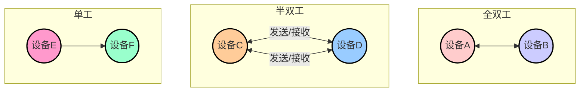

# 80C51


## 简介

- 什么是单片机 

一台能够工作的计算机要有这样几个部份构成：**CPU（进行运算、控制）、RAM（数据存储）、ROM（程序存储）、输入/输出设备（例如：串行口、并行输出口等）**。

而在单片机中,这些部份全部被做到**一块集成电路芯片**中了,所以就称为单片机（单芯片）


- 8位CPU
- 4K ROM 存放程序
- 128B RAM 存放数据
- IO接口
- 2个16位定时计数器
- 1个全双工可编程串行口

**数据总线、地址总线、控制总线**


??? note "MCS51 单片机和8051、8031、89C51 等的关系"
    - MCS51 是指由美国INTEL 公司生产的一系列单片机的总称,这一系列单片机包括了好些品种,如8031,8051,8751,8032,8052,8752 等
        - 其中8051 是最早最典型的产品,该系列其它单片机都是在8051 的基础上进行功能的增、减、改变而来的,所以人们习惯于用8051 来称呼MCS51 系列单片机
        - 而8031 是前些年在我国最流行的单片机,所以很多场合会看到8031 的名称。INTEL 公司将MCS51 的核心技术授权给了很多其它公司
        


## 结构

[单片机应用原理篇之80C51的CPU_哔哩哔哩_bilibili](https://www.bilibili.com/video/BV1p54y1D7Ys)

### 引脚


> 缺口左侧是1号口


单片机的40 个引脚大致可分为4 类：

**电源、时钟、控制和I/O 引脚。**


**电源引脚**

Vcc 40脚:5V

Vss 20 GND

**控制引脚**

RST 9 高电平复位

ALE


80C51 共有4个8位并行I/O 端口：

**P0,P1,P2,P3 口**,共32 个引脚。

P3 口还具有第二功能,用于特殊信号输入输出和控制信号（属控制总线）

1. P0口既可以作为普通I/O口，又可以作为外部扩展时的数据总线和地址总线的低8位，分时复用；作为普通I/O口时，外部要接上拉电阻。
2. P1口可以作为普通I/O口使用，内部带上拉电阻。
3. P2口可以作为普通I/O口使用，又可作为外部扩展时地址总线的高8位，作为普通I/O时，内部带上拉电阻。
4. P3口可以作为普通I/O口使用，又具有第二功能，作为普通I/O时，内部带上拉电阻。


### CPU

**CPU的位数：**8位

**CPU的作用：**取指令，译码，执行

**CPU的构成：**


- 运算器


寄存器B：乘除法

累加器A：最繁忙的寄存器

PSW 程序状态字寄存器


- 控制器


- 程序计数器PC（16位，24K），控制读取的代码

一开始指向0000H，跳转到30H开始执行

30H开始放代码

```assembly
MOV A,20H
MOV B,20H
MOV C,20H
```

- 数据指针寄存器DPTR（data pointer）

指向ROM或RAM的地址指针

外部的RAM

16位，可寻址范围64KB


### **存储器构造**

看总线区分哈佛和冯诺依曼：数据总线和地址总线


哈佛结构 RAM和ROM是分开的;独立结构

哈佛结构 可以同时获得数据和代码


冯诺依曼结构 RAM和ROM是相邻的，统一编址（分时）


51单片机是**改进哈佛结构**，分时复用，一套数据地址总线，通过指令的方式区分


4个物理存储空间，实际是3个逻辑存储空间


地址总线是16位的，最大不可以超过64K

### 程序存储器 ROM | `READ ONLY MEMORY`

存放程序、表格常数；

在运行过程中只读不可写，掉电不丢失数据。


EA引脚，EA=1方案1，EA=0方案2

- 方案1：4K以内地址在片内ROM，大于4K的在片外ROM
- 方案2：片内ROM禁用，全部存放在片外

|       |                              |
| ----- | ---------------------------- |
| 0023H | RI/TI中断跳转                |
| 001BH | T1中断跳转                   |
| 0013H | INT1中断跳转                 |
| 000BH | T0跳转                       |
| 0003H | INT0中断跳转                 |
| 0000H | 主程序跳转指令(只有三个Byte) |


在89C51 中的ROM 是一种电可擦除的ROM,称为FLASH ROM

所谓随机存取存储器,即随时能改写,也能读出里面的数据,它类似于我们的黑板,我能随时写东西上去,也能用黑板擦擦掉重写。


### 数据存储器 RAM | `READ RANDOM MEMORY`

所谓随机存取存储器,即随时能改写,也能读出里面的数据,它类似于我们的黑板,我能随时写东西上去,也能用黑板擦擦掉重写。


空间分配

- 低128字节 real RAM `00H-7FH`

13只能字节寻址，2可以位寻址

1 工作寄存器区：4x8bytes 每个区域都是R0-R7;只能选一组

2 可位寻址区：对00H-7FH进行位编址，通过指令区分


3 用户RAM区


- 高128字节 `SFR` 特殊功能寄存器 `80H-FFH`


寄存器 PSW 程序状态空间


**存储器译码**

65536 种状态我们只需要16 根线就能代表了


从上面的介绍中我们已经看到,用来传递数据的八根线并不是专用的,而是很多器件大家共用的,所以我们称之为数据总线,总线英文名为BUS,总即公交车道,谁者能走。而十六根地址线也是连在一起的,称之为地址总线

### 寄存器


## 中断

### 流程

中断系统是为使CPU具有对外界紧急事件的实时处理能力而设置的,当中央处理机CPU正在处理某件事的时候外界发生了紧急事件请求,要求CPU暂停当前的工作,转而去处理这个紧急事件,处理完以后,再回到原来被中断的地方,继续原来的工作,这样的过程称为中断。


**CPU在每一个机械周期内都会检查是否有中断**


中断响应与子程序调用的区别

- **函数的执行**是由程序员事先安排好的（由一条调用函数指令来转入）,而中断服务程序是由随机的中断事件引起的;

- **函数的调用**受到主调函数控制<br>而中断服务程序一般与被中断的程序毫无关系(没有从属关系);

- 有可能发生多个中断事件同时请求CPU服务的情况。

- **地址**中断响应程序的入口地址固定,而函数或者子程序调用中的子函数可以放在程序空间的任意位置。

- 中断返回指令`RETI`,子程序返回指令`RET`

- 有两种保护方式：外部保护再进子程序;进入子程序后再保护。中断事件保护现场只能放在中断服务当中,不能提前保护现场


`RETI`中断函数返回,清除中断状态的标志位,否则如果来了一个小于等于当前中断优先级的中断事件不会响应

| 环节      | 作用                           |
| --------- | ------------------------------ |
| ①中断源   | （申请中断的来源）             |
| ②中断申请 | （中断源发出信号提出申请）     |
| ③中断控制 | （中断系统判断是否要响应申请） |
| ④保护现场 | （安排好当前的工作）           |
| ⑤中断服务 | （响应中断源的申请）           |
| ⑥恢复现场 | （完事后,回去……）              |
| ⑦中断返回 | （继续做打断前的工作）         |

### 结构

2个人为优先级`IP`

中断使能寄存器 `IE`：是否响应,总开关打开且子开关打开

中断控制寄存器`SCON`

`TCON`电平还是下降沿方式


中断源、中断标志位、中断开关、中断优先级、中断入口地址


5+1 = 6个中断源

两个外部中断,两个定时中断,两个串行中断

- $\overline{INT0}$（P3.2）。可由`IT0(TCON.0)`选择其为低电平有效还是下降沿有效。当CPU检测到`P3.2`引脚上出现有效的中断信号时,中断标志`IE0(TCON.1)`置1,向CPU申请中断。
- $\overline{INT1}$（P3.3）。可由`IT1(TCON.2)`选择其为低电平有效还是下降沿有效。当CPU检测到`P3.3`引脚上出现有效的中断信号时,中断标志`IE1(TCON.3)`置1,向CPU申请中断。
- **TF0**（`TCON.5`）,片内定时/计数器`T0`溢出中断请求标志。当定时/计数器`T0`发生溢出时,置位`TF0`,并向CPU申请中断。
- **TF1**（`TCON.7`）,片内定时/计数器`T1`溢出中断请求标志。当定时/计数器T1发生溢出时,置位`TF1`,并向CPU申请中断。
- **RI**（`SCON.0`）或**TI**（`SCON.1`）,串行发送/接受<br>串行口中断请求标志。当串行口接收完一帧串行数据时置位`RI`或当串行口发送完一帧串行数据时置位`TI`,向CPU申请中断。


- `IT0（TCON.0）`,外部中断0触发方式控制位。<br>当IT0=0时,为电平触发方式。<br>当IT0=1时,为边沿触发方式（下降沿有效）。

- `IE0（TCON.1）`,外部中断0中断请求标志位。

- `IT1（TCON.2）`,外部中断1触发方式控制位。

- `IE1（TCON.3）`,外部中断1中断请求标志位。

- `TF0（TCON.5）`,定时/计数器`T0`溢出中断请求标志位。

- `TF1（TCON.7）`,定时/计数器`T1`溢出中断请求标志位。    


####  入口地址

**起始地址开始的8个地址**

在第2章中已经讲过, 地址为0003H-002AH的共40个单元是单片机5个中断源的中断服务程序存放地址区,它被分为5段,每段8个单元,分别分配给5个中断源,具体分配如下：

- `0003H-000AH`：外部中断0中断服务程序地址区。

- `000BH-0012H`：定时/计数器0中断服务程序地址区。

- `0013H-001AH`：外部中断1中断服务程序地址区。

- `001BH-0022H`：定时/计数器1中断服务程序地址区。

- `0023H-002AH`：串行口中断服务程序地址区。

#### 触发方式

下降沿——不会响应多次

#### 外部中断的扩展

多外部中断源的系统示例。

设有5个外部中断源,中断优先级排队顺序为：XI0、XI1、XI2、XI3、XI4。试设计它们与80C51单片机的接口。


```assembly
    ORG  0003H
    LJMP INSE0       ;转外部中断0服务程序入口
    ORG  0013H
    LJMP INSE1		;转外部中断1服务程序入口
    … …
    … …
INSE0:  
	PUSH PSW	;XI0中断服务程序
    PUSH ACC
    … …
    … …
    POP  ACC
    POP  PSW
    RETI 
INSE1:
	PUSH PSW         ;中断服务程序
    PUSH ACC
    JB P1.0,DV1    ;P1.0为1,转XI1中断服务程序
    JB P1.1,DV2     ;P1.1为1,转XI2中断服务程序
    JB P1.2,DV3     ;P1.2为1,转XI3中断服务程序
    JB P1.3,DV4     ;P1.3为1,转XI4中断服务程序
INRET:
	POP ACC
    POP PSW
    RETI
DV1:
    … …             ;XI1中断服务程序
    AJMP INRET
DV2:
	… …             ;XI2中断服务程序
    AJMP INRET
DV3:
	… …             ;XI3中断服务程序
	AJMP INRET
DV4:
	… …             ;XI4中断服务程序
	AJMP INRET
```


### 优先级

- **CPU总是先响应优先级别最高的中断请求。**

- 不能被新的同级或低优先级的中断请求所中断

- 能被高优先级中断请求所中断

> 打印机发送打印任务,中断,CPU处理其他任务

### 条件

- 中断源有中断请求

- 此中断源的中断允许位为1

- CPU开中断（即EA=1）

CPU执行程序过程中,在每个机器周期的**S5P2**期间,中断系统对各个中断源进行采样。

!!! note "可能会有一些滞后"
    当前指令执行完之后,双周期<br>
    正在执行的指令为RET、RETI或任何访问IE或IP寄存器的指令。即只有在这些指令后面至少再执行一条指令时才能接受中断请求。<br>
    执行一条硬件`LCALL`指令<br>


中断程序标准写法：

```assembly
    ORG 0000H
START:
	LJMP MAIN                ;跳转到主程序
    ORG 0003H
    LJMP INT0                ;转向中断服务程序
  
    ORG 0030H                ;主程序
MAIN:
	CLR IT0                      ;设为电平触发方式
    SETB EA                     ;CPU开放中断
    SETB EX0                   ;允许中断
    MOV  DPTR,#1000H 		;设置数据区地址指针
    AJMP $
    ORG 0200H                  ;中断服务程序
INT0:
	PUSH PSW                  ;保护现场
	PUSH ACC
	CLR P3.0                     ;由P3.0输出0
	NOP;
	NOP;
	SETB P3.0					;由P3.0输出1,撤除       
	MOV A,P1					;输入数据
	MOVX   @DPTR,A				;存入数据存储器
	INC   DPTR					;修改数据指针,指向下一个单元
	... ... 
	POP ACC                     ;恢复现场
	POP PSW
    RETI                              ;中断返回
```


## 定时 / 计数 

### 时序单位

晶振` fosc`

**机器周期、指令周期 、振荡周期、状态周期**

1 状态 = 2 振荡

1 机器 = 12 振荡

1 指令 = 1~4个机器周期

1个指令周期=N个机器周期=6N个状态周期=12N个节拍=12N个时钟周期=12N个振荡周期


单字节

- 如果晶振频率 \($ f_{\text{osc}} = 12 \text{ MHz} $\),则时钟周期 \( $T_{\text{clock}} $\) 为：
  $T_{\text{clock}} = \frac{1}{12 \times 10^6 \text{ Hz}} = 83.33 \text{ ns} $

- 如果某个微处理器的一个机器周期需要 12 个时钟周期完成,则机器周期 \( $T_{\text{machine}}$为：
  $T_{\text{machine}} = 12 \times 83.33 \text{ ns} = 1\mu s $


复位RES

- A = 0

- PSW = 0

- PC = 0

- DPTR = 0

- **SP = 07H**

!!! note "短时延时函数"
    ```assembly
    ;简单
    DELAY:
        MOV R7,#TIME
    LOOP:
        NOP
        NOP
        DJNZ R7,LOOP
        RET
    ;定时较长
    DELAY:
        MOV R5,#TIME1
    LOOP2:
        MOV R7,#TIME2
    LOOP1:
        NOP
        NOP
        DJNZ R7,LOOP1
        DJNZ R5,LOOP2
        RET
    ```

### 结构


2个16位定时器、计数器

定时器在单片机内部就像一个小闹钟一样,根据时钟的输出信号,每隔“一秒”,计数单元的数值就增加一,当计数单元数值增加到“设定的闹钟提醒时间”时,计数单元就会向中断系统发出中断申请,产生“响铃提醒”,使程序跳转到中断服务函数中执行

- 定时器：机械周期,晶振已知
- 计数器：光电码盘测量电机转速


设置为定时器模式时,加1计数器是对内部机器周期计数（1个机器周期等于12个振荡周期,即计数频率为晶振频率的1/12）。计数值N乘以机器周期$T_{cy}$就是定时时间$t$ 。

加1计数器输入的计数脉冲有两个来源,一个是由系统的时钟振荡器输出脉冲经12分频后送来;一个是T0或T1引脚输入的外部脉冲源。


#### **控制寄存器`TCON`**

TR0 TR1 控制定时计数器的启动停止

TF0 TF1 溢出中断请求标志位


#### 工作方式寄存器`TMOD`


- M0M1 ：工作方式设置位工作在4种模式

  | M1M0 | 工作方式 | 说明                           |
  | ---- | -------- | ------------------------------ |
  | 00   | 方式0    | 13位定时计数器                 |
  | 01   | 方式1    | 16位定时计数器                 |
  | 10   | 方式2    | 8位自动重装定时计数器          |
  | 11   | 方式3    | T0两个独立8位计数器,T1停止计数 |

  

- CT：定时控制器选择位：工作在定时模式还是计数模式

- GATE：启停模式


#### 中断允许控制寄存器IE


开启ET1,ET0才能中断


### 工作方式

兼容48芯片,所以有4种工作状态


#### 方式0


方式0为13位计数,由TL0的低5位（高3位未用）和TH0的8位组成

定时模式 Gate = 0,CT = 0

Gate = 1：由INT0进行控制

Gate = 0：或门让右侧一直是1 ,完全由TR决定


!!! note "测量周期/频率"
	设置TR = 1,CT = 0,GATE = 1;<br>INT0输入,高电平时候,计时开始;就可以记录高电平有多少个机械周期


- 计数外部脉冲个数： **$1～8192(2^{13})$**

- 定时时间：     $T～8192T$

- $f_{osc}=12MHz$,$T=1\mu s$时,最大定时时间：$8.19ms$

!!! note "控制不同初始值来控制定时时间"
    溢出后会中断<br>
    初始化定时/计数器时,初值N计算:<br>
    定时机器周期数: $N=\frac{t}{T}$ ——定时时间/机器周期<br>
    计数初值：$X=2^{13}-N $​——计数最大值与计数值之差<br>


!!! note "方式0,查询方式"
    选用定时/计数器1**工作方式0**   产生$500\mu s$定时,在P1.1输出周期为$1ms$的方波,设晶振频率=$6MHz$。
	=== "TMOD进行初始化"

    - GATE=0（用TR1位控制定时的启动和停止）<br>
    - C/T =0（置定时功能）<br>
    - M1M0=00（置方式0）<br>
    - 因定时/计数器0不用,可将其置为方式0（不能置为工作方式3）<br>
    - 这样可将TMOD的低4位置0,所以（TMOD）＝00H。<br>
    
    === "计算定时初值"
    
        $[2^{13}- X]\times 2=500 X=7942D=1111100000110B$
        将低5位送TL1,高8位送TH1得：$(TH1)＝F8H$,$(TL1)=06H$
    
    === "代码实现"
        ```assembly
            ORG 0000H
            LJMP MAIN
            ORG 0300H
        MAIN:
            MOV TMOD,#00H    ;TMOD初始化
            MOV TH1,#0F8H    ;设置计数初值
            MOV TL1,#06H
            MOV IE,#00H      ;禁止中断
            SETB TR1         ;启动定时
        LOOP: 
            JBC TF1,ZCZ      ;查询计数溢出
            AJMP LOOP
        ZCZ:  
            MOV TL1,#06H     ;重新置计数初值
            MOV TH1,#0F8H
            CPL P1.1          ;输出取反
            AJMP LOOP         ;重复循环
        ```


#### 方式1

**16位**计数 65536


!!! note "定时时间超过最大定时时间"
    例如,要求延时100ms,最大65536个机械周期<br>
    可以设置成50ms延时并执行两次<br>


!!! note "例子"
    例 1 利用定时/计数器T0的方式1,产生10ms的定时,并使P1.0引脚上输出周期为20ms的方波,采用中断方式,设系统时钟频率为12 MHz。

    === "1、计算计数初值X"
    
    由于晶振为12 MHz,所以机器周期$Tcy$为$1 ns$
    
    $N＝\frac{t}{T_{cy}}=\frac{10\times10^{-3}}{1\times10^{-6}}=10000$
    
    $X＝65536－10000＝55536＝D8F0H$
    
    即应将$D8H$送入$TH0$中,$F0H$送入$TL0$中
    
    === "2、求T0的方式控制字TMOD"
    
    M1M0=01,GATE=0,C/T=0,可取方式控制字为01H;
    
    ```assembly
    ORG   0000H  
    LJMP  MAIN                ;跳转到主程序
    ORG   000BH              ;T0的中断入口地址
    LJMP  DVT0                ;转向中断服务程序
    ORG   0100H
    
    MAIN：
        MOV   TMOD,#01H 		;置T0工作于方式1
        MOV   TH0,#0D8H			;装入计数初值
        MOV   TL0,#0F0H          
        SETB  ET0				;T0开中断
        SETB  EA				;CPU开中断
        SETB TR0				;启动T0
        SJMP $					;等待中断,程序一直停在这里,直至中断。
    DVT0:
        CPL  P1.0                ;P1.0取反输出
        MOV  TH0,#0D8H          ;重新装入计数值
        MOV  TL0,#0F0H           
        RETI                            ;中断返回
        END
    
    ```


#### 方式2


**8位自动重装定时计数器**

方式0,方式1,溢出后变成0000,需要重新设置初始值

方式2,可以自动重置初始值,不需要人工赋值


一般CT = 0,GATE =0

计数外部脉冲个数范围：1～256(28)

定时时间范围：T～256T


!!! note "方式2"
    例1：用定时/计数器1以工作方式2计数,要求每计满100次进行累加器加1操作。
	=== "TMOD初始化"

    - M1M0=10（方式2）
    
    - CT=1（计数功能)
    
    - GATE=0（TR1启动和停止）
    
    因此（TMOD）=60H。
    
    === "计算计数初值"
    
     $2^8-100=156D=9CH$  所以 $TH1=9CH$
    
    ```assembly
    ORG 0000H
    AJMP MAIN     ;跳转到主程序
    ORG 001BH     ;定时/计数器1中断服务程序入口地址
    INC A
    RETI
    ORG 0030H
    
    MAIN:	
    	MOV TMOD #60H	;TMOD初始化
    	MOV TL1,#9CH	;首次计数初值
    	MOV TH1,#9CH  	;装入循环计数初值
    	SETB EA			;开中断
        SETB ET1
        SETB TR1       ;启动定时/计数器1
    HERE:	SJMP $        ;等待中断
    ```


#### 方式3


T0分成两个8位定时/计数器TL0和TH0 ;


**TL0：**既可计数也可定时,是一个8位定时/计数器。占用了T0;所有控制位： C/T,TR0,GATE,TF0和INT0、T0引脚;

**TH0：**只能作为定时器,因为T0已被TL0占用, TH0用 T1的控制位：TR1、TF1;

**如果定时/计数器T0工作在方式3,T1只能工作在0、1、2方式****。此时由于T1的运行控制位TR1及计数溢出标志位TF1已被定时/计数器T0借用,这时,****T1作为串行口的波特率发生器使用。**


!!! note "例子"

    例2．欲用80C51产生两个方波,一个周期为200μs,另一个周期为400μs,该80C51同时使用串行口,用定时器／计数器作为波特率发生器。
    
    - 方案1：用两个独立的定时计数器实现两个不同周期的定时
    
    - 方案2：两个定时周期刚好成倍数关系,采用1个定时器,然后用软件实现两个定时。
    
    ​     本例为了演示工作方式3,采用方案1
    
    这时`T0`采用方式3工作,其中,`TL0`产生$200\mu s$定时,由` P1.0`输出方波;
    
    `TH0`产生$400\mu s$定时,由`P1.1`输出方波;
    
    `T1`设置为方式2作波特率发生器用。$f_{OCC}=9.216MHz$​​ 
    
    === "定时常数计算"
    
    - `TLO`定时常数为`TL0`：$t_{10} = 100μs$
    
    $TCL0 = 2^8 - 9.216×10^6×100×10^-6 = 256 - 76.8 = 179.2$
    
    单位$\mu s$,为十进制数值。十六进制数值为`TL0 = B3H`。
    
    - `TH0`定时常数为`TH0`：定时时间为$t10 = 200μs$
    
    $TCH0 = 2^8 - 9.216×10^6×200×10^-6 = 256 - 153.6 = 102.4$
    
    单位$\mu s$,为十进制数值。十六进制的值为`TH0 = 66 H`。
    
    - TH1的波特率（详细计算见串行口部分）
    
    设波特率为`2400`,则定时常数为`TC2 = F6H`
    
    === "程序代码"
    
    ```assembly
    ; 定时器0初始化
    MOV TL0, #0B3H ; 设TL0初值(100us定时)
    MOV TH0, #66H ; 设TH0初值(200us定时)
    MOV TL1, #0F6H ; 设TL1初值(波特率为2400)
    MOV TH1, #0F6H ; 设TH1初值
    SETB TR0 ; 启动TL0
    SETB TR1 ; 启动TH0
    SETB ET0 ; 允许TL0中断
    SETB ET1 ; 允许TH0中断
    SETB EA ; CPU中断开放
    AJMP $
    
    ; 定时器0中断服务程序
    ORG 0200H
    ITL0: MOV TL0, #0B3H ; 重装定时常数
    CPL P1.0 ; 输出方波(200us)
    RETI
    ITH0: MOV TH0, #66H ; 重装定时常数
    CPL P1.1 ; 输出方波(400us)
    RETI
    
    ; 主程序
    ORG 0000H
    AJMP MAIN
    ORG 000BH ; TL0的中断入口
    AJMP ITL0
    ORG 001BH ; TH0的中断入口
    AJMP ITH0
    ORG 0100H
    MAIN: MOV SP, #60H ; 设栈指针
    MOV TMOD, #23H ; 设T0为方式3,T1为2
    ```


### 初始化


**设置工作方式 TMOD**

确定用T0还是T1：初始化TMOD高四位还是低四位<br>

定时模式还是计数模式：CT<br>

方式0-3使用哪一种： M1M0<br>

控制模式：GATE<br>


**计算初始值**

计算加1计数器的计数初值Count,并将计数初值Count送入TH、TL中

初始值 = 上限 - 计数值


**计数**方式时：  $X=M-计数值$

**定时**方式时：  定时值$t(\mu s)=(M—X)\cdot T_M=\frac{12}{f_{osc}(M-X)}$,所以$X=M-t(\mu s)\times f_{osc}(MHz)_{12}$。

- M为定时计数器溢出值：$2^N,N=13,16,8$

- $T_M$​单片机时钟周期


**TCON**

启动计数器工作TCON,启动定时计数器使TR0或TR1置位

若采用中断方式,则应设置IE


```c
// 设置工作方式：GATE,C/T,M1M0→TMOD
TMOD = 0x01; // 定时器0工作在模式1

// 设置加1计数器初值：Count→TH,TL
TH0 = 0xFC;  // 高8位初值
TL0 = 0x66;  // 低8位初值

// 启动定时/计数器：1→TRx (x=0,1)
TR0 = 1;     // 启动定时器0

// 开中断：1→ETx (x=0,1),1→EA
ET0 = 1;     // 使能定时器0中断
EA = 1;      // 总中断使能
```

## 串口通信

数据通信 = 数据处理 + 数据传输

数据通信方式：并行通信、串行通信

### 概念

> 有部分内容其实是计网物理层的内容

#### 物理接口

> 参考[串口、COM口、UART口, TTL、RS-232、RS-485区别详解 - 知乎 (zhihu.com)](https://zhuanlan.zhihu.com/p/89240672)
>
> [单片机应用原理篇之串行通信基本概念_哔哩哔哩_bilibili](https://www.bilibili.com/video/BV1zK4y147qr/?spm_id_from=333.1007.top_right_bar_window_history.content.click&vd_source=8b7a5460b512357b2cf80ce1cefc69f5)

**串口、UART口、COM口、USB口是指的物理接口形式(硬件)**


!!! note "概念"
    - **UART接口：**通用异步收发器（Universal Asynchronous Receiver/Transmitter)，UART是串口收发的逻辑电路，这部分可以独立成芯片，也可以作为模块嵌入到其他芯片里，单片机、SOC、PC里都会有UART模块。<br>
    - **COM口：**特指台式计算机或一些电子设备上的D-SUB外形(一种连接器结构，VGA接口的连接器也是D-SUB)的串行通信口，应用了串口通信时序和RS232的逻辑电平。<br>
    - **USB口：**通用串行总线，和串口完全是两个概念。虽然也是串行方式通信，但由于USB的通信时序和信号电平都和串口完全不同，因此和串口没有任何关系。USB是高速的通信接口，用于PC连接各种外设，U盘、键鼠、移动硬盘、当然也包括“USB转串口”的模块。（USB转串口模块，就是USB接口的UART模块）<br>


#### 电平标准（电信号）

**TTL、RS-232、RS-485是指的电平标准(电信号)**

- TTL电平：全双工（逻辑1: 2.4V--5V 逻辑0: 0V--0.5V）<br>距离：1m左右

- **RS-232** 电平：全双工（逻辑1：-15V--3V 逻辑0：+3V--+15V)<br>距离：15m左右，用232做中转可以做的更远；

- **RS485：**RS485是一种串口接口标准，为了长距离传输采用差分方式传输，传输的是差分信号，抗干扰能力比RS232强很多。<br>

  半双工、（逻辑1：+2V-+6V 逻辑0： -6V- -2V）<br>可以实现主从机器的功能


!!! note "注意"
	COM口一般是RS232,只是把UART的高电平电压增大了，以便传得更远，而RS485又在此基础上把低电平改成了负电压，从而把信号改成了差分信号，增加了抗干扰能力。其实信号的本质并没有变化。


#### 通信方向

**全双工：**通信双方可以在同一时刻互相传输数据

**半双工：**通信双方可以互相传输数据,但必须分时复用一根数据线；

在发送时候不可以接收，在接收的时候不可以发送

> 对讲机

**单工：**通信只能有一方发送到另一方,不能反向传输




#### 同步异步

异步：通信双方各自约定通信速率,

传输数据是以字符为单位的,待传送的字符串中的每个字符均加上起始位、停止位、校验位等控制信息位,构成一个字符帧。

帧与帧之间的时间间隔是任意的


同步：通信双方靠一根时钟线来约定通信速率


#### 串行并行


#### 通信速率

通信速率是以每秒传送多少个二进制位来度量的,这个速率称作波特率（Baud Rate）,其单位为bps（bits per second,位/秒）

常用波特率：300,600,1200,2400,4800,9600,19200

总线：连接各个设备的数据传输线路（类似于一条马路,把路边各住户连接起来,使住户可以相互交流）

先确定波特率，让定时器产生波特率，约定波特率再通信


HEX模式/十六进制模式/二进制模式：以原始数据的形式显示

文本模式/字符模式：以原始数据编码后的形式显示


  MCS-51单片机的串行口——全双工的异步串行通信接口（即：通用异步收发器UART）,它内部包括一个发送器和一个接收器,实现CPU并行输出→串行发送,串行接收→CPU并行接收的转换功能。


**RS-232C**

负逻辑


| 主要引脚   | 作用     |
| ---------- | -------- |
| TXD `P3.0` | 发送数据 |
| RXD `P3.1` | 接收数据 |
| SGND       | 信号接地 |

公头-针,母头-孔（2,3交换,5共地）


!!! note "不能过远的原因"

### 结构


SBUF（逻辑地址只有一个,两个物理地址）


虽然接收和发送SBUF使用同一个逻辑地址，但物理是两个地址


大部分使用方式2,产生一个固定的方波


接收移位寄存器,每收到一个位,就左移一个位,满载（8bit）以后就移到SBUF当中

接收最多2Byte,主动发送最多1Byte

接收方有两级缓存


#### 串行口控制寄存器SCON


SM0、SM1——串行口工作方式选择位。

SM2——多机通信控制位(主要用于方式2和方式3)


REN－允许/禁止串行口接收控制位

REN=1,允许接收;REN=0,禁止接收。

可通过软件对该位进行设置


TB8－第9位发送数据

方式0中不使用TB8。

在方式1中,TB8为停止位,

在方式2和方式3时,TB8的内容是要发送的数据格式中的第9位。

 

RB8－第9位接收数据

方式0中不使用RB8

方式1中RB8为接收到的停止位

方式2和方式3时,RB8存放接收到的第9位数据,在双机通信中,作为奇偶校验;在多机通信中,用作区别地址帧/数据帧的标志。


TI ——发送结束和发送中断标志位

RI——接收结束和接收中断标志位

可以通过检验TI RI 来判断是否接受、发送结束

#### 电源控制寄存器PCON

PCON的单元地址为87H,其内部各位均不能进行位寻址


SMOD为串行口波特率倍增位,当串行口工作在方式1和方式3时,其波特率可调。调节手段之一便是利用SMOD。

（1）若SMOD=0,波特率不倍增;

（2）若SMOD=1,则选定的波特率倍频1倍;

   系统复位时,SMOD自动清零


### 工作方式

帧的结构和通信速率不同

| SM0  | SM1  | 工作方式 | 功能描述          | 波特率                                |
| ---- | ---- | -------- | ----------------- | ------------------------------------- |
| 0    | 0    | 方式0    | 8位同步移位寄存器 | $\frac{fosc}{12} $                    |
| 0    | 1    | 方式1    | 10位异步收发      | 由定时器控制                          |
| 1    | 0    | 方式2    | 11位异步收发      | $\frac{fosc}{64}$或$\frac{fosc}{32} $ |
| 1    | 1    | 方式3    | 11位异步收发      | 由定时器控制                          |

#### 方式0

发送/接收过程：SBUF中的串行数据由RXD逐位移出/移入

（**低位在先,高位在后**）;TXD输出移位时钟,频率=  $\frac{fosc}{12} $   ;

每送出/接收8位数据 TI/ RI自动置1;需要用软件清零 TI/ RI 。


发送完成后,TI就置1


串行口在方式0下的工作并非是一种同步通信方式,经常配合“串入并出”“并入串出”移位寄存器一起使用,以达到扩展一个并行口的目的。 扩展电路如下图所示。


51的RXD传入有效信息位,TXD机械周期放到时钟

对外展示并行输出


如要发送数据,查询方式的程序如下：

```assembly
MOV SCON,#00H	;串行口方式0
MOV SBUF,A		;将数据送出
JNB TI,$         ;等待数据发送完毕,等待TI=1,即发送完成
CLR TI           ;为下次发送作准备
```

注意：复位时,SCON 已经被清零。

发送条件：TI=0。

接收条件：TI=0,置位 REN=1 （允许接收数据）。

#### 方式1

1位起始位+8位信息位+1位结束位


发送完变成高电平


接收方式


接收完成RI = 1


```assembly
;发送代码
MOV	SCON,#40H    ;//串口工作在方式1下
MOV	A,P1
MOV	SBUF,A    ;//启动串口发送
LP:   
JNB TI    LP    ;等待发送完成
CLR   TI           ;发送完成后清TI
```

```assembly
;接收代码
     MOV  SCON, #50H; 串口工作在方式1,启动接收
LP: 
     JNB RI  LP        ;  等待接受完毕
     MOV  A,   SBUF ;把收到的数据保存下来
     MOV  P1,  A      ;接收到的数据送P1口
     CLR RI               ;  清接收中断标志

```

**波特率设置**

- 波特率 = $(2^{\frac{SMOD}{32}}) \times (定时/计数器1的溢出率)$

- 定时/计数器1的溢出率 =$ \frac{f_{osc}}{12 \times (256 - 初值)}$

- 波特率 = $2^{\frac{SMOD}{32}} \times \frac{f_{osc}}{12 \times (256 - 初值)}$

- 定时器初值 = $256 - \frac{f_{osc} \times 2^{SMOD}}{384 \times 波特率}$

为了能够被384整除

串行口工作时,$f_{osc}$常取11.0592M而非12M,是因为11.0592M时能提供更精确的波特率。


#### 方式2

1位起始位+8位数据+1位校验+1位终止


**发送过程**

A、首先根据要传送的8位数据的特征(如奇偶、地址/数据特征)决定第9个信息位的状态。

B、启动串口发送（`MOV SBUF,A` 或 `MOV SBUF,#XXH`）。按起始位、数据位D0～D7、校验位、停止位的顺序将该帧信息以规定的波特率逐一从TXD引脚移出。

 C、待发送完毕后自动将SCON中的TI位置1,表示发送过程结束。


**接收过程**

A、软件将`REN`置1,启动串行口在方式2下的接收过程;

B、UART自动地按规定的波特率从引脚`RXD`上逐位接收信息,移入串口中的接收移位寄存器。

C、接收完毕后,将接收移位寄存器中的数据位D0～D7锁入`SBUF`。同时将校验位送入`SCON`中的`RB8`位,自动将`SCON`中的RI置1,表示接收过程结束。编程时可通过查询和中断方式对下一步进行处理。 


**波特率设置**

倍频：`SMOD = 1` 波特率 = $\frac{2^{SMOD}\times f_{osc}}{64} = \frac{f_{osc}}{32}$

不倍频：`SMOD = 0` 波特率 = $\frac{2^{SMOD}\times f_{osc}}{64} = \frac{f_{osc}}{64}$


#### 方式3

多级通信or奇偶校验


工作方式3串行口的结构和特点

 在方式3下,串行口的结构、传送的帧格式、各位的定义皆与方式2相同,唯一的区别在于工作方式3通信的波特率是可编程的。


### 初始化

RITI不会自动清零 必须软件清零

发送：第一次要在主程序当中


!!! note "先确定波特率，再找到溢出率，再计算定时器初值，得到这个溢出率"

方式0的波特率 = fosc/12

方式2的波特率 =$(\frac{2^{SMOD}}{64})\cdot fosc$ 

方式1的波特率 =（2SMOD/32）·（T1溢出率）

方式3的波特率 =（2SMOD/32）·（T1溢出率）


### 编程

1、查询方式

指令查询标志位TI和RI ：

TI =1,一帧发送完,TI≠1,没有发送完

RI=1,一帧数据已送到,RI≠1,没有送到

2、**中断方式**

设置中断允许,以TI和RI作为中断请求标志位,TI=1或RI=1均可引发中断。


??? note "串口方式1"

通过MCS-51串行口按模式1发送存放在片内`RAM 20H～3FH`中的数据,要求传送的波特率为`1200bps`。编写有关的通信程序。 `fosc=11.0592MHz`。


=== "计算"

设串行口为方式1,定时器/计数器T1为方式2作为串行口的波特率发生器。可以避免计数溢出后用软件重装定时初值的工作。

$波特率 = \frac{2^{SMOD}}{32}\times \frac{fosc}{12\times(2^8-TH1)}$

**取SMOD＝0** 

**(TH1)＝232＝0E8H**

=== "程序代码"

```assembly
;A机发送程序
MOV	 TMOD,#20H	;设T1为方式2
MOV	 TL1,#0E8H	;T1定时常数
MOV	 TH1,#0E8H
SETB TR1	;启动T1
MOV SCON,#01000000B;设串行口为方式1
MOV	 R0,#20H		;设发送数据区首址
MOV	 R7,#32		;发送32个ASCII码数据
LOOP:
    MOV	A,@R0 ;取ASCII码数据
    MOV	SBUF,A ;带校验位发送
    JNB	TI,$ ;发送等待
    CLR	TI ;清TI标志	
    INC	 R0 ;未发送完,则继续
    DJNZ R7,LOOP
```

=== "B机接收"

采用查询方式，本例与上例相呼应，接收器把接收到的32个数据存放在20H－3FH单元内，波特率同上。

```
MOV   SCON，#01010000B    ；设串口方式1，允许接收
MOV   TMOD，#20H；设置定时器T1为方式2
MOV   TL1，#0E8H                  ；初值，波特率为1200b/s
MOV   TH1，#0E8H  
SETB  TR1                   	           ；启动T1运行
MOV   R0，#20H                      ；数据存放首地址
MOV   R7，#32                        ；数据块长度
LOOP: JNB   RI，$         	；RI由硬件置位
CLR   RI            	；软件清除RI
MOV  A，SBUF 
MOV    @R0，A         	          ；存放接收的数据
INC      R0
DJNZ   R7，LOOP

```


 

### 多机通讯

从机：站号
