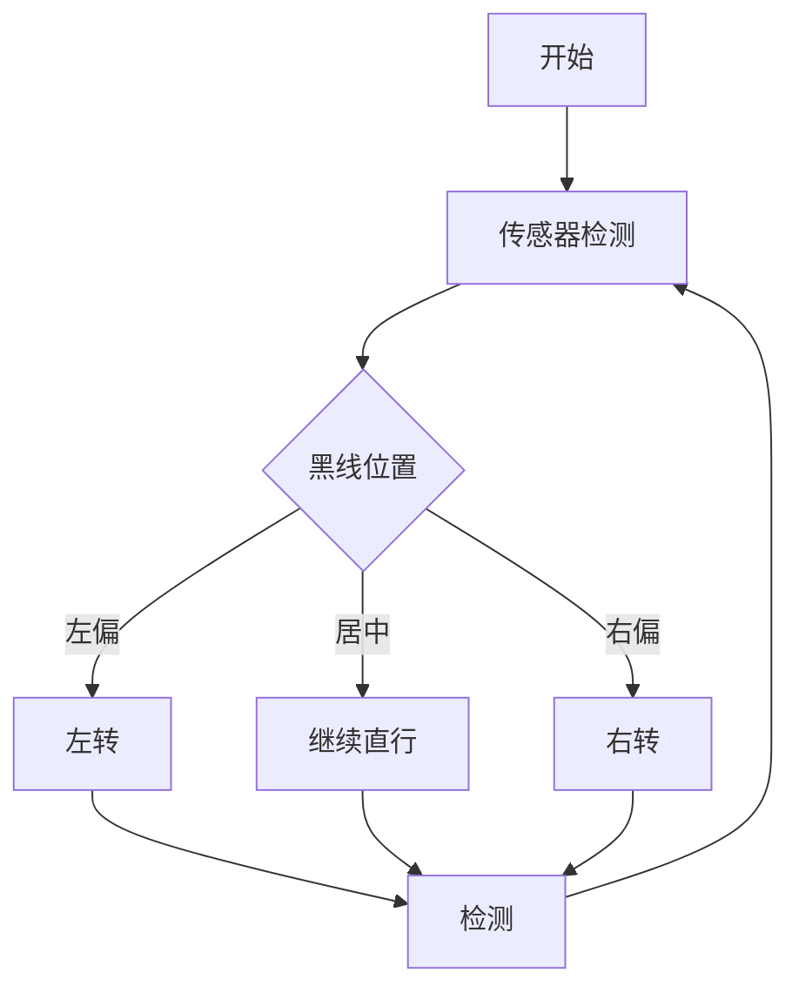

# 机器人导论历年卷

!!! note "历年卷来源"
       [2022-2023春机器人导论回忆卷](https://www.cc98.org/topic/5597275)<br>
       [2021-2022 春 机器人导论 回忆卷](https://www.cc98.org/topic/5306507)<br>
       [2019-2020春夏机器人导论回忆卷](https://www.cc98.org/topic/4961482)<br>
       [2019-2020春夏部分考试回忆（机器人导论](https://www.cc98.org/topic/4960976/1#1)<br>
       [2020-2021春学期机器人导论回忆卷](https://www.cc98.org/topic/5070617)<br>

!!! bug "大部分答案由大语言模型生成，仅供参考"

## 综述、框图

!!! note "从智能和体能两方面简述机器人的组成" 

**智能方面**

1. **处理器和控制器**: 这是机器人的大脑，负责处理和控制机器人的动作和行为。它包括中央处理器（CPU）、微控制器（MCU）和各种传感器等。
2. **传感器**: 机器人需要通过传感器来感知周围环境，如摄像头、激光雷达、力传感器等。这些传感器收集到的信息会传输给处理器进行分析和处理。
3. **软件和算法**: 机器人的智能还体现在软件和算法上，包括操作系统、控制算法、机器学习算法等。这些软件和算法使机器人能够自主决策、学习和适应环境。

**体能方面**

1. **机械结构**: 机器人的机械结构包括机身、关节、传动装置等。这些结构使机器人能够移动、抓取物体和完成各种任务。
2. **驱动系统**: 驱动系统为机器人提供动力，包括电机、液压系统、气压系统等。这些系统使机器人能够执行各种动作，如行走、抓取和操纵物体。
3. **能源系统**: 能源系统为机器人提供能量，包括电池、电源等。这些系统使机器人能够长时间工作，而无需频繁充电或更换电池。


!!! note "机器人设计的一般流程，对各个步骤的简要阐述" 

1. **明确执行机构**: 在这一步中，需要确定机器人需要完成的任务和功能，并根据这些要求选择合适的执行机构，如电机、液压缸、气压缸等。
2. **确定传动方式**: 根据执行机构的特点和要求，选择合适的传动方式，如齿轮传动、皮带传动、链传动等。传动方式的选择需要考虑传动效率、精度、可靠性等因素。
3. **设计导向机构**: 导向机构用于引导执行机构的运动，使其按照预定的轨迹运动。导向机构的设计需要考虑运动精度、刚度、抗干扰能力等因素。
4. **结构设计**: 在这一步中，需要根据执行机构、传动方式和导向机构的要求，进行机器人的整体结构设计。结构设计需要考虑材料的选择、强度和刚度的要求、装配和维护的便利性等因素。
5. **优化分析**: 在完成结构设计后，需要对机器人进行优化分析，包括运动学分析、动力学分析、控制策略分析等。优化分析的目的是提高机器人的性能，减少能耗，延长使用寿命等。
6. **组装与测试**: 最后，需要将各个部件组装成完整的机器人系统，并进行测试和调试。测试的目的是验证机器人的功能和性能是否满足设计要求，并进行必要的调整和改进。


!!! note "举一个智能体的例子，说明该智能体是如何与外界环境的交互逻辑，并说明是如何实现的" 

一个智能体的例子是自主导航机器人，它通过与外界环境的交互来实现自主导航功能。

**交互逻辑**

1. **感知环境**: 自主导航机器人通过各种传感器（如摄像头、激光雷达、超声波传感器等）感知周围环境，获取环境信息。
2. **地图构建**: 机器人利用感知到的环境信息构建地图，包括障碍物的位置、大小和形状等。
3. **路径规划**: 根据地图信息和导航目标，机器人进行路径规划，找到一条安全、可行且最优的路径。
4. **运动控制**: 机器人根据规划好的路径进行运动控制，包括速度控制、方向控制和避障等。
5. **反馈与调整**: 在运动过程中，机器人不断感知环境变化，并根据反馈信息对路径和运动进行调整，以适应环境的变化。

**实现方式**

1. **传感器数据处理**: 使用计算机视觉、激光雷达数据处理等技术对传感器数据进行处理，提取有用的环境特征。
2. **地图构建算法**: 采用SLAM（同步定位与地图构建）等算法，实现对环境的实时地图构建。
3. **路径规划算法**: 使用A*、Dijkstra等搜索算法进行路径规划，找到最优路径。
4. **运动控制算法**: 采用PID控制、模糊控制等算法实现对机器人的运动控制。


## 微控制器部分

!!! note "说明微控制器的冯诺依曼结构。" 


!!! note "双轮差速巡线小车"
    请画出巡线流程图，并编写一个简单的巡线用Arduino程序，简单注释。 <br>
    画双轮差速小车巡线流程图，编写直线和左转程序<br>




```c
// 定义电机引脚
const int leftMotorPin1 = 2; // 左电机引脚1
const int leftMotorPin2 = 3; // 左电机引脚2
const int rightMotorPin1 = 4; // 右电机引脚1
const int rightMotorPin2 = 5; // 右电机引脚2

void setup() {
  // 设置电机引脚为输出模式
  pinMode(leftMotorPin1, OUTPUT);
  pinMode(leftMotorPin2, OUTPUT);
  pinMode(rightMotorPin1, OUTPUT);
  pinMode(rightMotorPin2, OUTPUT);
}

void loop() {
  // 直线行驶
  digitalWrite(leftMotorPin1, HIGH); // 左电机正转
  digitalWrite(leftMotorPin2, LOW);
  digitalWrite(rightMotorPin1, HIGH); // 右电机正转
  digitalWrite(rightMotorPin2, LOW);
  delay(1000); // 延迟1秒

  // 左转
  digitalWrite(leftMotorPin1, LOW); // 左电机停止
  digitalWrite(leftMotorPin2, LOW);
  digitalWrite(rightMotorPin1, HIGH); // 右电机正转
  digitalWrite(rightMotorPin2, LOW);
  delay(500); // 延迟0.5秒
}
```


## 传感器

!!! note "机器人传感器的定义？"

用于**定量**感知环境**特定物质属性**的**电子、机械、化学设备**，并能够把各种物理量和化学量等**精确**地变换为**电信号**，再经由电子电路或计算机进行分析与处理，从而对这些量进行检测  


!!! note "传感器在机器人系统中的作用？"

**环境感知**

传感器使机器人能够感知和测量其周围的物理特性，如距离、温度、压力、光照等。通过这些感知信息，机器人可以构建出环境的内部模型，从而实现对环境的理解和导航。

**决策与控制**

传感器为机器人的决策和控制提供了基础。通过感知环境信息，机器人可以做出相应的决策，如避障、路径规划等。同时，传感器也为机器人的控制提供了反馈，使机器人能够根据实际情况调整其行为。

**人机交互**

传感器在人机交互中也扮演着重要角色。通过传感器，机器人可以感知人类的行为和意图，从而实现与人类的自然交互。例如，语音识别传感器使机器人能够理解人类的语言指令，而视觉传感器使机器人能够识别人类的手势和表情。


!!! note "假如你正在设计一款智能移动家居机器人，请设计四个所需要的传感器，并说明原理和作用。"

1. **激光雷达（LiDAR）**
   - **原理**：激光雷达通过发射激光束并测量其反射时间来确定物体的距离和形状。它使用旋转的激光扫描仪或多个激光发射器来创建周围环境的3D地图。
   - **作用**：激光雷达用于机器人的导航和避障。它可以帮助机器人创建详细的环境地图，识别障碍物并规划最佳路径，以安全地在家中移动。
2. **视觉传感器（RGB-D相机）**
   - **原理**：RGB-D相机结合了传统的RGB相机和深度传感器，可以同时捕捉彩色图像和深度信息。它使用红外光或结构光来测量物体的距离。
   - **作用**：视觉传感器使机器人能够感知和识别物体的形状、颜色和纹理。它可以用于人脸识别、手势识别和物体检测，使机器人能够与人类进行交互和执行特定任务。
3. **超声波传感器**
   - **原理**：超声波传感器通过发送超声波信号并测量其反射时间来确定物体的距离。它使用压电陶瓷或超声波换能器来发送和接收超声波。
   - **作用**：超声波传感器用于机器人的近距离避障和测距。它可以帮助机器人检测附近的障碍物并避免碰撞，特别是在复杂的家庭环境中。
4. **力传感器**
   - **原理**：力传感器用于测量施加在机器人身上的力或压力。它使用应变片、压电电阻或压电陶瓷等技术来检测力的变化。
   - **作用**：力传感器使机器人能够感知和响应外部力。它可以用于检测机器人是否与物体接触或被推动，并调整其行为以保持平衡或避免损坏。


## 驱动

??? +note "串励直流电机 "
	（1）写出电压平衡方程 
	（2）写出转矩平衡方程 
	（3）用20kHz的pwm波调速，达到60%额定转速时的脉宽$t_1$？


$$
电压平衡方程：& u_a(t) = R_ai_a(t) + L_a\frac{di_a(t)}{dt} + E_a(t)\\
感应电动势方程：&E_a(t) = K_e \omega\\
电磁转矩方程：&T(t) = K_t i_a(t)\\
转矩平衡方程：&T(t) = J\frac{d\omega(t)}{dt}+ B\omega(t) + T_d(t) 
$$


（3）对于使用20kHz的PWM波调速，要达到60%额定转速时的脉宽$t_1$，首先计算出PWM波的周期$T = 1 / 20,000 Hz = 0.05 ms$。然后根据需要达到的转速百分比确定占空比$D = 0.6$。最后，脉宽$t1 = D * T = 0.6 * 0.05 ms = 0.03 ms$。所以，达到60%额定转速时的脉宽$t_1$为$0.03 ms$。


电机由静止到额定转速的步骤和过程；电机长期运行在超过额定转速的状态下会有什么问题？如何解决？


电机烧掉：**电机铜线外绝缘体破坏，电线与电线之间短路**

检查方法：测量电机绕组的电阻值是否正常进行判断


!!! note "说出图示无刷电机的联结方式、不同导通情况，画不同情况下中间部分为磁铁的工作图"


画出无刷电机运行一个周期的六种状态流程（如下图所示：）


## 传动

 !!! note "写出5种变旋转为直线的传动方式"

螺丝

齿轮齿条


滚珠丝杠


曲柄滑块


蜗轮蜗杆传动


凸轮机构


写出题目图中气动为几位几通，并说明其往复运动的工作流程（也被我找到原图了：


曲柄摇杆装置中，若l1为曲柄，l1最短，证明l3必为摇杆 


定轴轮系 （1）几级减速？ （2）齿轮2的模数是1，求齿轮1的分度圆直径 （3）计算减速比


写三种铰链四连杆机构；列写2种演化形式并画图，判断BC最短时的机构，并列ABCD的矢量方程


## 运动学

!!! note "旋转
    "两个关节空间a,b；原本重合，b绕a的x轴旋转m°；再绕z轴旋转n°；

    试求b至a的旋转矩阵


关节空间b绕关节空间a的x轴旋转$m^\circ$，再绕z轴旋转$n^\circ$的旋转矩阵

$$
\mathbf{R} = \mathbf{R}_z(n) \cdot \mathbf{R}_x(m) = \begin{bmatrix}
\cos n & -\sin n & 0 \\
\sin n & \cos n & 0 \\
0 & 0 & 1
\end{bmatrix} \cdot \begin{bmatrix}
1 & 0 & 0 \\
0 & \cos m & -\sin m \\
0 & \sin m & \cos m
\end{bmatrix}
$$

其中，$\mathbf{R}_x(m)$和$\mathbf{R}_z(n)$分别是绕x轴和z轴的旋转矩阵，它们可以表示为：

$$
\mathbf{R}_x(m) = \begin{bmatrix}
1 & 0 & 0 \\
0 & \cos m & -\sin m \\
0 & \sin m & \cos m
\end{bmatrix}, \quad \mathbf{R}_z(n) = \begin{bmatrix}
\cos n & -\sin n & 0 \\
\sin n & \cos n & 0 \\
0 & 0 & 1
\end{bmatrix}
$$

将两个矩阵相乘，得到最终的旋转矩阵：

$$
\mathbf{R} = \begin{bmatrix}
\cos n & -\sin n \cos m & \sin n \sin m \\
\sin n & \cos n \cos m & -\cos n \sin m \\
0 & \sin m & \cos m
\end{bmatrix}
$$


## 视觉

!!! note "被动视觉传感器的优缺点"

优点包括：

- 成本低且易用，可以快速启动和运行，适用于各种应用。
- 具有灵活性，可以通过更换镜头来满足不同应用的需求。

缺点

- 无法获得物体的深度和大小（了解大小需要参照物 ）
- 在外部光弱的情况下无法成像，依赖于外部环境影响


!!! note "相机模型需要考虑哪些物理因素"

1. 光圈：光圈是一个用来控制光线透过镜头进入机身内感光面光量的装置。光圈的大小用f值来表示，光圈越大，f值越小，进光量越大，画面越亮；反之光圈越小，f值越大，进光量越小，画面越暗。光圈还可以控制景深。

2. 快门速度：快门速度是指光线通过镜头进入感光元件的时间长短。快门速度越长，进光量越多，画面越亮；快门速度越短，进光量越少，画面越暗。快门速度还会影响到画面的清晰度和动态捕捉能力。

3. 感光度（ISO）：感光度是指感光元件对于光的灵敏程度。ISO越高，感光元件对光越敏感，画面越亮；反之ISO越低，感光元件对光越不敏感，画面越暗。ISO的高低还会影响到画面的噪点水平。

4. 镜头焦距：镜头焦距决定了相机的视角和放大倍率。焦距越短，视角越广，适合拍摄大场景；焦距越长，视角越窄，适合拍摄远处的物体。

5. 相机传感器尺寸：相机传感器的尺寸会影响到相机的画质和感光能力。较大的传感器尺寸可以提供更好的画质和更低的噪点水平。

6. 相机镜头设计：镜头的设计包括镜片的材料、数量、排列方式等，这些都会影响到相机的成像质量、畸变控制和色彩还原能力。

7. 相机机身设计：相机机身的设计包括材料的选择、散热设计、防尘防水设计等，这些都会影响到相机的耐用性和工作环境适应性。

!!! note "视觉可以用在机器人哪些功能上"

- 划痕检测
- 土壤分析
- 文字识别
- 人脸识别
- 视觉定位、导航

## 地图、运动规划、集群


简述GPS定位的原理


机器人的路径规划 （1）机器人的路径规划有基于采样和基于搜索两种方案，请列举四种路径规划方法（两种基于采样的，两种基于搜索的） （2）选择（1）中的一种算法，描述具体原理 （3）路径规划在机器人系统中的作用？理想功能？ 


集群算法 （1）列举社会生活中出现的两种集群机器人 （2）基于生物群落模型的集群算法（Flocking Models）的原理？ （3）Flocking Models应用的难点和解决办法

列两种具有协作能力的生物群体、仿生群体机器人的定义、设计一种仿生群体机器人并说明功能


概率融合定位能否消除全局歧义？为什么


## 设计题


用于大型场馆的商业清洁机器人，可以自主实现清扫、收集垃圾、倾倒垃圾、自动加水、自动充电等功能。 

（1）设计电路，画出电路硬件设计图（包括电路、传感器等，不用考虑外壳、扫帚等机械装置） 

（2）设计定位方案，可以用到多种传感器，说明选择该方案的理由、优缺点 

（3）机器人如何发现和定位垃圾，如何计算机器人和垃圾之间的距离？


一架无人机每天定期检测固定河道的污染程度（存疑）、透明度，要求列出无人机所具备的功能并说明，画电路图（存疑）


8.智能扫地机器人是个很智能的东西，做到了与外界环境智能交互，请举出其他的一个例子说明其是如何智能的与外界交互的 


9.发电站需配备一个机器人实时监测各关键设备，读取仪表数值的功能

 (1).列出你认为该机器人应当具备的功能 

(2).画出该机器人的系统框图，并说明各个模块的功用 

(3).关于读取仪表数值的功能，在设计过程中需要怎样去实现；对于功能的改善，效果提升，有什么方法


高尔夫球童机器人，自动跟踪主人，运送球杆，需要适应草地、沙地等多种地形 （1）具有哪些功能，并简要阐述这些功能 （2）机器人设计框图 （3）“自动跟踪主人”功能的实现需要用到哪些人工智能方法，说明实现过程和方法


