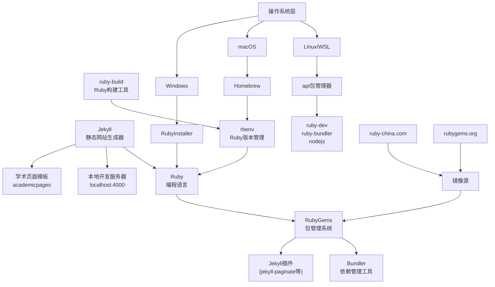

# Jekyll

[Jekyll • 简单静态博客网站生成器 - 将纯文本转换为静态博客网站](https://jekyllcn.com/)


## 安装

下面是一些工具与关系的介绍 

* **Ruby** → 编程语言（类似 **Python**）
* **RubyGems** → Ruby 的包管理系统（类似 **pip**）
* **Bundler** → 项目依赖管理工具（类似 **requirements.txt + pip-tools/poetry**，比 pip 单独用更接近 poetry/pipenv）
* **Jekyll 插件**（如 `jekyll-paginate` 等）→ 类似 **Django/Flask 的插件或扩展**
* **rbenv** → Ruby 版本管理工具（类似 **pyenv**）
* **ruby-build** → rbenv 的插件，用来编译安装 Ruby（类似 **pyenv 的插件 pyenv-install**）



### 安装 ruby

[Downloads](https://rubyinstaller.org/downloads/)

```shell
ruby -v
```


=== "linux or wsl"

    ```shell 
    sudo apt update && sudo apt upgrade -y
    sudo apt install ruby-dev ruby-bundler nodejs
    ```

    ```shell
    git clone https://github.com/rbenv/rbenv.git ~/.rbenv
    echo 'export PATH="$HOME/.rbenv/bin:$PATH"' >> ~/.bashrc
    echo 'eval "$(rbenv init - bash)"' >> ~/.bashrc
    source ~/.bashrc

    git clone https://github.com/rbenv/ruby-build.git ~/.rbenv/plugins/ruby-build
    ```


=== "macos"

    ```shell title="macos"
    brew install rbenv ruby-build
    ```


    ```shell title="macos"
    echo 'eval "$(rbenv init - zsh)"' >> ~/.zshrc
    source ~/.zshrc
    ```

```shell
rbenv install 3.2.4
rbenv global 3.2.4
exec $SHELL
```

```shell
ruby -v
```


```shell
$ which rbenv

> /home/user/.rbenv/bin/rbenv

$ rbenv versions
> 看看有没有3.2.4
```

### rubygems 
[下载 RubyGems](https://rubygems.org/pages/download)

下载后解压到任意路径。打开Windows的cmd界面，输入命令： 

```shell
$ cd 解压的路径
```


```shell title="升级 RubyGems"
gem update --system
```

### 切换镜像源

```shell
# 添加镜像源并移除默认源
gem sources --add https://mirrors.tuna.tsinghua.edu.cn/rubygems/ --remove https://rubygems.org/
```
```shell title="列出已有源"
gem sources -l # 应该只有镜像源一个
```

```shell title="验证"
*** CURRENT SOURCES ***
https://gems.ruby-china.com/
```

### 安装 Bundler

安装 一个名为 Bundler 的程序 —— 用于自动安装其他所需的程序
```shell
gem install bundler
```


### 安装`Jekyll`
```shell
gem install jekyll
```

!!! bug "ERROR: Could not find a valid gem 'sass-embedded' (~> 1.54) (required by 'jekyll' (>= 0)) in any repository ERROR: Possible alternatives: sass-embedded"
    这一步报错了，所以再把镜像源切换回官方的

    ```shell
    gem sources -a https://rubygems.org/
    ```

### 安装`jekyll-paginate`

```shell
gem install jekyll-paginate
```

验证 jekyll :  
```shell
jekyll -v
```


### 本地启动服务
在命令行中切换到你的网站仓库内
```shell
bundle install（这一步不要）

jekyll serve 
```

### 查看网站
 
`127.0.0.1:4000` 或 `localhost:4000`

注意：如端口被占用修改端口 

```shell
jekyll serve -P 5555
```

## [academicpages](https://github.com/academicpages/academicpages.github.io)

> 参考
> [Wanjia Zhao](https://wanjiazhao1203.github.io/#academicservices)
> [Leo / Zeqing Yuan](https://leoyuan.site/)

```shell
bundle config set --local path 'vendor/bundle'
```

```shell
bundle install
```


```shell
bundle exec jekyll serve -l -H localhost
```


