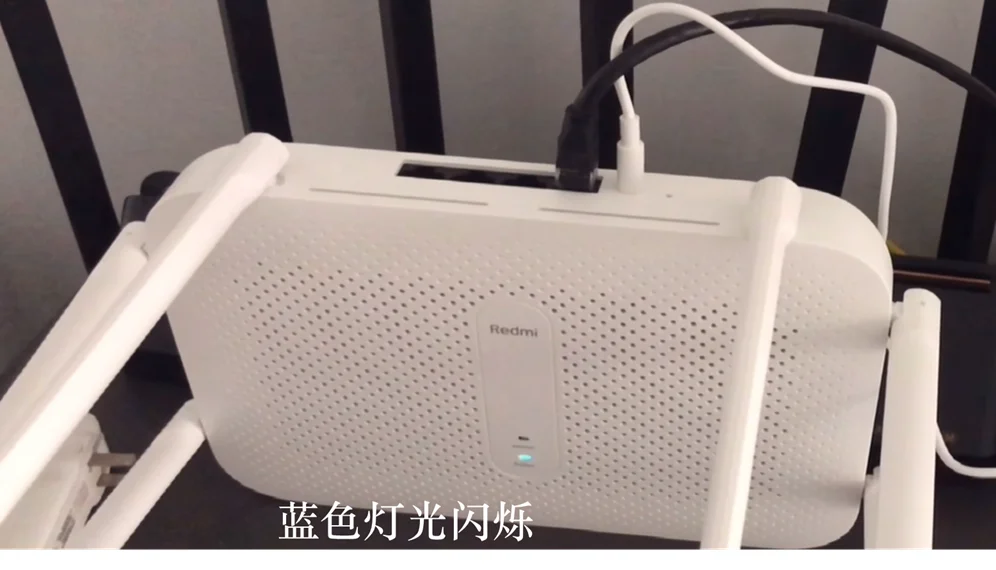
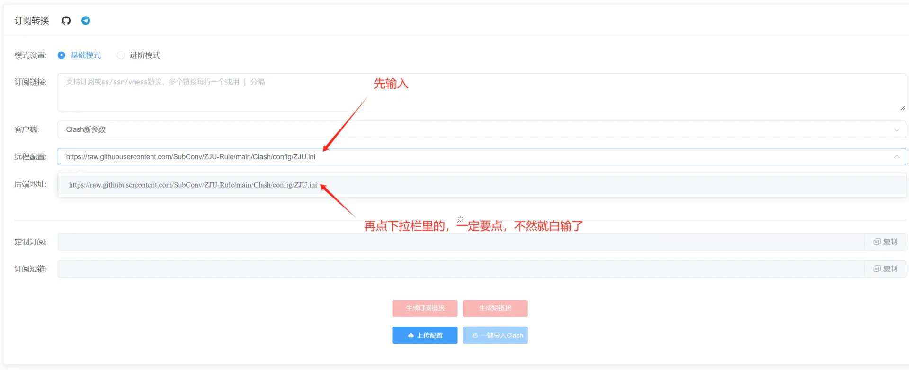
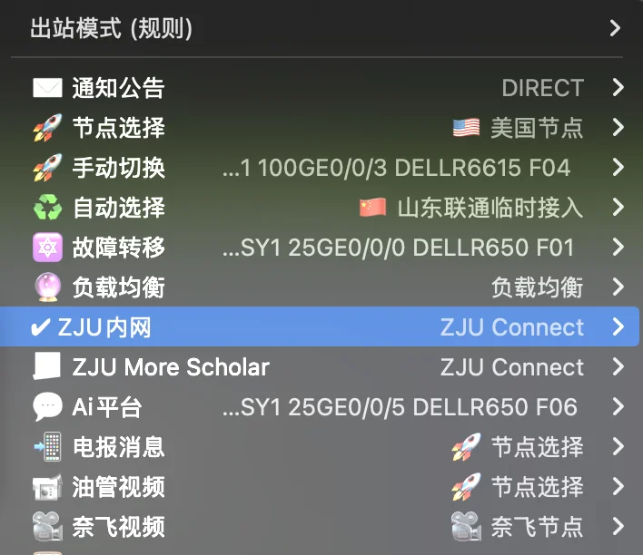

# Router


## 资料链接


[恩山无线论坛](https://www.right.com.cn/forum/forum.php)

https://github.com/SuLingGG

[紫金港纯小白路由器总结 - CC98论坛](https://www.cc98.org/topic/5177370)


## 环境配置
### **L2TP（Layer 2 Tunneling Protocol）**

[分享：玉泉 Windows 有线网 L2TP/IPv6 不死脚本 - CC98论坛](https://www.cc98.org/topic/5150942)

L2TP 是 **第二层隧道协议**，主要用于 **VPN（虚拟专用网络）** 连接，通常与 IPsec 结合使用，以增强安全性。  
特点：
- 仅提供隧道功能，不提供加密，需要结合 **IPSec** 才能实现安全的 VPN 连接。
- 适用于远程访问和站点间 VPN 连接。
- 支持 **PPP（点对点协议）**，可用于认证（如 PAP、CHAP）。
- 性能比 **OpenVPN** 等协议更优，延迟较低。


### LAN和WAN接口

路由器通常有两种主要的网络接口类型：LAN（Local Area Network，局域网）和WAN（Wide Area Network，广域网）。

#### LAN接口
- LAN接口用于连接**内部网络设备**，如电脑、手机、打印机等
- 通常有多个LAN端口（如4个RJ45接口）
- 默认分配私有IP地址（如192.168.1.x）
- 内置DHCP服务器，可自动为连接设备分配IP地址
- 支持有线（以太网）和无线（WiFi）连接
- 通常配置为网关，IP地址如192.168.1.1

#### WAN接口
- WAN接口用于连接**外部网络**（如运营商网络）
- 通常只有1个WAN端口
- 获取公网IP地址（由ISP分配）
- 负责NAT（网络地址转换）功能
- 处理内外网络之间的数据转发
- 可配置为DHCP客户端、静态IP或PPPoE等模式

#### 工作原理
1. WAN口连接互联网，获取公网IP
2. LAN口为内网设备提供私有IP
3. 路由器通过NAT技术，使内网设备共享WAN口的公网IP访问互联网
4. 同时提供防火墙功能，保护内网安全


### 固件 - Breed
Breed是一个适用于多种路由器的Bootloader（引导加载程序）：

- 功能特点：
  - 提供Web界面进行固件刷写
  - 支持固件备份和恢复
  - 可以修改MAC地址和其他参数
  - 具有故障恢复功能
  - 支持多种型号的路由器

- 优势：
  - 操作简单直观
  - 刷机失败的风险较低
  - 可以防止路由器变砖
  - 支持多种固件格式

!!! note "路由器坏块"
    路由器就像一台小电脑，它的存储器（类似于硬盘）有时会出现坏掉的区域，这些坏掉的区域叫做"坏块"。坏块主要是由于频繁更新系统、电压不稳定或者硬件本身老化等原因造成的。

    如果路由器出现坏块，可能会导致路由器无法正常开机、系统不稳定等问题。遇到这种情况，我们可以先用检测工具看看坏块的数量，如果坏块太多的话就需要考虑换新路由器了。平时使用时，尽量不要频繁更新系统，并且要使用稳定的电源，这样可以减少坏块产生的机会。
    
    ```html title="NAND坏块检查"
    http://192.168.31.1/cgi-bin/luci/;stok=CCCCCCCCCCC/api/misystem/set_config_iotdev?bssid=Xiaomi&user_id=longdike&ssid=%0A%5B%20-z%20%22%24(dmesg%20%7C%20grep%20ESMT)%22%20%5D%20%26%26%20B%3D%22Toshiba%22%20%7C%7C%20B%3D%22ESMT%22%0Auci%20set%20wireless.%24(uci%20show%20wireless%20%7C%20awk%20-F%20'.'%20'%2Fwl1%2F%20%7Bprint%20%242%7D').ssid%3D%22%24B%20%24(dmesg%20%7C%20awk%20'%2FBad%2F%20%7Bprint%20%245%7D')%22%0A%2Fetc%2Finit.d%2Fnetwork%20restart%0A
    ```
    
    运行代码后，你路由器的2.4g WiFi名称会改名成：比如  "ESMT"，"Toshiba"，"Toshiba 90 768"。 90和768是坏块。 如果ESMT或者Toshiba后面没数字，那恭喜你，没有坏块！！！


### **固件 - OpenWrt**

以Redmi AC2100为例，使用OpenWrt固件，配置IPv6 NAT。

<iframe src="//player.bilibili.com/player.html?isOutside=true&aid=786429754&bvid=BV1114y1X7TA&cid=1211226722&p=1&autoplay=0" scrolling="no" border="0" frameborder="no" framespacing="0" allowfullscreen="true"></iframe>

第一步，上电，连接网线（可以连接宿舍里面的网口，也可以将LAN口和WAN口直接连接起来），等待启动。进入管理后台 `192.168.31.1`, 更改网络名称以及密码

第二步，在，刷入降级固件。等待5-7min，重新进入网络。发现固件已经降级。观察浏览器界面，可以发现url部分有 `stok=xxxxxxxx`字样，记录stok字段

第三步，刷入不死固件。

在浏览器中输入下面的url，将CCCCC部分替换成为自己的stok字段

```html title="不死固件刷入"
http://192.168.31.1/cgi-bin/luci/;stok=CCCCCCCCCCCCCCCC/api/misystem/set_config_iotdev?bssid=Xiaomi&user_id=longdike&ssid=%0Acd%20%2Ftmp%0Acurl%20-o%20B%20-O%20https%3A%2F%2Fbreed.hackpascal.net%2Fr1286%2520%255b2020-10-09%255d%2Fbreed-mt7621-xiaomi-r3g.bin%20-k%20-g%0A%5B%20-z%20%22%24(sha256sum%20B%20%7C%20grep%20242d42eb5f5aaa67ddc9c1baf1acdf58d289e3f792adfdd77b589b9dc71eff85)%22%20%5D%20%7C%7C%20mtd%20-r%20write%20B%20Bootloader%0A
```

发现路由器指示灯由蓝色变为橙色，再变为蓝色，说明固件刷入成功。

需要断电，按住reset不动在开电10秒后松开reset。这样才能进入Breed后台。等到蓝色灯光闪烁的时候




!!! note "这里应该需要一个有网口的电脑"

使用网线连接路由器LAN口与电脑网口，设置电脑自动获取ip地址

```shell title="win + R 输入，进入网络管理"
ncpa.cpl
```


[【0608-精简稳定版OpenWrt】红米＆小米AC2100|多拨|超频|SmartDNS|IPV6，附刷机教程-小米无线路由器及小米网络设备-恩山无线论坛](https://www.right.com.cn/forum/thread-4027477-1-1.html)


[openwrt配置IPv6 NAT（2024） - CC98论坛](https://www.cc98.org/topic/5962343)
[搬到1舍后终于用上了IPV6 relay！！(附Redmi AC2100 OpenWrt固件) - CC98论坛](https://www.cc98.org/topic/5372458)

[紫金港 OpenWrt & Adguard Home 配置小总结 - CC98论坛](https://www.cc98.org/topic/5208534)
[OpenWrt@玉泉，从编译到日常使用的入门指南 - CC98论坛](https://www.cc98.org/topic/4957730/1#1)
[Openwrt配置合集——编译、l2tp、静态路由、IPV6(NAT6、Relay) - CC98论坛](https://www.cc98.org/topic/5076895)


[OpenWrt 路由器 MacVLAN+MWAN3 有线网多拨超详细指南 - CC98论坛](https://www.cc98.org/topic/5575720)
**OpenWrt** 是一个 **基于 Linux 的嵌入式路由器操作系统**，支持许多 **路由器和嵌入式设备**。  
特点：
- **开源**，可自定义路由器功能，如防火墙、QoS、VPN。
- **强大的软件包管理**，可安装 OpenVPN、L2TP、Shadowsocks、AdGuardHome 等。
- **支持 IPv6**，能方便地进行 IPv6 隧道或原生 IPv6 连接。
- **适合高级用户和开发者**，支持 Shell、Lua、Python 等编程语言。

### 固件 - Padavan

[浙大校园网Padavan固件路由器配置教程 - CC98论坛](https://www.cc98.org/topic/5213173)

[Padavan IPV6设置终结帖（RedMi AC2100） - CC98论坛](https://www.cc98.org/topic/5040118)

**Padavan** 是一个专门为 **MTK（联发科）路由器** 设计的 **第三方固件**，基于 ASUSWRT（华硕官方固件）进行改进，支持某些 **小米、华硕、斐讯** 路由器。  
特点：
- **轻量化、稳定、高效**，比 OpenWrt 更适合日常使用。
- **支持 IPv6、VPN（L2TP/PPTP）、Shadowsocks/V2Ray/SSR 代理**。
- **Web UI 友好**，适合普通用户配置。
- **不支持扩展软件包**，不像 OpenWrt 那样可自由安装插件。

### **IPv6（Internet Protocol Version 6）**
IPv6 是 **互联网协议的第六版**，用于替代 IPv4，解决地址耗尽问题。  
特点：
- **地址空间大**，使用 128 位地址，可提供几乎无限的 IP。
- **无 NAT（网络地址转换）**，设备可直接全球互联。
- **内置安全性**，支持 **IPSec**，增强安全性。
- **支持自动配置（SLAAC 和 DHCPv6）**，减少网络管理复杂度。
[校网 IPv6 终极指南 - CC98论坛](https://www.cc98.org/topic/5344325)
[有线IPv6环境下基于DNS64/NAT64突破外网出口限速的方法 - CC98论坛](https://www.cc98.org/topic/5108856)

[学校网络架构升级，l2tp和ipv6出了点问题 - CC98论坛](https://www.cc98.org/topic/5945388)

### 软路由


## NAS
[NAS / 硬路由：从入门到入门（网络存储 / Debian 方案 / 校园网认证 / Tailscale / Jellyfin / SMB / WebDAV / Docker / Immich 等） - CC98论坛](https://www.cc98.org/topic/5966741)‘


## BT & PT


## Proxy

!!! note "什么是代理"
    代理服务器是一种位于用户和互联网之间的服务器，用于转发用户请求。代理服务器的作用是代替用户发送请求，然后将响应返回给用户。代理服务器可以用于访问被封锁的网站、保护用户隐私、提高访问速度等。

### 正向代理

正向代理（forward proxy）：是一个位于客户端和目标服务器之间的服务器(代理服务器)，为了从目标服务器取得内容，客户端向代理服务器发送一个请求并指定目标，然后代理服务器向目标服务器转交请求并将获得的内容返回给客户端。


这种代理其实在生活中是比较常见的，比如访问外国网站技术，其用到的就是代理技术。


有时候，用户想要访问某国外网站，该网站无法在国内直接访问，但是我们可以访问到一个代理服务器，这个代理服务器可以访问到这个国外网站。这样呢，用户对该国外网站的访问就需要通过代理服务器来转发请求，并且该代理服务器也会将请求的响应再返回给用户。这个上网的过程就是用到了正向代理。


!!! note "正向代理，其实是代理服务器代理了客户端，去和目标服务器进行交互。"
    - 突破访问限制 
    - 提高访问速度
    - 隐藏客户端真实IP

[Clash for Windows 优雅地使用 TUN 模式接管系统流量 · Dejavu's Blog](https://blog.dejavu.moe/posts/cfw-tun/)

[Mythologyli/zju-connect: ZJU RVPN 客户端的 Go 语言实现](https://github.com/Mythologyli/ZJU-Connect)


### 反向代理
反向代理（reverse proxy）：是指以代理服务器来接受internet上的连接请求，然后将请求转发给内部网络上的服务器，并将从服务器上得到的结果返回给internet上请求连接的客户端，此时代理服务器对外就表现为一个反向代理服务器。

!!! note "反向代理，其实是代理服务器代理了目标服务器，去和客户端进行交互。"

[终于有人把正向代理和反向代理解释的明明白白了！-腾讯云开发者社区-腾讯云](https://cloud.tencent.com/developer/article/1418457)


### ZJU-Rule + ZJU-Connect

> [新的ZJU-Rule解决方案 - CC98论坛](https://www.cc98.org/topic/5769136/1#1)
> [Mythologyli/zju-connect: ZJU RVPN 客户端的 Go 语言实现](https://github.com/Mythologyli/ZJU-Connect)


原ZJU-Rule的公共服务已经停止了，但是我们仍然可以使用一些基于[subconverter](https://github.com/tindy2013/subconverter)的公共订阅转换  

**请注意，使用公共的订阅转换服务不能保证节点信息不被泄漏**  

1. 打开订阅转换网页 (以 [acl4ssr](https://acl4ssr-sub.github.io/) 为例)
2. 在远程配置（**不是后端地址**）输入`https://raw.githubusercontent.com/SubConv/ZJU-Rule/main/Clash/config/ZJU.ini`，并点击下拉栏中的地址  
  
3. 如果用 [acl4ssr](https://acl4ssr-sub.github.io/) 的话，有个后端地址选项，并不是所有后端口可用，自己试试看  
4. 在订阅链接位置处粘贴订阅链接，如果需要配置ZJU-Connect，需要在最后一行加入`tg://socks?server=127.0.0.1&port=1080&remarks=ZJU Connect`，然后在规则配置界面选择`ZJU-Connect`

```shell title="示例,填在订阅链接的位置"
ss://aes-256-gcm:password@1.1.1.1:443#测试节点 
ssr://MTI3LjAuMC4xOjEyMzQ6YXV0aF9zaGExOnJjNC1tZDU6dGxzMS4yX3RpY2tldF9hdXRoOnZWMk5EVXpNdw 
vmess://eyJhZGQiOiIxLjEuMS4xIiwicG9ydCI6NDQzLCJpZCI6IjEyMzQ1Njc4LWFiY2QtMTIzNC1hYmNkIn0=   
tg://socks?server=127.0.0.1&port=1080&remarks=ZJU Connect
```




```
你的设备 → TUN 虚拟网卡 → Clash（规则匹配,ZJU-Rule） → SOCKS5/V2Ray 代理(ZJU-Connect) → 目标网站
```


!!! note "Some Protocols"

    === "SS（Shadowsocks）"
          - **特点**：简单高效，无混淆，易被封锁。  
          - **格式**：  
          ```shell title="格式"
          ss://加密方式:密码@服务器IP:端口#备注  
          ```
          ```shell title="示例"
          ss://aes-256-gcm:password@1.1.1.1:443#测试节点  
          ```
    
    === "SSR（ShadowsocksR）"
          - **特点**：支持混淆和协议插件，抗封锁更强。  
          - **格式**：  
          ```shell title="格式"
          ssr://Base64编码(IP:端口:协议:加密:混淆:密码/?参数)  
          ```
    
          ```shell title="示例"
          ssr://MTI3LjAuMC4xOjEyMzQ6YXV0aF9zaGExOnJjNC1tZDU6dGxzMS4yX3RpY2tldF9hdXRoOnZWMk5EVXpNdw  
          ```
    
    === "VMess（V2Ray协议）"
          - **特点**：动态端口，抗封锁强，配置复杂。  
          - **格式**： 
    
          ```shell title="格式"
          vmess://Base64编码({"add":"IP","port":"443","id":"UUID"})  
          ```
    
          ```shell title="示例"
          vmess://eyJhZGQiOiIxLjEuMS4xIiwicG9ydCI6NDQzLCJpZCI6IjEyMzQ1Njc4LWFiY2QtMTIzNC1hYmNkIn0=  
          ```


ZJU-Connect 服务配置[zju-connect/docs/service.md at main · Mythologyli/zju-connect](https://github.com/Mythologyli/zju-connect/blob/main/docs/service.md)

[PlistEdit Pro - Advanced Mac plist and JSON editor](https://www.fatcatsoftware.com/plisteditpro/)


### Subconverter
**Subconverter** 是一个开源工具（GitHub项目：[tindy2013/subconverter](https://github.com/tindy2013/subconverter)），主要用于 **订阅链接转换**，常见于科学上网场景。  

**核心功能**：
- **订阅格式转换**：  
  支持不同代理客户端（如 Clash、Surge、Quantumult、Shadowrocket）的订阅格式互转。
  ```
  V2Ray订阅 → Clash订阅
  ```
- **规则合并/自定义**：  可合并多个订阅，或添加自定义规则（如去广告、分流）。  
- **远程订阅缓存**：  避免频繁请求原始订阅链接，提高访问速度。  


Subconverter 的工作原理
```
用户请求 → Subconverter 服务器 → 获取原始订阅 → 转换格式 → 返回给用户
```
1. **输入订阅链接**：  
   - 支持 `vmess://`、`ss://`、`trojan://` 等协议。  
2. **规则处理**：  
   - 根据配置文件（`pref.ini`、`rule.txt`）修改规则。  
3. **输出目标格式**：  
   - 生成 Clash/Surge 等客户端的配置文件。  

**关键技术点**：
- **模板引擎**：使用 Jinja2 等模板生成不同客户端的配置文件。  
- **缓存机制**：减少对原始订阅的频繁请求。  


### Clash（代理工具）
Clash 是一个开源的网络代理工具，支持多种代理协议（如 HTTP、SOCKS5、VMess、Trojan 等），常用于科学上网或流量管理。

核心功能：

- 规则分流（如国内直连、国外走代理）。
- 支持订阅多个代理节点。
- 提供 RESTful API 进行动态控制。


### TUN/TAP（虚拟网络设备）
**TUN/TAP** 是操作系统提供的虚拟网络设备：
- **TUN（隧道模式）**：处理 **IP 层（三层）** 数据包（如 VPN）。
- **TAP（以太网模式）**：处理 **数据链路层（二层）** 数据包（如虚拟网卡）。

在 **Clash** 中，`TUN Mode` 可以让所有流量（包括系统全局流量）经过 Clash 代理，而无需手动配置每个应用的代理。


### 上下游（Upstream/Downstream）
在网络流量转发中：
- **上游（Upstream）**：指 **流量来源**，比如你的本地设备（Clash 客户端）。
- **下游（Downstream）**：指 **流量去向**，比如代理服务器（SOCKS5/HTTP 代理、VPN 等）。

**在 Clash 中的关系**：
```
你的设备（上游） → Clash（规则匹配） → 代理服务器（下游）
```
- Clash 根据规则决定流量是直连（Direct）还是转发到代理服务器（Proxy）。


### SOCKS5（代理协议）
**SOCKS5** 是一种网络代理协议，比 HTTP 代理更底层，支持：
- TCP/UDP 流量转发。
- 认证（用户名/密码）。
- 适用于游戏、BT 下载、全局代理等。

**与 HTTP 代理的区别**：
| 特性       | SOCKS5               | HTTP 代理           |
|------------|----------------------|---------------------|
| 协议层级   | 传输层（TCP/UDP）    | 应用层（HTTP/HTTPS）|
| 支持 UDP   | ✅                   | ❌                  |
| 适用场景   | 全局代理、游戏       | 浏览器网页访问      |

**在 Clash 中的应用**：
- Clash 可以作为 SOCKS5 服务器，供其他设备（如手机、游戏机）连接。
- 也可以使用外部 SOCKS5 代理作为下游（如 `socks5://127.0.0.1:1080`）。

1. **Clash + TUN 模式**（全局代理）：

```
你的设备 → TUN 虚拟网卡 → Clash（规则匹配） → SOCKS5/V2Ray 代理 → 目标网站
```

2. **反向代理 + SOCKS5**（内网穿透）：

```
用户访问 [https://your-domain.com] → Nginx（反向代理）→ 本地 SOCKS5（Clash）→ 目标服务
```


## 静态路由

静态路由是一种需要管理员手动配置的特殊路由。静态路由比动态路由使用更少的带宽，并且不占用 CPU 资源来计算和分析路由更新。但是，当网络发生故障或者拓扑发生变化后，静态路由不会自动更新，必须手动重新配置。

[为什么要设置静态路由 - CC98论坛](https://www.cc98.org/topic/5650063)
### 静态路由的组成

静态路由主要包括 5 个主要的参数：目的 IP 地址和子网掩码、出接口和下一跳 IP 地址、优先级。

1、目的 IP 地址/子网掩码

目的 IP 地址就是路由要到达的目的主机或者目的网络的 IP 地址，子网掩码就是目的地址所对应的子网掩码。当目的地址和子网掩码全为 0 的时候，表示静态缺省路由（默认路由）。

2、出接口和下一跳地址

根据不同的出接口类型，在配置静态路由的时候，可以选择出接口的方式，也可以指定下一跳 IP 地址，还可以同时指定出接口和下一跳 IP 地址。

- 对于点对点类型的接口，只需指定出接口。当然，也可以同时指定下一跳 IP 地址，但这时已没有意义。
- 对于 NBMA 类型的接口，只需配置下一跳 IP 地址，当然，也可以同时指定出接口。
- 对于广播类型的接口和 VT（ virtual-template ）接口，必须指定下一跳 IP 地址，有些情况下还需要指定出接口。

3、静态路由的优先级

对于不同的静态路由，可以为它们配置不同的优先级。优先级值越小表示静态路由的优先级越高。配置到达相同目的地的多条静态路由，如果指定相同的优先级，则可实现负载分担；如果指定不同优先级，则可以实现路由备份。


