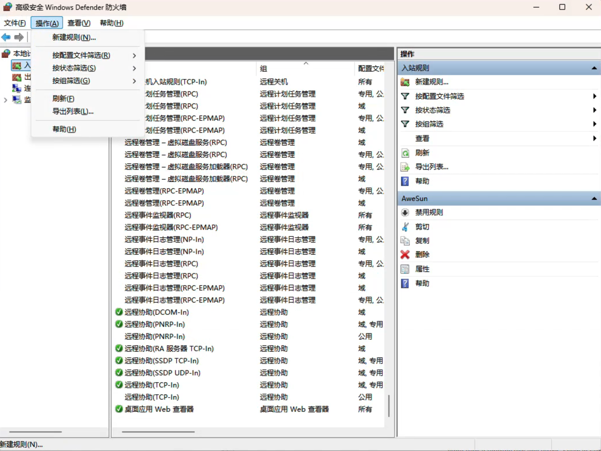
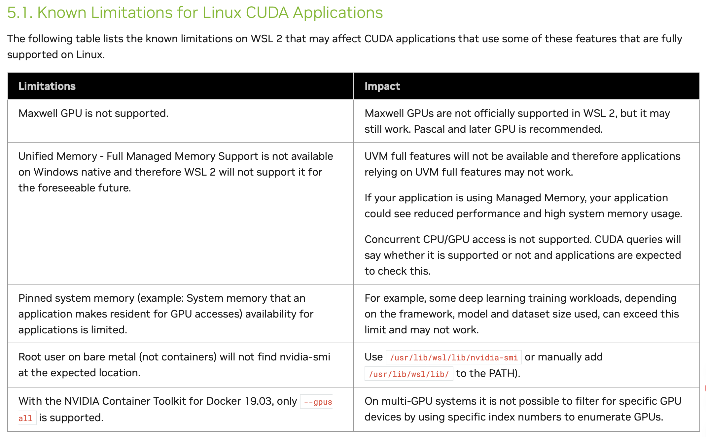
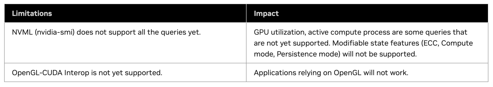
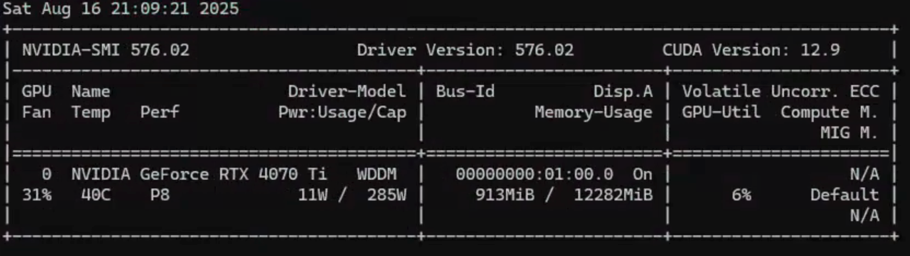

# WSL

## 安装
### 安装系统
```shell title="powershell"
Enable-WindowsOptionalFeature -Online -FeatureName Microsoft-Windows-Subsystem-Linux
Enable-WindowsOptionalFeature -Online -FeatureName VirtualMachinePlatform
```
第一个结束不要重启，第二个结束一起重启


```shell title="同样的效果"
dism.exe /online /enable-feature /featurename:Microsoft-Windows-Subsystem-Linux /all /norestart
dism.exe /online /enable-feature /featurename:VirtualMachinePlatform /all /norestart
```

访问 程序和功能 子菜单 `打开或关闭Windows功能`，勾选`适用于Linux的Windows子系统`和`虚拟机平台`


```shell title="cmd更新wsl"
wsl --update
```

```shell title="cmd更新wsl"
wsl --set-default-version 2
```

```shell title="cmd更新wsl"
wsl --set-version <distro> <version>
```


[Ubuntu 20.04.6 LTS - Windows官方下载 | 微软应用商店 | Microsoft Store](https://apps.microsoft.com/detail/9mttcl66cpxj?hl=zh-cn&gl=US)

点击安装，等待安装完成


打开cmd，打开ubuntu的标签，设置用户名和密码，可以进入子系统
### 系统换源


### SSH - wsl基础配置

> 参考[【linux】SSH 连接 WSL2 本地环境的完整步骤](https://blog.csdn.net/2201_75772333/article/details/147534639)

```shell title="ssh 安装"
sudo apt update
sudo apt install openssh-server -y
sudo apt install net-tools
```


```shell title="ssh 配置"
sudo vim /etc/ssh/sshd_config
```

搜索下面的内容，更改或取消注释

这样设置可以同时监听22和2222端口，方便使用

```text title="ssh 配置"
Port 22
Port 2222
ListenAddress 0.0.0.0
PasswordAuthentication yes
PermitRootLogin yes
```

```shell title="ssh 启动"
sudo systemctl start ssh
```


```shell title="ssh 重启"
sudo systemctl restart ssh
```

```shell title="ssh 状态"
systemctl status ssh
```

```shell title="确认是2222端口"
sudo ss -tlnp | grep ssh

netstat -tlnp | grep ssh
```


你应该能看到 `0.0.0.0:2222` 或 `[::]:2222`。

```shell title="ssh 连接"
ssh -p 2222 <user>@<host>
```

```shell title="ssh 免密登陆"
ssh-copy-id -p 2222 <user>@<host>
```

!!! note "开机自启"
    如果不配置开机自启动的话，需要手动启动ssh服务

    ```shell title="ssh 开机自启"
    sudo systemctl enable ssh
    ```


!!! note "免密登陆"

    下面是配置免密登陆的步骤
    
    ```shell title="powershell生成密钥"
    ssh-keygen -t ed25519 -C "wsl-ssh-key"
    ```
    
    ```shell title="ssh 查看密钥"
    cat ~\.ssh\id_ed25519.pub
    ```
    
    复制输出的内容（以 `ssh-ed25519` 开头的一行）
    
    在 WSL2 中粘贴到 `~/.ssh/authorized_keys`：
    
    ```shell title="ssh 粘贴公钥"
    mkdir ~/.ssh
    echo "粘贴的公钥内容" >> ~/.ssh/authorized_keys
    chmod 600 ~/.ssh/authorized_keys
    ```

### SSH - windows 转发


1. WSL IP 

在 WSL 里执行：

```shell title="WSL IP"
ip addr show eth0
```

你会看到类似：

```shell title="WSL IP"
inet 172.22.183.12/20 brd 172.22.191.255 scope global eth0
```

这里的 `172.22.183.12` 就是 WSL 的内部 IP。
⚠️ 注意：WSL 重启后，这个 IP 会变化。


确认 Windows 主机 IP, 在 Windows PowerShell 里运行：

```shell
ipconfig
```

找到你要让别人访问的网络接口（例如 Wi-Fi 或 Ethernet），记下 IPv4 地址，比如 `192.168.1.100`。


2. Windows 上配置端口转发


在 Windows PowerShell（管理员权限）里执行：

```shell title="Windows 上配置端口转发"
netsh interface portproxy add v4tov4 listenport=2222 listenaddress=0.0.0.0 connectport=2222 connectaddress=<WSL_IP>
```

替换 `<WSL_IP>` 为上一步查到的 WSL IP（例如 `172.22.183.12`）。

这个命令意思是：当别人访问 `Windows_IP:2222`，流量会被转发到 `WSL_IP:2222`。

也可以使用defender防火墙添加规则




3. 开放防火墙

```shell title="开放防火墙"
netsh advfirewall firewall add rule name="OpenSSH WSL 2222" dir=in action=allow protocol=TCP localport=2222
```

4. 测试连接

在另一台机器上执行：

```bash title="ssh 连接"
ssh -p 2222 user@192.168.1.100
```

这里 `192.168.1.100` 是 Windows 主机的局域网 IP。


后台自动运行的 PowerShell 脚本，它会定时检查 WSL 的 IP 是否变化，如果变了就自动更新 Windows 的端口转发规则

```powershell title="WSL 端口转发后台守护脚本"
# WSL 端口转发后台守护脚本
# 保存为 wsl-portproxy-daemon.ps1 并用 PowerShell 管理员身份运行

$listenPort = 2222   # Windows 对外暴露的端口
$connectPort = 2222  # WSL 内部 sshd 端口
$interval = 30       # 检查间隔（秒）

function Get-WslIP {
    try {
        $ip = wsl hostname -I 2>$null
        if ($ip) {
            return $ip.Trim().Split(" ")[0]
        }
    } catch {
        return $null
    }
    return $null
}

$lastIP = ""

Write-Host "🚀 WSL 端口转发守护进程启动 (每 $interval 秒检查一次)" -ForegroundColor Cyan

while ($true) {
    $wslIP = Get-WslIP
    if ($wslIP -and $wslIP -ne $lastIP) {
        Write-Host "✅ 检测到 WSL IP: $wslIP"

        # 删除旧规则
        netsh interface portproxy delete v4tov4 listenport=$listenPort listenaddress=0.0.0.0 2>$null | Out-Null

        # 添加新规则
        netsh interface portproxy add v4tov4 listenport=$listenPort listenaddress=0.0.0.0 connectport=$connectPort connectaddress=$wslIP

        Write-Host "🔄 已更新端口转发规则: Windows:0.0.0.0:$listenPort → WSL:$wslIP:$connectPort" -ForegroundColor Green

        $lastIP = $wslIP
    }
    Start-Sleep -Seconds $interval
}
```

1. 将脚本保存为 `wsl-portproxy-daemon.ps1`。

2. 用 管理员权限 启动 PowerShell。

3. 运行它会在后台循环运行，每隔 30 秒检查一次 WSL IP，若变化就自动更新转发规则。

```shell title="运行脚本"
powershell.exe -ExecutionPolicy Bypass -File .\wsl-portproxy-daemon.ps1
```


### 安装cuda


!!! note "Limitations&Banned Features"
    
    === "Limitations"
    
        
    
    === "Banned Features"
    
        


首先查看电脑支持的CUDA版本

```shell title="查看CUDA版本"
nvidia-smi
```

右上角是支持的cuda版本



根据[CUDA Toolkit 12.9 Downloads | NVIDIA Developer](https://developer.nvidia.com/cuda-12-9-0-download-archive?target_os=Linux&target_arch=x86_64&Distribution=WSL-Ubuntu&target_version=2.0&target_type=deb_local)，选择对应的版本

```shell title="CUDA Toolkit Installer V12.9"
wget https://developer.download.nvidia.com/compute/cuda/repos/wsl-ubuntu/x86_64/cuda-wsl-ubuntu.pin
sudo mv cuda-wsl-ubuntu.pin /etc/apt/preferences.d/cuda-repository-pin-600
wget https://developer.download.nvidia.com/compute/cuda/12.9.0/local_installers/cuda-repo-wsl-ubuntu-12-9-local_12.9.0-1_amd64.deb
sudo dpkg -i cuda-repo-wsl-ubuntu-12-9-local_12.9.0-1_amd64.deb
sudo cp /var/cuda-repo-wsl-ubuntu-12-9-local/cuda-*-keyring.gpg /usr/share/keyrings/
sudo apt-get update
sudo apt-get -y install cuda-toolkit-12-9
```

最后记得把路径添加进`PATH`

```shell title="添加CUDA路径"
export PATH="/usr/local/cuda-12.9/bin:$PATH"
```

!!! note "添加路径"
    [CUDA Installation Guide for Linux — Installation Guide for Linux 13.0 documentation](https://docs.nvidia.com/cuda/cuda-installation-guide-linux/index.html#post-installation-actions)

    In addition, when using the runfile installation method, the `LD_LIBRARY_PATH` variable needs to contain `/usr/local/cuda-13.0/lib64` on a 64-bit system and `/usr/local/cuda-13.0/lib` for the 32 bit compatibility:
    
    ```shell title="添加路径"
    $ export LD_LIBRARY_PATH=${LD_LIBRARY_PATH}:/usr/local/cuda-13.0/lib64
    ```
    
    Note that the above paths change when using a custom install path with the runfile installation method.


!!! note "V13.0"
    如果是13.0，则可以安装13.0，参考NVIDIA 官方文档 [CUDA on WSL User Guide — CUDA on WSL 13.0 documentation](https://docs.nvidia.com/cuda/wsl-user-guide/index.html)


    可以前往[CUDA Toolkit 13.0 Downloads | NVIDIA Developer](https://developer.nvidia.com/cuda-downloads?target_os=Linux&target_arch=x86_64&Distribution=WSL-Ubuntu&target_version=2.0&target_type=deb_local)这个网页查看具体教程，这里截取使用的命令（2025-8-16）
    
    ```shell title="CUDA Toolkit Installer V13.0"
    wget https://developer.download.nvidia.com/compute/cuda/repos/wsl-ubuntu/x86_64/cuda-wsl-ubuntu.pin
    sudo mv cuda-wsl-ubuntu.pin /etc/apt/preferences.d/cuda-repository-pin-600
    wget https://developer.download.nvidia.com/compute/cuda/13.0.0/local_installers/cuda-repo-wsl-ubuntu-13-0-local_13.0.0-1_amd64.deb
    sudo dpkg -i cuda-repo-wsl-ubuntu-13-0-local_13.0.0-1_amd64.deb
    sudo cp /var/cuda-repo-wsl-ubuntu-13-0-local/cuda-*-keyring.gpg /usr/share/keyrings/
    sudo apt-get update
    sudo apt-get -y install cuda-toolkit-13-0
    ```
    
    像lz就不小心装错了，在第三步的时候发现，
    
    ```shell title="删除CUDA Toolkit Installer V13.0"
    sudo dpkg -r cuda-repo-wsl-ubuntu-13-0-local
    sudo dpkg --purge cuda-repo-wsl-ubuntu-13-0-local
    ```

### nsight-systems
在官网上进行下载

```shell title="安装nsight-systems"
chmod a+x NsightSystems-linux-public-2025.5.1.121-3638078.run
sudo ./NsightSystems-linux-public-2025.5.1.121-3638078.run
```


```shell title="添加路径"
export PATH="/opt/nvidia/nsight-systems/2025.5.1/bin/:$PATH"
```

!!! attention "这里要注意PATH的先后顺序，在前面路径下的文件会优先被调用"
    比如`/usr/local/cuda-12.9/bin`和`/usr/local/cuda-13.0/bin`，如果`/usr/local/cuda-12.9/bin`在前面，那么`nvcc`会优先使用`/usr/local/cuda-12.9/bin`下的文件，而不是`/usr/local/cuda-13.0/bin`下的文件。

    比如我有两个版本的Nsight-systems，一个在`/opt/nvidia/nsight-systems/2025.5.1`，一个在`/opt/nvidia/nsight-systems/2025.3.0`，如果`/opt/nvidia/nsight-systems/2025.5.1`的PATH路径`/opt/nvidia/nsight-systems/2025.5.1/bin`在前面，那么`nsight-systems`会优先使用`/opt/nvidia/nsight-systems/2025.5.1/bin`下的文件，而不是`/opt/nvidia/nsight-systems/2025.3.0/bin`下的文件。

!!! attention "注意版本问题"
    高版本的nsight-system生成的文件，低版本的nsight-system无法打开。

### nsight-compute

```shell title="安装nsight-compute"
chmod a+x nsight-compute-linux-2025.3.0.19-36273991.run
sudo ./nsight-compute-linux-2025.3.0.19-36273991.run
```

```shell title="添加路径"
export PATH="/usr/local/NVIDIA-Nsight-Compute/:$PATH"
```


## 问题

### 不要设置windows环境变量

在wsl 的 ubuntu中编辑`/etc/wsl.conf`，输入：

```shell
vi /etc/wsl.conf
```


```shell title="/etc/wsl.conf"
[interop]
enabled = false
appendWindowsPath = false
```

```shell title="powershell重启wsl"
wsl --shutdown
```
