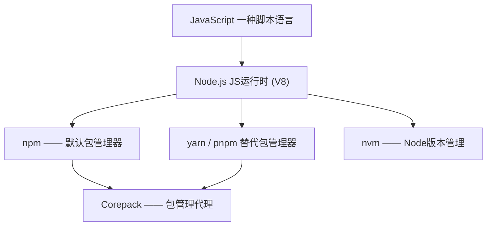

---
status:new
---
# JavaScript

## 基础简介


* **JavaScript**：一种脚本语言，最初用于网页交互，现在可运行在前端和后端。
* **Node.js**：基于 V8 引擎的 JavaScript 运行时，让 JS 能在服务器和本地运行。
* **npm**：Node.js 自带的包管理器，用来安装和管理依赖。（Node Package Manager）
* **yarn/pnpm**：npm 的替代包管理器，提供更快或更高效的依赖管理方式。
* **nvm**：Node.js 版本管理工具，允许在同一台机器上切换不同的 Node.js 版本。（Node version manager）
* **Corepack**：Node.js 自带的包管理代理，用于统一和固定 npm/yarn/pnpm 版本。





## Nodejs

一个 JavaScript 运行时环境，基于 Chrome V8 引擎。

让你可以在浏览器外（如服务器端）运行 JavaScript。

作用类似于：

- Python 的解释器 python
- Java 的虚拟机 java

没有 Node.js，就不能直接在命令行运行 .js 程序。


### 安装


[Node.js — Download Node.js®](https://nodejs.org/en/download)

使用这个网站上面的安装的指令


[windows安装npm教程\_npm 安装-CSDN博客](https://blog.csdn.net/zhouyan8603/article/details/109039732)


[Node.js — Run JavaScript Everywhere](https://nodejs.org/en/)

安装以后可以把nodejs的本地仓库从c盘移出来

```shell
npm config set prefix "<path>\nodejs\node_global"
npm config set cache "<path>\nodejs\node_cache"
```
### 卸载

```
sudo npm uninstall npm -g
```

```shell
cd /usr/local/lib/node_modules/

rm -rf npm
```

```shell
sudo apt-get remove nodejs
sudo apt-get remove npm
sudo apt-get remove node
```

```shell
node -v
npm -v 
```


## NPM - 包管理器
npm (Node Package Manager)

Node.js 自带的包管理工具。用来下载、安装和管理 JavaScript 库/框架。

类似于：

- Python 的 pip
- Java 的 maven/gradle


```bash title="检查版本"
node -v   # 查看 Node.js 版本
npm -v    # 查看 npm 版本
```


```bash title="初始化项目"
npm init
```

它会一步一步问你项目名、版本号、作者等。
如果只想快速生成默认配置：

```bash
npm init -y
```

会生成一个 `package.json` 文件，记录项目信息和依赖。

### 增

```bash
npm install 包名
```


```bash
npm i 包名
```

会把包写进 `node_modules/`，同时在 `package.json` 的 `dependencies` 里记录。


=== "全局安装"

    ```bash title="全局安装"
    npm install -g 包名
    ```

=== "只在开发环境安装"

    ```bash title="只在开发环境需要"
    npm install 包名 --save-dev
    ```

    缩写：

    ```bash
    npm i 包名 -D
    ```

    写入 `devDependencies`，比如测试框架 jest、打包工具 webpack。


### 删

```bash
npm uninstall 包名
```

缩写：

```bash
npm un 包名
```

### 查


```bash title="查看已安装的依赖"
npm list
```

```bash title="更新依赖"
npm update 包名
```

```bash title="清除缓存"
npm cache clean --force
```

```bash title="升级npm"
npm install -g npm
```

## NVM
[nvm-sh/nvm](https://github.com/nvm-sh/nvm): Node Version Manager - POSIX-compliant bash script to manage multiple active node.js versions


```shell
wget -qO- https://raw.githubusercontent.com/nvm-sh/nvm/v0.40.2/install.sh | bash
```

```shell
export NVM_DIR="$([ -z "${XDG_CONFIG_HOME-}" ] && printf %s "${HOME}/.nvm" || printf %s "${XDG_CONFIG_HOME}/nvm")"
[ -s "$NVM_DIR/nvm.sh" ] && \. "$NVM_DIR/nvm.sh" --no-use # This loads nvm, without auto-using the default version
```

```shell title="验证"
nvm -vx
```

### 下载
使用NVM进行管理

```shell
nvm install stable
```


### 更换版本
```
nvm install 22
nvm use 22
```


## Vue

```shell title="cmd验证安装"
npm -v
npm info vue
```

```shell title="配置镜像站点"
npm config set registry=http://registry.npm.taobao.org 
```

```
npm install vue -g
npm install vue-router -g
```

```shell title="创建vue工程"
vue init webpack vue01
cd vue01
npm install
npm run dev

npm run build
```

成功界面，提示打开地址http://localhost:8080

