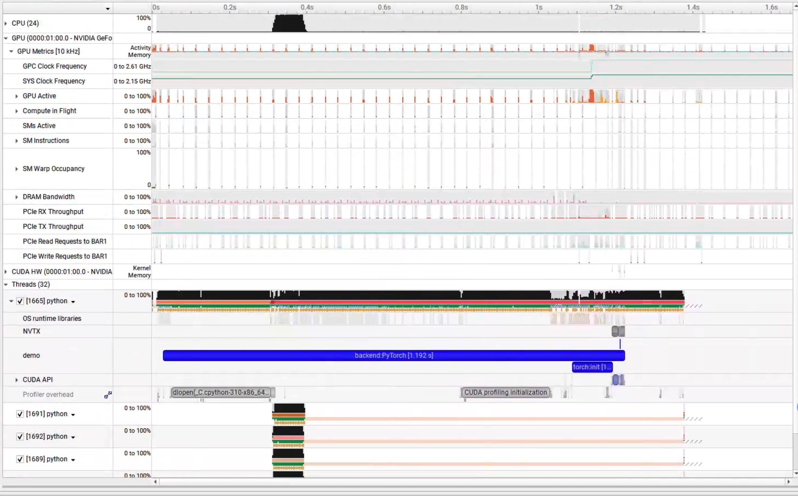
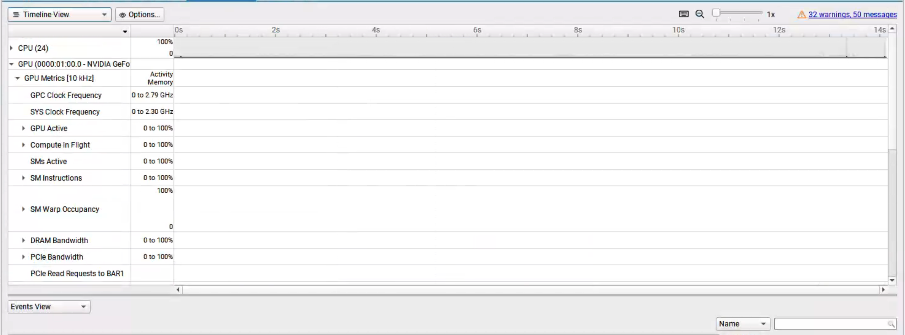

# NVIDIA Toolkit

[TOC]


## NVTX

### 使用
- [nvtx · PyPI](https://pypi.org/project/nvtx/)
- [nvtx · API Document](https://nvidia.github.io/NVTX/python/reference.html#nvtx.Domain.start_range)


### 案例


```python title="demo.py"
import time
import nvtx

@nvtx.annotate(color="blue")
def my_function():
    for i in range(5):
        with nvtx.annotate("my_loop", color="red"):
            time.sleep(i)

my_function()
```


## Nsight System 下载


!!! note "Acknowledgements"

    视频教程：
    
    - [Nsight Systems - 油管官方教程](https://www.youtube.com/playlist?list=PL5B692fm6--uxmZ5qUnF-y5xaF8enRZGg)
      - [Nsight Systems Timeline - YouTube](https://www.youtube.com/watch?v=TGChXcFm-Yo)
      - [如何在 CUDA C/C++ 中重叠数据传输 |NVIDIA 技术博客 --- How to Overlap Data Transfers in CUDA C/C++ | NVIDIA Technical Blog](https://developer.nvidia.com/blog/how-overlap-data-transfers-cuda-cc/)
    
    安装教程：
    
    - [isaid22/Nvidia-Nsight-Systems-Setup: Shows how to set up Nsight](https://github.com/isaid22/Nvidia-Nsight-Systems-Setup)
    - [Jetson Nano - Nsight Systems target not supported - Nsight Systems / Profiling Embedded Targets - NVIDIA Developer Forums](https://forums.developer.nvidia.com/t/jetson-nano-nsight-systems-target-not-supported/256990)
    - [How to use Nvidia Nsight Systems remote session using SSH - Nsight Systems / Profiling Linux Targets - NVIDIA Developer Forums](https://forums.developer.nvidia.com/t/how-to-use-nvidia-nsight-systems-remote-session-using-ssh/222960/6)
    
    使用案例：
    
    - [Nsight System经验 | 奔跑的IC](https://zmurder.github.io/CUDA/Nsight/Nsight%20System%E7%BB%8F%E9%AA%8C/)
    - [vLLM性能分析案例 - 知乎](https://zhuanlan.zhihu.com/p/18702718502)
    - [Profiling LLM Training Workflows on NVIDIA Grace Hopper - NVIDIA Developer](https://developer.nvidia.com/zh-cn/blog/profiling-llm-training-workflows-on-nvidia-grace-hopper/)
    - [The Study of Nsight Systerm – 子暘的blog](https://zhangweihao.cn/the-study-of-nsight-systerm/)
    - [使用Nsight Profiling工具对大模型进行性能调优 - 极术社区 - 连接开发者与智能计算生态](https://aijishu.com/a/1060000000483241)


​    

​    

​    


​    


`nsys` 是 NVIDIA Nsight Systems 的命令行工具，可以用于分析 CUDA 应用程序的性能和行为


### 安装

下载地址为：https://developer.nvidia.com/nswight-systems。

```shell
chmod +x <installer-name>.run
./<installer-name>.run
```

添加 nsys 到系统的 PATH 环境变量中。为了能够在终端中直接使用 nsys 命令，您需要将安装目录中的 bin 文件夹添加到系统的 PATH 环境变量中。可以使用以下命令将 nsys 添加到 PATH 环境变量中：

```shell title="换成实际安装路径"
export PATH="/opt/nvidia/nsight-systems/bin:$PATH"
```


nsys profile --trace=cuda,cudnn,cublas,osrt,nvtx python demo.py


### profile - CLI - 基本使用

- [Nsight-Systems](https://docs.nvidia.com/nsight-systems/UserGuide/index.html)


简单理解：`nsys profile [options] <application>` 会启动一个应用并对它进行系统级和 CUDA 级的性能分析。常用参数分几类：

**采样与回溯**

* `-b, --backtrace=`：控制采样时是否收集调用栈，默认 `lbr`（低开销硬件支持），也可以 `fp`、`dwarf` 或 `none`。
* `-s, --sample=`：是否做 CPU IP/backtrace 采样（`process-tree`、`system-wide`、`none`）。
* `--sampling-period=`：CPU 采样周期（默认 1,000,000 cycles）。

**控制采集范围**

* `-c` or `--capture-range`：决定什么时候开始采集（如 `cudaProfilerApi`, `nvtx`, `hotkey`）。
* `--capture-range-end`：采集范围结束后的行为，比如 `stop`、`repeat` 等。
* `--duration` or `-d`：直接设置采集时长（秒）。

**CUDA 相关**

* `-t` or `--trace=`：选择要跟踪的 API，默认 `cuda,nvtx,osrt,opengl`。
  例如 `--trace=cuda,cublas,cuDNN`。
* `--cuda-event-trace=`：跟踪 CUDA Event，同步点。
* `--cuda-memory-usage=`：跟踪 GPU 内存使用情况。
* `--cuda-trace-all-apis=`：是否采集所有 CUDA API。
* `--cudabacktrace`：给特定 CUDA API 调用收集 backtrace。
* `--cuda-um-*`：跟踪 unified memory 的 CPU/GPU page fault。

**GPU / 系统指标**

* `--gpu-metrics-devices=`：采集 GPU 指标（默认 none，可以选 `all` 或具体 GPU ID）。
* `--gpu-metrics-frequency=`：GPU 指标采样频率（Hz，默认 10000）。
* `--nic-metrics=`：采集网络适配器指标。
* `--storage-metrics=`：采集存储吞吐指标（实验性）。

**Python / 深度学习支持**

* `--python-functions-trace=`：指定 JSON 来跟踪 Python 函数（PyTorch、Dask 已有预设）。
* `--pytorch=`：启用 PyTorch 特殊标记，如 `autograd-nvtx`。
* `--dask=`：类似，用于 Dask。

**输出**

* `-o, --output=`：结果文件前缀（默认 `report1`）。
* `--export=`：选择额外的导出格式（`sqlite`, `json`, `text` 等）。
* `--stats=`：是否生成汇总统计。


✅ **常用命令示例**（假设要分析一个 PyTorch 脚本 `train.py`）：

```bash
nsys profile -o result --trace=cuda,cublas,cudnn,nvtx,osrt \
  --gpu-metrics-devices=all \
  python train.py
```

✅ **只在代码里调用 `cudaProfilerStart/Stop` 时采集**：

```bash
nsys profile -c cudaProfilerApi -o result python train.py
```

✅ **采集 30 秒并导出 SQLite 和 JSON**：

```bash
nsys profile -d 30 -o result --export=sqlite,json python train.py
```


### GUI - 基本使用

- zoom in: 
  - 选中区域`shift + z`
  - ctrl+滚轮 / command + 滚轮
- option/alt + 滚轮: 水平移动
- `backspace ` 返回上一个视图


### GUI - SSH连接


### 问题

#### 测试

用GPT写了一个使用NVTX打标的，带有CUDA命令交互 的程序，用于测试环境配置，代码如下

??? note "NVTX CUDA demo"

    ```python
    #!/usr/bin/env python3
    # -*- coding: utf-8 -*-

    """
    NVTX + CUDA 测试程序（Python）
    - 自动选择后端：PyTorch -> CuPy -> Numba
    - 在关键阶段打 NVTX 区段（range）与点标记（marker）
    - 进行一次 warmup，再进行多次重复以便观察
    """

    import time
    import math

    # ---- NVTX（CPU 侧区段/标记）----
    try:
        import nvtx
    except Exception as e:
        raise SystemExit(
            "未找到 nvtx 库，请先安装：\n  pip install nvtx\n原始错误：%s" % e
        )

    REPEATS = 5
    N = 1_000_000  # 元素数量，可调大以拉开时间
    DEVICE_ID = 0

    def now_ms():
        return time.perf_counter() * 1000.0

    def with_nvtx_range(name):
        # 轻量包装，统一风格
        return nvtx.annotate(message=name, domain="demo")

    def torch_backend():
        import torch

        if not torch.cuda.is_available():
            raise RuntimeError("PyTorch 可用，但未检测到 CUDA 设备。")

        torch.cuda.set_device(DEVICE_ID)
        # 也用 torch 自带的 NVTX（作用等价于 nvtx.annotate）
        from torch.cuda import nvtx as tnvtx

        with with_nvtx_range("torch:init"):
            a = torch.rand(N, device="cuda")
            b = torch.rand(N, device="cuda")
            c = torch.empty_like(a)

        # warmup
        with tnvtx.range("torch:warmup"):
            c = a + b
            torch.cuda.synchronize()

        # 重复多次，便于观察
        for i in range(REPEATS):
            with tnvtx.range(f"torch:iter_{i}:compute(+sync)"):
                c = a + b
                torch.cuda.synchronize()
            nvtx.mark(message=f"torch:iter_{i}:done", domain="demo")

        # 额外做一次小的归约，拉起 cuBLAS/cuDNN 之外的内核
        with tnvtx.range("torch:reduce(sum)+sync"):
            s = torch.sum(c)
            torch.cuda.synchronize()

        # 防止优化器消除
        print("torch sum:", float(s))

    def cupy_backend():
        import cupy as cp
        from cupy.cuda import nvtx as cnvtx

        cp.cuda.Device(DEVICE_ID).use()

        with with_nvtx_range("cupy:init"):
            a = cp.random.random(N, dtype=cp.float32)
            b = cp.random.random(N, dtype=cp.float32)
            c = cp.empty_like(a)

        # warmup
        with cnvtx.RangePush("cupy:warmup"):
            c = a + b
            cp.cuda.runtime.deviceSynchronize()
        cnvtx.RangePop()

        for i in range(REPEATS):
            cnvtx.RangePush(f"cupy:iter_{i}:compute(+sync)")
            c = a + b
            cp.cuda.runtime.deviceSynchronize()
            cnvtx.RangePop()
            nvtx.mark(message=f"cupy:iter_{i}:done", domain="demo")

        with cnvtx.RangePush("cupy:reduce(sum)+sync"):
            s = float(cp.sum(c).get())
            cp.cuda.runtime.deviceSynchronize()
        cnvtx.RangePop()

        print("cupy sum:", s)

    def numba_backend():
        import numpy as np
        from numba import cuda

        cuda.select_device(DEVICE_ID)

        @cuda.jit
        def vadd(x, y, z):
            i = cuda.grid(1)
            if i < x.size:
                z[i] = x[i] + y[i]

        threads = 256
        blocks = math.ceil(N / threads)

        with with_nvtx_range("numba:host_init"):
            ha = np.random.rand(N).astype(np.float32)
            hb = np.random.rand(N).astype(np.float32)

        with with_nvtx_range("numba:to_device"):
            da = cuda.to_device(ha)
            db = cuda.to_device(hb)
            dc = cuda.device_array_like(da)

        # warmup
        with with_nvtx_range("numba:warmup(+sync)"):
            vadd[blocks, threads](da, db, dc)
            cuda.synchronize()

        for i in range(REPEATS):
            with with_nvtx_range(f"numba:iter_{i}:kernel(+sync)"):
                vadd[blocks, threads](da, db, dc)
                cuda.synchronize()
            nvtx.mark(message=f"numba:iter_{i}:done", domain="demo")

        with with_nvtx_range("numba:copy_back"):
            hc = dc.copy_to_host()

        print("numba sum sample:", float(hc[:5].sum()))

    def main():
        started = now_ms()
        print("NVTX CUDA demo start")

        # 优先顺序：torch -> cupy -> numba
        for name, runner in [
            ("PyTorch", torch_backend),
            ("CuPy", cupy_backend),
            ("Numba", numba_backend),
        ]:
            try:
                with with_nvtx_range(f"backend:{name}"):
                    runner()
                print(f"使用后端：{name}")
                break
            except Exception as e:
                print(f"[跳过 {name}] 原因：{e}")
        else:
            raise SystemExit(
                "未找到可用的 CUDA Python 后端（PyTorch / CuPy / Numba 任一）。\n"
                "请先安装其中之一，并确保 CUDA 驱动可用。"
            )

        print("Total elapsed: %.2f ms" % (now_ms() - started))

    if __name__ == "__main__":
        main()
    ```

正常运行后，应该显示类似如下图的结果



#### 版本问题

#### 路径问题

#### 无法连接GPU


遇到的问题是`CUDA device 0: Unified Memory cannot be traced on devices that don't support peer-to-peer transfers.Please verify that SLI/NVLink is functioning properly.`且GPU没有抓取到信息



我的使用环境是：在windows上运行Nsight System，使用ssh连接wsl虚拟机，进行连接


首先检查安装问题

```shell
nvcc --version
nsys --version
nvidia-smi
```

其次检查windows端有没有打开

[](https://global.discourse-cdn.com/nvidia/original/4X/d/a/2/da2a85828fee97f1940e26df6c043bf8a598dbb8.png)

最后找到了官方论坛上关于这个问题的讨论，[Nsight system error : Unified Memory cannot be traced on devices that don't support peer-to-peer transfers  - NVIDIA Developer Forums](https://forums.developer.nvidia.com/t/nsight-system-error-unified-memory-cannot-be-traced-on-devices-that-dont-support-peer-to-peer-transfers/294742/2)

[Segfaults during Deep Learning Profiling [BUG?] - Nsight Systems / Profiling Linux Targets - NVIDIA Developer Forums](https://forums.developer.nvidia.com/t/segfaults-during-deep-learning-profiling-bug/273984)

[Nsys doesn't show cuda kernel and memory data - Nsight Systems / Profiling Linux Targets - NVIDIA Developer Forums](https://forums.developer.nvidia.com/t/nsys-doesnt-show-cuda-kernel-and-memory-data/315536/9)

给出了下面的解决方法


```shell title="find ini"
$ nsys -z
/home/liuyis/.config/NVIDIA Corporation/nsys-config.ini
```

Create the config.ini file if it does not already exist. Note the path might have a space in it so it needs to be wrapped by quotes
```shell title="create ini"
mkdir -p "/home/liuyis/.config/NVIDIA Corporation"
touch "/home/liuyis/.config/NVIDIA Corporation/nsys-config.ini"
```

Add a line in the config file:`CuptiUseRawGpuTimestamps=false`

```shell title="add line"
echo "CuptiUseRawGpuTimestamps=false" > "/home/liuyis/.config/NVIDIA Corporation/nsys-config.ini"
```

但是没有解决问题
#### 无法打开vllm
[[Bug]: nsys cann't open the file · Issue #19903 · vllm-project/vllm](https://github.com/vllm-project/vllm/issues/19903)

[[Bug]: Failed profiling vllm (both offline and server) with Nsight Systems · Issue #20178 · vllm-project/vllm](https://github.com/vllm-project/vllm/issues/20178)

#### 无法显示CUDA信息

[[Perf][Spec Decode] EAGLE Kernel Fusion + Synchronization Overhead Reduction by leo-cf-tian · Pull Request #20078 · vllm-project/vllm](https://github.com/vllm-project/vllm/pull/20078)

[[Bug]: nsys profiler failed to collect CUDA events on vLLM 0.9.2 · Issue #20959 · vllm-project/vllm](https://github.com/vllm-project/vllm/issues/20959)

[Missing CUDA runtime events from nsys report - Nsight Systems / Profiling Linux Targets - NVIDIA Developer Forums](https://forums.developer.nvidia.com/t/missing-cuda-runtime-events-from-nsys-report/330296)

[Nsys 无法捕获 cuda 信息 - Nsight Systems / Profiling DRIVE Targets - NVIDIA 开发者论坛 --- Nsys cannot capture cuda information - Nsight Systems / Profiling DRIVE Targets - NVIDIA Developer Forums](https://forums.developer.nvidia.com/t/nsys-cannot-capture-cuda-information/330762)


[[Core] Nsys can't capture any information · Issue #42139 · ray-project/ray](https://github.com/ray-project/ray/issues/42139#issuecomment-2141724352)


[[Bug]: vLLM with ray backend and enable nsight can't get perf metrics due to connection issue · Issue #7830 · vllm-project/vllm](https://github.com/vllm-project/vllm/issues/7830)

#### 多进程只有主线程显示CUDA信息

[[Bug]: nsys cannot track the cuda kernel called by the process except rank 0 · Issue #5132 · vllm-project/vllm](https://github.com/vllm-project/vllm/issues/5132)


--event-sample=system-wide 

Not really, this only enables the “event sampling” feature, which indirectly enabled the “CPU sampling” feature and that’s why you can see the background Python process and the callstack in my screenshot. However, for trace features like CUDA trace, OSRT trace, there is no system-wide support and the process has to be launched by Nsys.

Nsys does not support attaching to running processes. You’ll need to launch the process through Nsys, i.e. something like `nsys profile --trace=osrt,cuda <the background app that run CUDA workload>`


#### 多卡无法显示CUDA信息


[[Misc]: nsys profile can not show CUDA HW on all devices · Issue #10708 · vllm-project/vllm](https://github.com/vllm-project/vllm/issues/10708)


[[misc] nsys profile output kernel classifier and visualizer by gracehonv · Pull Request #22971 · vllm-project/vllm](https://github.com/vllm-project/vllm/pull/22971)


#### 无法连接CPU

Unable to collect CPU kernel IP/backtrace samples. perf event paranoid level is 2.
Change the paranoid level to 1 to enable CPU kernel sample collection.


```shell
sudo sh -c 'echo 1 >/proc/sys/kernel/perf_event_paranoid'
```
to change the paranoid level to 1.


## Nsight Compute

!!! note "Acknowledgements"
    使用教程：

    - [【教程向】如何在wsl2上使用Nsight compute CLI进行profiling - 知乎](https://zhuanlan.zhihu.com/p/706903160)


### roofline Analysis


### Memory Chart
