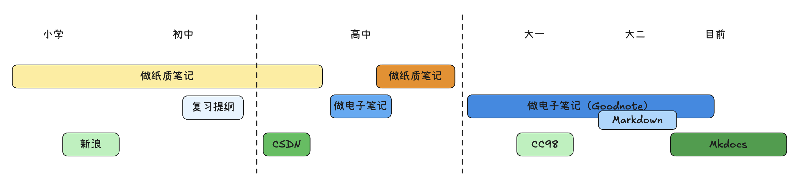

---
date:
  created: 2025-08-08
nostatistics: true
draft: true
---
# 关于我

## 为什么要写笔记

其实写笔记并不是突发奇想，而是一个循序渐进的过程。

做笔记 -> 做电子笔记 -> 做开源的电子笔记

这可能是我学生时代的一个阶段性的变化路径。这里并没有鄙视链的关系，不过多加一个定语，同行者就愈少。

当时学校还搞书香班级建设，午休晚休前都会倡导大家读课外书，再加上我的班主任也是一个提倡看书的语文老师，我便愈发痴迷地读起了书，那个时候中午午休时间趴在床上看了不少现当代的名著。

小学的时候，学校里要求每个班级都每月都要发博客，美其名曰班级文化建设，并且还以数量作为评优的标准。作为班里对电脑感兴趣的人，我被班主任。虽然大部分都是毫无意义的转载或是拼接，只有极少数是原创的感受，但是现在回想起来，那可能是第一次在网络上写东西。 

初中时候，学习还算不错，经常能排到前几名。各个科目也都掌握的不错。当时

高一的时候，突发奇想去学了OI，而且天天被六年级的“学长”乱杀，再加上并不适应高中的生活。

2020，疫情的到来让我猝不及防开始了网课的生活。在天天

当我们在谈论写笔记的时候，我们究竟在讨论什么

做笔记或者整理笔记，就能出一个人对知识的掌握程度。

？真的吗——对于这个命题，其置信度并不那么高。知识掌握程度最终一定是思考，而做笔记很多时候都必然要花费一些额外的时间（）

## 工具

