# 欢迎来到PhilFan的笔记本

如果你觉得这个笔记本对你有用的话，不妨动动小手点一个star！

## About this Notebook
笔记本的主要内容如下

```mermaid
mindmap
    root(PhilFan's Notebook)
        Math<br/> 一些数理课程记录
            线性代数与矩阵论
            概率论、统计、随机过程
            最优化
            机器学习
        AI<br/> 
            热点话题学习
            LLM相关
            机器学习实战
        Computer Science<br/>
            语言基础
            Computer Network
        Robotics<br/>自动化专业课程
            控制理论
            嵌入式与IOT
            机器人建模与控制
        Interests<br/> 兴趣爱好与探索
            🎹Music
            🍳Cooking
            🏃Sports
```

引用一段John Denero 说的话

> When I was getting married, I was a PhD student at the time. My mom pulled me aside on my wedding day and said "John I want to give you some advice". I was like oh she's going to like tell me to listen to my wife or whatever. But she didn't. She said only two words that have stuck with me for a long time. She said **"don't compare"**. That's all. And then she was like okay you can go back to do whatever you're doing. At the time this was very hard for me to process because I was in a university which is all about comparing people based on like what their exam score was. It turns out that out there in the world, there are no exams that everybody takes that are standardized anymore. All that matter is what you go and get done on your own particular path. So, comparing yourselves to other people becomes meaningless rapidly as what really matter is what you could do yourself, like what you're capable of and what you bother to do and how you choose to spend your time. It took years of this two-word phrase "don't compare" to marinate inside of me and for me to realize that my self-worth really has nothing to do with what other people can do or whether I can do it better than them or worse than them. It has everything to do with what i've done and what i'm gonna do next and how I spend my time and better myself. I should just focus on improving myself and forget about what everybody else is doing. 

