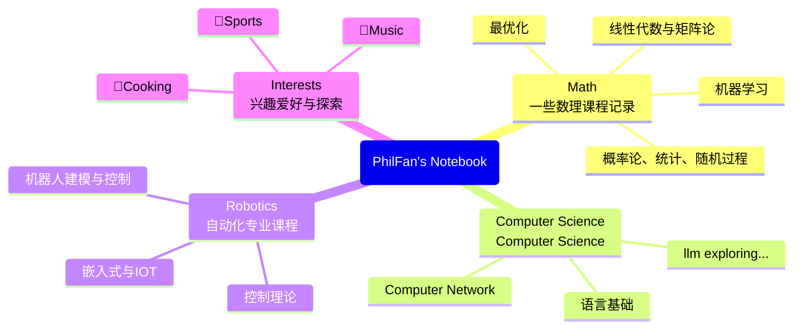

# 欢迎来到PhilFan的笔记本

如果你觉得这个笔记本对你有用的话，不妨动动小手点一个star！

## About this Notebook
笔记本的主要内容如下

```mermaid
mindmap
    root(PhilFan's Notebook)
        Math<br/> 一些数理课程记录
            线性代数与矩阵论
            概率论、统计、随机过程
            最优化
            机器学习
        Computer Science<br/>Computer Science
            语言基础
            llm exploring...
            Computer Network
        Robotics<br/>自动化专业课程
            控制理论
            嵌入式与IOT
            机器人建模与控制
        Interests<br/> 兴趣爱好与探索
            🎹Music
            🍳Cooking
            🏃Sports
```

> todo: 规范笔记风格，并添加一些笔记的索引

!!! note "Statistics"
    - 笔记总数：{{pages}}篇
    - 总字数：{{words}}字

## About Me

